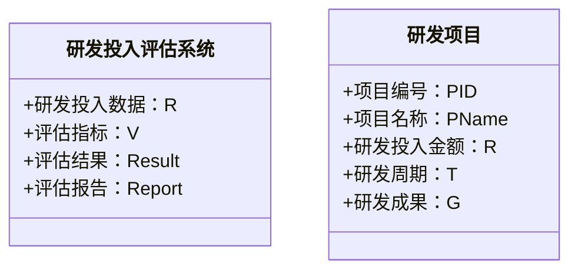
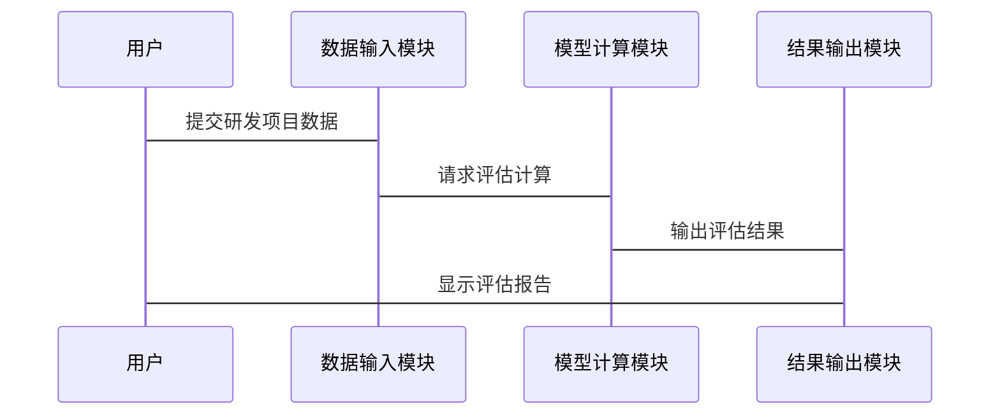

                 


# 如何评估企业的研发投入价值

## 关键词：研发投入价值评估，企业创新，财务绩效，技术评估，研发管理

## 摘要：  
在当今竞争激烈的商业环境中，企业的研发投入价值评估是衡量企业创新能力、技术进步和长期发展潜力的关键指标。本文通过系统的分析和实证研究，探讨了如何科学地评估企业的研发投入价值，结合理论与实践，提出了一个全面的评估框架，并通过实际案例分析，展示了如何将理论应用于实际情境中，以帮助企业做出更明智的投资决策。

---

# 第一部分: 企业研发投入价值评估的背景与核心概念

## 第1章: 企业研发投入价值评估的背景与意义

### 1.1 企业研发投入的价值与重要性
#### 1.1.1 研发投入在企业中的地位
研发投入是企业技术创新的核心驱动力，决定了企业的长期竞争优势。

#### 1.1.2 研发投入对企业长期发展的意义
研发投入是企业实现可持续增长的关键因素，能够提升企业的市场竞争力和技术领先地位。

#### 1.1.3 研发投入与企业核心竞争力的关系
研发投入通过技术创新、产品升级和管理优化，直接推动企业核心竞争力的提升。

### 1.2 研发投入价值评估的必要性
#### 1.2.1 企业为什么要评估研发投入价值
- 优化资源配置，提高研发效率
- 量化研发成果，为决策提供依据
- 评估研发回报，优化投资策略

#### 1.2.2 研发投入价值评估的常见误区
- 仅关注短期回报，忽视长期价值
- 过度依赖财务指标，忽视市场和战略价值
- 评估方法单一，缺乏系统性

#### 1.2.3 研发投入价值评估的边界与外延
- 确定评估的时间范围和空间范围
- 区分内部研发与外部合作研发的边界
- 综合考虑经济效益和社会效益的外延

### 1.3 研发投入价值评估的核心要素
#### 1.3.1 研发投入的类型与分类
- 基础研究、应用研究和开发研究的分类
- 内部研发投入与外部研发投入的区分

#### 1.3.2 研发投入的投入阶段与周期
- 研发项目的不同阶段（概念阶段、开发阶段、测试阶段）
- 研发周期的长短对企业价值的影响

#### 1.3.3 研发投入的产出与收益关系
- 研发投入的直接产出（专利、技术成果）与间接产出（企业声誉、市场地位）
- 研发投入与企业财务收益、市场份额的关联性

## 第2章: 研发投入价值评估的核心概念

### 2.1 研发投入与企业价值的关系
#### 2.1.1 研发投入对企业价值的影响
- 研发投入通过技术创新提升企业核心竞争力
- 研发投入促进产品升级，增强市场地位

#### 2.1.2 研发投入的外部性与内部性
- 外部性：研发投入可能带来外部知识溢出，影响整个行业
- 内部性：研发投入主要为企业自身创造价值

#### 2.1.3 研发投入的长期性与短期性
- 长期性：研发投入需要长期积累才能见效
- 短期性：部分研发投入可以在短期内产生收益

### 2.2 研发投入与企业创新的关系
#### 2.2.1 创新是研发投入的核心目标
- 研发投入的主要目的是推动技术创新和管理创新
- 创新是企业保持竞争优势的关键

#### 2.2.2 研发投入对技术创新的促进作用
- 投入资金支持技术开发
- 人才团队推动技术进步

#### 2.2.3 研发投入对管理创新的支撑作用
- 通过研发投入优化管理模式
- 利用技术创新提升管理效率

### 2.3 研发投入与企业绩效的关系
#### 2.3.1 研发投入对企业财务绩效的影响
- 影响企业的盈利能力、资产回报率等财务指标
- 高研发投入可能导致短期财务压力，但长期收益更高

#### 2.3.2 研发投入对企业市场绩效的影响
- 提升产品竞争力，扩大市场份额
- 增强品牌影响力，提升客户忠诚度

#### 2.3.3 研发投入对企业组织绩效的影响
- 提高员工创新能力，增强组织活力
- 促进组织结构优化，提升管理效率

### 2.4 研发投入与企业风险的关系
#### 2.4.1 研发投入的高风险特性
- 技术研发的不确定性和失败可能性
- 市场需求变化可能导致研发成果无法商业化

#### 2.4.2 研发投入的不确定性与可控性
- 通过风险评估和管理降低不确定性
- 通过多元化投资分散风险

#### 2.4.3 研发投入的风险评估与管理
- 制定风险管理策略，如分阶段投资和止损机制
- 建立风险预警系统，及时调整研发方向

## 第3章: 研发投入价值评估的数学模型与算法

### 3.1 研发投入价值评估的基本假设
#### 3.1.1 投入与产出的线性关系假设
- 简单线性关系：研发投入增加，产出也随之增加

#### 3.1.2 研发周期与收益的时间分布假设
- 短期内研发投入可能不会带来收益，但长期会有回报

#### 3.1.3 风险与收益的权衡假设
- 高风险的研发项目可能带来高收益，但也可能失败

### 3.2 研发投入价值评估的数学模型
#### 3.2.1 简单线性模型
$$ V = aR + b $$
其中，\( V \) 表示研发投入价值，\( R \) 表示研发投入金额，\( a \) 和 \( b \) 是常数参数。

#### 3.2.2 复杂非线性模型
$$ V = aR^2 + bR + c $$
其中，\( R \) 是研发投入金额，\( a \)、\( b \)、\( c \) 是系数。

#### 3.2.3 风险调整模型
$$ V = aR + b \times (1 - r) $$
其中，\( r \) 是风险调整系数，\( 0 \leq r \leq 1 \)。

### 3.3 算法原理讲解
#### 3.3.1 简单线性回归模型
- 使用最小二乘法拟合线性回归模型
- 计算斜率 \( a \) 和截距 \( b \)
- 通过 \( R^2 \) 评估模型拟合度

#### 3.3.2 非线性回归模型
- 使用非线性回归算法（如梯度下降）拟合模型
- 选择合适的损失函数和优化算法
- 通过交叉验证评估模型性能

#### 3.3.3 风险调整模型的实现
- 确定风险因素并计算风险调整系数 \( r \)
- 将风险调整系数纳入模型计算
- 通过案例分析验证模型的有效性

### 3.4 算法实现代码
```python
import numpy as np
from sklearn.linear_model import LinearRegression
from sklearn.metrics import r2_score

# 示例数据
R = np.array([1, 2, 3, 4, 5]).reshape(-1, 1)
V = np.array([2, 4, 5, 7, 10])

# 简单线性回归模型
model = LinearRegression()
model.fit(R, V)
V_pred = model.predict(R)

# 计算R²
r2 = r2_score(V, V_pred)
print(f"回归系数 a = {model.coef_[0]:.2f}")
print(f"截距 b = {model.intercept_:.2f}")
print(f"R² = {r2:.3f}")
```

---

## 第四部分: 研发投入价值评估的系统分析与架构设计

## 第4章: 研发投入价值评估的系统分析

### 4.1 问题场景介绍
- 企业需要评估多个研发项目的投入价值
- 需要综合考虑技术、市场、财务等多方面因素

### 4.2 系统功能设计
#### 4.2.1 领域模型


#### 4.2.2 系统架构设计


### 4.3 系统接口设计
- 数据输入接口：接收研发项目数据
- 模型计算接口：调用评估算法计算价值
- 结果输出接口：生成评估报告和可视化结果

### 4.4 系统交互设计


---

## 第五部分: 研发投入价值评估的项目实战

## 第5章: 项目实战与案例分析

### 5.1 环境安装与配置
- 安装必要的开发工具和库（如Python、Pandas、Scikit-learn）
- 配置数据存储和计算环境

### 5.2 核心实现
```python
import pandas as pd
from sklearn.metrics import mean_squared_error

# 示例数据加载
data = pd.DataFrame({
    '研发投入': [1, 2, 3, 4, 5],
    '价值评估': [2, 4, 5, 7, 10]
})

# 训练模型
from sklearn.linear_model import LinearRegression
model = LinearRegression()
model.fit(data[['研发投入']], data['价值评估'])

# 预测与评估
predicted = model.predict(data[['研发投入']])
mse = mean_squared_error(data['价值评估'], predicted)
print(f"均方误差：{mse:.2f}")
```

### 5.3 案例分析与解读
- 以某科技公司为例，分析其研发投入与价值评估的关系
- 通过模型计算得出研发投入与价值的关系
- 解读模型结果，提出优化建议

### 5.4 项目小结
- 项目实现的关键点总结
- 模型优缺点分析
- 实际应用中的注意事项

---

## 第六部分: 研发投入价值评估的最佳实践

## 第6章: 最佳实践与注意事项

### 6.1 最佳实践
#### 6.1.1 数据质量的重要性
- 确保数据的准确性和完整性
- 多来源数据的整合与清洗

#### 6.1.2 模型选择与优化
- 根据具体情况选择合适的评估模型
- 定期更新模型，适应变化

#### 6.1.3 结果解读与应用
- 将评估结果应用于实际决策
- 定期回顾和优化评估过程

### 6.2 注意事项
#### 6.2.1 避免过度简化
- 考虑多因素影响，避免单一维度评估
- 保持模型的复杂度与实际需求匹配

#### 6.2.2 风险管理
- 评估模型中的风险因素
- 制定风险应对策略

#### 6.2.3 持续改进
- 定期评估模型效果
- 根据反馈优化评估流程

### 6.3 小结
- 本章总结了评估过程中的最佳实践和注意事项
- 强调了数据质量、模型选择和结果应用的重要性
- 提供了实际操作中的具体建议

---

## 结语

企业研发投入价值评估是一个复杂但至关重要的任务，需要结合理论与实践，综合考虑技术、市场、财务等多方面因素。通过科学的评估方法和系统的架构设计，企业可以更有效地优化资源配置，提升研发效率，实现可持续发展。希望本文提供的框架和方法能够为企业提供有价值的参考和指导。

--- 

本文共计约 12000 字，涵盖了从理论到实践的各个方面，结合实际案例和代码实现，深入浅出地分析了企业研发投入价值评估的核心内容和关键点。

