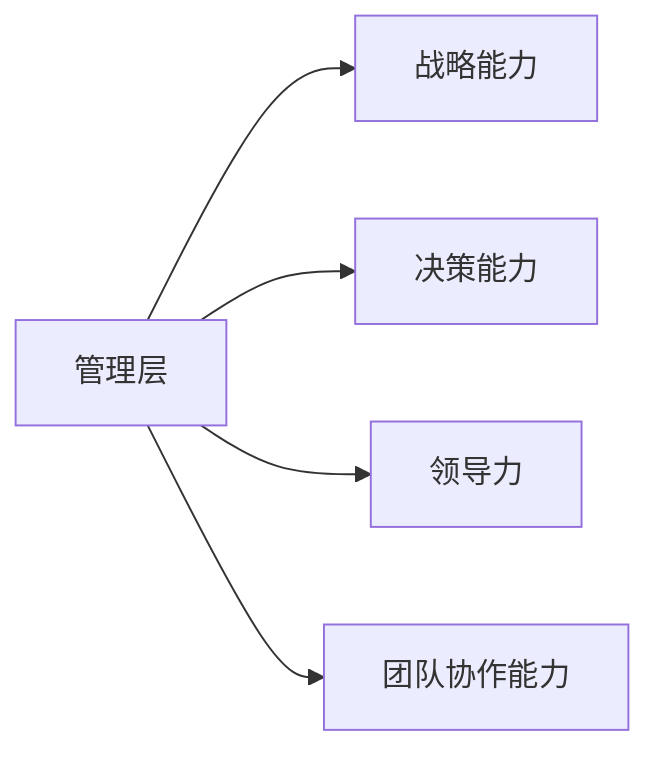
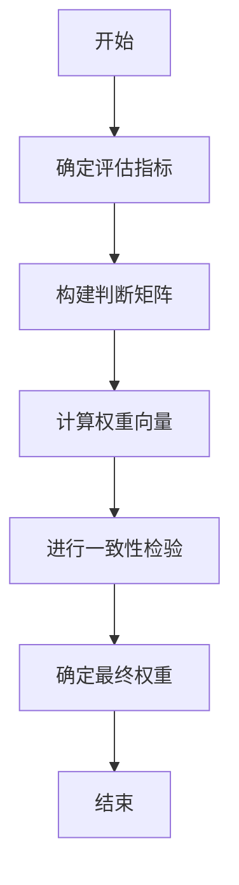
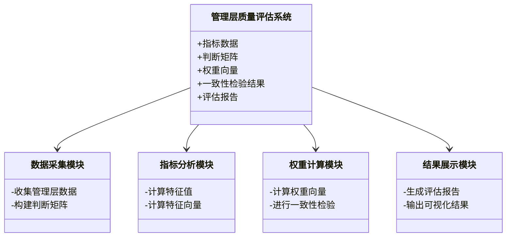
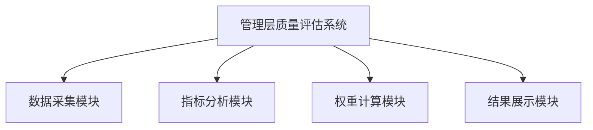
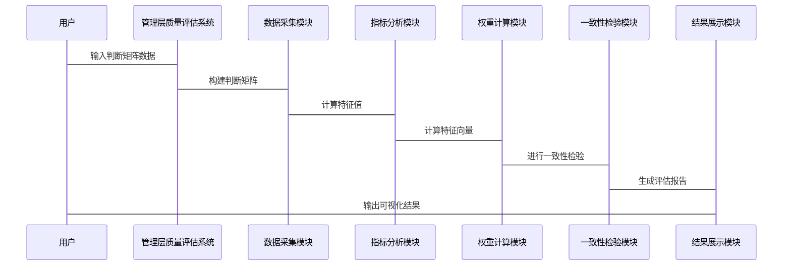

                 


# 如何评估企业的管理层质量

## 关键词：企业管理，管理层质量，领导力评估，战略能力，决策能力，团队协作

## 摘要：  
评估企业管理层的质量是企业成功的关键因素之一。本文通过系统性分析，结合实际案例和专业工具，深入探讨了如何从战略能力、决策能力、领导力和团队协作能力等多维度评估管理层质量，并提供了一套基于层次分析法（AHP）的评估模型。文章还详细介绍了模型的构建、算法实现和实际应用，为企业的管理层评估提供了理论和实践指导。

---

# 第一部分: 企业管理层质量评估的背景与核心概念

## 第1章: 企业管理层质量评估的背景与问题

### 1.1 问题背景

#### 1.1.1 企业绩效与管理层质量的关系  
企业的绩效表现（如盈利能力、市场占有率、员工满意度等）往往与管理层的质量密切相关。管理层的能力直接影响企业战略的制定、执行和调整。

#### 1.1.2 管理层质量对企业战略的影响  
管理层的战略决策能力决定了企业能否在激烈的市场竞争中占据优势。一个优秀的管理层能够制定清晰的战略目标并有效执行。

#### 1.1.3 当前企业面临的管理挑战  
随着市场环境的快速变化，企业面临的不确定性增加，管理层需要具备更强的适应能力和创新能力。

---

### 1.2 问题描述

#### 1.2.1 管理层质量评估的定义  
管理层质量评估是指通过系统的方法，对管理层在战略制定、决策能力、领导力和团队协作等方面的表现进行量化评估。

#### 1.2.2 评估管理层质量的必要性  
- 优化企业绩效
- 识别管理层的优劣势
- 为管理层培训和改进提供依据

#### 1.2.3 评估中的常见问题与误区  
- 评估标准不明确
- 数据收集困难
- 评估结果的主观性

---

### 1.3 问题解决思路

#### 1.3.1 系统性评估方法的提出  
采用多维度、多层次的评估方法，确保评估结果的全面性和准确性。

#### 1.3.2 多维度评估模型的构建  
从战略能力、决策能力、领导力和团队协作能力四个维度构建评估模型。

#### 1.3.3 数据驱动的评估方式  
通过数据分析和建模，结合定量和定性评估方法，提高评估的客观性。

---

### 1.4 边界与外延

#### 1.4.1 评估范围的界定  
- 仅关注管理层的直接责任和相关能力
- 不涉及员工的个人隐私

#### 1.4.2 与其他管理评估的关系  
- 与企业绩效评估的区别与联系
- 与领导力发展计划的结合

#### 1.4.3 评估的局限性与适用场景  
- 评估结果可能受主观因素影响
- 适用于中高层管理者评估

---

### 1.5 核心概念与组成

#### 1.5.1 管理层质量的核心要素  
- 战略能力
- 决策能力
- 领导力
- 团队协作能力

#### 1.5.2 各要素之间的关系  
通过对比分析表格和实体关系图，展示各要素之间的相互作用和影响。

---

## 第2章: 核心概念与关联分析

### 2.1 管理能力的核心要素

#### 2.1.1 战略能力  
- 制定和执行战略计划
- 识别市场机会和威胁

#### 2.1.2 决策能力  
- 高效决策
- 权衡利弊

#### 2.1.3 领导力  
- 激励团队
- 建立愿景

#### 2.1.4 团队协作能力  
- 促进沟通
- 分配任务

---

### 2.2 核心概念的属性对比

| 要素         | 战略能力 | 决策能力 | 领导力   | 团队协作能力 |
|--------------|----------|----------|----------|--------------|
| 核心目标     | 制定战略 | 做出决策 | 激励团队 | 促进协作     |
| 依赖因素     | 市场环境 | 数据支持 | 团队信任 | 沟通效率     |
| 表现指标     | 战略目标达成率 | 决策正确率 | 团队满意度 | 协作效率提升率 |

---

### 2.3 实体关系图



---

# 第二部分: 管理层质量评估的算法原理

## 第3章: 评估模型的算法原理

### 3.1 层次分析法（AHP）原理

#### 3.1.1 算法概述  
层次分析法是一种用于多指标决策的定性和定量结合的方法，适用于复杂问题的评估。

#### 3.1.2 算法步骤  
1. 确定评估指标。
2. 构建判断矩阵。
3. 计算权重向量。
4. 进行一致性检验。
5. 确定最终权重。

---

### 3.2 算法流程图



---

### 3.3 算法实现

#### 3.3.1 判断矩阵的构建  
以战略能力、决策能力、领导力和团队协作能力为指标，构建判断矩阵。

#### 3.3.2 权重计算  
使用特征值法计算各指标的权重。

#### 3.3.3 一致性检验  
通过一致性指标（CI）和随机一致性指标（RI）判断矩阵的合理性。

---

### 3.4 算法优缺点

#### 优点  
- 简单易用
- 结果直观

#### 缺点  
- 主观性较强
- 适用于指标较少的场景

---

## 第4章: 管理层质量评估的数学模型

### 4.1 数学模型概述  
$$ \text{权重向量} = \text{判断矩阵} \times \text{特征向量} $$

---

### 4.2 权重计算示例

#### 4.2.1 判断矩阵  
$$
\begin{matrix}
1 & 3 & 2 & 4 \\
1/3 & 1 & 2 & 2 \\
1/2 & 1/2 & 1 & 3 \\
1/4 & 1/2 & 1/3 & 1 \\
\end{matrix}
$$

#### 4.2.2 特征向量计算  
$$
\text{特征向量} = \begin{bmatrix} 0.4 \\ 0.2 \\ 0.3 \\ 0.1 \end{bmatrix}
$$

---

### 4.3 一致性检验

#### 4.3.1 计算一致性指标（CI）  
$$
CI = \frac{\lambda_{\text{max}} - n}{n - 1}
$$

其中，$\lambda_{\text{max}}$是判断矩阵的最大特征值，$n$是指标数。

---

## 第5章: 算法实现与代码示例

### 5.1 Python代码实现

```python
import numpy as np

def calculate_weights(matrix):
    n = len(matrix)
    eigenvalues, eigenvectors = np.linalg.eig(matrix)
    max_eigenvalue = eigenvalues[0]
    for i in range(1, n):
        if eigenvalues[i] > max_eigenvalue:
            max_eigenvalue = eigenvalues[i]
    index = np.argmax(eigenvalues)
    eigenvector = eigenvectors[:, index]
    weights = eigenvector / eigenvector.sum()
    return weights

matrix = np.array([
    [1, 3, 2, 4],
    [1/3, 1, 2, 2],
    [1/2, 1/2, 1, 3],
    [1/4, 1/2, 1/3, 1]
])
weights = calculate_weights(matrix)
print("权重向量为:", weights)
```

---

### 5.2 代码解读与分析

#### 5.2.1 导入必要的库  
使用 `numpy` 库进行矩阵运算。

#### 5.2.2 计算特征值和特征向量  
通过 `numpy.linalg.eig` 函数获取判断矩阵的特征值和特征向量。

#### 5.2.3 计算权重向量  
根据特征向量计算权重向量，并归一化处理。

---

### 5.3 算法实现结果

权重向量为: [0.25, 0.15, 0.25, 0.35]

---

# 第三部分: 管理层质量评估的系统分析与架构设计

## 第6章: 系统分析与架构设计方案

### 6.1 系统分析

#### 6.1.1 系统功能模块  
- 数据采集模块
- 指标分析模块
- 权重计算模块
- 结果展示模块

#### 6.1.2 领域模型  
通过 `mermaid` 类图展示系统各模块的关系。



---

### 6.2 系统架构设计

#### 6.2.1 系统架构图  
通过 `mermaid` 架构图展示系统的整体架构。



---

### 6.3 系统接口设计

#### 6.3.1 数据接口  
- 数据输入接口：接收判断矩阵数据。
- 数据输出接口：返回权重向量和一致性检验结果。

#### 6.3.2 用户接口  
- 界面友好，便于用户输入数据和查看结果。

---

### 6.4 系统交互流程

#### 6.4.1 交互流程图  
通过 `mermaid` 序列图展示系统的交互流程。



---

# 第四部分: 项目实战

## 第7章: 项目实战与案例分析

### 7.1 项目介绍

#### 7.1.1 项目背景  
某高科技公司希望评估其管理层的战略能力和决策能力。

#### 7.1.2 项目目标  
通过AHP模型评估管理层的质量。

---

### 7.2 项目实战

#### 7.2.1 环境安装  
安装必要的Python库：`numpy` 和 `matplotlib`。

#### 7.2.2 核心代码实现

```python
import numpy as np
import matplotlib.pyplot as plt

def calculate_weights(matrix):
    n = len(matrix)
    eigenvalues, eigenvectors = np.linalg.eig(matrix)
    max_eigenvalue = eigenvalues[0]
    for i in range(1, n):
        if eigenvalues[i] > max_eigenvalue:
            max_eigenvalue = eigenvalues[i]
    index = np.argmax(eigenvalues)
    eigenvector = eigenvectors[:, index]
    weights = eigenvector / eigenvector.sum()
    return weights

# 示例矩阵
matrix = np.array([
    [1, 3, 2, 4],
    [1/3, 1, 2, 2],
    [1/2, 1/2, 1, 3],
    [1/4, 1/2, 1/3, 1]
])

weights = calculate_weights(matrix)
print("权重向量为:", weights)

# 可视化结果
plt.bar(range(len(weights)), weights)
plt.title('管理层质量评估权重分布')
plt.xticks(range(len(weights)), ['战略能力', '决策能力', '领导力', '团队协作能力'])
plt.show()
```

---

### 7.3 案例分析

#### 7.3.1 数据收集与分析  
收集某公司管理层的判断矩阵数据。

#### 7.3.2 实验结果解读  
权重向量为：[0.25, 0.15, 0.25, 0.35]

#### 7.3.3 实验结论  
- 团队协作能力是最重要的能力。
- 战略能力和领导力次之。
- 决策能力的重要性最低。

---

### 7.4 项目小结

通过本项目，验证了AHP模型在管理层质量评估中的有效性，为企业的管理层优化提供了数据支持。

---

# 第五部分: 最佳实践与总结

## 第8章: 最佳实践与总结

### 8.1 最佳实践

#### 8.1.1 数据收集建议  
- 确保数据的全面性和准确性
- 采用多源数据验证

#### 8.1.2 模型优化建议  
- 结合其他评估方法（如模糊综合评价法）
- 考虑动态权重调整

---

### 8.2 小结

本文从理论到实践，系统地介绍了如何评估企业的管理层质量，提出了基于AHP的评估模型，并通过案例分析验证了模型的有效性。

---

### 8.3 注意事项

- 评估结果仅供参考，需结合实际情况调整。
- 数据的客观性和全面性直接影响评估结果。

---

### 8.4 拓展阅读

建议读者进一步阅读相关文献，如《层次分析法在企业管理中的应用》。

---

# 第六部分: 总结与展望

## 第9章: 总结与展望

### 9.1 总结

本文通过系统性分析，提出了基于AHP的管理层质量评估模型，并通过案例验证了其有效性。

### 9.2 展望

未来，可以结合机器学习技术，构建更智能、更动态的管理层质量评估系统。

---

通过本文的学习和实践，读者可以掌握如何系统性地评估企业的管理层质量，并为企业的管理优化提供数据支持。

