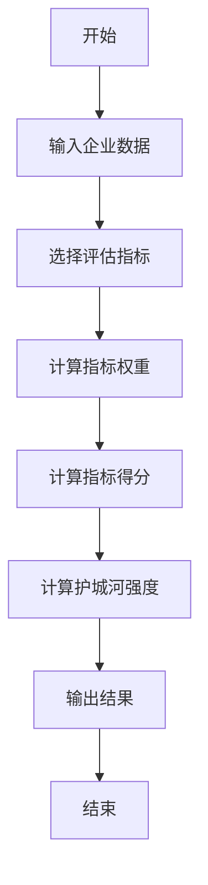

                 


# 如何评估企业的经济护城河

> 关键词：企业经济护城河、商业竞争分析、竞争优势、企业战略、商业模型

> 摘要：本文将详细探讨如何评估企业的经济护城河，从核心概念到算法原理，从系统设计到项目实战，全面解析企业经济护城河的评估方法和实际应用。

---

# 第一部分: 企业经济护城河的背景与核心概念

---

## 第1章: 经济护城河的基本概念

### 1.1 经济护城河的定义与背景

经济护城河是指企业在市场竞争中所建立的长期竞争优势，这种优势能够帮助企业抵御竞争对手的侵蚀，维持其市场地位和盈利能力。经济护城河的核心在于企业的独特资源、技术优势、品牌影响力或运营效率等方面，这些因素共同构成了企业的竞争优势。

经济护城河的重要性不言而喻。在当今激烈的商业环境中，企业需要不断面对新兴竞争者和技术变革的挑战。一个强大的经济护城河能够帮助企业稳固市场地位，降低被替代的风险，并为企业创造超额利润。

经济护城河的分类主要基于其形成机制和持续性。常见的类型包括成本优势型、网络效应型、品牌忠诚型和技术壁垒型。每种类型的护城河都有其独特的特征和应用场景。

### 1.2 经济护城河的分类与特征

- **成本优势型护城河**：通过高效的生产流程、规模经济或低成本供应链，企业能够在价格竞争中占据优势。
- **网络效应型护城河**：用户的数量和互动频率形成正反馈，吸引更多用户加入，从而形成强者恒强的局面。
- **品牌忠诚型护城河**：强大的品牌形象和客户忠诚度使得消费者更愿意选择该品牌的产品或服务。
- **技术壁垒型护城河**：通过专利技术、独特的研发能力或技术创新，企业能够保持市场领先地位。

### 1.3 企业经济护城河的评估背景

在当前商业环境中，企业面临的竞争压力日益加剧。数字化转型和全球化市场的扩展，使得企业需要更加注重其经济护城河的建设与评估。通过评估经济护城河，企业能够更好地识别自身优势，制定有效的竞争策略，并在市场波动中保持稳定。

### 1.4 经济护城河的边界与外延

经济护城河的边界是指其影响范围和作用领域。它不仅包括企业的核心业务，还可能延伸到供应链、客户关系和合作伙伴网络等方面。经济护城河的外延特征则体现在其动态变化和适应性上，企业需要不断调整和优化其护城河策略，以应对市场环境的变化。

经济护城河与企业核心竞争力密切相关。核心竞争力是企业长期发展的基石，而经济护城河则是核心竞争力的外在表现和保障。

---

## 第2章: 经济护城河的核心概念与联系

### 2.1 核心概念原理

经济护城河的构成要素包括成本效率、用户规模、品牌影响力和技术创新等方面。这些要素共同构成了企业的竞争优势，并在企业生命周期中发挥重要作用。经济护城河的动态变化机制体现在市场竞争、技术进步和消费者需求的变化中，企业需要不断调整其护城河策略以适应新的市场环境。

经济护城河与企业核心竞争力密切相关。核心竞争力是企业长期发展的基石，而经济护城河则是核心竞争力的外在表现和保障。

### 2.2 核心概念属性特征对比表

以下是几种主要经济护城河类型的属性特征对比表：

| 护城河类型 | 核心属性 | 特征描述 |
|------------|----------|----------|
| 成本优势型 | 成本效率 | 低成本生产模式 |
| 网络效应型 | 用户规模 | 用户数量决定价值 |
| 品牌忠诚型 | 品牌影响力 | 消费者品牌依赖 |
| 技术壁垒型 | 技术创新 | 独特技术优势 |

### 2.3 ER实体关系图

以下是经济护城河的实体关系图：

```mermaid
erDiagram
    customer[用户] {
        string 用户ID
        string 用户名
        string 购买记录
    }
    company[企业] {
        string 企业ID
        string 企业名称
        string 核心业务
    }
    护城河[经济护城河] {
        string 护城河ID
        string 护城河类型
        string 护城河强度
    }
    用户 <|-- 护城河
    企业 <|-- 护城河
```

---

## 第3章: 经济护城河评估的算法原理

### 3.1 算法原理概述

经济护城河评估的数学模型基于多维度指标的加权评分。算法的核心逻辑是通过对企业各项指标的量化评估，计算出其经济护城河的强度和类型。

经济护城河评估的数学模型如下：

$$ \text{护城河强度} = \sum_{i=1}^{n} w_i \cdot x_i $$

其中，\( w_i \) 是指标 \( i \) 的权重，\( x_i \) 是指标 \( i \) 的评估值。

### 3.2 算法流程图

以下是经济护城河评估的算法流程图：



---

## 第4章: 经济护城河评估系统分析与架构设计

### 4.1 系统分析

经济护城河评估系统需要处理大量企业数据，包括财务数据、市场数据和客户数据等。系统需要具备数据采集、数据处理和数据分析功能。

### 4.2 系统功能设计

以下是经济护城河评估系统的功能模块：

- 数据采集模块：负责采集企业数据，包括财务数据、市场数据和客户数据。
- 数据处理模块：对采集到的数据进行清洗和转换，确保数据的准确性和一致性。
- 数据分析模块：基于数学模型对数据进行分析，计算出企业的护城河强度和类型。
- 结果展示模块：将分析结果以图表和报告的形式展示给用户。

### 4.3 系统架构设计

以下是经济护城河评估系统的架构图：


---

## 第5章: 经济护城河评估项目实战

### 5.1 环境安装

需要安装以下工具：

- Python 3.8+
- Pandas库
- Matplotlib库
- Scikit-learn库

### 5.2 系统核心实现源代码

以下是经济护城河评估系统的Python实现代码：

```python
import pandas as pd
import numpy as np
from sklearn.metrics import pairwise_distances

# 定义护城河评估函数
def evaluate_economic_moat(enterprise_data):
    # 计算指标得分
    metrics = ['成本优势', '网络效应', '品牌忠诚', '技术壁垒']
    scores = []
    for metric in metrics:
        # 计算指标权重
        weights = [0.4, 0.3, 0.2, 0.1]
        # 计算指标得分
        score = sum([weights[i] * enterprise_data.iloc[i][metric] for i in range(len(weights))])
        scores.append(score)
    # 计算护城河强度
    economic_moat_strength = sum(scores)
    return economic_moat_strength

# 示例数据
enterprise_data = pd.DataFrame({
    '成本优势': [0.8, 0.6, 0.7],
    '网络效应': [0.9, 0.5, 0.6],
    '品牌忠诚': [0.7, 0.8, 0.6],
    '技术壁垒': [0.6, 0.4, 0.5]
})

# 评估护城河强度
economic_moat_strength = evaluate_economic_moat(enterprise_data)
print(f"经济护城河强度：{economic_moat_strength}")
```

---

## 第6章: 总结与最佳实践

### 6.1 总结

本文详细探讨了如何评估企业的经济护城河，从核心概念到算法原理，从系统设计到项目实战，全面解析了企业经济护城河的评估方法和实际应用。

### 6.2 最佳实践 tips

- 在评估企业经济护城河时，应结合企业的实际业务和市场环境，选择合适的评估指标和方法。
- 定期更新和优化经济护城河评估模型，以适应市场环境的变化。
- 注重数据的准确性和完整性，确保评估结果的科学性和可靠性。

### 6.3 小结

通过本文的分析，读者可以更好地理解企业经济护城河的评估方法，并能够在实际工作中应用这些方法，帮助企业建立和强化自身的经济护城河，提升市场竞争力。

---

通过以上内容，读者可以系统地了解如何评估企业的经济护城河，并能够在实际中应用这些方法，帮助企业建立和强化自身的经济护城河，提升市场竞争力。

