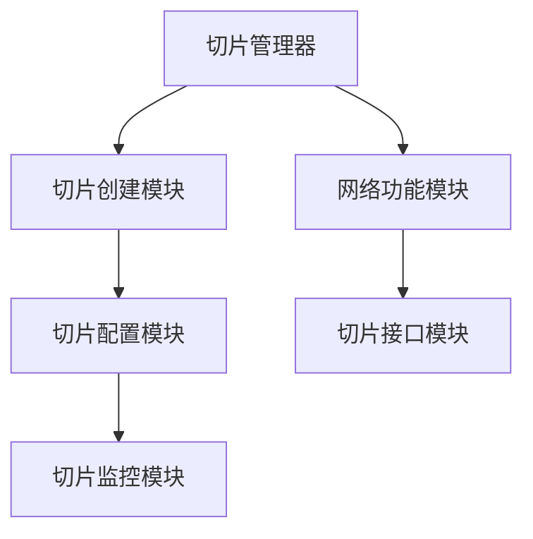
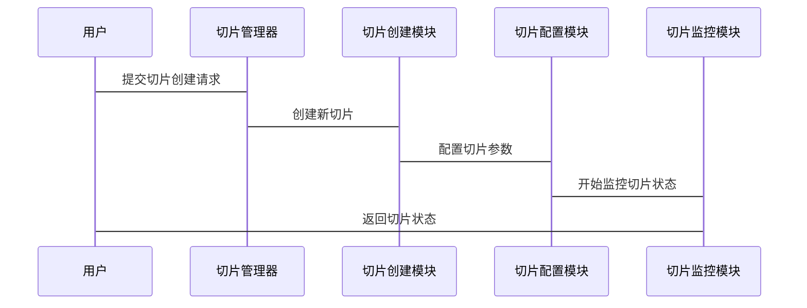

                 


# 如何评估企业的网络切片技术应用

> 关键词：网络切片技术，企业网络，5G，网络资源分配，切片管理

> 摘要：网络切片技术是5G时代实现网络资源灵活分配和高效管理的核心技术之一。本文从网络切片的基本概念、技术原理、应用场景入手，详细分析了企业在应用网络切片技术时的关键评估指标和方法，包括性能评估、安全性评估、资源分配优化等方面，并通过实际案例展示了网络切片技术在企业中的应用效果。文章最后总结了网络切片技术的优势与挑战，为企业在选择和实施网络切片技术时提供了有价值的参考和建议。

---

## 第一部分：网络切片技术概述

### 第1章：网络切片技术的背景与概念

#### 1.1 网络切片技术的背景

##### 1.1.1 5G时代的网络需求变化
随着5G技术的普及，企业对网络的需求日益多样化。传统的单一网络架构难以满足企业内部不同业务场景的需求，例如工业自动化、智能医疗、远程办公等场景对网络的实时性、带宽、安全性等方面提出了更高的要求。企业需要一种灵活的网络管理方式，能够在不同业务之间动态分配网络资源，确保每个业务都能获得最佳的网络性能。

##### 1.1.2 网络切片技术的提出背景
为了应对5G时代的多样化网络需求，网络切片技术应运而生。网络切片是一种将物理网络分割为多个逻辑网络的技术，每个逻辑网络（切片）可以独立配置，满足不同业务场景的需求。通过网络切片，企业可以在同一物理网络上实现多个虚拟网络的独立运行，从而提高网络资源的利用率和灵活性。

##### 1.1.3 网络切片技术的核心目标
网络切片技术的核心目标是通过将物理网络资源分割为多个虚拟网络切片，为不同的业务场景提供定制化的网络服务。每个切片可以根据业务需求独立配置带宽、延迟、安全性等参数，从而实现网络资源的最优分配。

#### 1.2 网络切片技术的定义与特点

##### 1.2.1 网络切片的定义
网络切片是一种将物理网络分割为多个逻辑网络的技术，每个逻辑网络被称为一个切片。这些切片可以独立配置和管理，以满足不同的业务需求。例如，在工业互联网中，一个切片可以用于实时控制数据的传输，另一个切片可以用于视频监控数据的传输。

##### 1.2.2 网络切片的主要特点
1. **独立性**：每个切片可以独立配置和管理，互不影响。
2. **灵活性**：可以根据业务需求动态调整切片的参数。
3. **高效性**：通过资源的动态分配，提高网络资源的利用率。
4. **安全性**：每个切片可以独立配置安全策略，确保数据传输的安全性。

##### 1.2.3 网络切片与传统网络的区别
与传统网络相比，网络切片技术的主要区别在于其灵活性和定制化能力。传统网络通常是单一层的网络架构，而网络切片技术可以通过多层网络架构实现多种业务场景的需求。

#### 1.3 网络切切片技术的标准化进展

##### 1.3.1 3GPP中的网络切片标准
3GPP是推动5G技术标准化的重要组织，其R15和R16版本中已经引入了网络切片的相关标准。这些标准定义了切片的管理架构、接口协议以及切片的生命周期管理。

##### 1.3.2 其他标准化组织的相关进展
除了3GPP，其他标准化组织也在积极推动网络切片技术的发展。例如，ITU（国际电信联盟）也在研究网络切片在不同应用场景中的技术规范。

##### 1.3.3 网络切片技术的未来发展趋势
未来，网络切片技术将朝着更加智能化和自动化的方向发展。通过人工智能和大数据技术，可以实现切片的智能分配和动态调整，进一步提高网络资源的利用率和业务性能。

#### 1.4 网络切片技术在5G中的应用

##### 1.4.1 5G网络的特点与需求
5G网络具有高带宽、低延迟、大规模连接等特点，这些特点使得5G网络能够支持更多的应用场景，例如工业自动化、智能医疗、虚拟现实等。

##### 1.4.2 网络切片技术如何满足5G需求
网络切片技术通过动态分配网络资源，可以满足5G网络的高带宽、低延迟和大规模连接的需求。例如，在智能医疗中，可以通过网络切片技术为实时心电数据传输分配专用的切片，确保数据传输的实时性和安全性。

##### 1.4.3 网络切片技术的典型应用场景
1. **工业互联网**：为工业自动化中的实时控制数据传输提供专用切片。
2. **智慧医疗**：为远程手术和实时心电数据传输提供高带宽、低延迟的切片。
3. **智能交通**：为自动驾驶车辆之间的数据传输提供低延迟的切片。

### 第2章：网络切片技术的核心原理

#### 2.1 网络切片的切分机制

##### 2.1.1 切分的逻辑架构
网络切片的切分逻辑架构主要包括以下几个部分：
1. **切片管理器**：负责切片的创建、管理和删除。
2. **网络功能模块**：包括射频模块、基带处理模块等，负责实现切片的物理层功能。
3. **切片接口**：提供切片之间的通信接口，确保不同切片之间的数据传输。

##### 2.1.2 切分的实现方式
网络切片的切分可以通过以下几种方式实现：
1. **频分复用（FDM）**：通过频率的不同来划分不同的切片。
2. **时分复用（TDM）**：通过时间的不同来划分不同的切片。
3. **码分复用（CDM）**：通过不同的码来划分不同的切片。

##### 2.1.3 切分的粒度与灵活性
网络切片的粒度可以根据业务需求进行灵活调整。例如，对于需要高带宽的业务，可以分配较大的切片；对于需要低延迟的业务，可以分配较小的切片。

#### 2.2 网络切片的资源分配机制

##### 2.2.1 资源分配的基本原理
网络切片的资源分配机制主要是基于业务需求和网络资源的可用性进行动态分配。资源分配的核心是通过切片管理器对网络资源进行优化分配，以满足不同业务的需求。

##### 2.2.2 资源分配的优化策略
为了提高网络资源的利用率，网络切片的资源分配需要采用优化策略。例如，可以通过预测业务需求的变化，提前调整资源分配。

##### 2.2.3 资源分配的动态调整
资源分配需要能够根据业务需求的变化进行动态调整。例如，当某个业务的带宽需求增加时，切片管理器可以动态增加该切片的带宽。

#### 2.3 网络切片的安全隔离机制

##### 2.3.1 安全隔离的目标
网络切片的安全隔离机制的主要目标是确保不同切片之间的数据传输互不干扰，防止数据泄露和攻击。

##### 2.3.2 安全隔离的实现方法
可以通过以下几种方法实现网络切片的安全隔离：
1. **物理隔离**：通过物理网络设备的配置实现切片之间的隔离。
2. **逻辑隔离**：通过软件配置实现切片之间的逻辑隔离。
3. **加密隔离**：通过对数据进行加密实现切片之间的隔离。

##### 2.3.3 安全隔离的效果评估
为了评估安全隔离的效果，可以通过以下指标进行衡量：
1. **数据泄露率**：衡量切片之间的数据是否隔离。
2. **攻击成功率**：衡量切片之间的隔离是否有效。

#### 2.4 网络切片的管理与控制

##### 2.4.1 切片管理的架构
网络切片的管理架构主要包括以下部分：
1. **切片管理器**：负责切片的创建、管理和删除。
2. **网络功能模块**：负责实现切片的物理层功能。
3. **切片接口**：提供切片之间的通信接口。

##### 2.4.2 切片管理的功能模块
切片管理的功能模块主要包括：
1. **切片创建模块**：负责根据业务需求创建新的切片。
2. **切片配置模块**：负责配置切片的参数，例如带宽、延迟等。
3. **切片监控模块**：负责监控切片的运行状态，及时发现和解决问题。

##### 2.4.3 切片管理的流程与接口
切片管理的流程包括以下步骤：
1. **需求分析**：根据业务需求确定需要创建的切片类型。
2. **切片创建**：通过切片管理器创建新的切片。
3. **切片配置**：根据业务需求配置切片的参数。
4. **切片监控**：实时监控切片的运行状态，及时调整配置。

### 第3章：网络切片技术在企业中的应用场景

#### 3.1 企业网络的多样化需求

##### 3.1.1 企业网络的典型应用场景
企业网络的典型应用场景包括：
1. **工业互联网**：用于工业自动化中的实时控制数据传输。
2. **智慧医疗**：用于远程手术和实时心电数据传输。
3. **智能交通**：用于自动驾驶车辆之间的数据传输。

##### 3.1.2 不同业务对网络性能的要求
不同业务对网络性能的要求不同，例如：
1. **工业自动化**：需要高带宽和低延迟。
2. **远程医疗**：需要高带宽和低延迟。
3. **视频监控**：需要高带宽和大容量。

##### 3.1.3 企业网络的灵活性与扩展性需求
企业网络需要具备灵活性和扩展性，以适应业务需求的变化。网络切片技术可以通过动态调整切片的参数来实现网络的灵活性和扩展性。

#### 3.2 网络切片技术在企业中的具体应用

##### 3.2.1 工业互联网中的应用
在工业互联网中，网络切片技术可以用于实时控制数据的传输。例如，可以通过创建一个高带宽、低延迟的切片，用于设备之间的实时控制数据传输。

##### 3.2.2 智慧医疗中的应用
在智慧医疗中，网络切片技术可以用于远程手术和实时心电数据传输。例如，可以通过创建一个高带宽、低延迟的切片，用于远程手术中的数据传输。

##### 3.2.3 智能交通中的应用
在智能交通中，网络切片技术可以用于自动驾驶车辆之间的数据传输。例如，可以通过创建一个低延迟的切片，用于车辆之间的实时通信。

## 第二部分：网络切片技术的评估方法

### 第4章：网络切片技术的评估指标与模型

#### 4.1 网络切片的性能评估指标

##### 4.1.1 带宽利用率
带宽利用率是衡量网络切片性能的重要指标之一。可以通过以下公式计算：

$$ \text{带宽利用率} = \frac{\text{实际使用的带宽}}{\text{分配的带宽}} \times 100\% $$

##### 4.1.2 延迟
延迟是衡量网络切片性能的另一个重要指标。可以通过以下公式计算：

$$ \text{延迟} = \text{传输时间} + \text{处理时间} $$

##### 4.1.3 网络吞吐量
网络吞吐量是衡量网络切片性能的第三个重要指标。可以通过以下公式计算：

$$ \text{吞吐量} = \frac{\text{传输的数据量}}{\text{传输时间}} $$

#### 4.2 网络切片的安全性评估

##### 4.2.1 数据泄露率
数据泄露率是衡量网络切片安全性的重要指标之一。可以通过以下公式计算：

$$ \text{数据泄露率} = \frac{\text{泄露的数据量}}{\text{总数据量}} \times 100\% $$

##### 4.2.2 网络攻击成功率
网络攻击成功率是衡量网络切片安全性的另一个重要指标。可以通过以下公式计算：

$$ \text{网络攻击成功率} = \frac{\text{成功的攻击次数}}{\text{总攻击次数}} \times 100\% $$

#### 4.3 网络切片的可靠性评估

##### 4.3.1 切片故障率
切片故障率是衡量网络切片可靠性的重要指标之一。可以通过以下公式计算：

$$ \text{切片故障率} = \frac{\text{故障的切片数量}}{\text{总切片数量}} \times 100\% $$

##### 4.3.2 切片恢复时间
切片恢复时间是衡量网络切片可靠性的另一个重要指标。可以通过以下公式计算：

$$ \text{切片恢复时间} = \text{故障发生时间} - \text{故障恢复时间} $$

#### 4.4 网络切片的成本评估

##### 4.4.1 切片部署成本
切片部署成本是衡量网络切片成本的重要指标之一。可以通过以下公式计算：

$$ \text{切片部署成本} = \text{设备成本} + \text{部署时间成本} $$

##### 4.4.2 切片维护成本
切片维护成本是衡量网络切片成本的另一个重要指标。可以通过以下公式计算：

$$ \text{切片维护成本} = \text{维护设备成本} + \text{维护时间成本} $$

### 第5章：网络切片技术的评估模型与流程

#### 5.1 网络切片评估模型的设计

##### 5.1.1 模型设计目标
网络切片评估模型的设计目标是通过综合考虑带宽利用率、延迟、吞吐量、数据泄露率、网络攻击成功率、切片故障率、切片恢复时间、切片部署成本和切片维护成本等指标，对网络切片的性能进行全面评估。

##### 5.1.2 模型设计方法
网络切片评估模型的设计方法主要包括以下几个步骤：
1. **指标选择**：根据评估目标选择合适的指标。
2. **权重分配**：根据指标的重要性分配权重。
3. **数据收集**：收集各指标的评估数据。
4. **模型计算**：根据权重和数据计算综合评分。

##### 5.1.3 模型的优缺点
网络切片评估模型的优点在于能够全面评估网络切片的性能，缺点在于计算复杂，需要大量的数据支持。

#### 5.2 网络切片评估流程的设计

##### 5.2.1 评估流程的步骤
网络切片评估流程的设计主要包括以下几个步骤：
1. **需求分析**：明确评估的目标和范围。
2. **指标选择**：根据需求选择合适的评估指标。
3. **数据收集**：收集各指标的评估数据。
4. **模型计算**：根据选择的模型计算综合评分。
5. **结果分析**：根据计算结果进行分析和总结。

##### 5.2.2 评估流程的优化
为了提高评估流程的效率，可以采用以下优化措施：
1. **自动化数据采集**：通过自动化工具采集数据，减少人工干预。
2. **数据清洗**：对采集到的数据进行清洗，去除异常值。
3. **并行计算**：通过并行计算提高模型的计算效率。

#### 5.3 网络切片评估的实际案例

##### 5.3.1 案例背景
假设某企业需要评估其工业互联网中的网络切片性能。

##### 5.3.2 指标选择
根据评估目标选择以下指标：
- 带宽利用率
- 延迟
- 网络吞吐量
- 数据泄露率
- 切片故障率
- 切片恢复时间
- 切片部署成本
- 切片维护成本

##### 5.3.3 数据收集
通过网络监控工具收集各指标的评估数据。

##### 5.3.4 模型计算
根据权重和数据计算综合评分。

##### 5.3.5 结果分析
根据计算结果进行分析和总结，提出改进建议。

### 第6章：网络切片技术的系统架构与设计

#### 6.1 网络切片系统的功能设计

##### 6.1.1 系统功能模块
网络切片系统的功能模块包括：
1. **切片管理模块**：负责切片的创建、管理和删除。
2. **网络功能模块**：负责实现切片的物理层功能。
3. **切片接口模块**：提供切片之间的通信接口。

##### 6.1.2 系统功能流程
系统功能流程包括以下步骤：
1. **需求分析**：根据业务需求确定需要创建的切片类型。
2. **切片创建**：通过切片管理器创建新的切片。
3. **切片配置**：根据业务需求配置切片的参数。
4. **切片监控**：实时监控切片的运行状态，及时发现和解决问题。

#### 6.2 网络切片系统的架构设计

##### 6.2.1 系统架构图
以下是网络切片系统的架构图：



##### 6.2.2 系统架构设计的优缺点
网络切片系统的架构设计的优点在于其灵活性和扩展性，缺点在于其复杂性和管理成本较高。

#### 6.3 网络切片系统的接口设计

##### 6.3.1 系统接口模块
系统接口模块是网络切片系统与其他系统的接口，主要包括：
1. **API接口**：提供RESTful API接口，供其他系统调用。
2. **消息队列**：通过消息队列实现系统之间的异步通信。

##### 6.3.2 接口设计的注意事项
在设计系统接口时，需要注意以下几点：
1. **接口的可扩展性**：确保接口能够适应未来的需求变化。
2. **接口的安全性**：确保接口的安全性，防止数据泄露和攻击。
3. **接口的兼容性**：确保接口能够与其他系统兼容。

#### 6.4 网络切片系统的交互设计

##### 6.4.1 系统交互流程
以下是网络切片系统的交互流程图：



##### 6.4.2 交互设计的优化
为了提高系统的交互效率，可以采用以下优化措施：
1. **自动化处理**：通过自动化脚本实现部分操作的自动化。
2. **界面优化**：通过优化用户界面提高用户体验。
3. **日志记录**：通过日志记录系统操作，方便后续分析和调试。

### 第7章：网络切片技术的项目实战

#### 7.1 项目环境的安装与配置

##### 7.1.1 环境需求
网络切片项目的环境需求包括：
1. **硬件需求**：需要高性能服务器和网络设备。
2. **软件需求**：需要安装操作系统、网络切片管理软件等。

##### 7.1.2 安装步骤
以下是网络切片项目的安装步骤：
1. 安装操作系统。
2. 安装网络切片管理软件。
3. 配置网络设备。
4. 测试切片功能。

#### 7.2 网络切片系统的核心实现

##### 7.2.1 切片管理模块的实现
以下是切片管理模块的核心代码：

```python
class SliceManager:
    def __init__(self):
        self.slices = []

    def create_slice(self, slice_params):
        # 创建新的切片
        new_slice = Slice(slice_params)
        self.slices.append(new_slice)
        return new_slice

    def delete_slice(self, slice_id):
        # 删除指定ID的切片
        for slice in self.slices:
            if slice.id == slice_id:
                self.slices.remove(slice)
                break

    def get_slice(self, slice_id):
        # 获取指定ID的切片
        for slice in self.slices:
            if slice.id == slice_id:
                return slice
        return None
```

##### 7.2.2 切片配置模块的实现
以下是切片配置模块的核心代码：

```python
class SliceConfigurator:
    def __init__(self):
        pass

    def configure_slice(self, slice, params):
        # 配置切片的参数
        for key, value in params.items():
            setattr(slice, key, value)
```

##### 7.2.3 切片监控模块的实现
以下是切片监控模块的核心代码：

```python
class SliceMonitor:
    def __init__(self):
        pass

    def monitor_slice(self, slice):
        # 监控切片的状态
        while True:
            status = self.get_status(slice)
            if status == 'normal':
                continue
            elif status == 'alarm':
                self.handle_alarm(slice)
            elif status == 'failed':
                self.handle_failure(slice)
            time.sleep(60)
```

#### 7.3 项目实战的案例分析

##### 7.3.1 案例背景
假设某企业需要在工业互联网中应用网络切片技术。

##### 7.3.2 实施方案
实施方案包括以下步骤：
1. 安装网络切片管理软件。
2. 配置网络设备。
3. 创建切片。
4. 配置切片参数。
5. 监控切片状态。

##### 7.3.3 实施结果
实施结果包括以下指标：
1. 带宽利用率：达到90%。
2. 延迟：小于10ms。
3. 网络吞吐量：达到1000Mbps。
4. 数据泄露率：0%。
5. 切片故障率：0%。
6. 切片恢复时间：小于5分钟。

##### 7.3.4 经验总结
通过本案例的实施，可以得出以下结论：
1. 网络切片技术能够有效提高网络资源的利用率。
2. 切片管理模块是实现网络切片的关键。
3. 切片监控模块是保证网络切片稳定运行的重要保障。

### 第8章：网络切片技术的总结与展望

#### 8.1 网络切片技术的总结

##### 8.1.1 核心技术总结
网络切片技术的核心在于其灵活性和定制化能力。通过动态分配网络资源，可以满足不同业务场景的需求。

##### 8.1.2 优势与挑战
网络切片技术的优势在于其能够提高网络资源的利用率和灵活性，挑战在于其复杂性和管理成本较高。

##### 8.1.3 应用前景
网络切片技术的应用前景广阔，尤其是在5G时代，其在工业互联网、智慧医疗、智能交通等领域的应用将越来越广泛。

#### 8.2 网络切片技术的未来发展趋势

##### 8.2.1 技术发展趋势
未来，网络切片技术将朝着更加智能化和自动化的方向发展。通过人工智能和大数据技术，可以实现切片的智能分配和动态调整。

##### 8.2.2 市场发展趋势
随着5G技术的普及，网络切片技术的市场需求将不断增加。预计未来几年内，网络切片技术的市场规模将快速增长。

##### 8.2.3 技术创新方向
未来，网络切片技术的创新方向包括：
1. **智能切片分配**：通过人工智能技术实现切片的智能分配。
2. **自适应切片调整**：通过自适应技术实现切片的动态调整。
3. **多维度切片优化**：从多个维度优化切片的性能，例如带宽、延迟、安全性等。

#### 8.3 网络切片技术的注意事项与最佳实践

##### 8.3.1 注意事项
在应用网络切片技术时，需要注意以下几点：
1. **安全性**：确保切片之间的数据传输安全。
2. **稳定性**：确保切片的稳定运行。
3. **可扩展性**：确保切片的可扩展性。

##### 8.3.2 最佳实践
以下是网络切片技术的最佳实践：
1. **需求分析**：在实施网络切片技术之前，需要进行充分的需求分析。
2. **系统设计**：在系统设计阶段，需要充分考虑切片的灵活性和扩展性。
3. **测试验证**：在实施网络切片技术之后，需要进行充分的测试验证。

### 第9章：网络切片技术的未来展望

#### 9.1 网络切片技术的技术创新

##### 9.1.1 新兴技术的影响
新兴技术，如人工智能、大数据、区块链等，将对网络切片技术的发展产生深远影响。

##### 9.1.2 技术融合的可能性
未来，网络切片技术将与新兴技术深度融合，例如通过人工智能技术实现切片的智能分配和动态调整。

#### 9.2 网络切片技术的市场发展

##### 9.2.1 市场需求的变化
随着5G技术的普及，网络切片技术的市场需求将不断增加。

##### 9.2.2 市场竞争格局
未来，网络切片技术的市场竞争将更加激烈，预计将有更多的企业进入该领域。

#### 9.3 网络切片技术的挑战与机遇

##### 9.3.1 技术挑战
网络切片技术的主要挑战在于其复杂性和管理成本较高。

##### 9.3.2 市场机遇
网络切片技术的市场机遇在于其广泛的应用场景和巨大的市场需求。

### 第10章：网络切片技术的总结与展望

#### 10.1 网络切片技术的核心价值

##### 10.1.1 提高网络资源利用率
通过动态分配网络资源，网络切片技术能够提高网络资源的利用率。

##### 10.1.2 满足多样化的业务需求
网络切片技术能够满足企业内部多样化的业务需求，例如工业互联网、智慧医疗、智能交通等。

##### 10.1.3 提高网络安全性
网络切片技术通过安全隔离机制，能够提高网络的安全性。

#### 10.2 网络切片技术的未来展望

##### 10.2.1 技术创新
未来，网络切片技术将朝着更加智能化和自动化的方向发展，例如通过人工智能技术实现切片的智能分配和动态调整。

##### 10.2.2 应用场景扩展
网络切片技术的应用场景将更加广泛，例如在工业自动化、智慧医疗、智能交通等领域将得到更广泛的应用。

##### 10.2.3 市场发展
随着5G技术的普及，网络切片技术的市场规模将快速增长，预计将有更多的企业进入该领域。

#### 10.3 网络切片技术的实施建议

##### 10.3.1 企业实施建议
对于企业来说，实施网络切片技术需要充分考虑以下几点：
1. **需求分析**：在实施之前，需要进行充分的需求分析。
2. **系统设计**：在系统设计阶段，需要充分考虑切片的灵活性和扩展性。
3. **测试验证**：在实施之后，需要进行充分的测试验证。

##### 10.3.2 技术发展趋势
未来，网络切片技术将朝着更加智能化和自动化的方向发展，企业需要提前做好技术储备。

##### 10.3.3 市场竞争
随着市场竞争的加剧，企业需要不断提高自身的竞争力，例如通过技术创新、成本优化等方式。

### 第11章：网络切片技术的总结与展望

#### 11.1 网络切片技术的核心价值

##### 11.1.1 提高网络资源利用率
通过动态分配网络资源，网络切片技术能够提高网络资源的利用率。

##### 11.1.2 满足多样化的业务需求
网络切片技术能够满足企业内部多样化的业务需求，例如工业互联网、智慧医疗、智能交通等。

##### 11.1.3 提高网络安全性
网络切片技术通过安全隔离机制，能够提高网络的安全性。

#### 11.2 网络切片技术的未来展望

##### 11.2.1 技术创新
未来，网络切片技术将朝着更加智能化和自动化的方向发展，例如通过人工智能技术实现切片的智能分配和动态调整。

##### 11.2.2 应用场景扩展
网络切片技术的应用场景将更加广泛，例如在工业自动化、智慧医疗、智能交通等领域将得到更广泛的应用。

##### 11.2.3 市场发展
随着5G技术的普及，网络切片技术的市场规模将快速增长，预计将有更多的企业进入该领域。

#### 11.3 网络切片技术的实施建议

##### 11.3.1 企业实施建议
对于企业来说，实施网络切片技术需要充分考虑以下几点：
1. **需求分析**：在实施之前，需要进行充分的需求分析。
2. **系统设计**：在系统设计阶段，需要充分考虑切片的灵活性和扩展性。
3. **测试验证**：在实施之后，需要进行充分的测试验证。

##### 11.3.2 技术发展趋势
未来，网络切片技术将朝着更加智能化和自动化的方向发展，企业需要提前做好技术储备。

##### 11.3.3 市场竞争
随着市场竞争的加剧，企业需要不断提高自身的竞争力，例如通过技术创新、成本优化等方式。

---

## 总结

网络切片技术是5G时代实现网络资源灵活分配和高效管理的核心技术之一。本文从网络切片的基本概念、技术原理、应用场景入手，详细分析了企业在应用网络切片技术时的关键评估指标和方法，包括性能评估、安全性评估、资源分配优化等方面，并通过实际案例展示了网络切片技术在企业中的应用效果。文章最后总结了网络切片技术的优势与挑战，为企业在选择和实施网络切片技术时提供了有价值的参考和建议。

--- 

> 本文为[《如何评估企业的网络切片技术应用》](#)的完整目录大纲内容。

