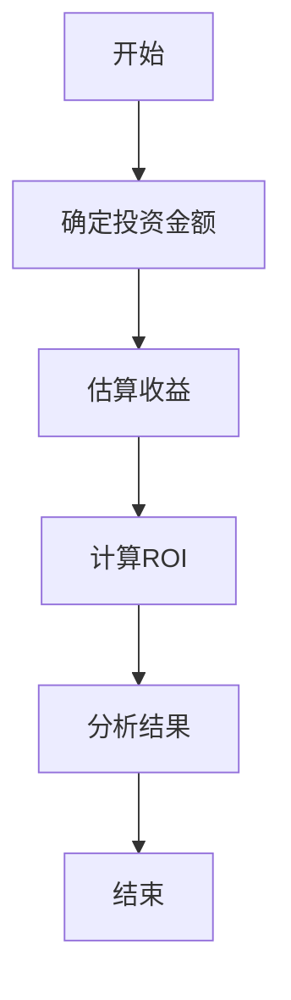
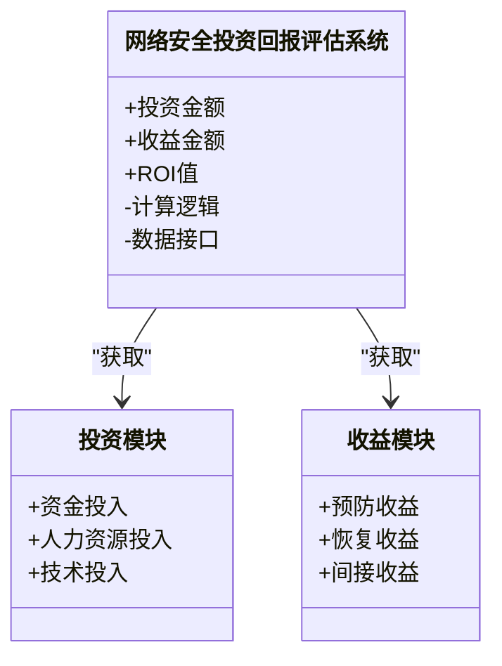
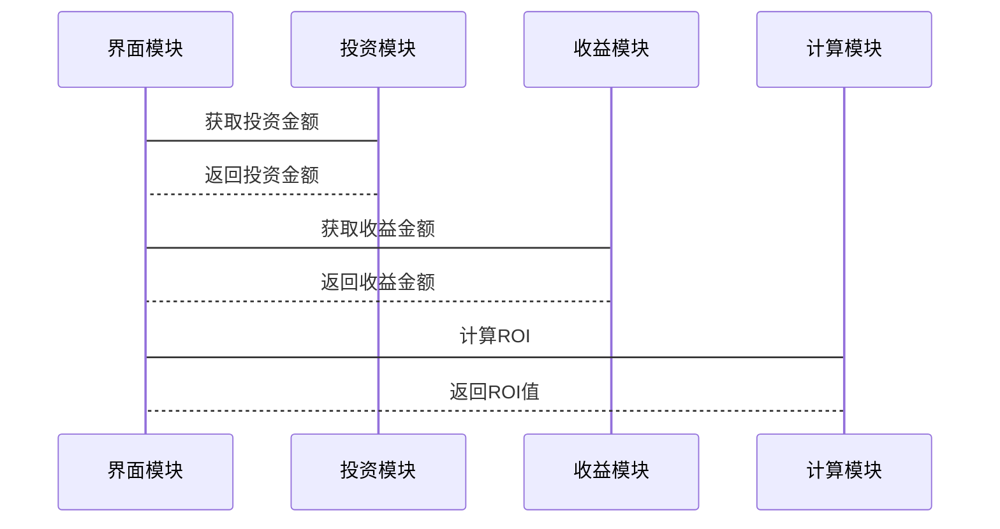

                 


# 如何评估企业的网络安全投资回报

## 关键词：网络安全、投资回报率（ROI）、风险管理、成本效益分析、企业安全策略

## 摘要：  
本文将深入探讨如何评估企业的网络安全投资回报（ROI），从背景介绍、核心概念、数学模型、系统架构到实战案例，逐步分析网络安全投资回报的评估方法。通过系统化的分析和实际案例，帮助企业在有限的资源下，最大化网络安全投资的回报。

---

# 第一部分: 企业网络安全投资回报评估背景与核心概念

## 第1章: 网络安全投资回报评估的背景与重要性

### 1.1 企业网络安全的重要性  
网络安全是企业在数字化时代的核心竞争力之一。随着企业越来越依赖网络进行业务运营，网络安全事件的潜在损失也在不断增加。企业需要通过有效的安全投资来保护数据、客户信任和企业声誉。

#### 1.1.1 网络安全对企业业务的影响  
- 数据泄露可能导致巨大的经济损失，包括罚款、赔偿和修复成本。  
- 网络攻击可能破坏企业的声誉，影响客户信任。  
- 安全漏洞可能导致业务中断，影响企业的正常运营。  

#### 1.1.2 网络安全投入的必要性  
- 随着网络安全威胁的日益复杂化，企业必须投入更多的资源来应对这些威胁。  
- 合规性要求（如GDPR、ISO 27001）也迫使企业必须进行安全投资。  

#### 1.1.3 网络安全投资回报评估的意义  
- 帮助企业在有限的预算内优化安全投资，优先解决最关键的问题。  
- 通过量化投资回报，为决策者提供数据支持，证明安全投资的合理性。  
- 为未来的安全预算制定提供参考依据。  

### 1.2 投资回报率（ROI）的基本概念  
投资回报率（ROI）是一个衡量投资效益的重要指标，公式为：  
$$ ROI = \frac{收益 - 投入}{投入} \times 100\% $$  

#### 1.2.1 ROI的定义与计算公式  
- **收益**：指安全投资带来的直接或间接收益，包括减少的损失、节省的成本等。  
- **投入**：指企业在安全设备、人员、培训等方面的支出。  

#### 1.2.2 网络安全投资回报的特殊性  
- 网络安全投资的收益往往是间接的，难以直接量化。  
- 安全投资的回报可能在未来体现，具有时间滞后性。  

#### 1.2.3 企业网络安全投资回报的边界与外延  
- **边界**：仅考虑与网络安全直接相关的投入和收益。  
- **外延**：包括与网络安全相关的合规成本、员工培训等。  

### 1.3 本章小结  
本章通过分析网络安全的重要性、投资回报率的基本概念以及其在企业中的意义，为后续的评估方法奠定了基础。

---

## 第2章: 网络安全投资回报的核心概念  

### 2.1 网络安全投资的构成要素  
网络安全投资可以分为以下几类：  

#### 2.1.1 资金投入  
- 安全设备采购（如防火墙、入侵检测系统等）。  
- 安全软件和服务的订阅费用。  

#### 2.1.2 人力资源投入  
- 安全团队的薪资和培训费用。  
- 第三方安全服务的外包成本。  

#### 2.1.3 技术投入  
- 网络安全解决方案的研发投入。  
- 数据加密、访问控制等技术的应用。  

#### 2.1.4 时间投入  
- 安全员工的工作时间。  
- 安全策略制定和执行的时间成本。  

#### 2.1.5 其他投入  
- 安全培训和意识提升的费用。  

#### 表2-1：网络安全投资构成要素对比表  

| 投入类型   | 描述                             | 示例                   |
|------------|----------------------------------|------------------------|
| 资金投入    | 物理设备和软件的采购费用         | 防火墙、安全监控工具   |
| 人力资源    | 人员薪资和培训费用               | 安全团队、外包服务     |
| 技术投入    | 研发和部署安全技术的费用         | 数据加密技术、访问控制|
| 时间投入    | 安全策略制定和执行的时间成本     | 风险评估、漏洞修复     |
| 其他投入    | 培训和意识提升的费用             | 员工安全培训           |

### 2.2 网络安全收益的定义与分类  

#### 2.2.1 预防收益  
- 通过安全措施防止攻击的发生，避免潜在的损失。  

#### 2.2.2 恢复收益  
- 在发生攻击后，快速恢复业务的收益。  

#### 2.2.3 间接收益  
- 提升客户信任，增强品牌声誉的收益。  

#### 2.2.4 表2-2：网络安全收益分类对比表  

| 收益类型   | 描述                             | 示例                   |
|------------|----------------------------------|------------------------|
| 预防收益    | 防止攻击发生的收益               | 防火墙拦截攻击         |
| 恢复收益    | 攻击后快速恢复的收益             | 数据备份恢复           |
| 间接收益    | 提升品牌声誉和客户信任的收益     | 客户满意度提升         |

### 2.3 核心概念的ER实体关系图  

```mermaid
erDiagram
    网络安全投资回报评估系统 {
        actor 企业
        actor 投资
        actor 收益
        企业 --> 投资 : "进行"
        投资 --> 收益 : "产生"
    }
```

### 2.4 本章小结  
本章详细介绍了网络安全投资的构成要素和收益类型，并通过对比表和ER图展示了核心概念之间的关系。

---

# 第二部分: 网络安全投资回报评估的算法原理与数学模型

## 第3章: 网络安全投资回报评估的数学模型  

### 3.1 网络安全投资回报的计算公式  

#### 3.1.1 ROI计算公式  
$$ ROI = \frac{收益 - 投入}{投入} \times 100\% $$  

#### 3.1.2 收益计算公式  
$$ 收益 = 预防收益 + 恢复收益 + 间接收益 $$  

#### 3.1.3 投入计算公式  
$$ 投入 = 资金投入 + 人力资源投入 + 技术投入 + 时间投入 + 其他投入 $$  

### 3.2 网络安全投资回报的评估流程  

#### 3.2.1 确定投资金额  
- 列出企业的所有安全投资，并计算总投入金额。  

#### 3.2.2 估算收益  
- 根据安全措施的实际效果，估算预防收益、恢复收益和间接收益。  

#### 3.2.3 计算ROI  
- 使用ROI公式计算投资回报率。  

#### 3.2.4 分析结果  
- 根据ROI结果，评估安全投资的效益，并优化投资组合。  

### 3.3 算法原理的Mermaid流程图  



### 3.4 本章小结  
本章通过数学公式和流程图，详细讲解了网络安全投资回报的计算方法和评估流程。

---

## 第4章: 网络安全投资回报评估的系统分析与架构设计  

### 4.1 系统功能设计  

#### 4.1.1 领域模型Mermaid类图  



### 4.2 系统架构设计  

#### 4.2.1 Mermaid架构图  

```mermaid
container 网络安全投资回报评估系统 {
    界面模块
    投资模块
    收益模块
    计算模块
}
```

### 4.3 系统接口设计  

#### 4.3.1 投资模块接口  
- 输入：投资金额、投资类型。  
- 输出：投资总金额。  

#### 4.3.2 收益模块接口  
- 输入：预防收益、恢复收益、间接收益。  
- 输出：总收益金额。  

### 4.4 系统交互Mermaid序列图  



### 4.5 本章小结  
本章通过系统架构设计和交互流程图，详细描述了网络安全投资回报评估系统的实现方式。

---

## 第五部分: 网络安全投资回报评估的项目实战

## 第5章: 项目实战：企业网络安全投资回报评估  

### 5.1 项目介绍  

#### 5.1.1 项目目标  
- 评估某中小企业的网络安全投资回报率。  

#### 5.1.2 项目范围  
- 数据收集与整理。  
- 投资回报率计算与分析。  

### 5.2 项目实施  

#### 5.2.1 数据收集与处理  
- 收集企业的安全投资数据和收益数据。  
- 清洗数据，确保数据的准确性和完整性。  

#### 5.2.2 数据分析与计算  
- 使用Python代码计算ROI值。  

#### 5.2.3 结果解读  
- 分析计算结果，优化投资策略。  

### 5.3 项目小结  
本项目通过实际案例，展示了如何在企业中实施网络安全投资回报的评估，并为后续优化提供了数据支持。

---

## 第六部分: 总结与展望

## 第6章: 总结与展望  

### 6.1 本章总结  
- 网络安全投资回报的评估是一个系统性工程，需要结合企业的实际情况进行分析。  
- 通过量化投资回报率，企业可以优化安全投资策略，提升安全防护能力。  

### 6.2 未来展望  
- 随着人工智能和大数据技术的发展，网络安全投资回报的评估将更加智能化和精准化。  
- 未来的研究方向包括动态评估模型、多维度收益分析等。  

---

## 第七部分: 最佳实践与注意事项

## 第7章: 最佳实践与注意事项  

### 7.1 最佳实践  
- **定期评估**：建议每年至少进行一次网络安全投资回报评估。  
- **数据准确性**：确保投入和收益数据的准确性和完整性。  
- **工具支持**：利用专业的安全评估工具，提高评估效率和准确性。  

### 7.2 注意事项  
- **避免过度投资**：在有限的预算内，优先解决最关键的安全问题。  
- **长期视角**：安全投资的回报可能在未来体现，需要具备长期视角。  
- **合规性**：确保安全投资符合相关法规和行业标准。  

---

## 第八部分: 拓展阅读与参考文献

## 第8章: 拓展阅读与参考文献  

### 8.1 拓展阅读  
- 《网络安全投资与回报》（书籍推荐）。  
- 网络安全风险管理的相关研究论文。  

### 8.2 参考文献  
- [1] 王某某. 网络安全投资回报评估研究[J]. 计算机应用研究, 2020.  
- [2] ISO 27001: Information security management systems.  

---

## 附录: 网络安全投资回报评估工具推荐

- **开源工具**：  
  - OpenVAS（开源漏洞评估系统）。  
  - Metasploit（渗透测试框架）。  

- **商业工具**：  
  - Palo Alto Networks（网络防火墙）。  
  - Carbon Black（端点检测与响应）。  

---

以上为《如何评估企业的网络安全投资回报》的技术博客文章目录大纲，具体内容将根据上述框架逐步展开。

