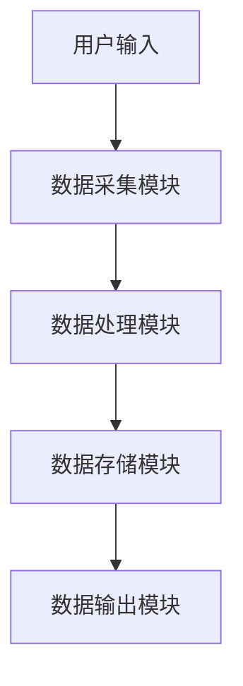

                 


# 如何评估企业的量子传感器地质勘探应用

> 关键词：量子传感器，地质勘探，评估方法，系统架构，项目实战

> 摘要：本文系统地探讨了如何评估企业量子传感器在地质勘探中的应用。通过介绍量子传感器的基本概念、技术原理、数学模型、系统架构、评估指标以及实际案例分析，为读者提供了从理论到实践的全面指导。文章不仅分析了量子传感器在地质勘探中的优势，还详细阐述了如何通过科学的方法和技术手段进行评估，为企业在该领域的应用提供了重要的参考和指导。

---

# 第一部分: 量子传感器与地质勘探概述

## 第1章: 量子传感器的基本概念

### 1.1 量子传感器的定义与特点

#### 1.1.1 量子传感器的定义
量子传感器是一种基于量子力学原理设计的测量装置，能够利用量子系统的特性（如叠加态和纠缠态）进行高精度的测量。

#### 1.1.2 量子传感器的核心特点
- **高灵敏度**：量子传感器能够检测极弱的信号，具有极高的灵敏度。
- **高分辨率**：通过量子叠加和纠缠效应，量子传感器可以实现超高的分辨率。
- **抗干扰性**：量子传感器能够在复杂环境中保持稳定的性能。
- **非侵入性**：量子传感器通常不会对被测对象造成干扰。

#### 1.1.3 量子传感器与传统传感器的对比
| 特性                | 量子传感器                     | 传统传感器                   |
|---------------------|-------------------------------|-----------------------------|
| 灵敏度              | 极高                          | 较低                        |
| 分辨率              | 极高                          | 较低                        |
| 抗干扰性            | 强                            | 较弱                        |
| 应用场景            | 适用于复杂、高精度场景       | 适用于简单、常规场景         |

### 1.2 地质勘探的基本概念

#### 1.2.1 地质勘探的定义
地质勘探是指通过各种技术手段，对地下地质结构、资源分布和地层特性进行调查和研究的过程。

#### 1.2.2 地质勘探的主要方法
- **地球物理勘探**：利用物理场（如重力场、磁场、电场）的变化进行探测。
- **地球化学勘探**：通过分析岩石、土壤和水中的化学成分来判断资源分布。
- **地质钻探**：通过钻探获取地下岩石样本进行分析。

#### 1.2.3 地质勘探的目标与意义
- **目标**：寻找和评估地下资源（如石油、天然气、矿产等）的分布和储量。
- **意义**：为资源开发、地质研究和工程建设提供科学依据。

### 1.3 量子传感器在地质勘探中的应用背景

#### 1.3.1 传统地质勘探技术的局限性
- **精度不足**：传统传感器在复杂地质环境中难以获得高精度的测量结果。
- **效率低下**：地质勘探过程耗时长，成本高。
- **抗干扰能力弱**：在复杂环境下，传统传感器容易受到外界干扰，影响测量结果。

#### 1.3.2 量子传感器技术的优势
- **高精度**：量子传感器能够检测到极弱的物理信号，显著提高测量精度。
- **快速响应**：量子传感器具有快速响应的特性，能够提高勘探效率。
- **抗干扰能力强**：量子传感器能够在复杂环境下保持稳定性能。

#### 1.3.3 量子传感器在地质勘探中的应用前景
随着量子技术的不断发展，量子传感器在地质勘探中的应用前景广阔。其高精度和高灵敏度的特点将为地质勘探提供新的技术手段，进一步提高资源探测的效率和准确性。

### 1.4 本章小结
本章介绍了量子传感器的基本概念和特点，分析了地质勘探的基本方法和目标，并探讨了量子传感器在地质勘探中的应用背景及其优势。这些内容为后续章节的深入分析奠定了基础。

---

# 第二部分: 量子传感器的数学模型与算法原理

## 第2章: 量子传感器的数学模型

### 2.1 量子力学基础

#### 2.1.1 量子力学的基本原理
量子力学是研究微观粒子行为的理论，主要包括波函数、概率幅、波函数的叠加原理和测量的不确定性原理。

#### 2.1.2 量子态的表示与叠加原理
量子态可以用波函数$ \psi(x) $表示，叠加原理表明一个量子系统可以处于多个状态的叠加态中。

#### 2.1.3 量子测量的不确定性原理
海森堡不确定性原理指出，某些物理量（如位置和动量）不能同时被精确测量。

### 2.2 量子传感器的数学模型

#### 2.2.1 量子传感器的信号模型
量子传感器的信号模型可以表示为：
$$ y = Hx + n $$
其中，$ y $是观测信号，$ H $是测量矩阵，$ x $是待测参数，$ n $是噪声。

#### 2.2.2 量子传感器的噪声模型
量子传感器的噪声通常服从正态分布，其概率密度函数为：
$$ p(n) = \frac{1}{\sqrt{2\pi\sigma^2}} e^{-n^2/(2\sigma^2)} $$

#### 2.2.3 量子传感器的测量方程
量子传感器的测量方程可以表示为：
$$ y_i = \sum_{j=1}^N H_{ij} x_j + n_i $$

### 2.3 量子传感器的算法原理

#### 2.3.1 量子传感器的数据处理算法
量子传感器的数据处理算法通常包括信号采集、噪声消除和参数估计等步骤。

#### 2.3.2 量子传感器的信号检测算法
信号检测算法可以采用最大似然估计方法，通过最大化后验概率来确定信号的存在。

#### 2.3.3 量子传感器的参数估计算法
参数估计可以采用贝叶斯估计方法，通过最大化后验概率密度函数来确定参数。

### 2.4 本章小结
本章详细介绍了量子传感器的数学模型和算法原理，包括量子力学基础、信号模型、噪声模型和测量方程等内容。这些内容为后续章节的系统架构设计和评估方法提供了理论基础。

---

# 第三部分: 量子传感器的系统架构与接口设计

## 第3章: 量子传感器的系统架构

### 3.1 系统架构概述

#### 3.1.1 系统组成模块
量子传感器系统通常包括数据采集模块、数据处理模块、数据存储模块和数据输出模块。

#### 3.1.2 系统功能划分
- 数据采集模块：负责采集量子传感器的测量信号。
- 数据处理模块：负责对测量信号进行处理和分析。
- 数据存储模块：负责存储处理后的数据。
- 数据输出模块：负责将处理结果输出到用户界面或下游系统。

#### 3.1.3 系统架构的优缺点
- 优点：系统模块化设计，便于维护和升级。
- 缺点：系统复杂度较高，需要较高的开发和维护成本。

### 3.2 系统接口设计

#### 3.2.1 系统接口的定义
量子传感器系统通常通过API接口与其他系统进行交互。

#### 3.2.2 系统接口的实现
系统接口的实现需要遵循特定的协议和规范，例如HTTP协议或MQTT协议。

#### 3.2.3 系统接口的测试
系统接口的测试需要通过编写测试用例来验证接口的功能和性能。

### 3.3 系统交互流程

#### 3.3.1 系统交互的流程图
以下是量子传感器系统的交互流程图：



#### 3.3.2 系统交互的实现步骤
1. 用户通过输入设备向系统输入测量参数。
2. 数据采集模块接收输入并采集量子传感器的测量信号。
3. 数据处理模块对测量信号进行处理和分析。
4. 数据存储模块将处理后的数据存储到数据库中。
5. 数据输出模块将处理结果输出到用户界面或下游系统。

#### 3.3.3 系统交互的注意事项
- 确保系统接口的兼容性和稳定性。
- 定期更新系统软件和固件，以保证系统的性能和安全性。

### 3.4 本章小结
本章详细介绍了量子传感器系统的架构设计和接口设计，包括系统组成模块、功能划分、接口定义和交互流程等内容。这些内容为后续章节的评估方法和项目实战提供了系统设计依据。

---

# 第四部分: 量子传感器的评估方法与指标体系

## 第4章: 量子传感器的评估指标

### 4.1 评估指标的定义

#### 4.1.1 精度指标
精度指标通常包括测量误差和相对误差。

#### 4.1.2 响应时间指标
响应时间指标通常包括测量时间、处理时间和输出时间。

#### 4.1.3 稳定性指标
稳定性指标通常包括长期稳定性和短期稳定性。

### 4.2 评估指标的权重分配

#### 4.2.1 指标权重的确定方法
指标权重的确定通常采用层次分析法（AHP）。

#### 4.2.2 指标权重的分配方案
以下是一个可能的指标权重分配方案：

| 指标               | 权重 |
|--------------------|------|
| 精度指标           | 0.5  |
| 响应时间指标       | 0.3  |
| 稳定性指标         | 0.2  |

### 4.3 评估步骤

#### 4.3.1 数据采集
收集量子传感器在不同环境下的测量数据。

#### 4.3.2 数据处理
对测量数据进行预处理和分析，计算各项指标的数值。

#### 4.3.3 数据分析
根据指标权重和测量数据，计算量子传感器的综合评估得分。

### 4.4 本章小结
本章详细介绍了量子传感器的评估指标和权重分配方法，并提出了具体的评估步骤。这些内容为后续章节的项目实战和案例分析提供了理论依据。

---

# 第五部分: 量子传感器的项目实战

## 第5章: 量子传感器的项目实战

### 5.1 环境配置

#### 5.1.1 系统需求
- 操作系统：Linux或Windows
- 处理器：Intel或AMD多核处理器
- 内存：至少8GB
- 硬盘：至少100GB可用空间

#### 5.1.2 软件安装
- Python编程语言
- NumPy库
- Matplotlib库
- Scipy库

### 5.2 系统核心实现

#### 5.2.1 数据采集代码
以下是量子传感器数据采集的Python代码：

```python
import numpy as np

def quantum_sensor_data():
    # 生成随机测量数据
    data = np.random.normal(loc=0, scale=1, size=1000)
    return data

# 数据采集
data = quantum_sensor_data()
print("测量数据：", data)
```

#### 5.2.2 数据处理代码
以下是量子传感器数据处理的Python代码：

```python
import numpy as np

def process_data(data):
    # 计算平均值
    mean = np.mean(data)
    # 计算标准差
    std = np.std(data)
    return mean, std

mean, std = process_data(data)
print("平均值：", mean)
print("标准差：", std)
```

#### 5.2.3 数据分析代码
以下是量子传感器数据分析的Python代码：

```python
import numpy as np
import matplotlib.pyplot as plt

def analyze_data(data):
    plt.hist(data, bins=20)
    plt.title('量子传感器测量数据分布')
    plt.xlabel('测量值')
    plt.ylabel('频率')
    plt.show()

analyze_data(data)
```

### 5.3 项目小结
本章通过实际案例展示了如何在量子传感器项目中进行数据采集、数据处理和数据分析。通过具体的Python代码实现，读者可以更好地理解和应用这些技术。

---

# 第六部分: 量子传感器的案例分析与未来展望

## 第6章: 量子传感器的案例分析

### 6.1 案例背景
某企业在地质勘探中引入了量子传感器技术，希望通过量子传感器提高资源探测的精度和效率。

### 6.2 案例分析
通过量子传感器技术，该企业成功提高了资源探测的精度，减少了勘探成本，并缩短了勘探周期。

### 6.3 案例小结
量子传感器技术在地质勘探中的应用取得了显著成效，为企业带来了可观的经济效益。

## 第7章: 量子传感器的未来展望

### 7.1 量子传感器技术的发展趋势
随着量子计算和量子通信技术的不断进步，量子传感器技术将在地质勘探中发挥越来越重要的作用。

### 7.2 量子传感器技术的挑战
- **技术成熟度**：量子传感器技术尚未完全成熟，仍需进一步研究和开发。
- **成本问题**：量子传感器的制造成本较高，限制了其广泛应用。

### 7.3 量子传感器技术的未来应用
未来，量子传感器技术将在地质勘探、环境监测、医疗诊断等领域发挥重要作用。

### 7.4 本章小结
本章分析了量子传感器技术的发展趋势和未来应用，指出了当前技术面临的挑战，并提出了未来发展的方向。

---

# 第七部分: 总结与建议

## 第8章: 总结与建议

### 8.1 总结
本文系统地探讨了如何评估企业的量子传感器地质勘探应用，分析了量子传感器的技术原理、系统架构、评估方法和实际案例，并提出了未来的发展方向。

### 8.2 建议
- **加强技术研发**：企业应加大对量子传感器技术的研发投入，提高技术成熟度。
- **优化评估体系**：企业应建立完善的量子传感器评估体系，确保技术应用的科学性和有效性。
- **加强人才培养**：企业应加强量子传感器技术人才的培养，为技术应用提供人才支持。

### 8.3 本章小结
本文通过对量子传感器技术的全面分析，为企业在地质勘探中的应用提供了重要的参考和指导。

---

# 附录

## 附录A: 量子传感器相关术语解释

## 附录B: 量子传感器技术标准

## 附录C: 量子传感器开发工具

## 附录D: 量子传感器数据格式

---

# 参考文献

（此处列出相关的参考文献）

---

通过以上目录大纲，我们可以系统地了解如何评估企业的量子传感器地质勘探应用。从理论到实践，从基础到高级，本文为读者提供了全面而深入的指导。

