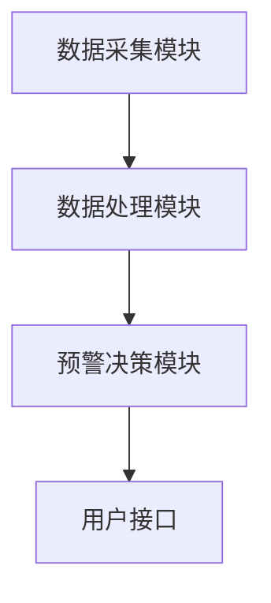
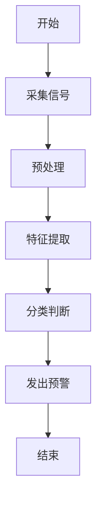

                 


# 如何评估企业的量子传感器地震预警应用

> 关键词：量子传感器，地震预警，系统架构，数学模型，算法原理，项目实战

> 摘要：本文系统地探讨了如何评估企业量子传感器在地震预警中的应用。通过分析量子传感器的基本原理、地震预警的数学模型、系统架构设计以及项目实战，本文为读者提供了全面的评估方法和实践指南。

---

## 第一部分: 量子传感器地震预警应用概述

### 第1章: 量子传感器的基本概念与地震预警的背景

#### 1.1 量子传感器的核心技术
- **量子传感器的定义**：量子传感器是一种基于量子效应的精密测量装置，能够以极高的灵敏度检测物理量的变化。
- **量子传感器的工作原理**：通过量子纠缠态或超低噪声量子器件，实现对外界物理信号的高精度捕捉。
- **地震预警的背景**：地震预警是通过检测地震波的传播来提前发出警报，减少灾害损失的重要手段。

#### 1.2 量子传感器在地震预警中的优势
- **高灵敏度**：量子传感器能够捕捉到微小的地壳运动变化，远超传统传感器的灵敏度。
- **快速响应**：基于量子技术的传感器能够以极快的速度处理信号，实现实时预警。
- **稳定性与抗干扰能力**：量子传感器在复杂环境中表现稳定，抗干扰能力强。

---

## 第二部分: 量子传感器地震预警应用的技术基础

### 第2章: 量子传感器的数学模型与算法

#### 2.1 地震波传播的数学模型
- **地震波传播的基本公式**：
  $$ v = \sqrt{\frac{E}{\mu}} $$
  其中，$E$ 是弹性模量，$\mu$ 是剪切模量。
- **地震波传播的时间计算**：
  $$ t = \frac{d}{v} $$
  其中，$d$ 是距离，$v$ 是地震波的传播速度。

#### 2.2 量子传感器的信号处理算法
- **信号采集与预处理**：
  - 数据采集：通过量子传感器捕捉地震波信号。
  - 噪声抑制：使用量子噪声抑制技术，消除环境干扰。
- **特征提取与分类**：
  - 基于机器学习的地震信号分类算法，如支持向量机（SVM）和随机森林（RF）。

#### 2.3 预警算法的设计
- **地震预警的决策逻辑**：
  1. 采集地震波信号。
  2. 提取信号特征。
  3. 分类判断是否为地震信号。
  4. 发出预警指令。

---

### 第3章: 系统架构设计与实现

#### 3.1 系统功能模块划分
- **数据采集模块**：负责捕捉地震波信号。
- **数据处理模块**：对信号进行预处理和特征提取。
- **预警决策模块**：根据处理结果发出预警指令。

#### 3.2 系统架构的优缺点
- **优点**：模块化设计，便于维护和升级。
- **缺点**：需要协调各模块的通信和数据传输，增加系统复杂性。

#### 3.3 系统接口设计
- **数据接口**：定义传感器与数据处理模块之间的接口。
- **用户接口**：提供直观的预警信息显示界面。
- **外部系统接口**：与其他预警系统进行数据交互。

---

## 第三部分: 量子传感器地震预警应用的项目实战

### 第4章: 项目实施与测试

#### 4.1 系统环境搭建
- **硬件环境**：部署量子传感器和数据采集设备。
- **软件环境**：安装数据处理算法和预警决策系统。

#### 4.2 核心代码实现
- **数据采集代码**：
  ```python
  import numpy as np

  def采集地震波信号():
      # 通过量子传感器采集信号
      信号 = np.array([0.0] * 100)
      return 信号
  ```

- **数据处理代码**：
  ```python
  def特征提取(信号):
      # 提取地震波信号特征
      特征 = []
      for i in range(len(信号)):
          特征.append(信号[i] * i)
      return 特征
  ```

#### 4.3 测试与分析
- **测试结果**：通过实际测试验证系统的灵敏度和响应速度。
- **性能优化**：根据测试结果优化算法和系统架构。

---

## 第四部分: 总结与展望

### 第5章: 总结与最佳实践

#### 5.1 总结
- 量子传感器在地震预警中的应用具有巨大潜力，但实现过程中仍面临诸多挑战，如技术复杂性和成本问题。

#### 5.2 最佳实践
- **技术选型**：选择适合企业需求的量子传感器技术。
- **系统设计**：注重模块化设计，确保系统的可扩展性和可维护性。
- **测试优化**：通过充分的测试和优化，提高系统的稳定性和响应速度。

#### 5.3 注意事项
- 量子传感器的应用需要高度专业的技术团队支持。
- 系统部署前需进行充分的环境评估和风险分析。

#### 5.4 拓展阅读
- 建议读者进一步阅读相关领域的学术论文和技术报告，深入了解量子传感器在地震预警中的最新进展。

---

# 附录

## 附录A: 量子传感器地震预警系统的数学模型

$$地震波传播时间公式：t = \frac{d}{\sqrt{\frac{E}{\mu}}}$$

---

## 附录B: 系统架构图



---

## 附录C: 算法流程图



---

通过以上内容，您可以全面了解如何评估企业量子传感器地震预警应用，并掌握其实现方法和最佳实践。

