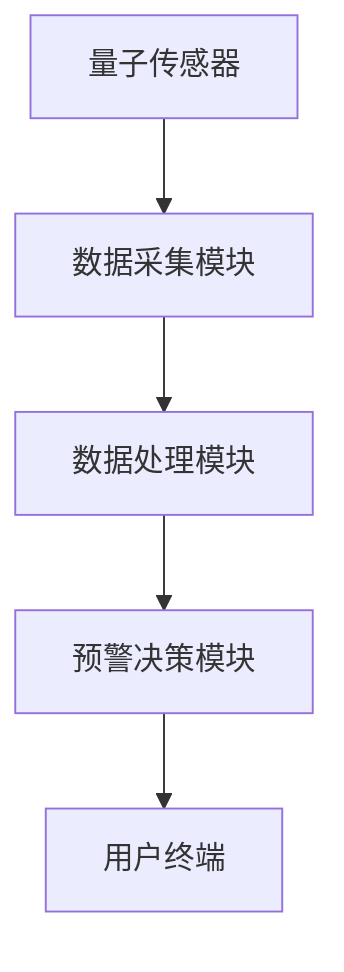

                 


# 如何评估企业的量子传感器地震预警应用

---

## 关键词
量子传感器, 地震预警, 实时监测, 数据处理, 系统架构, 传感器网络

---

## 摘要
随着量子技术的发展，量子传感器在地震预警中的应用逐渐成为研究的热点。本文旨在为企业提供一套系统化的评估方法，涵盖量子传感器的基本原理、地震预警系统的架构设计、算法实现及数学模型、系统性能分析等方面。通过对比传统传感器与量子传感器的优劣，结合实际应用场景，本文提出了优化企业量子传感器地震预警系统的建议，为企业在该领域的技术选型和系统优化提供了参考。

---

## 目录
1. [背景介绍](#背景介绍)
2. [核心概念与联系](#核心概念与联系)
3. [算法原理与数学模型](#算法原理与数学模型)
4. [系统分析与架构设计](#系统分析与架构设计)
5. [项目实战](#项目实战)
6. [最佳实践](#最佳实践)

---

## 正文

---

### 第1章: 量子传感器地震预警应用的背景介绍

#### 1.1 量子传感器的基本概念
量子传感器是一种基于量子力学原理设计的新型传感器，其核心在于利用量子态的特性来感知外界环境的变化。与传统传感器相比，量子传感器具有更高的灵敏度和分辨率，能够在极微弱的信号中检测出变化，这使得它们在地震预警等领域具有潜在的应用价值。

#### 1.2 地震预警的基本原理
地震预警系统通过实时监测地震波的传播，提前向可能受影响的区域发出警报。传统的地震预警系统主要依赖于地震仪等设备，通过检测地震波的传播速度和强度来预测地震的影响范围和强度。然而，传统系统在精度和响应速度上存在一定的局限性，尤其是在早期震损预测方面。

#### 1.3 量子传感器与地震预警的结合
量子传感器的高灵敏度和快速响应特性，使其在地震预警中具有独特的优势。通过量子传感器实时监测地壳的微小变化，可以更早地 detecting 地震前兆，从而提高预警的准确性。同时，量子传感器的网络化部署可以实现更广泛的覆盖，提升地震预警系统的整体性能。

---

### 第2章: 量子传感器地震预警系统的核心概念与联系

#### 2.1 量子传感器的核心原理
量子传感器的核心在于其对量子态的操控能力。例如，利用量子干涉效应可以实现对外界振动的高灵敏检测。这种检测能力远超过传统的压电传感器或光纤传感器，能够在地震发生前捕捉到地壳的微小振动。

#### 2.2 地震预警系统的架构与功能
地震预警系统通常包括数据采集模块、数据处理与分析模块以及预警决策模块。量子传感器的引入可以显著提升数据采集的精度和速度，从而优化整个系统的性能。

#### 2.3 量子传感器与地震预警系统的实体关系图
```mermaid
er
    entity 量子传感器 {
        id
        类型
        精度
        稳定性
    }
    entity 地震预警系统 {
        id
        类型
        功能模块
    }
    relation 量子传感器-地震预警系统 {
        关联方式
        关联强度
    }
```

---

### 第3章: 量子传感器地震预警系统的算法原理与数学模型

#### 3.1 量子传感器数据处理算法
量子传感器的数据处理需要结合量子力学的原理，例如利用量子滤波算法来消除噪声。以下是量子滤波算法的简单实现：
```python
def quantum_filter(sensor_data):
    # 量子态初始化
    q_state = initialize_quantum_state(sensor_data.shape)
    # 应用哈密顿算符
    q_state = apply_hamiltonian(q_state, sensor_data)
    # 测量与滤波
    filtered_data = measure_quantum_state(q_state)
    return filtered_data
```

#### 3.2 地震预警系统的预测模型
地震预警系统的预测模型通常基于贝叶斯概率公式，如下所示：
$$ P(\text{地震}| \text{信号}) = \frac{P(\text{信号}| \text{地震}) \cdot P(\text{地震})}{P(\text{信号})} $$

---

### 第4章: 系统分析与架构设计

#### 4.1 系统架构图


#### 4.2 接口设计
量子传感器通过标准接口与数据处理模块连接，确保数据的实时传输和处理。以下是接口的设计示例：
```python
class QuantumSensor:
    def __init__(self, id):
        self.id = id
        self.data = []

    def collect_data(self):
        # 量子传感器数据采集
        pass

    def send_data(self, data):
        # 数据传输至处理模块
        pass
```

---

### 第5章: 项目实战

#### 5.1 环境安装
为了实现量子传感器地震预警系统，首先需要安装必要的库和工具，例如：
- QuantumSensor SDK
- 数据处理库（如NumPy）
- 可视化工具（如Matplotlib）

#### 5.2 核心代码实现
以下是量子传感器数据处理的核心代码示例：
```python
import numpy as np

def process_sensor_data(data):
    # 数据预处理
    normalized_data = (data - np.mean(data)) / np.std(data)
    # 数据分析
    fft_result = np.fft.fft(normalized_data)
    return fft_result
```

---

### 第6章: 最佳实践

#### 6.1 小结
本文系统地介绍了如何评估企业的量子传感器地震预警应用，从背景介绍到系统架构设计，再到实际项目的实现，为企业提供了全面的指导。

#### 6.2 注意事项
在实际应用中，需要注意量子传感器的校准和维护，确保系统的稳定性和准确性。

#### 6.3 拓展阅读
对于感兴趣的技术细节，可以参考以下文献：
- "Quantum Sensors and Their Applications in Earthquake Prediction"
- "Advanced Algorithm Design for Earthquake Warning Systems"

---

通过以上内容，您可以系统地评估和优化企业的量子传感器地震预警应用，确保在实际应用中发挥最佳性能。

