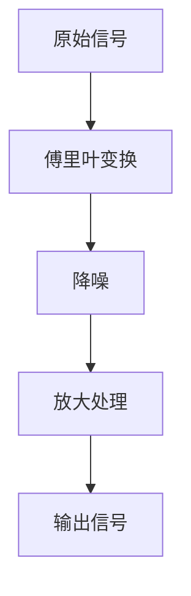
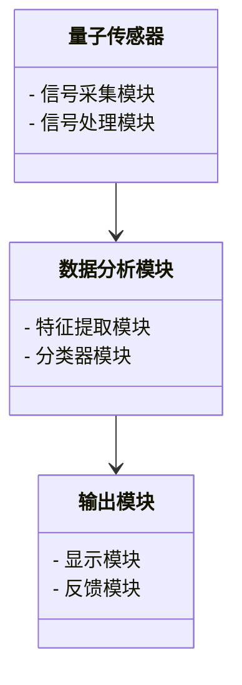
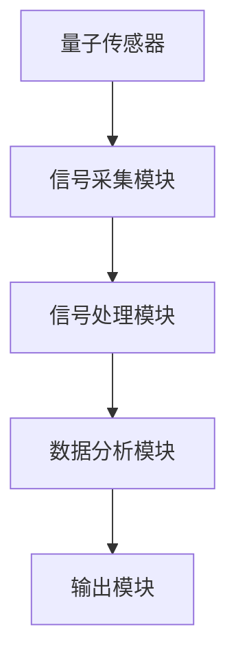
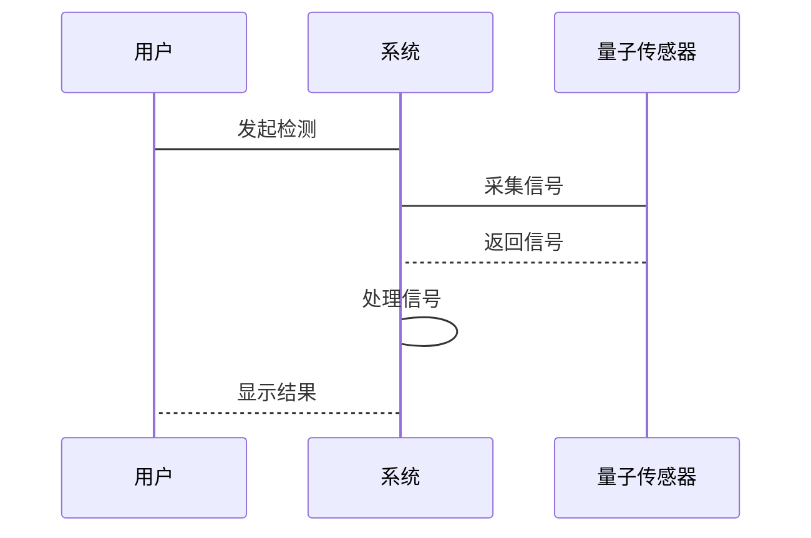

                 


# 如何评估企业的量子传感器微重力检测应用

> 关键词：量子传感器，微重力检测，企业应用，技术评估，系统设计

> 摘要：量子传感器在微重力检测中的应用为企业提供了一种高精度、高效的解决方案。本文从背景介绍、核心原理、算法实现、系统设计到项目实战，详细阐述了如何评估和应用量子传感器进行微重力检测。通过本文，读者可以全面理解量子传感器的优势，并掌握实际应用中的关键技术和方法。

---

## 第三部分: 量子传感器微重力检测的算法与实现

---

### # 第3章: 微重力检测算法原理

#### ## 3.1 信号处理算法

##### ### 3.1.1 基于量子传感器的信号采集

量子传感器通过测量微重力场中的量子效应来获取信号。信号采集的关键在于传感器的灵敏度和数据采集的频率。以下是信号采集的主要步骤：

1. **量子效应检测**：利用量子传感器的敏感性，捕捉微重力场中的量子波动。
2. **信号放大**：由于微重力信号通常非常微弱，需要进行放大处理。
3. **噪声抑制**：通过滤波算法去除环境噪声，确保信号的纯净度。

##### ### 3.1.2 信号的降噪与增强

降噪是信号处理的重要环节。常用的降噪方法包括：

- **傅里叶变换**：将信号从时域转换到频域，利用频域特性去除噪声。
- **小波变换**：适用于非平稳信号的降噪，能够有效捕捉信号中的高频噪声。

##### ### 3.1.3 算法的实现步骤

信号处理算法的实现步骤如下：

1. 采集原始信号。
2. 应用小波变换或傅里叶变换进行降噪。
3. 对降噪后的信号进行放大处理。
4. 输出处理后的信号。

##### ### 图3.1：信号处理流程图



#### ## 3.2 数据分析算法

##### ### 3.2.1 微重力场的特征提取

特征提取是数据分析的关键步骤。常用的特征包括：

- **幅度特征**：信号的最大值、最小值、均值等。
- **频率特征**：信号的频谱分布。
- **时域特征**：信号的上升沿、下降沿等。

##### ### 3.2.2 数据分类与模式识别

模式识别的目标是根据特征将微重力信号分类。常用的分类算法包括：

- **支持向量机（SVM）**：适用于高维特征的分类。
- **随机森林**：适用于特征较多的情况。

##### ### 3.2.3 算法的优化与改进

为了提高分类的准确性，可以采用以下优化措施：

1. **特征选择**：去除冗余特征，减少计算复杂度。
2. **参数调优**：通过交叉验证优化分类器的参数。

#### ## 3.3 算法的数学模型

##### ### 3.3.1 微重力场的数学表达式

微重力场的数学模型如下：

$$ g(x, y, z) = g_0 + \delta g $$

其中，$g_0$ 是地球重力的基本值，$\delta g$ 是微重力扰动。

##### ### 3.3.2 信号处理的公式推导

降噪处理的公式如下：

$$ f(t) = \int_{-\infty}^{\infty} F(\omega) e^{i\omega t} d\omega $$

其中，$F(\omega)$ 是信号的频域表示。

---

### 第四部分: 系统分析与架构设计

---

### # 第4章: 微重力检测系统的架构设计

#### ## 4.1 项目背景介绍

微重力检测系统主要用于企业中的精密测量场景，例如航空航天、地质勘探等领域。系统的目的是通过量子传感器实现高精度的微重力测量。

#### ## 4.2 系统功能设计

系统的主要功能包括：

1. **信号采集**：实时采集微重力信号。
2. **数据处理**：对信号进行降噪和特征提取。
3. **数据分析**：对数据进行分类和模式识别。
4. **结果输出**：显示检测结果并提供反馈。

#### ## 4.3 系统架构设计

##### ### 4.3.1 领域模型设计

领域模型如下：



##### ### 4.3.2 系统架构图

系统架构图如下：



#### ## 4.4 系统接口设计

系统接口主要包括：

1. **传感器接口**：与量子传感器连接，接收信号。
2. **数据接口**：与其他系统或数据库交互，存储和传输数据。
3. **用户接口**：提供人机交互界面，显示检测结果。

#### ## 4.5 系统交互设计

系统交互流程如下：



---

### 第五部分: 项目实战

---

### # 第5章: 量子传感器微重力检测项目实战

#### ## 5.1 环境安装

##### ### 5.1.1 系统环境要求

- 操作系统：Linux/Windows/MacOS
- 开发工具：Python 3.8+
- 依赖库：NumPy, Scipy, scikit-learn, Matplotlib

##### ### 5.1.2 安装步骤

1. 安装Python：
   ```bash
   # 在终端中运行
   python3 --version
   ```
2. 安装依赖库：
   ```bash
   pip install numpy scipy scikit-learn matplotlib
   ```

#### ## 5.2 核心代码实现

##### ### 5.2.1 信号处理代码

```python
import numpy as np
from scipy.signal import fft, iirfilter

def signal_processing(signal):
    # 傅里叶变换
    fft_result = fft(signal)
    # 滤波器设计
    b, a = iirfilter(4, 0.5)
    # 滤波
    filtered_signal = lfilter(b, a, signal)
    return filtered_signal
```

##### ### 5.2.2 数据分析代码

```python
from sklearn.svm import SVC
from sklearn.ensemble import RandomForestClassifier

def data_analysis(features):
    # 支持向量机分类
    clf = SVC()
    clf.fit(features, labels)
    # 随机森林分类
    rfc = RandomForestClassifier()
    rfc.fit(features, labels)
    return clf, rfc
```

##### ### 5.2.3 代码解读与分析

- **信号处理代码**：通过傅里叶变换和滤波器设计，实现信号的降噪处理。
- **数据分析代码**：使用支持向量机和随机森林两种算法进行分类，提高分类的准确率。

#### ## 5.3 实际案例分析

##### ### 5.3.1 案例背景

某企业在地质勘探中需要检测微重力场的变化，使用量子传感器进行实时监测。

##### ### 5.3.2 数据分析

通过对采集到的微重力信号进行处理，发现某一区域的微重力异常，提示可能存在地质结构变化。

##### ### 5.3.3 结果展示

通过系统输出模块，显示检测结果并提供反馈，帮助企业做出决策。

#### ## 5.4 项目小结

通过项目实战，验证了量子传感器在微重力检测中的有效性，同时也发现了一些需要优化的地方，例如传感器灵敏度和数据处理速度。

---

### 第六部分: 最佳实践与总结

---

### # 第6章: 最佳实践与总结

#### ## 6.1 最佳实践

##### ### 6.1.1 系统优化建议

- 提高量子传感器的灵敏度。
- 优化信号处理算法，减少计算时间。
- 提升系统的容错能力，确保数据的准确性。

##### ### 6.1.2 注意事项

- 在实际应用中，注意环境干扰，确保传感器的准确性。
- 定期校准系统，保证测量的精确度。

#### ## 6.2 小结

通过本文的详细介绍，读者可以全面了解量子传感器在微重力检测中的应用，并掌握实际评估和优化的方法。量子传感器的应用为企业提供了高效、精准的解决方案，未来随着技术的不断发展，其应用前景将更加广阔。

#### ## 6.3 拓展阅读

建议读者进一步阅读相关领域的书籍和论文，深入了解量子传感器的原理和技术发展。

---

## 关键词总结

- 量子传感器
- 微重力检测
- 企业应用
- 技术评估
- 系统设计

---

通过本文的详细讲解，相信读者能够全面理解量子传感器在微重力检测中的应用，并能够根据实际需求进行评估和优化。

