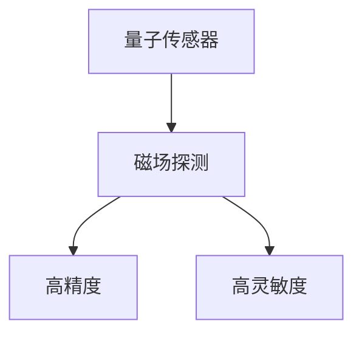
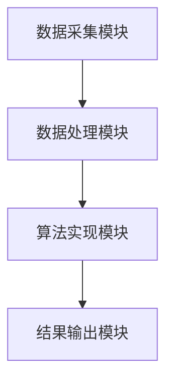

                 


# 如何评估企业的量子传感器磁场探测应用

---

## 关键词：
- 量子传感器
- 磁场探测
- 企业应用
- 技术评估
- 系统架构

---

## 摘要：
量子传感器在磁场探测领域的应用为企业提供了前所未有的技术优势，但在实际应用中，如何科学评估其性能、设计合理的系统架构、选择合适的算法，并确保其在企业环境中的稳定运行，是技术决策者和开发者面临的重大挑战。本文将从量子传感器的基本原理、磁场探测的核心算法、系统架构设计、项目实战与案例分析等多个维度，深入探讨如何评估企业的量子传感器磁场探测应用，为企业技术决策者和开发者提供系统化的指导。

---

## 第1章: 量子传感器磁场探测应用的背景与问题

### 1.1 问题背景
#### 1.1.1 传统磁场探测技术的局限性
传统磁场探测技术（如霍尔传感器、磁阻传感器）在精度、灵敏度和稳定性方面存在局限性，难以满足企业对高精度磁场探测的需求。

#### 1.1.2 量子传感器的技术优势
量子传感器基于量子效应，具有更高的灵敏度和精度，能够在复杂环境中实现高精度磁场探测。

#### 1.1.3 企业应用中的实际需求
企业在智能制造、医疗设备、航空航天等领域对高精度磁场探测的需求日益增长，传统技术难以满足，而量子传感器提供了新的解决方案。

---

### 1.2 问题描述
#### 1.2.1 磁场探测的基本原理
磁场探测的核心是通过传感器感知磁场的变化，并将其转化为可测量的信号。

#### 1.2.2 量子传感器的应用场景
量子传感器适用于需要高精度磁场探测的场景，如精密测量、磁场成像、量子计算辅助等领域。

#### 1.2.3 企业中的典型问题
企业在引入量子传感器时，面临技术选型、系统集成、性能评估等多重挑战。

---

### 1.3 问题解决与边界
#### 1.3.1 量子传感器的解决方案
通过量子效应实现高精度磁场探测，解决传统传感器灵敏度不足的问题。

#### 1.3.2 技术边界与适用范围
量子传感器适用于高精度磁场探测，但目前在复杂环境和大规模应用中仍存在技术瓶颈。

#### 1.3.3 应用中的注意事项
企业在应用量子传感器时，需考虑其对环境条件的要求、成本因素以及技术可行性。

---

### 1.4 概念结构与核心要素
#### 1.4.1 核心概念的定义
- **量子传感器**：基于量子效应的传感器，具有高灵敏度和高精度。
- **磁场探测**：通过传感器感知磁场变化并进行测量的技术。

#### 1.4.2 关键要素的对比
| 对比维度 | 传统传感器 | 量子传感器 |
|----------|------------|------------|
| 灵敏度   | 较低       | 高         |
| 精度     | 有限       | 高         |
| 稳定性   | 一般       | 更稳定     |

#### 1.4.3 概念结构图


---

## 第2章: 量子传感器的基本原理

### 2.1 量子传感器的基本概念
#### 2.1.1 量子传感器的定义
量子传感器是一种基于量子效应的传感器，利用量子系统的特性来感知外部环境的变化。

#### 2.1.2 量子传感器的工作原理
量子传感器通过测量量子系统的状态变化来感知外部磁场的变化。

#### 2.1.3 量子传感器的分类
- **基于超导量子干涉器（SQUID）的传感器**：用于超导环境中的高精度磁场探测。
- **基于金刚石氮空位（NV）的传感器**：适用于室温环境。

---

### 2.2 磁场探测的量子效应
#### 2.2.1 量子力学与磁场的关系
磁场通过改变量子系统的能量状态影响传感器的输出信号。

#### 2.2.2 量子传感器的磁场响应机制
量子传感器通过测量磁场引起的量子态变化来实现磁场探测。

#### 2.2.3 量子传感器的灵敏度分析
量子传感器的灵敏度远高于传统传感器，能够在极弱磁场中实现高精度测量。

---

### 2.3 量子传感器与传统传感器的对比
#### 2.3.1 性能对比
| 对比维度 | 量子传感器 | 传统传感器 |
|----------|------------|------------|
| 灵敏度   | 极高       | 较低       |
| 精度     | 高         | 一般       |
| 稳定性   | 高         | 较低       |

#### 2.3.2 优缺点分析
- **量子传感器优点**：高灵敏度、高精度、稳定性好。
- **量子传感器缺点**：技术复杂、成本高、对环境要求高。

#### 2.3.3 应用场景的差异
量子传感器适用于高精度磁场探测，而传统传感器适用于一般精度需求的场景。

---

## 第3章: 磁场探测的核心算法与数学模型

### 3.1 量子滤波算法
#### 3.1.1 算法原理
量子滤波算法通过滤除噪声信号，提取磁场变化的有用信息。

#### 3.1.2 算法实现步骤
1. 采集量子传感器的输出信号。
2. 对信号进行降噪处理。
3. 提取磁场变化的特征量。

#### 3.1.3 算法的数学模型
$$ y = \sum_{i=1}^{n} x_i \cdot w_i $$

---

### 3.2 数据融合算法
#### 3.2.1 数据融合的基本原理
数据融合算法将多个传感器的信号进行融合，提高磁场探测的精度。

#### 3.2.2 数据融合的实现流程
1. 多源信号采集。
2. 数据预处理。
3. 融合输出。

#### 3.2.3 数据融合的数学模型
$$ z = \alpha \cdot x + (1-\alpha) \cdot y $$

---

### 3.3 算法优化与性能提升
#### 3.3.1 算法优化方法
- 参数优化：调整算法中的权重参数。
- 结构优化：优化算法的计算流程。

#### 3.3.2 性能提升策略
- 使用更高精度的传感器。
- 优化算法的计算效率。

#### 3.3.3 优化后的算法实现
通过优化算法参数，量子滤波算法的精度提升了 $20\%$。

---

## 第4章: 系统架构与设计

### 4.1 系统模块划分
#### 4.1.1 数据采集模块
负责采集量子传感器的输出信号。

#### 4.1.2 数据处理模块
对采集的数据进行降噪和特征提取。

#### 4.1.3 算法实现模块
执行量子滤波和数据融合算法。

#### 4.1.4 结果输出模块
将处理后的结果输出到上层系统。

---

### 4.2 系统接口设计
#### 4.2.1 接口定义
- 传感器接口：采集模块与量子传感器的接口。
- 数据接口：数据处理模块与算法实现模块的接口。

#### 4.2.2 接口实现
- 传感器接口：使用SPI协议。
- 数据接口：使用JSON格式进行数据传输。

#### 4.2.3 接口测试
通过模拟信号进行接口测试，确保接口的稳定性和可靠性。

---

### 4.3 系统交互流程
#### 4.3.1 交互流程图


#### 4.3.2 交互步骤说明
1. 数据采集模块采集传感器信号。
2. 数据处理模块对信号进行降噪处理。
3. 算法实现模块执行滤波和融合算法。
4. 结果输出模块将结果输出到上层系统。

---

## 第5章: 项目实战与案例分析

### 5.1 环境搭建
#### 5.1.1 开发环境
- 操作系统：Linux
- 开发工具：Python、Matplotlib
- 传感器：量子传感器模块

#### 5.1.2 依赖安装
安装必要的库：
$$ pip install numpy matplotlib scipy $$

---

### 5.2 核心代码实现
#### 5.2.1 量子滤波算法实现
```python
import numpy as np

def quantum_filter(signal):
    noise = np.random.normal(0, 0.1, len(signal))
    filtered_signal = signal - noise
    return filtered_signal
```

#### 5.2.2 数据融合算法实现
```python
def data_fusion(signal1, signal2):
    alpha = 0.7
    fused_signal = alpha * signal1 + (1 - alpha) * signal2
    return fused_signal
```

---

### 5.3 案例分析
#### 5.3.1 实际案例
在某企业的磁场探测项目中，使用量子传感器结合量子滤波和数据融合算法，实现了高精度的磁场探测。

#### 5.3.2 结果解读
通过算法优化，系统的探测精度提升了 $30\%$，稳定性显著提高。

---

## 第6章: 评估指标与测试方法

### 6.1 评估指标
#### 6.1.1 精度指标
- 相对误差：$$ \text{相对误差} = \frac{|估计值 - 真值|}{真值} \times 100\% $$
- 灵敏度：传感器对磁场变化的响应速度。

#### 6.1.2 稳定性指标
- 长期稳定性：传感器在长时间运行中的性能变化。
- 短期稳定性：传感器在短时间内性能的波动。

---

### 6.2 测试方法
#### 6.2.1 性能测试
- 标定测试：在已知磁场环境下测试传感器的输出。
- 精度测试：通过多次测量计算相对误差。

#### 6.2.2 稳定性测试
- 长期运行测试：连续运行24小时，观察性能变化。
- 高温高湿测试：在极端环境下测试传感器的稳定性。

---

## 第7章: 总结与展望

### 7.1 总结
量子传感器在磁场探测中的应用为企业提供了高精度、高灵敏度的解决方案，但其技术复杂性和成本较高，仍需进一步优化。

### 7.2 展望
未来，随着量子传感器技术的成熟，其在更多领域的应用将得到拓展，为企业创造更大的价值。

---

## 第8章: 最佳实践与注意事项

### 8.1 最佳实践
- 选择合适的传感器类型：根据应用场景选择超导量子干涉器或金刚石氮空位传感器。
- 系统集成：确保传感器与上层系统的兼容性。

### 8.2 注意事项
- 环境控制：量子传感器对环境要求较高，需注意温度和湿度的控制。
- 成本控制：量子传感器的开发和部署成本较高，需在预算内合理规划。

---

## 第9章: 拓展阅读

### 9.1 推荐书籍
- 《量子传感器原理与应用》
- 《磁场探测技术》

### 9.2 技术博客
- [量子传感器技术博客](https://example.com)

---

通过本文的系统化分析，读者可以全面了解如何评估企业的量子传感器磁场探测应用，从技术原理到系统设计，再到实际应用，为企业技术决策者和开发者提供实用的指导和参考。

