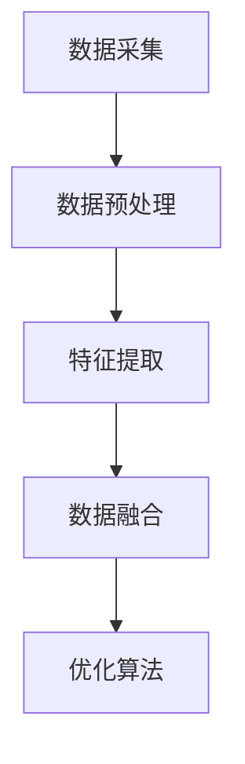
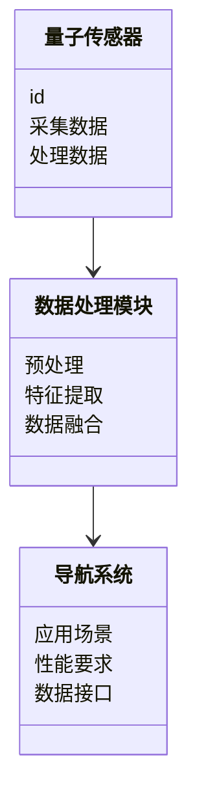

                 


# 如何评估企业的量子传感器精密导航技术潜力

---

## 关键词：
量子传感器、精密导航技术、技术潜力评估、企业应用、算法原理、系统架构、市场分析

---

## 摘要：
量子传感器精密导航技术是一种结合量子力学原理和现代传感器技术的新兴领域，具有在导航精度、抗干扰能力和应用场景上的巨大潜力。本文将从技术背景、核心概念、算法原理、系统架构、项目实战等多个维度，全面分析如何评估企业在量子传感器精密导航技术领域的潜力。通过深入解析技术原理、系统设计和实际案例，本文为企业提供了一套科学的评估方法和实践指南。

---

# 目录大纲：如何评估企业的量子传感器精密导航技术潜力

---

## 第一部分: 量子传感器精密导航技术背景与概述

### 第1章: 量子传感器精密导航技术概述

#### 1.1 量子传感器的基本概念
- 1.1.1 量子传感器的定义与分类
- 1.1.2 精密导航技术的核心原理
- 1.1.3 量子传感器与传统传感器的对比

#### 1.2 量子传感器精密导航技术的应用场景
- 1.2.1 军事与航空航天领域
- 1.2.2 自动驾驶与智能交通系统
- 1.2.3 民用导航与物联网应用

#### 1.3 量子传感器精密导航技术的市场现状
- 1.3.1 全球市场发展概况
- 1.3.2 主要国家的技术研发进展
- 1.3.3 中国市场与企业布局

#### 1.4 本章小结

---

### 第2章: 量子传感器精密导航技术的核心概念

#### 2.1 量子传感器的原理与技术特征
- 2.1.1 量子力学基础与传感器原理
- 2.1.2 量子传感器的关键技术特征
- 2.1.3 精密导航技术的核心要素

#### 2.2 量子传感器精密导航技术的系统架构
- 2.2.1 系统组成与功能模块
- 2.2.2 数据流与信息处理流程
- 2.2.3 系统性能指标与评估标准

#### 2.3 核心概念的ER实体关系图
```mermaid
er
    entity 量子传感器 {
        id
        类型
        参数
    }
    entity 导航系统 {
        id
        应用场景
        性能要求
    }
    entity 数据流 {
        id
        数据类型
        传输路径
    }
```

#### 2.4 本章小结

---

## 第二部分: 量子传感器精密导航技术的算法原理

### 第3章: 量子传感器数据处理算法

#### 3.1 量子传感器数据采集与预处理
- 3.1.1 数据采集流程与关键节点
- 3.1.2 数据预处理方法与优化策略

#### 3.2 量子传感器信号的特征提取
- 3.2.1 信号特征的识别与分类
- 3.2.2 基于量子力学的特征分析

#### 3.3 数据融合与优化算法
- 3.3.1 数据融合模型与算法选择
- 3.3.2 算法优化与性能提升策略

#### 3.4 量子传感器算法的数学模型
- 3.4.1 数据处理的数学公式
- 3.4.2 算法流程的mermaid图


#### 3.5 本章小结

---

## 第三部分: 量子传感器精密导航技术的系统架构与设计

### 第4章: 系统功能设计与架构分析

#### 4.1 系统功能设计
- 4.1.1 系统模块划分与功能定义
- 4.1.2 模块之间的交互关系
- 4.1.3 系统功能的实现流程

#### 4.2 系统架构设计
- 4.2.1 分层架构设计
- 4.2.2 微服务架构设计
- 4.2.3 架构的可扩展性和灵活性

#### 4.3 系统架构的mermaid图


#### 4.4 本章小结

---

## 第四部分: 量子传感器精密导航技术的项目实战

### 第5章: 项目实战与案例分析

#### 5.1 项目背景与目标
- 5.1.1 项目背景介绍
- 5.1.2 项目目标与范围

#### 5.2 项目环境与工具安装
- 5.2.1 系统环境配置
- 5.2.2 开发工具安装与配置
- 5.2.3 数据采集设备的准备

#### 5.3 核心代码实现
- 5.3.1 数据采集模块的实现
- 5.3.2 数据处理模块的实现
- 5.3.3 导航系统模块的实现

#### 5.4 代码实现的详细解读
- 5.4.1 数据采集模块的代码解析
- 5.4.2 数据处理模块的代码解析
- 5.4.3 导航系统模块的代码解析

#### 5.5 项目测试与优化
- 5.5.1 测试方案设计
- 5.5.2 测试结果分析
- 5.5.3 系统优化与改进

#### 5.6 案例分析与经验总结
- 5.6.1 案例分析
- 5.6.2 经验总结与改进建议

#### 5.7 本章小结

---

## 第五部分: 总结与展望

### 第6章: 总结与最佳实践

#### 6.1 核心观点总结
- 6.1.1 量子传感器精密导航技术的核心优势
- 6.1.2 技术评估的关键点
- 6.1.3 企业应用的潜力与挑战

#### 6.2 最佳实践 tips
- 6.2.1 技术评估的注意事项
- 6.2.2 项目实施的建议
- 6.2.3 未来发展的展望

#### 6.3 本章小结

---

## 参考文献与拓展阅读
- 量子传感器相关技术文献
- 精密导航技术领域的权威书籍
- 相关行业报告与市场分析

---

通过以上目录大纲，我们可以系统地评估企业的量子传感器精密导航技术潜力，从技术背景、核心概念、算法原理、系统架构到项目实战，层层深入，为企业提供科学的评估方法和实践指南。

