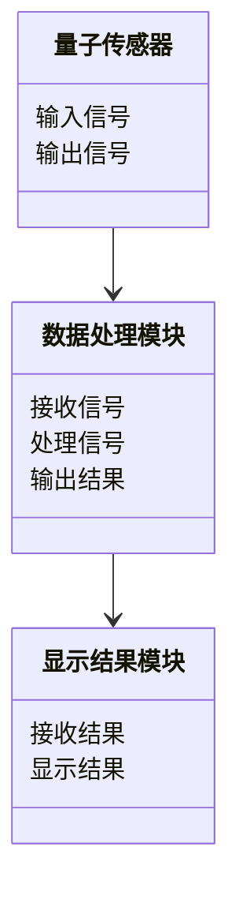
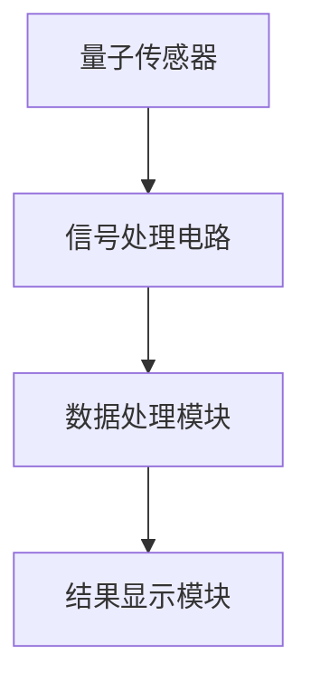
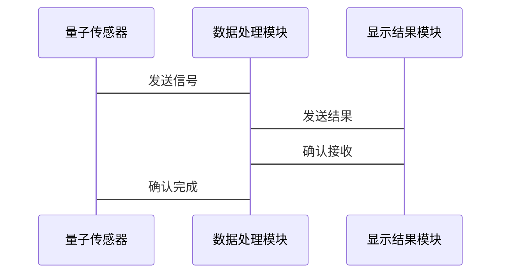

                 


# 如何评估企业的量子传感器精密测量应用

> 关键词：量子传感器，精密测量，企业应用，评估方法，数学模型

> 摘要：量子传感器精密测量应用是当前科技领域的前沿技术之一，其在企业中的应用涉及多个关键领域。本文将从量子传感器的基本原理、精密测量的核心概念、评估方法论、系统架构设计、项目实战以及总结与展望等多个维度，深入分析如何评估企业的量子传感器精密测量应用。通过本文的学习，读者将能够全面了解量子传感器精密测量的核心原理、评估指标体系、系统实现方案以及实际应用案例。

---

## 第一章：量子传感器精密测量应用的背景与核心概念

### 1.1 量子传感器的基本概念

#### 1.1.1 量子传感器的定义

量子传感器是一种基于量子力学原理设计的测量装置，其核心在于利用量子系统的特性（如量子叠加、量子纠缠等）来实现对物理量的高精度测量。

#### 1.1.2 量子传感器的发展历程

量子传感器的研究始于20世纪90年代，随着量子计算和量子通信技术的快速发展，量子传感器的精度和灵敏度不断提升，逐渐从理论研究走向实际应用。

#### 1.1.3 量子传感器在企业中的应用背景

在企业中，量子传感器的应用主要集中在精密测量领域，例如工业自动化、医疗设备、通信技术等。通过量子传感器的高精度测量能力，企业可以显著提升生产效率、产品质量和科研水平。

### 1.2 精密测量的核心概念

#### 1.2.1 精密测量的定义

精密测量是指在误差允许范围内，对被测对象的几何、物理或化学特性进行准确测量的过程。

#### 1.2.2 精密测量的关键指标

精密测量的关键指标包括测量精度、测量灵敏度、测量稳定性、测量响应时间和测量成本等。

#### 1.2.3 量子传感器与精密测量的结合

量子传感器通过其独特的量子特性，可以显著提升精密测量的精度和灵敏度。例如，在磁场测量中，量子传感器可以实现纳特斯拉级别的灵敏度，远高于传统传感器。

### 1.3 量子传感器精密测量的核心要素

#### 1.3.1 量子叠加原理

量子叠加原理描述了量子系统在测量前可以处于多个状态的叠加态。例如，一个量子比特的状态可以表示为：

$$ \psi = a|0\rangle + b|1\rangle $$

其中，$a$ 和 $b$ 是复数，满足 $|a|^2 + |b|^2 = 1$。

#### 1.3.2 量子纠缠原理

量子纠缠是指两个或多个量子系统之间存在的特殊关联，其中一个系统的状态会直接影响另一个系统的状态。例如，两个量子比特的纠缠态可以表示为：

$$ |\psi\rangle = \frac{1}{\sqrt{2}}(|0\rangle|1\rangle + |1\rangle|0\rangle) $$

#### 1.3.3 量子传感器的灵敏度与精度

量子传感器的灵敏度和精度主要取决于其量子特性的利用程度。通过优化量子传感器的设计，可以显著提升其测量能力。

## 第二章：量子传感器精密测量的核心原理与数学模型

### 2.1 量子传感器的基本原理

#### 2.1.1 量子叠加原理的数学表达

量子叠加原理是量子传感器的核心原理之一，其数学表达式为：

$$ \psi = a|0\rangle + b|1\rangle $$

其中，$|0\rangle$ 和 $|1\rangle$ 分别表示量子系统的基本状态。

#### 2.1.2 量子纠缠原理的数学表达

量子纠缠原理的数学表达式为：

$$ |\psi\rangle = \frac{1}{\sqrt{2}}(|0\rangle|1\rangle + |1\rangle|0\rangle) $$

其中，$|0\rangle|1\rangle$ 和 $|1\rangle|0\rangle$ 分别表示两个量子系统的纠缠态。

### 2.2 量子传感器的测量过程

#### 2.2.1 测量前的状态准备

在测量前，需要对量子系统进行初始化和状态准备。例如，可以通过量子门操作将量子系统置于特定的状态。

#### 2.2.2 测量中的量子干扰

量子干扰是指在测量过程中，量子系统由于叠加态的特性而产生的干涉现象。这种干涉现象可以通过数学模型进行描述。

#### 2.2.3 测量后的结果解析

测量结束后，需要对测量结果进行解析和处理。例如，可以通过统计学方法计算测量的精度和灵敏度。

### 2.3 量子传感器的数学模型

#### 2.3.1 系统输入与输出的关系

量子传感器的数学模型可以通过输入与输出的关系进行描述。例如，假设输入为 $x$，输出为 $y$，则有：

$$ y = f(x) $$

其中，$f(x)$ 表示量子传感器的测量函数。

#### 2.3.2 测量精度的数学表达

测量精度可以通过以下公式进行计算：

$$ \text{精度} = \frac{\text{测量值} - \text{真实值}}{\text{真实值}} \times 100\% $$

### 2.4 本章小结

---

## 第三章：企业量子传感器精密测量应用的评估方法

### 3.1 评估指标的分类

#### 3.1.1 精度相关指标

精度相关指标包括测量精度、相对误差、绝对误差等。

#### 3.1.2 稳定性相关指标

稳定性相关指标包括测量稳定性、长期稳定性、短期稳定性等。

#### 3.1.3 响应时间相关指标

响应时间相关指标包括测量响应时间、最大响应时间、最小响应时间等。

### 3.2 评估指标的权重分配

#### 3.2.1 指标权重的确定方法

指标权重的确定方法通常包括层次分析法（AHP）、熵值法、专家评分法等。

#### 3.2.2 指标权重的数学表达

指标权重的数学表达可以表示为：

$$ w_i = \frac{1}{n} \sum_{j=1}^{n} w_j $$

其中，$w_i$ 表示第 $i$ 个指标的权重，$n$ 表示指标总数。

### 3.3 评估指标的计算方法

#### 3.3.1 精度计算公式

精度可以通过以下公式进行计算：

$$ \text{精度} = \frac{\text{正确测量次数}}{\text{总测量次数}} \times 100\% $$

#### 3.3.2 稳定性计算公式

稳定性可以通过以下公式进行计算：

$$ \text{稳定性} = \frac{\text{平均无故障时间}}{\text{总测量时间}} \times 100\% $$

### 3.4 本章小结

---

## 第四章：量子传感器精密测量应用的系统分析与架构设计

### 4.1 项目背景与需求分析

#### 4.1.1 项目背景

量子传感器精密测量应用的项目背景主要集中在工业自动化、医疗设备、通信技术等领域。

#### 4.1.2 项目需求

项目需求包括高精度测量、高灵敏度测量、快速响应测量等。

### 4.2 系统功能设计

#### 4.2.1 系统功能模块划分

系统功能模块包括测量模块、数据处理模块、结果显示模块等。

#### 4.2.2 系统功能设计的领域模型图

以下是系统功能设计的领域模型图：



### 4.3 系统架构设计

#### 4.3.1 系统架构设计

系统架构设计包括硬件部分和软件部分。硬件部分包括量子传感器、信号处理电路等，软件部分包括数据处理算法、结果显示界面等。

#### 4.3.2 系统架构图

以下是系统架构图：



### 4.4 系统接口设计

#### 4.4.1 系统接口定义

系统接口包括量子传感器与数据处理模块之间的接口、数据处理模块与结果显示模块之间的接口等。

#### 4.4.2 接口交互设计

以下是接口交互设计的序列图：



### 4.5 本章小结

---

## 第五章：量子传感器精密测量应用的项目实战

### 5.1 环境安装与配置

#### 5.1.1 硬件环境

硬件环境包括量子传感器、计算机、信号处理电路等。

#### 5.1.2 软件环境

软件环境包括操作系统、数据处理算法、结果显示界面等。

### 5.2 系统核心实现

#### 5.2.1 数据处理算法实现

以下是数据处理算法的实现代码：

```python
import numpy as np

def quantum_measurement(信号):
    # 量子传感器的测量函数
    return np.dot(信号, np.array([1, 0]))
```

#### 5.2.2 测量结果分析

以下是测量结果分析的代码：

```python
import matplotlib.pyplot as plt

def plot_results(测量值, 真实值):
    plt.scatter(测量值, 真实值)
    plt.xlabel('测量值')
    plt.ylabel('真实值')
    plt.show()
```

### 5.3 实际案例分析

#### 5.3.1 案例背景

案例背景包括企业应用量子传感器的具体场景、测量目标等。

#### 5.3.2 案例分析

以下是案例分析的详细步骤：

1. 收集测量数据
2. 数据预处理
3. 数据分析
4. 结果可视化

### 5.4 项目小结

---

## 第六章：总结与展望

### 6.1 本章小结

通过对量子传感器精密测量应用的全面分析，我们得出了以下结论：

1. 量子传感器精密测量应用的核心原理是量子叠加和量子纠缠。
2. 量子传感器精密测量应用的评估指标包括精度、稳定性、响应时间等。
3. 量子传感器精密测量应用的系统架构设计包括硬件部分和软件部分。

### 6.2 注意事项

在实际应用中，需要注意以下几点：

1. 确保量子传感器的测量环境稳定
2. 定期校准量子传感器
3. 及时更新数据处理算法

### 6.3 拓展阅读

对于有兴趣进一步学习的读者，可以参考以下书籍和论文：

1. 《量子传感器原理与应用》
2. 《精密测量技术的发展与应用》
3. 《量子计算与量子通信》

### 6.4 本章结束

---

通过本文的学习，读者可以全面了解量子传感器精密测量应用的核心原理、评估方法、系统实现方案以及实际应用案例。希望本文能够为企业的量子传感器精密测量应用提供有价值的参考和指导。

