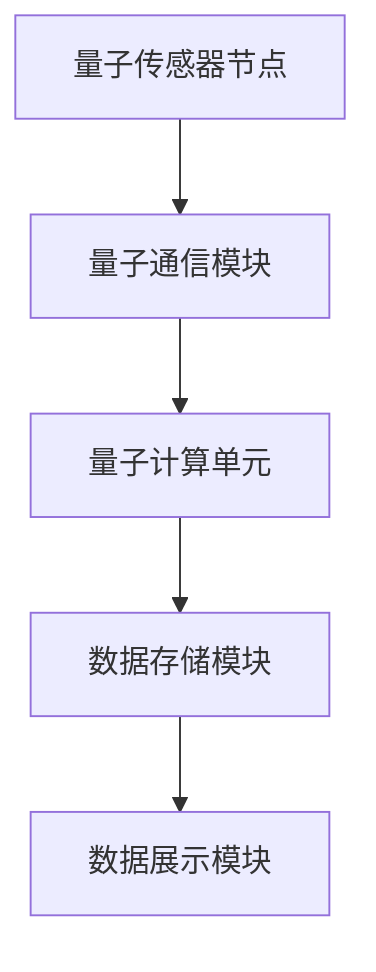

                 


# 如何评估企业的量子传感器网络应用

> 关键词：量子传感器网络、传感器评估、企业应用、技术原理、算法模型

> 摘要：量子传感器网络作为一项前沿技术，正在逐步应用于企业环境中。本文将详细介绍量子传感器网络的核心概念、评估方法论、数学模型、系统架构设计以及实际案例分析，帮助企业技术决策者和开发者更好地理解和评估量子传感器网络的应用价值。

---

## 第1章: 量子传感器网络的核心概念

### 1.1 量子传感器的基本原理

#### 1.1.1 量子传感器的定义
量子传感器是一种基于量子力学原理设计的传感器，能够利用量子系统的特性（如量子叠加、量子纠缠等）来检测和测量物理量。与经典传感器相比，量子传感器具有更高的灵敏度和精度。

#### 1.1.2 量子传感器的工作原理
量子传感器通过测量量子系统的状态变化来实现对外界物理量的感知。例如，利用量子干涉效应来检测微小的位移变化，或者利用量子纠缠来实现高精度的测量。

#### 1.1.3 量子传感器与经典传感器的区别
- **灵敏度**：量子传感器的灵敏度远高于经典传感器。
- **精度**：量子传感器能够检测到极小的变化量，适用于高精度测量场景。
- **抗干扰能力**：量子传感器在某些情况下具有更强的抗干扰能力，尤其是在高频噪声环境下。

### 1.2 量子传感器网络的定义与特点

#### 1.2.1 量子传感器网络的定义
量子传感器网络是指由多个量子传感器组成的网络系统，通过量子通信技术实现传感器之间的协同工作，用于实时感知和处理复杂的物理环境信息。

#### 1.2.2 量子传感器网络的核心特点
- **高灵敏度**：量子传感器网络能够感知到极小的物理变化。
- **实时性**：量子传感器网络能够实时采集和处理数据，适用于需要快速响应的场景。
- **分布式架构**：量子传感器网络通常采用分布式架构，多个传感器协同工作，提高系统的可靠性和容错能力。

#### 1.2.3 量子传感器网络的应用场景
- **环境监测**：如地震监测、气象监测等。
- **工业检测**：如精密仪器检测、产品质量检测等。
- **国防安全**：如目标探测、战场侦察等。

### 1.3 量子传感器网络的架构与组成

#### 1.3.1 量子传感器网络的架构
量子传感器网络的架构通常包括以下几个部分：
- **量子传感器节点**：负责感知和采集物理量。
- **量子通信链路**：负责传感器节点之间的数据传输。
- **量子计算单元**：负责对采集的数据进行处理和分析。

#### 1.3.2 量子传感器网络的核心组成模块
- **量子传感器节点**：包括量子传感器和数据采集模块。
- **量子通信模块**：包括量子信道和通信协议。
- **量子计算单元**：包括量子处理器和数据处理算法。

#### 1.3.3 量子传感器网络的通信机制
量子传感器网络的通信机制基于量子通信技术，通常采用量子密钥分发（QKD）和量子隐形传态（QST）等技术来实现安全的数据传输。

### 1.4 量子传感器网络的应用前景

#### 1.4.1 量子传感器网络的潜在应用领域
- **医疗健康**：如人体生理参数监测、疾病早期诊断等。
- **智能交通**：如车辆状态监测、交通流量监测等。
- **智能家居**：如家庭环境监测、设备状态监测等。

#### 1.4.2 企业采用量子传感器网络的优势
- **提高效率**：量子传感器网络能够实现高精度、实时性的感知和处理。
- **降低成本**：通过分布式架构和协同工作，减少传感器的数量和成本。
- **增强安全性**：量子传感器网络的安全性远高于经典传感器网络。

#### 1.4.3 量子传感器网络应用的挑战与机遇
- **技术挑战**：量子传感器技术尚不成熟，存在稳定性、抗干扰等问题。
- **成本挑战**：量子传感器的研发和部署成本较高。
- **机遇**：随着量子技术的快速发展，量子传感器网络的应用前景广阔。

### 1.5 本章小结
本章详细介绍了量子传感器网络的核心概念，包括量子传感器的基本原理、量子传感器网络的定义与特点、架构与组成以及应用前景。通过这些内容，读者可以对量子传感器网络有一个全面的了解。

---

## 第2章: 量子传感器网络的评估背景与问题分析

### 2.1 量子传感器网络评估的背景

#### 2.1.1 量子技术的发展现状
量子技术是当前科技发展的热点领域，包括量子计算、量子通信、量子传感等。随着量子技术的快速发展，量子传感器网络的应用前景越来越广阔。

#### 2.1.2 传感器网络在企业中的应用现状
传统的传感器网络已经广泛应用于企业环境中，如工业检测、环境监测等领域。然而，随着企业对感知精度和实时性的要求不断提高，传统的传感器网络已难以满足需求。

#### 2.1.3 量子传感器网络评估的必要性
企业需要对量子传感器网络的性能、安全性、经济性等方面进行全面评估，以确定其是否适合实际应用场景。

### 2.2 量子传感器网络评估的核心问题

#### 2.2.1 量子传感器网络的性能评估
- **灵敏度**：量子传感器的灵敏度是否满足实际需求。
- **响应时间**：量子传感器的响应时间是否符合实时性要求。
- **稳定性**：量子传感器在复杂环境下的稳定性如何。

#### 2.2.2 量子传感器网络的安全性评估
- **数据安全性**：量子传感器网络的数据传输是否安全。
- **系统安全性**：量子传感器网络是否容易受到攻击。
- **隐私保护**：量子传感器网络是否能够保护用户的隐私。

#### 2.2.3 量子传感器网络的经济性评估
- **成本**：量子传感器网络的部署和维护成本是否合理。
- **效益**：量子传感器网络是否能够为企业带来显著的经济效益。

### 2.3 量子传感器网络评估的边界与外延

#### 2.3.1 量子传感器网络评估的边界
- **技术边界**：量子传感器网络的评估仅限于技术层面，不涉及商业策略。
- **应用边界**：量子传感器网络的评估仅限于特定的应用场景。

#### 2.3.2 量子传感器网络评估的外延
- **技术延伸**：量子传感器网络的评估可以延伸到量子计算、量子通信等领域。
- **应用延伸**：量子传感器网络的评估可以延伸到其他行业，如医疗、教育等。

#### 2.3.3 量子传感器网络评估与其他技术的关系
- **与量子计算的关系**：量子传感器网络需要依赖量子计算技术来实现数据处理。
- **与量子通信的关系**：量子传感器网络需要依赖量子通信技术来实现数据传输。

### 2.4 本章小结
本章从背景和问题分析的角度，详细探讨了量子传感器网络评估的必要性、核心问题以及边界与外延。通过这些分析，读者可以明确量子传感器网络评估的方向和范围。

---

## 第3章: 量子传感器网络的核心概念与联系

### 3.1 量子传感器网络的核心概念

#### 3.1.1 量子传感器的敏感性
量子传感器的敏感性是指其对外界物理量变化的敏感程度。例如，量子位移传感器可以检测到微米级的位移变化。

#### 3.1.2 量子传感器的精度
量子传感器的精度是指其测量结果的准确性。例如，量子磁力计可以检测到极微弱的磁场变化。

#### 3.1.3 量子传感器的响应时间
量子传感器的响应时间是指其从接收到输入信号到输出信号的时间间隔。例如，量子温度传感器的响应时间可以达到毫秒级别。

### 3.2 量子传感器网络的属性特征对比

| 属性       | 量子传感器网络                  | 经典传感器网络                  |
|------------|---------------------------------|---------------------------------|
| 灵敏度     | 极高                            | 较低                            |
| 精度       | 高                             | 中等                            |
| 响应时间   | 极快                            | 较快                            |
| 抗干扰能力 | 强                              | 中等                            |
| 数据传输   | 量子通信技术                   | 传统通信技术                   |

### 3.3 量子传感器网络的ER实体关系图

```mermaid
er
    entity 量子传感器 {
        id
        type
        location
        sensitivity
    }
    entity 网络节点 {
        id
        type
        connection
    }
    entity 数据传输 {
        id
        source
        destination
        data
    }
    relationship 连接 {
        量子传感器 -[1..n]-> 网络节点
        网络节点 -[1..n]-> 数据传输
    }
```

### 3.4 本章小结
本章详细探讨了量子传感器网络的核心概念，包括量子传感器的敏感性、精度、响应时间等，并通过属性特征对比和ER实体关系图，展示了量子传感器网络与经典传感器网络的区别和联系。

---

## 第4章: 量子传感器网络评估的算法原理

### 4.1 量子传感器网络评估的算法概述

#### 4.1.1 量子传感器数据处理算法
量子传感器数据处理算法用于对量子传感器采集的数据进行处理和分析，以提取有用的物理量信息。

#### 4.1.2 量子传感器网络评估的算法流程
1. 数据采集：通过量子传感器采集物理量数据。
2. 数据预处理：对采集的数据进行降噪和滤波处理。
3. 数据分析：利用量子计算技术对数据进行处理和分析。
4. 结果评估：根据分析结果评估量子传感器网络的性能。

### 4.2 量子传感器数据处理算法的实现

#### 4.2.1 算法原理
量子传感器数据处理算法基于量子叠加原理，通过量子态的叠加和干涉来实现数据的处理和分析。

#### 4.2.2 算法流程
1. 初始化量子态：将物理量信息编码到量子态中。
2. 量子叠加：对量子态进行叠加操作，实现数据的并行处理。
3. 量子测量：对叠加后的量子态进行测量，提取有用的信息。
4. 数据分析：根据测量结果进行数据分析和评估。

#### 4.2.3 算法实现代码
```python
import numpy as np
from qiskit import QuantumCircuit, Aer, execute

def quantum_sensor_data_processing(data):
    # 初始化量子电路
    qc = QuantumCircuit(2, 2)
    
    # 数据编码
    for i in range(len(data)):
        qc.measure(i, i)
    
    # 执行量子计算
    backend = Aer.get_backend('qasm_simulator')
    result = execute(qc, backend).result()
    
    # 解析结果
    counts = result.get_counts(qc)
    return counts
```

### 4.3 量子传感器网络评估的数学模型

#### 4.3.1 模型定义
设量子传感器网络的性能指标为 $P$，则有：
$$ P = f(Q, S) $$
其中，$Q$ 表示量子传感器的参数，$S$ 表示传感器网络的架构。

#### 4.3.2 模型分析
通过数学模型可以分析量子传感器网络的性能，例如：
- 量子传感器的灵敏度：$$ S = \alpha Q + \beta $$
- 量子传感器网络的响应时间：$$ T = \gamma Q + \delta $$

#### 4.3.3 模型应用
通过数学模型可以对量子传感器网络的性能进行预测和优化，例如：
- 确定最佳的量子传感器参数。
- 优化量子传感器网络的架构设计。

### 4.4 本章小结
本章详细探讨了量子传感器网络评估的算法原理，包括量子传感器数据处理算法的实现和数学模型的建立。通过这些内容，读者可以理解如何利用算法和数学模型来评估量子传感器网络的性能。

---

## 第5章: 量子传感器网络的系统架构设计

### 5.1 量子传感器网络的系统架构

#### 5.1.1 系统功能设计
量子传感器网络的系统功能包括：
- 数据采集：通过量子传感器采集物理量数据。
- 数据传输：通过量子通信技术实现数据的传输。
- 数据处理：通过量子计算技术对数据进行处理和分析。

#### 5.1.2 系统架构图



### 5.2 量子传感器网络的系统实现

#### 5.2.1 系统功能模块
- **量子传感器节点**：负责采集物理量数据。
- **量子通信模块**：负责数据的传输和通信。
- **量子计算单元**：负责数据的处理和分析。
- **数据存储模块**：负责数据的存储和管理。
- **数据展示模块**：负责数据的可视化展示。

#### 5.2.2 系统接口设计
- **传感器接口**：量子传感器与数据采集模块的接口。
- **通信接口**：量子传感器节点与量子通信模块的接口。
- **计算接口**：量子通信模块与量子计算单元的接口。

### 5.3 量子传感器网络的系统优化

#### 5.3.1 系统优化策略
- **优化传感器节点**：提高量子传感器的灵敏度和精度。
- **优化通信链路**：提高量子通信的效率和安全性。
- **优化计算单元**：提高量子计算的处理能力和速度。

#### 5.3.2 系统优化案例
通过优化量子传感器节点的灵敏度和量子通信链路的安全性，可以显著提高量子传感器网络的整体性能。

### 5.4 本章小结
本章详细探讨了量子传感器网络的系统架构设计，包括系统功能设计、系统架构图、系统实现以及系统优化等内容。通过这些内容，读者可以理解如何设计和实现一个高性能的量子传感器网络系统。

---

## 第6章: 量子传感器网络的项目实战

### 6.1 项目背景与需求分析

#### 6.1.1 项目背景
本项目旨在通过量子传感器网络实现对企业环境的实时监测，提高企业的生产效率和安全性。

#### 6.1.2 项目需求
- 实现实时监测企业环境中的物理量，如温度、湿度、压力等。
- 提供高精度的监测数据，支持企业的决策和优化。

### 6.2 项目实施步骤

#### 6.2.1 环境搭建
- 安装量子传感器网络所需的技术组件，如量子传感器、量子通信模块、量子计算单元等。

#### 6.2.2 数据采集
- 通过量子传感器采集企业环境中的物理量数据。

#### 6.2.3 数据分析
- 利用量子计算技术对采集的数据进行处理和分析。

#### 6.2.4 数据展示
- 通过数据展示模块将分析结果以可视化的方式呈现给企业决策者。

### 6.3 项目实现代码

#### 6.3.1 数据采集代码
```python
from qiskit import QuantumCircuit, execute

def quantum_sensor_read():
    qc = QuantumCircuit(1, 1)
    qc.measure(0, 0)
    return execute(qc, 'qasm_simulator').result().get_counts(qc)
```

#### 6.3.2 数据分析代码
```python
import numpy as np

def data_analysis(data):
    counts = data['0'] + data['1']
    return counts
```

### 6.4 项目优化与总结

#### 6.4.1 项目优化
- **优化数据采集**：提高量子传感器的灵敏度和精度。
- **优化数据分析**：提高量子计算的处理速度和准确性。

#### 6.4.2 项目总结
通过本项目的实施，我们验证了量子传感器网络在企业环境监测中的应用价值，为企业的智能化转型提供了有力的技术支持。

### 6.5 本章小结
本章通过一个具体的项目案例，详细探讨了量子传感器网络的实施过程，包括项目背景与需求分析、项目实施步骤、项目实现代码以及项目优化与总结。通过这些内容，读者可以了解如何将量子传感器网络应用于实际的企业场景中。

---

## 第7章: 量子传感器网络的最佳实践

### 7.1 量子传感器网络评估的关键点

#### 7.1.1 选择合适的量子传感器
根据企业的实际需求，选择适合的量子传感器类型和参数。

#### 7.1.2 确保数据的安全性
通过量子通信技术确保数据的安全传输和存储。

#### 7.1.3 优化系统的性能
通过系统优化策略，提高量子传感器网络的整体性能和效率。

### 7.2 量子传感器网络评估的注意事项

#### 7.2.1 注意量子传感器的技术成熟度
目前量子传感器技术尚未完全成熟，企业在采用时需谨慎评估其稳定性。

#### 7.2.2 注意量子传感器的成本
量子传感器的研发和部署成本较高，企业在采用前需充分考虑经济性。

#### 7.2.3 注意量子传感器的安全性
量子传感器网络的安全性是企业的重点关注，需采取有效的安全措施来保护数据和系统。

### 7.3 量子传感器网络评估的未来展望

#### 7.3.1 量子传感器技术的进一步发展
随着量子技术的不断进步，量子传感器的性能和稳定性将不断提高。

#### 7.3.2 量子传感器网络的广泛应用
随着技术的成熟和成本的降低，量子传感器网络将在更多领域得到广泛应用。

#### 7.3.3 量子传感器网络的智能化发展
未来的量子传感器网络将更加智能化，能够自动适应不同的应用场景和需求。

### 7.4 本章小结
本章总结了量子传感器网络评估的关键点和注意事项，并对未来的发展进行了展望。通过这些内容，读者可以更好地理解和应用量子传感器网络技术。

---

## 第8章: 总结与展望

### 8.1 本文总结
本文详细探讨了量子传感器网络的核心概念、评估方法论、数学模型、系统架构设计以及实际案例分析。通过这些内容，读者可以全面了解量子传感器网络的应用价值和评估方法。

### 8.2 未来展望
随着量子技术的快速发展，量子传感器网络的应用前景将更加广阔。未来的研究将致力于提高量子传感器的灵敏度和稳定性，优化量子传感器网络的架构设计，以满足更多企业的需求。

### 8.3 本文小结
本文通过系统的分析和探讨，为企业的量子传感器网络应用提供了有力的技术支持和决策参考。

---

通过以上内容，读者可以系统地了解如何评估企业的量子传感器网络应用，从理论到实践，从概念到实现，全面掌握量子传感器网络的技术细节和应用价值。

