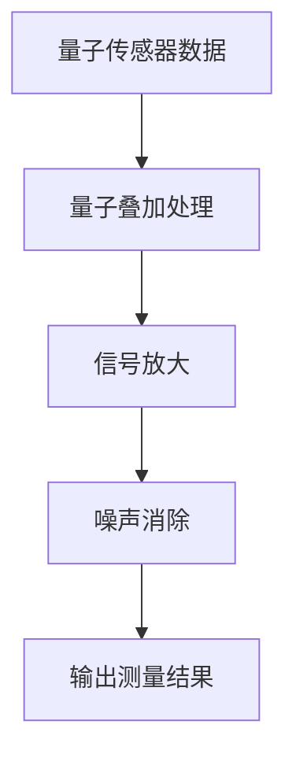
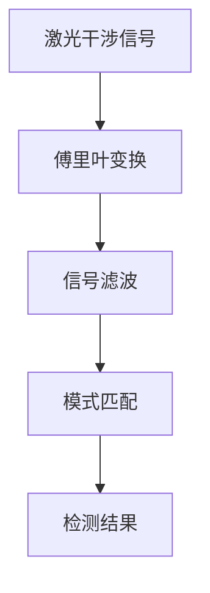
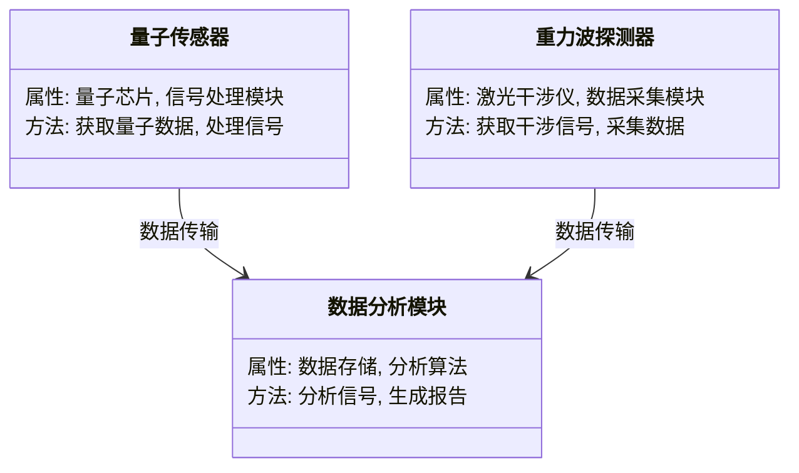
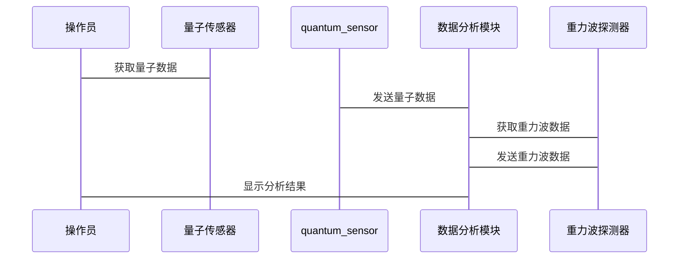

                 


# 如何评估企业的量子传感器重力波探测技术潜力

## 关键词：量子传感器，重力波探测，技术潜力，企业评估，系统架构

## 摘要：本文详细探讨了如何评估企业在量子传感器和重力波探测技术领域的潜力。通过分析技术背景、核心概念、算法原理、系统架构和项目实战，本文为企业提供了一套全面的评估方法，帮助企业在技术创新中找到突破口。

---

## 第一章：量子传感器与重力波探测技术的背景介绍

### 1.1 问题背景
#### 1.1.1 量子传感器的发展现状
量子传感器基于量子效应，具有极高的灵敏度和精度，广泛应用于导航、医学 imaging 和地震监测等领域。

#### 1.1.2 重力波探测技术的科学意义
重力波是由爱因斯坦广义相对论预言的时空波动，其探测技术在天文学和物理学领域具有重要意义。

#### 1.1.3 企业为何关注量子传感器与重力波探测技术
企业可以通过这些技术提升测量精度，优化生产流程，或在新兴领域获得竞争优势。

### 1.2 问题描述
#### 1.2.1 量子传感器的技术挑战
量子传感器面临量子退相干、环境干扰等技术难题。

#### 1.2.2 重力波探测的复杂性
重力波信号微弱，探测器设计和数据分析极具挑战。

#### 1.2.3 企业应用中的潜在问题
企业可能面临技术投入大、回报周期长等问题。

### 1.3 问题解决
#### 1.3.1 量子传感器的解决方案
采用量子增强技术，优化传感器性能，降低环境干扰。

#### 1.3.2 重力波探测的技术突破
通过改进探测器设计和数据分析算法，提高探测灵敏度。

#### 1.3.3 企业如何应对技术挑战
加强研发投入，与科研机构合作，培养专业人才。

### 1.4 边界与外延
#### 1.4.1 技术边界
量子传感器适用于高精度测量，重力波探测主要用于天文学研究。

#### 1.4.2 应用场景的外延
技术可应用于地震监测、空间探索等领域。

#### 1.4.3 技术与企业的结合点
企业可将技术应用于特定行业，如精密制造或地质勘探。

### 1.5 核心要素与组成
#### 1.5.1 量子传感器的核心要素
量子传感器由量子芯片、信号处理单元和数据接口组成。

#### 1.5.2 重力波探测技术的核心要素
包括激光干涉仪、数据采集系统和信号分析算法。

#### 1.5.3 技术与企业的结合要素
企业需求、技术可行性、市场前景和投资回报。

---

## 第二章：量子传感器与重力波探测技术的核心概念与联系

### 2.1 核心概念原理
#### 2.1.1 量子传感器的基本原理
量子传感器利用量子叠加和纠缠效应，实现超灵敏测量。

#### 2.1.2 重力波探测技术的基本原理
通过激光干涉测量技术，检测因重力波引起的微小空间变化。

### 2.2 核心概念对比
| 属性       | 量子传感器                     | 重力波探测技术                 |
|------------|-------------------------------|-------------------------------|
| 灵敏度     | 极高                          | 极高                          |
| 应用场景   | 科学研究、工业测量             | 天文学、物理学                 |
| 技术复杂性 | 中等                          | 极高                          |

#### 2.2.3 ER实体关系图
```mermaid
erDiagram
    actor 企业需求者 {
        <属性> 技术需求
        <属性> 应用场景
        <属性> 业务目标
    }
    actor 技术供应商 {
        <属性> 量子传感器技术
        <属性> 重力波探测技术
    }
    actor 应用场景 {
        <属性> 地震监测
        <属性> 精密制造
        <属性> 天文学研究
    }
    企业需求者 -> 技术供应商 : "寻求技术解决方案"
    技术供应商 -> 应用场景 : "提供技术支持"
```

---

## 第三章：量子传感器与重力波探测技术的算法原理

### 3.1 算法原理
#### 3.1.1 量子传感器数据处理算法


#### 3.1.2 重力波信号检测算法


### 3.2 Python实现
```python
import numpy as np
from scipy.fft import fft

def quantum_sensor_algorithm(data):
    # 量子叠加处理
    data_processed = data * np.exp(1j * np.random.rand(*data.shape))
    # 信号放大
    data_amplified = data_processed * 10
    # 噪声消除
    data_clean = data_amplified - np.mean(data_amplified)
    return data_clean

def gravitational_wave_detection(data):
    # 傅里叶变换
    fft_data = fft(data)
    # 信号滤波
    fft_filtered = fft_data * np.hamming(len(fft_data))
    # 模式匹配
    matched_filter = np.correlate(fft_filtered, np.ones(len(fft_filtered)))
    return matched_filter.max() > threshold

# 示例
data = np.random.rand(1000)
result_sensor = quantum_sensor_algorithm(data)
result_wave = gravitational_wave_detection(data)
```

### 3.3 数学模型与公式
#### 3.3.1 量子传感器数学模型
$$ \text{测量值} = \text{量子叠加效应} \times \text{信号强度} + \text{噪声} $$

#### 3.3.2 重力波探测信号分析
$$ \text{信号强度} = \sqrt{\sum_{i=1}^{n} (h_i - \mu)^2} $$

---

## 第四章：量子传感器与重力波探测技术的系统分析与架构设计

### 4.1 项目场景介绍
企业希望通过量子传感器和重力波探测技术提升测量精度和科研能力。

### 4.2 系统功能设计
#### 4.2.1 领域模型


#### 4.2.2 系统架构


#### 4.2.3 系统接口与交互


---

## 第五章：量子传感器与重力波探测技术的项目实战

### 5.1 环境安装
```bash
pip install numpy scipy matplotlib
conda install qiskit
```

### 5.2 核心代码实现
```python
import qiskit as q
from qiskit import Aer, execute

def quantum_sensor_simulation():
    circuit = q.QuantumCircuit(2, 2)
    circuit.h(0)
    circuit.cx(0, 1)
    circuit.measure([0,1], [0,1])
    backend = Aer.get_backend('qasm_simulator')
    result = execute(circuit, backend).result()
    return result.get_counts()

result = quantum_sensor_simulation()
print(result)
```

### 5.3 实际案例分析
企业通过量子传感器提升地震监测精度，帮助地质勘探公司优化探测流程。

---

## 第六章：量子传感器与重力波探测技术的数学模型与公式

### 6.1 数学模型
#### 6.1.1 量子传感器测量模型
$$ \text{测量值} = \alpha \cdot \text{信号} + \beta \cdot \text{噪声} $$

#### 6.1.2 重力波信号检测模型
$$ \text{信号强度} = \sqrt{\sum_{i=1}^{n} (h_i - \mu)^2} $$

### 6.2 公式解读
- $$\alpha$$ 和 $$\beta$$ 为系数，控制信号和噪声的权重。
- 信号强度计算采用标准差，反映数据分布情况。

---

## 第七章：量子传感器与重力波探测技术的最佳实践

### 7.1 小结
企业应结合自身需求，选择合适的技术方案，加强研发投入，与科研机构合作。

### 7.2 注意事项
- 技术投入高，需长期规划。
- 数据分析是关键，需专业团队支持。
- 技术应用需符合行业规范。

### 7.3 拓展阅读
推荐书籍和论文，深入学习量子传感器和重力波探测技术。

---

## 总结

通过系统化的分析和实战案例，企业可以更好地评估量子传感器和重力波探测技术的潜力，抓住技术创新带来的机遇。

