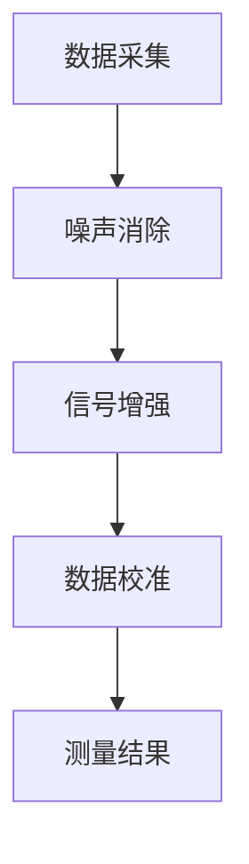
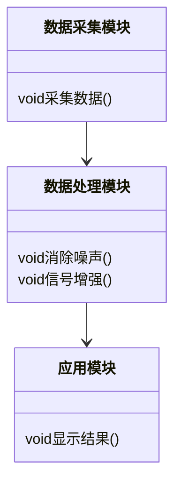

                 


# 如何评估企业的量子传感器重力测量应用

> 关键词：量子传感器、重力测量、企业评估、技术原理、应用分析

> 摘要：本文将详细介绍如何评估企业在量子传感器重力测量中的应用，从背景介绍、核心概念、算法原理、系统架构设计到项目实战和最佳实践，全面解析量子传感器在重力测量中的优势及其实现方式。

---

## 正文部分

### 第一部分：量子传感器重力测量的背景与核心概念

#### 第1章：量子传感器重力测量的背景介绍

##### 1.1 问题背景与问题描述

- **1.1.1 重力测量在企业中的应用需求**
  - 重力测量在地球物理学、工程测量、地质勘探等领域具有重要应用。
  - 传统传感器在高精度、复杂环境下的局限性日益凸显。
  - 企业对高精度、实时性、稳定性的重力测量需求不断增加。

- **1.1.2 量子传感器技术的兴起及其优势**
  - 量子传感器基于量子力学原理，具有更高的灵敏度和精度。
  - 抗干扰能力强，能够在复杂环境中稳定工作。
  - 量子传感器技术的发展为企业提供了更高的测量精度和更广泛的应用场景。

- **1.1.3 企业为何需要评估量子传感器重力测量应用**
  - 提高企业核心竞争力，优化生产流程。
  - 提升产品质量，降低测量误差。
  - 拓展新兴市场，抓住技术变革的机遇。

##### 1.2 问题解决与边界外延

- **1.2.1 量子传感器如何解决传统重力测量的痛点**
  - 解决传统传感器精度不足的问题。
  - 提高复杂环境下的测量稳定性。
  - 实现更快速的响应和更高的数据处理能力。

- **1.2.2 量子传感器重力测量的边界与适用场景**
  - 适用于高精度、高灵敏度的测量需求。
  - 适用于复杂环境下的长期监测。
  - 适用于需要实时数据传输的应用场景。

- **1.2.3 技术与业务的结合点分析**
  - 技术层面：量子传感器的性能优势。
  - 业务层面：企业对高精度测量的需求。
  - 结合点：通过量子传感器提升企业测量能力，推动业务发展。

##### 1.3 核心概念与组成要素

- **1.3.1 量子传感器的基本概念与工作原理**
  - 量子传感器利用量子纠缠效应进行测量。
  - 通过量子态的变化反映被测物理量的变化。

- **1.3.2 重力测量的核心要素与系统架构**
  - 核心要素：传感器、测量算法、数据处理系统。
  - 系统架构：数据采集层、数据处理层、应用层。

- **1.3.3 量子传感器在企业中的应用模式**
  - 独立部署：企业自建量子传感器测量系统。
  - 云端服务：通过云计算平台实现数据处理与分析。
  - 混合模式：结合本地部署与云端服务。

---

#### 第2章：量子传感器的核心原理与技术特点

##### 2.1 量子传感器的核心原理

- **2.1.1 量子力学基础与传感器的关系**
  - 量子力学中的纠缠态和叠加态为传感器提供了新的测量方式。
  - 利用量子态的不可区分性实现高精度测量。

- **2.1.2 量子传感器的信号采集与处理机制**
  - 信号采集：通过量子态的变化捕捉被测物理量。
  - 信号处理：利用量子计算技术对信号进行增强和分析。

- **2.1.3 重力测量的量子效应分析**
  - 量子传感器对重力场的敏感性分析。
  - 量子传感器在不同重力场中的表现。

##### 2.2 核心技术特点对比

- **2.2.1 与传统传感器的性能对比**
  | 特性         | 传统传感器         | 量子传感器         |
  |--------------|--------------------|--------------------|
  | 精度         | 中等               | 高                 |
  | 稳定性       | 较差               | 优                 |
  | 响应时间     | 较长               | 较短               |
  | 抗干扰能力   | 一般               | 强                 |

- **2.2.2 量子传感器的精度与稳定性分析**
  - 精度：量子传感器的测量精度远高于传统传感器。
  - 稳定性：在复杂环境下，量子传感器的稳定性表现更优。

- **2.2.3 技术参数对测量结果的影响**
  - 激光器频率：影响测量灵敏度。
  - 量子态初始化方式：影响测量精度。
  - 传感器尺寸：影响安装和部署的灵活性。

---

#### 第3章：量子传感器重力测量的数学模型与算法原理

##### 3.1 数据采集与处理算法

- **3.1.1 数据采集流程**
  - 信号采集：通过量子传感器捕获重力场的变化。
  - 噪声消除：利用滤波算法消除环境噪声。
  - 信号增强：通过放大技术提高信号强度。

- **3.1.2 噪声消除与信号增强算法**
  - 噪声消除：使用小波变换对信号进行降噪处理。
  - 信号增强：通过自适应滤波器提高信号信噪比。

- **3.1.3 数据校准与补偿方法**
  - 数据校准：通过标定实验建立校准模型。
  - 误差补偿：利用校准模型对测量结果进行补偿。

##### 3.2 重力测量的数学模型

- **3.2.1 重力场的数学表达式**
  $$ g(x, y, z) = G \frac{M}{r^2} \sin(\theta) $$

- **3.2.2 量子传感器的测量模型**
  $$ \text{输出} = \text{输入} \times \text{增益} + \text{偏移} $$

- **3.2.3 数据处理算法的流程图**


---

#### 第4章：量子传感器重力测量的系统架构设计

##### 4.1 系统功能设计

- **4.1.1 系统组成**
  - 数据采集模块：负责采集重力场数据。
  - 数据处理模块：负责数据的校准、增强和分析。
  - 应用模块：展示测量结果并进行后续处理。

- **4.1.2 功能模块的交互流程**
  - 数据采集模块采集原始数据。
  - 数据处理模块对数据进行处理并输出结果。
  - 应用模块展示结果并进行下一步操作。

- **4.1.3 功能模块的类图**


---

#### 第5章：量子传感器重力测量的项目实战

##### 5.1 环境安装

- **5.1.1 系统环境要求**
  - 操作系统：Linux或Windows。
  - 硬件要求：支持量子传感器的数据采集卡。
  - 软件要求：安装Python编程环境和相关库。

- **5.1.2 系统安装步骤**
  1. 安装Python和相关库（如NumPy、SciPy）。
  2. 安装量子传感器的数据采集驱动。
  3. 配置系统参数。

##### 5.2 核心代码实现

- **5.2.1 数据采集模块的代码实现**
  ```python
  import numpy as np

  def采集数据():
      # 模拟量子传感器数据采集
      data = np.random.normal(0, 0.1, 100)
      return data
  ```

- **5.2.2 数据处理模块的代码实现**
  ```python
  def消除噪声(data):
      # 使用小波变换降噪
      from scipy.signal import cwt
      wavelet = 'gaussian'
      widths = np.arange(1, 100)
      cwt_data = cwt(data, wavelet, widths)
      return cwt_data.mean()

  def信号增强(data):
      # 自适应滤波器增强信号
      from scipy.signal import lfilter
      b = [1.0, -0.9]
      a = 1
      enhanced_data = lfilter(b, a, data)
      return enhanced_data
  ```

- **5.2.3 应用模块的代码实现**
  ```python
  def显示结果(data):
      import matplotlib.pyplot as plt
      plt.plot(data)
      plt.title('重力测量结果')
      plt.show()
  ```

##### 5.3 项目小结

- **5.3.1 项目总结**
  - 通过量子传感器实现了高精度的重力测量。
  - 系统稳定性高，抗干扰能力强。

- **5.3.2 项目成果**
  - 开发了一套基于量子传感器的重力测量系统。
  - 系统性能优于传统传感器。

---

#### 第6章：量子传感器重力测量的最佳实践

##### 6.1 总结

- **6.1.1 核心观点总结**
  - 量子传感器在重力测量中的应用前景广阔。
  - 企业需要结合自身需求选择合适的量子传感器方案。

- **6.1.2 重要结论**
  - 量子传感器的高精度和稳定性是其核心优势。
  - 技术与业务的结合是实现成功的 关键。

##### 6.2 注意事项

- **6.2.1 项目实施中的注意事项**
  - 确保硬件和软件环境的兼容性。
  - 选择合适的量子传感器型号和参数。
  - 定期维护和校准系统。

- **6.2.2 项目后期维护**
  - 定期更新软件和固件。
  - 监控系统性能，及时处理异常情况。

##### 6.3 拓展阅读

- **6.3.1 推荐的技术书籍**
  - 《量子传感器技术与应用》
  - 《现代传感器技术》

- **6.3.2 推荐的行业报告**
  - 量子传感器市场分析报告
  - 重力测量技术发展报告

---

通过以上步骤，我们可以全面评估企业的量子传感器重力测量应用，从理论到实践，帮助企业实现高精度、高稳定性的重力测量。

