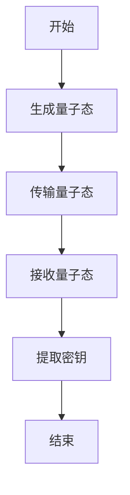
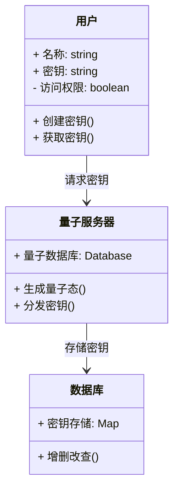
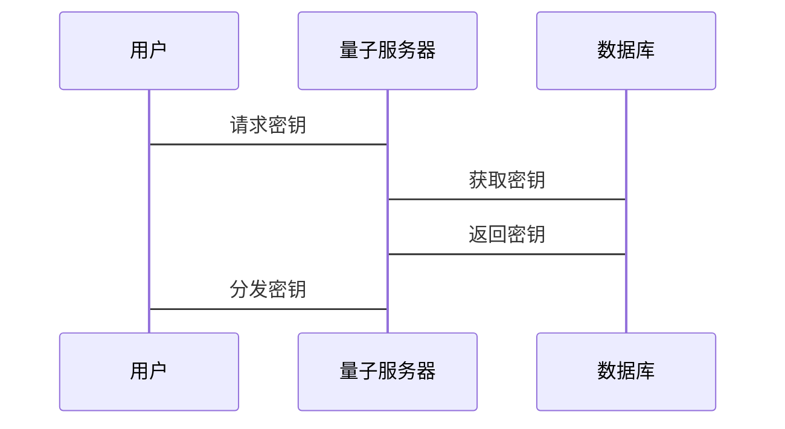

                 


# 如何评估企业的量子加密技术应用

> 关键词：量子加密技术、企业应用、量子计算、安全评估、加密算法

> 摘要：本文详细探讨了如何评估企业在量子加密技术中的应用。从量子加密技术的基本原理到实际应用中的系统架构设计，再到项目实战和最佳实践，本文为技术人员和企业决策者提供了全面的指导。通过分析量子加密技术的核心概念、数学模型、系统架构和实际案例，帮助读者理解如何在企业中有效应用量子加密技术，提升企业的数据安全性。

---

# 第一部分: 量子加密技术基础

## 第1章: 量子加密技术概述

### 1.1 量子加密技术的背景与重要性

#### 1.1.1 量子计算的基本概念
量子计算是一种基于量子力学原理的计算方式，利用量子叠加态和量子纠缠态来进行信息处理。与经典计算机不同，量子计算机可以在某些特定问题上表现出远超经典计算机的计算能力。

#### 1.1.2 量子加密技术的核心优势
量子加密技术的核心优势在于其安全性。量子密钥分发（QKD）利用量子力学的特性，确保密钥的分发过程无法被窃听，从而提供理论上无条件的安全性。

#### 1.1.3 企业应用量子加密技术的意义
随着量子计算技术的快速发展，传统加密算法面临被破解的风险。企业通过应用量子加密技术，可以有效提升数据安全性，保护核心业务信息不被窃取。

---

### 1.2 量子加密技术的基本原理

#### 1.2.1 量子叠加与量子纠缠
量子叠加是指量子系统可以处于多个状态的叠加态，例如著名的双缝实验。量子纠缠则是指两个或多个量子系统之间形成的相关性，无论距离多远，测量其中一个系统会立即影响另一个系统。

#### 1.2.2 量子密钥分发（QKD）的原理
量子密钥分发是一种利用量子力学原理进行密钥分发的协议。通过QKD，通信双方可以在不被窃听的情况下共享一个密钥，从而实现安全的通信。

#### 1.2.3 量子加密与经典加密的对比
量子加密与经典加密的主要区别在于安全性。经典加密算法依赖于计算复杂度，而量子加密技术则利用量子力学的特性，提供更高的安全性。

---

### 1.3 量子加密技术的应用场景

#### 1.3.1 金融行业的量子加密应用
金融行业对数据安全性要求极高，量子加密技术可以用于保护交易数据和客户信息的安全。

#### 1.3.2 政府机构的量子加密需求
政府机构处理大量敏感信息，量子加密技术可以有效防止信息泄露和未经授权的访问。

#### 1.3.3 企业数据安全的量子加密解决方案
企业可以通过量子加密技术保护核心数据，防止竞争对手或黑客的攻击。

---

## 第2章: 量子加密技术的核心概念与联系

### 2.1 量子加密技术的核心原理

#### 2.1.1 量子密钥分发（QKD）的数学模型
量子密钥分发的数学模型可以通过以下公式表示：
$$|\psi\rangle = \alpha|0\rangle + \beta|1\rangle$$
其中，$\alpha$ 和 $\beta$ 是复数，且满足 $|\alpha|^2 + |\beta|^2 = 1$。

#### 2.1.2 量子加密协议的实现过程
量子加密协议的实现过程包括量子态的生成、传输、测量和密钥提取等步骤。

#### 2.1.3 量子加密与经典加密的对比
量子加密技术的核心优势在于其安全性，而经典加密技术则依赖于计算复杂度。

---

### 2.2 核心概念的属性特征对比表格

#### 表2-1: 量子加密与经典加密的对比分析

| 特性           | 量子加密       | 经典加密       |
|----------------|----------------|----------------|
| 安全性         | 理论上无条件安全 | 依赖计算复杂度   |
| 实现难度       | 高             | 中             |
| 适用场景       | 高安全需求     | 一般安全需求   |

---

### 2.3 ER实体关系图与Mermaid流程图

#### 图2-1: 量子加密系统的ER实体关系图
```mermaid
erDiagram
    actor 用户
    actor 攻击者
    actor 量子服务器
    actor 经典服务器
    database 量子数据库
    database 经典数据库
    用户 --|{ 创建量子密钥} 量子服务器
    量子服务器 --|{ 存储密钥} 量子数据库
    经典服务器 --|{ 使用密钥} 经典数据库
    用户 --|{ 发起攻击} 攻击者
    攻击者 --|{ 尝试窃取密钥} 量子服务器
```

#### 图2-2: 量子密钥分发的Mermaid流程图
```mermaid
flowchart TD
    A[用户A] --> B[量子服务器]: 发送量子信号
    B --> C[用户B]: 接收量子信号
    C --> B: 返回测量结果
    B --> A: 确定共享密钥
```

---

## 第3章: 量子加密算法的数学模型与公式

### 3.1 量子密钥分发的数学模型

#### 图3-1: 量子密钥分发的数学模型图
```mermaid
graph TD
    A[用户A] --> B[量子服务器]: 发送量子信号
    B --> C[用户B]: 接收量子信号
    C --> B: 返回测量结果
    B --> A: 确定共享密钥
```

---

### 3.2 量子加密算法的公式推导

#### 公式3-1: 量子叠加态的数学表达式
$$|\psi\rangle = \alpha|0\rangle + \beta|1\rangle$$

#### 公式3-2: 量子纠缠态的数学表达式
$$|\phi\rangle = \frac{1}{\sqrt{2}}(|0\rangle|1\rangle + |1\rangle|0\rangle)$$

---

### 3.3 量子加密算法的实现过程

#### 图3-2: 量子加密算法的实现流程图


---

## 第4章: 量子加密技术的系统分析与架构设计

### 4.1 量子加密系统的应用场景

#### 图4-1: 量子加密技术的应用场景图
```mermaid
graph TD
    A[用户] --> B[量子服务器]: 请求密钥
    B --> C[用户]: 返回密钥
    C --> D[应用]: 使用密钥进行加密
```

---

### 4.2 系统功能设计

#### 图4-2: 量子加密系统的领域模型类图


---

### 4.3 系统架构设计

#### 图4-3: 量子加密系统的系统架构图


---

### 4.4 系统接口设计

#### 图4-4: 量子加密系统的接口交互图


---

## 第5章: 量子加密技术的项目实战

### 5.1 环境安装与配置

#### 5.1.1 量子加密开发环境的搭建
安装必要的开发工具和库，例如Qiskit（量子计算开发工具包）和QKD协议实现库。

#### 5.1.2 量子加密实验平台的安装
配置量子服务器和经典服务器，确保网络连接正常。

---

### 5.2 核心代码实现

#### 代码5-1: 量子密钥分发的Python实现
```python
import random

def generate_quantum_key(n):
    # 生成随机的n位量子密钥
    return ''.join(random.choices('01', k=n))

def distribute_key(user1, user2):
    key = generate_quantum_key(1024)
    # 模拟量子服务器分发密钥
    print(f"{user1} 生成密钥: {key}")
    print(f"{user2} 接收密钥: {key}")
    return key

# 示例
distribute_key("用户A", "用户B")
```

---

### 5.3 实际案例分析

#### 案例分析：金融行业的量子加密应用
某银行通过量子加密技术保护在线交易的安全性，确保客户信息不被窃取。

---

### 5.4 项目小结

#### 小结
通过项目实战，读者可以理解量子加密技术的实现过程，并将其应用到实际的企业场景中。

---

## 第6章: 量子加密技术的总结与展望

### 6.1 量子加密技术的总结

#### 6.1.1 核心要点回顾
量子加密技术的核心在于其安全性，通过量子密钥分发实现无条件安全的密钥分发。

#### 6.1.2 量子加密技术的优势
- 理论上无条件安全
- 抗量子计算攻击
- 适用性广

---

### 6.2 量子加密技术的未来展望

#### 6.2.1 技术发展趋势
随着量子计算技术的不断发展，量子加密技术将得到更广泛的应用。

#### 6.2.2 挑战与机遇
量子加密技术的推广需要克服技术瓶颈和成本问题，但其应用前景广阔。

---

## 第7章: 量子加密技术的最佳实践

### 7.1 量子加密技术的实施建议

#### 7.1.1 选择合适的量子加密协议
根据企业的实际需求选择适合的量子加密协议，如BB84协议或EPR协议。

#### 7.1.2 确保量子服务器的安全性
量子服务器是量子加密技术的核心，必须确保其安全性。

#### 7.1.3 定期更新密钥
为确保安全性，企业应定期更新量子密钥。

---

### 7.2 量子加密技术的注意事项

#### 7.2.1 技术风险
量子加密技术仍处于发展阶段，可能存在技术上的不确定性。

#### 7.2.2 成本问题
量子加密技术的实施成本较高，企业需要权衡成本与收益。

#### 7.2.3 法律法规
企业应遵守相关法律法规，确保量子加密技术的合法使用。

---

### 7.3 量子加密技术的未来发展方向

#### 7.3.1 研究更高效的量子加密算法
随着量子计算技术的进步，研究更高效的量子加密算法是未来的重要方向。

#### 7.3.2 推动量子加密技术的标准化
推动量子加密技术的标准化，有助于其在更广泛的领域中应用。

---

## 结语

量子加密技术作为一项前沿技术，正在逐步改变企业的信息安全防护方式。通过本文的详细分析，读者可以全面了解如何评估和应用量子加密技术，为企业的信息安全提供强有力的支持。未来，随着量子计算技术的进一步发展，量子加密技术将在更多领域展现出其独特的优势。

