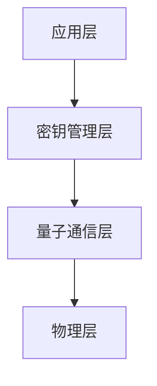
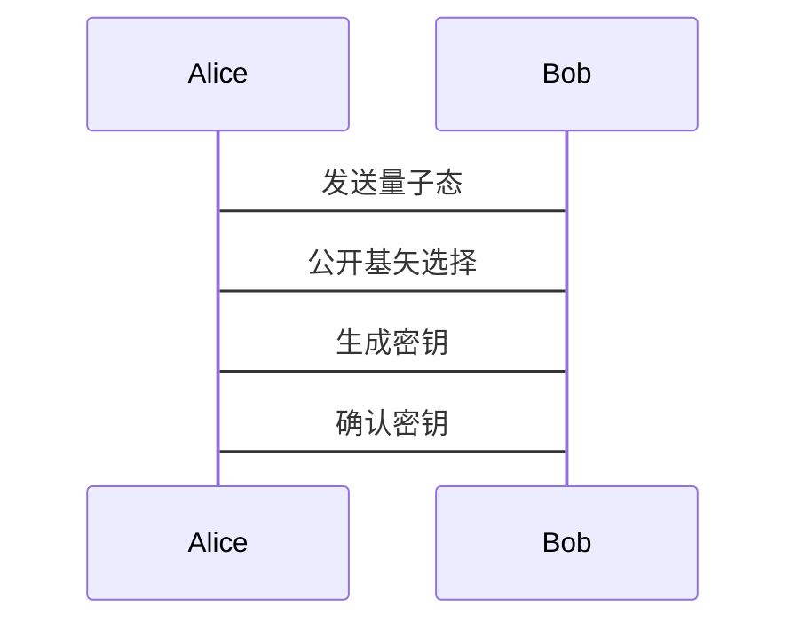

                 


# 如何评估企业的量子密码通信网络

## 关键词：量子密码通信、量子密钥分发、网络安全、评估方法、系统架构

## 摘要：  
随着量子计算技术的快速发展，传统加密算法的安全性面临前所未有的挑战。量子密码通信作为一种抗量子攻击的新兴技术，正在逐步应用于企业网络中。本文从量子密码通信的基本原理出发，详细探讨了企业量子密码通信网络的评估方法、系统架构、安全威胁与应对策略。通过理论分析和实际案例，帮助读者全面了解如何评估和构建安全可靠的量子密码通信网络。

---

# 第1章: 量子密码通信网络概述

## 1.1 量子密码通信的基本概念

### 1.1.1 量子密码通信的定义

量子密码通信是一种基于量子力学原理的加密技术，利用量子叠加和量子纠缠等特性实现信息的 secure transmission。与传统密码学不同，量子密码通信的核心是“不可克隆原理”，即量子信息无法被窃听或复制而不被察觉。

### 1.1.2 量子密码通信与经典密码学的区别

| 特性         | 传统密码学       | 量子密码通信     |
|--------------|------------------|------------------|
| 加密基础     | 数学算法         | 量子力学原理     |
| 安全性       | 易被量子攻击破解   | 抗量子攻击       |
| 密钥分发     | 中心节点分发     | 分布式分发       |

### 1.1.3 量子密码通信的应用场景

- **金融行业**：保护银行交易的安全性。  
- **政府机构**：保障敏感数据的传输。  
- **企业网络**：提升内部通信的安全性。  

---

## 1.2 量子密码通信的背景与应用

### 1.2.1 量子密码通信的发展历程

1984年，Bennett和 Brassard提出的BB84协议是量子密码通信的里程碑。近年来，随着量子计算机的快速发展，量子密码通信逐渐从理论走向实际应用。

### 1.2.2 量子密码通信的核心优势

- **抗量子攻击**：即使面对量子计算机，依然能保证安全性。  
- **通信安全性**：基于量子力学原理，通信过程无法被窃听。  
- **数据完整性**：确保数据在传输过程中不会被篡改。  

---

# 第2章: 量子密钥分发（QKD）技术

## 2.1 量子密钥分发的原理

### 2.1.1 QKD的基本工作流程

1. **量子态制备**：Alice生成随机量子态，并发送给Bob。  
2. **基矢选择**：Alice和Bob分别选择测量基矢，并公开一致的基矢。  
3. **密钥提取**：基于一致的基矢，Alice和Bob提取密钥。  

### 2.1.2 QKD的数学模型与公式

**密钥提取公式**：  
$$ K = \{x | a_i = b_i\} $$  

其中，$a_i$表示Alice的基矢选择，$b_i$表示Bob的基矢选择。

---

## 2.2 量子密钥分发的协议

### 2.2.1 BB84协议

BB84协议是最早的量子密钥分发协议，基于两个正交基矢（$Z$基和$X$基）进行量子态编码。

### 2.2.2 EPR协议

EPR协议利用量子纠缠特性，实现密钥的分发与验证。

### 2.2.3 其他QKD协议对比

| 协议名称 | 优缺点                     |
|----------|---------------------------|
| BB84     | 实现简单，但安全性较低       |
| EPR      | 安全性高，但实现复杂         |
| B92      | 抗干扰能力强，但效率较低     |

---

## 2.3 量子密钥分发的优缺点

### 2.3.1 优点

- **安全性高**：基于量子力学原理，无法被窃听。  
- **抗干扰**：通过纠错码技术，提升通信稳定性。  

### 2.3.2 缺点

- **距离限制**：量子通信的距离受限于光纤损耗。  
- **成本高**：设备昂贵，部署复杂。  

---

## 2.4 本章小结

---

# 第3章: 企业量子密码通信网络的安全威胁与挑战

## 3.1 量子密码通信的主要威胁

### 3.1.1 量子计算的威胁

量子计算机的出现，使得传统加密算法面临被破解的风险。

### 3.1.2 侧信道攻击

通过间接手段获取密钥信息。

### 3.1.3 量子黑客攻击

利用量子技术对通信网络发起攻击。

---

## 3.2 传统加密算法的弱点

### 3.2.1 RSA与椭圆曲线加密的局限性

- **RSA**：密钥长度增加，计算复杂度呈指数级增长。  
- **椭圆曲线加密**：安全性依赖于椭圆曲线的复杂性，但已被证实存在潜在漏洞。  

### 3.2.2 SHA系列哈希函数的潜在威胁

- **SHA-1**：已被证明存在碰撞攻击。  
- **SHA-256**：安全性较高，但面临量子攻击的威胁。  

---

## 3.3 量子密码通信的安全优势

### 3.3.1 抗量子攻击能力

量子密码通信的核心技术基于量子力学原理，无法被量子计算机破解。

### 3.3.2 通信过程的不可窃听性

基于“不可克隆原理”，通信过程无法被窃听而不被发现。

### 3.3.3 数据完整性保障

通过量子纠缠特性，确保数据在传输过程中不会被篡改。

---

## 3.4 本章小结

---

# 第4章: 企业量子密码通信网络的评估指标与方法

## 4.1 量子密码通信网络的评估指标

### 4.1.1 密钥生成效率

- **定义**：单位时间内生成的有效密钥数量。  
- **公式**：  
  $$ \text{密钥生成效率} = \frac{\text{有效密钥数量}}{\text{时间}} $$  

### 4.1.2 密钥分发距离

- **定义**：量子通信的最大有效距离。  
- **影响因素**：光纤损耗、设备性能等。  

### 4.1.3 网络延迟与带宽

- **定义**：通信过程中的延迟和带宽利用率。  
- **优化方法**：通过优化协议设计和设备性能，降低延迟。  

---

## 4.2 量子密码通信网络的评估方法

### 4.2.1 网络性能测试

- **测试内容**：密钥生成效率、网络延迟等。  
- **工具**：使用专用的量子通信测试仪。  

### 4.2.2 协议合规性验证

- **验证内容**：协议的正确性和安全性。  
- **方法**：通过模拟攻击测试协议的抗性。  

### 4.2.3 安全漏洞分析

- **分析方法**：基于QKD协议的数学模型，分析潜在漏洞。  

---

## 4.3 评估工具与技术

### 4.3.1 量子密钥分发测试仪

- **功能**：测量密钥生成效率、网络延迟等。  
- **示例**：  
  ```python
  import qkd
  def test_kgen_efficiency():
      eff = qkd.measure_efficiency()
      return eff
  ```

### 4.3.2 网络安全扫描工具

- **功能**：扫描网络中的潜在威胁。  
- **示例**：  
  ```python
  import network_scan
  def scan_network():
      vulnerabilities = network_scan.find_vulnerabilities()
      return vulnerabilities
  ```

---

## 4.4 本章小结

---

# 第5章: 企业量子密码通信网络的系统架构与设计

## 5.1 系统功能设计

### 5.1.1 密钥生成模块

- **功能**：生成量子密钥。  
- **实现**：基于BB84协议实现。  

### 5.1.2 密钥分发模块

- **功能**：将密钥分发给用户。  
- **实现**：通过光纤或无线信道传输密钥。  

### 5.1.3 密钥管理模块

- **功能**：管理密钥的生命周期。  
- **实现**：支持密钥的生成、存储、分发和销毁。  

---

## 5.2 系统架构设计

### 5.2.1 分层架构设计



### 5.2.2 组件间交互流程



---

## 5.3 本章小结

---

# 第6章: 企业量子密码通信网络的实战案例

## 6.1 实战环境搭建

### 6.1.1 硬件设备选择

- **量子通信设备**：如QKD模块、光纤等。  
- **网络设备**：如交换机、路由器等。  

### 6.1.2 软件环境配置

- **操作系统**：Linux或Windows。  
- **协议栈**：支持QKD协议的软件。  

---

## 6.2 核心代码实现

### 6.2.1 密钥生成代码

```python
import random
def generate_key(length):
    return ''.join(random.choices('01', k=length))
```

### 6.2.2 密钥分发代码

```python
import socket
def send_key(host, port, key):
    with socket.socket(socket.AF_INET, socket.SOCK_STREAM) as s:
        s.connect((host, port))
        s.send(key.encode())
```

---

## 6.3 实战案例分析

### 6.3.1 案例背景

- **企业网络**：某银行的内部通信网络。  
- **目标**：保护交易数据的安全性。  

### 6.3.2 案例实施

- **步骤1**：部署QKD设备。  
- **步骤2**：配置密钥管理模块。  
- **步骤3**：测试通信安全性。  

### 6.3.3 案例结果

- **结果**：通信安全性显著提升。  
- **总结**：量子密码通信技术在企业网络中的应用前景广阔。  

---

## 6.4 本章小结

---

# 第7章: 企业量子密码通信网络的安全风险与应对策略

## 7.1 量子密码通信的安全风险

### 7.1.1 量子计算的威胁

- **风险**：量子计算机可能破解传统加密算法。  
- **应对策略**：提前部署抗量子加密技术。  

### 7.1.2 侧信道攻击

- **风险**：通过间接手段获取密钥信息。  
- **应对策略**：加强设备安全性，减少侧信道泄露。  

---

## 7.2 量子密码通信的应对策略

### 7.2.1 技术层面

- **提升设备性能**：优化量子通信设备的性能和稳定性。  
- **加强协议安全性**：通过协议优化和漏洞修复，提升安全性。  

### 7.2.2 管理层面

- **制定安全策略**：明确密钥管理的流程和责任。  
- **培训与意识提升**：加强对员工的安全意识培训。  

---

## 7.3 本章小结

---

# 第8章: 量子密码通信网络的未来发展趋势

## 8.1 量子密码通信技术的未来发展

### 8.1.1 技术突破

- **超长距离量子通信**：通过卫星等手段实现全球量子通信。  
- **新型协议研发**：探索更高效的量子密钥分发协议。  

### 8.1.2 应用拓展

- **多行业应用**：金融、政府、能源等行业的广泛应用。  
- **智能化发展**：结合人工智能技术，提升量子通信的智能化水平。  

---

## 8.2 企业量子密码通信网络的未来挑战

### 8.2.1 技术成熟度

- **问题**：现有技术尚不成熟，距离大规模应用还有一定差距。  
- **应对策略**：加大研发投入，推动技术成熟。  

### 8.2.2 成本与部署

- **问题**：量子通信设备昂贵，部署成本高。  
- **应对策略**：通过技术创新降低成本，探索共享部署模式。  

---

## 8.3 本章小结

---

# 附录: 量子密码通信相关工具与资源

## 附录A: 量子通信测试工具

### 附录A.1 QKD测试仪

- **功能**：测量密钥生成效率、网络延迟等。  
- **推荐工具**：XX品牌QKD测试仪。  

### 附录A.2 网络安全扫描工具

- **功能**：扫描网络中的潜在威胁。  
- **推荐工具**：YY品牌网络安全扫描仪。  

---

## 附录B: 量子密码通信相关文献推荐

- **文献1**：Bennett, C. H., & Brassard, G. (1984). Quantum cryptography: Public key distribution and coin tossing.  
- **文献2**：Ekert, A. K. (1991). Quantum cryptography based on Bell’s theorem.  

---

## 参考文献

1. Bennett, C. H., & Brassard, G. (1984). Quantum cryptography: Public key distribution and coin tossing.  
2. Ekert, A. K. (1991). Quantum cryptography based on Bell’s theorem.  
3. Shor, P. W. (1994). Algorithms for quantum computation: Discrete logarithms and factoring.  

---

## 摘要

本文从量子密码通信的基本原理出发，详细探讨了企业量子密码通信网络的评估方法、系统架构、安全威胁与应对策略。通过理论分析和实际案例，帮助读者全面了解如何评估和构建安全可靠的量子密码通信网络。

