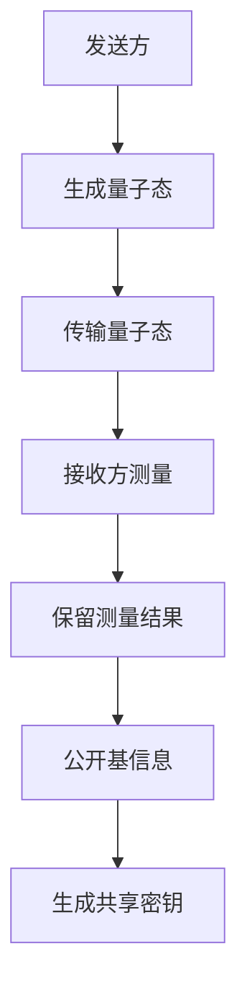
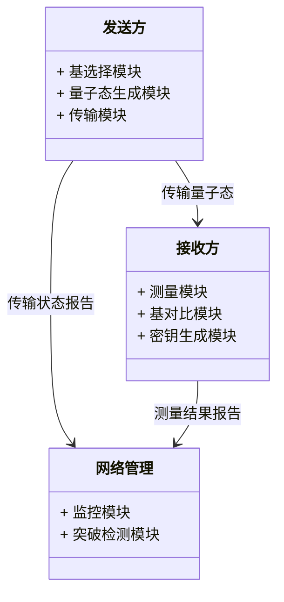
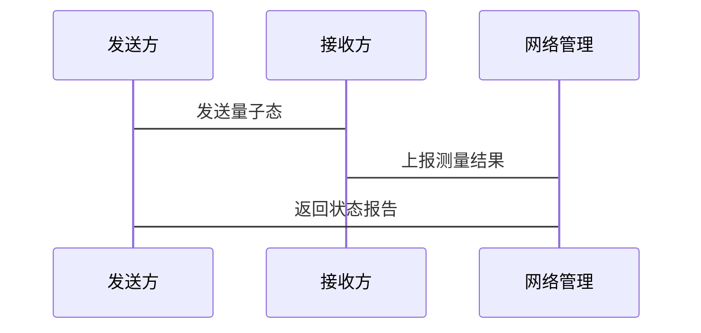

                 


# 《如何评估企业的量子密钥分发网络应用》

---

## 关键词：
量子密钥分发，QKD网络，安全性评估，企业应用，量子通信

---

## 摘要：
本文详细探讨了如何评估企业在量子密钥分发（QKD）网络中的应用。文章从量子密钥分发的基本概念和背景出发，深入分析其核心原理和算法实现。通过系统架构设计和项目实战案例，展示了如何在企业网络中集成QKD技术。文章还总结了最佳实践，提供了实际应用中的关键注意事项，帮助企业在量子通信领域做出明智决策。

---

# 第一部分：量子密钥分发网络应用概述

## 第1章：量子密钥分发网络的基本概念

### 1.1 量子密钥分发的定义与背景

#### 1.1.1 量子密钥分发的定义
量子密钥分发（Quantum Key Distribution, QKD）是一种利用量子力学原理进行加密密钥分发的技术。它通过量子态的不可克隆性和测量干扰性确保密钥的安全传输。

#### 1.1.2 量子密钥分发的背景与起源
QKD的概念最早由Wiesner在1983年提出，后经Bennett和Brassard（BB84协议）的发展，成为量子通信领域的里程碑。随着量子计算机的发展，QKD在保护敏感数据方面的重要性日益凸显。

#### 1.1.3 量子密钥分发的核心目标
QKD的主要目标是实现密钥的安全分发，确保通信双方共享的秘密密钥不被第三方窃取。这在金融、政府和军事等领域具有重要意义。

---

### 1.2 量子密钥分发的技术原理

#### 1.2.1 量子密钥分发的基本原理
QKD基于量子叠加和纠缠原理，通过发送方生成随机量子态，接收方测量这些态来建立共享密钥。过程中，任何窃听行为都会引入错误，从而被检测出来。

#### 1.2.2 量子密钥分发的关键技术
- **协议选择**：如BB84、EPR协议等，各有优缺点。
- **量子态传输**：通过光纤或量子中继实现长距离传输。
- **密钥生成与验证**：通过基的选择和纠错过程生成共享密钥。

#### 1.2.3 量子密钥分发的实现方式
- **有线传输**：光纤通信。
- **无线传输**：自由空间量子通信。
- **中继站**：用于扩展通信距离。

---

### 1.3 量子密钥分发的优势与劣势

#### 1.3.1 量子密钥分发的主要优势
- **绝对安全性**：基于量子力学原理，无法被窃听。
- **抗量子计算攻击**：即使量子计算机出现，传统加密方法易被破解，而QKD仍安全。

#### 1.3.2 量子密钥分发的主要劣势
- **技术复杂性**：设备要求高，实现难度大。
- **传输距离限制**：现有技术下，光纤传输距离有限，需中继站支持。
- **成本高昂**：设备和网络建设费用较高。

---

## 第2章：量子密钥分发的核心原理

### 2.1 量子密钥分发的协议类型

#### 2.1.1 BB84协议
- **基的选择**：发送方随机选择基（如 rect 或dial），接收方测量时需选择相同的基。
- **量子态传输**：发送方生成随机量子态，接收方测量。
- **密钥生成**：双方共享相同基的结果，形成密钥。

#### 2.1.2 EPR协议
- **纠缠态分发**：发送方生成纠缠态，发送给接收方。
- **测量与验证**：通过测量结果生成密钥，并验证安全性。

#### 2.1.3 B92协议
- **单向传输**：发送方发送特定量子态，接收方测量。
- **无须基交换**：通过公开信息验证密钥一致性。

---

### 2.2 量子密钥分发的数学模型

#### 2.2.1 量子态的表示
量子态可以表示为：
$$ |\psi\rangle = \alpha|0\rangle + \beta|1\rangle $$
其中，$\alpha$ 和 $\beta$ 是复数，满足 $|\alpha|^2 + |\beta|^2 = 1$。

#### 2.2.2 密钥生成的数学模型
在BB84协议中，密钥生成过程如下：
1. 发送方选择基 $\{B_s\}$ 和随机数 $\{r_s\}$，生成量子态 $|q_s\rangle$。
2. 接收方选择基 $\{B_r\}$ 和随机数 $\{r_r\}$，测量量子态。
3. 双方公开 $\{B_s\}$ 和 $\{B_r\}$，保留相同基的结果，形成密钥。

---

### 2.3 量子密钥分发的协议流程

#### 2.3.1 协议流程图


---

## 第3章：量子密钥分发的算法实现

### 3.1 量子密钥分发的协议实现

#### 3.1.1 BB84协议的实现步骤
1. **基的选择**：发送方和接收方分别生成随机的基序列。
2. **量子态生成**：发送方根据基生成量子态。
3. **传输与测量**：量子态通过量子信道传输，接收方测量。
4. **基对比**：双方公开基信息，保留相同基的结果。
5. **密钥生成**：剩余结果作为共享密钥。

#### 3.1.2 Python代码实现
```python
import random

def generate_basis(length):
    # 生成随机基序列
    basis = []
    for _ in range(length):
        basis.append(random.choice(['rect', 'dial']))
    return basis

def generate_qubits(basis):
    # 根据基生成量子态
    qubits = []
    for b in basis:
        if b == 'rect':
            qubits.append(random.choice([0, 1]))
        else:
            qubits.append(random.choice([0, 1, 2, 3]))
    return qubits

def measure_qubits(qubits, basis):
    # 根据基进行测量
    measured = []
    for q, b in zip(qubits, basis):
        if b == 'rect':
            measured.append(q % 2)
        else:
            measured.append(q % 4)
    return measured

# 示例
length = 100
sender_basis = generate_basis(length)
receiver_basis = generate_basis(length)
sender_qubits = generate_qubits(sender_basis)
receiver_qubits = measure_qubits(sender_qubits, receiver_basis)

# 生成共享密钥
shared_key = []
for s, r in zip(sender_basis, receiver_basis):
    if s == r:
        shared_key.append(sender_qubits[sender_basis.index(s)])

print("Shared Key:", ''.join(map(str, shared_key)))
```

#### 3.1.3 安全性分析
- **窃听检测**：通过对比基不同的结果，发现异常。
- **错误率分析**：错误率高表示可能存在窃听。

---

## 第4章：企业网络中的系统架构设计

### 4.1 系统需求分析

#### 4.1.1 业务需求
- 高安全性：确保密钥传输不被窃取。
- 可扩展性：支持企业内部多点通信。
- 易用性：与现有网络无缝集成。

#### 4.1.2 功能需求
- 密钥生成与分发。
- 用户身份验证。
- 网络管理与监控。

---

### 4.2 系统功能设计

#### 4.2.1 领域模型


---

### 4.3 系统架构设计

#### 4.3.1 分层架构


#### 4.3.2 接口设计
- **密钥生成接口**：`POST /key/generate`
- **密钥分发接口**：`POST /key/distribute`
- **状态监控接口**：`GET /network/status`

---

### 4.4 系统交互设计

#### 4.4.1 交互流程图


---

## 第5章：量子密钥分发网络的项目实战

### 5.1 项目环境搭建

#### 5.1.1 硬件环境
- 量子通信设备：支持QKD协议的量子中继站。
- 网络设备：光纤传输链路、交换机。

#### 5.1.2 软件环境
- 操作系统：Linux（如Ubuntu）。
- 开发工具：Python、Django框架。
- 量子通信库：QKD协议实现库。

---

### 5.2 系统核心实现

#### 5.2.1 量子密钥分发代码实现
```python
from qkd_lib import QuantumKeyGenerator

class QKDSystem:
    def __init__(self, network):
        self.network = network
        self.key_generator = QuantumKeyGenerator()

    def generate_key(self, length=100):
        return self.key_generator.generate(length)

    def distribute_key(self, recipient):
        self.network.send(self.generate_key(), recipient)
```

---

### 5.3 实际案例分析

#### 5.3.1 案例介绍
某企业采用QKD网络保护内部通信，实现财务数据的安全传输。

#### 5.3.2 实施步骤
1. 安装QKD设备。
2. 配置网络管理模块。
3. 测试密钥生成与分发。
4. 验证安全性。

---

### 5.4 项目总结

#### 5.4.1 成功经验
- 选择合适的QKD设备和协议。
- 做好网络规划和管理。

#### 5.4.2 常见问题
- 传输距离限制：通过中继站扩展。
- 安装调试复杂：需要专业人员支持。

---

## 第6章：最佳实践与总结

### 6.1 最佳实践

#### 6.1.1 设备选择
- 根据需求选择合适的QKD设备和协议。
- 确保设备兼容性和稳定性。

#### 6.1.2 网络设计
- 合理规划网络结构，避免单点故障。
- 配置监控系统，及时发现异常。

#### 6.1.3 安全管理
- 定期检查密钥生成过程。
- 做好人员培训，确保操作规范。

---

### 6.2 小结

本文详细探讨了企业如何评估和应用量子密钥分发网络。从基本概念到实际案例，全面分析了QKD的优势、挑战和解决方案。企业应结合自身需求，选择合适的QKD技术，确保通信安全。

---

### 6.3 注意事项

- **设备维护**：定期维护量子通信设备，确保其正常运行。
- **人员培训**：对相关人员进行专业培训，确保正确操作。
- **风险评估**：定期进行安全风险评估，及时调整安全策略。

---

### 6.4 拓展阅读

- 《量子密钥分发协议及其应用》
- 《量子通信技术与未来网络》
- 《企业网络安全防护指南》

---

## 结语

量子密钥分发作为量子通信的核心技术，正在逐步应用于企业网络。通过本文的分析，企业可以更好地评估和实施QKD网络，确保数据安全。未来，随着技术进步，QKD将在更多领域发挥重要作用。

---

