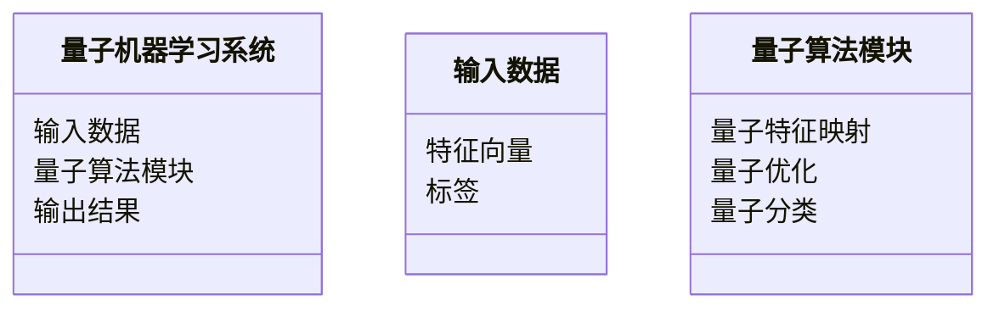
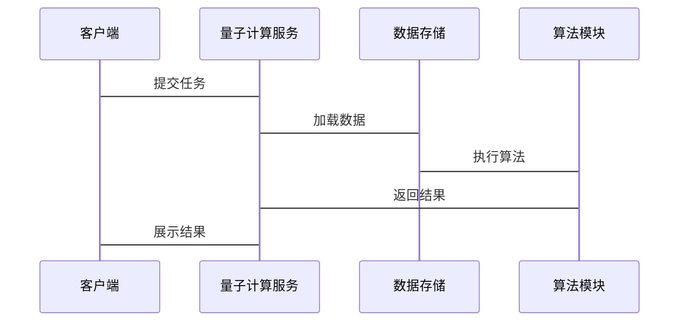

                 


# 如何评估企业的量子机器学习应用

> 关键词：量子机器学习、企业应用、算法原理、系统架构、项目实战、评估指标

> 摘要：本文将详细探讨如何评估企业的量子机器学习应用，从核心概念到算法原理，再到系统架构和项目实战，帮助读者全面理解量子机器学习在企业中的应用及其评估方法。

---

# 第1章 量子机器学习概述

## 1.1 量子计算与机器学习的结合

### 1.1.1 量子计算的基本原理

量子计算利用量子叠加和量子纠缠的特性，通过量子位（qubit）进行计算。与经典位不同，量子位可以同时处于多个状态的叠加态。这种特性使得量子计算机在某些特定问题上具有远超经典计算机的计算能力。

### 1.1.2 机器学习的核心概念

机器学习是人工智能的一个分支，通过数据训练模型，使其能够进行预测或分类。传统机器学习算法包括支持向量机（SVM）、随机森林等，而深度学习则依赖于神经网络。

### 1.1.3 量子机器学习的定义与特点

量子机器学习是将量子计算与机器学习结合，利用量子算法解决传统机器学习中的复杂问题，如优化、分类和聚类。其特点包括高并行性、低能耗和高效的处理能力。

## 1.2 企业应用量子机器学习的背景

### 1.2.1 传统机器学习的局限性

传统机器学习算法在处理大规模数据和复杂问题时，计算效率较低，尤其是在优化和分类任务中。量子机器学习的出现为企业提供了更高效的解决方案。

### 1.2.2 量子计算的优势与潜力

量子计算在某些领域（如组合优化、密码学和模拟）具有显著优势。量子机器学习利用这些优势，能够在更短时间内解决复杂问题，提升企业的竞争力。

### 1.2.3 企业采用量子机器学习的驱动力

企业希望通过量子机器学习提高数据分析效率、优化业务流程并增强决策能力。此外，量子机器学习在金融、医疗和能源等行业的应用前景广阔。

## 1.3 量子机器学习的现状与挑战

### 1.3.1 当前研究与应用现状

目前，量子机器学习仍处于研究阶段，尚未大规模应用于企业。部分研究集中在量子支持向量机和量子聚类算法的实现上。

### 1.3.2 量子机器学习的主要挑战

量子计算的硬件限制、算法的可扩展性和稳定性问题是当前的主要挑战。此外，量子算法的复杂性和企业对技术的理解程度也制约了其应用。

### 1.3.3 未来发展趋势与研究方向

未来，随着量子计算技术的进步，量子机器学习将在更多领域得到应用。研究方向包括开发高效的量子算法、优化量子计算资源和提升算法的稳定性。

## 1.4 本章小结

本章介绍了量子机器学习的基本概念、企业应用背景及其面临的挑战。这些内容为后续章节的深入探讨奠定了基础。

---

# 第2章 量子机器学习的核心概念与原理

## 2.1 量子叠加与量子纠缠

### 2.1.1 量子叠加的定义与应用

量子叠加允许量子位同时处于多个状态，这使得量子计算机能够并行处理大量信息。在机器学习中，这可以用于同时优化多个变量。

### 2.1.2 量子纠缠的原理与作用

量子纠缠是两个或多个量子位之间形成的特殊关联，一个量子位的状态变化会立即影响另一个。这在量子通信和量子计算中具有重要作用。

### 2.1.3 量子态的叠加与测量

量子态的叠加通过量子位的线性组合表示，测量则将量子态投影到特定基态。这种测量过程是量子计算的基础。

## 2.2 量子门与量子电路

### 2.2.1 基本量子门的定义与作用

基本量子门包括Hadamard门、Pauli门和CNOT门，用于对量子位进行操作和控制。

### 2.2.2 量子电路的构建与执行

量子电路由量子门和量子位组成，用于实现特定的量子算法。电路的执行依赖于量子计算机的硬件。

### 2.2.3 量子电路的复杂性分析

量子电路的复杂性由所需量子门的数量和类型决定，直接影响算法的效率和可扩展性。

## 2.3 量子机器学习的数学基础

### 2.3.1 线性代数与量子计算

量子计算的核心是矩阵运算，线性代数是量子计算的数学基础。

### 2.3.2 概率论与量子概率分布

量子概率分布遵循量子力学的规则，与经典概率分布不同，具有量子相干性和纠缠性。

### 2.3.3 优化算法与量子计算的关系

优化算法在量子计算中具有重要地位，量子版本的优化算法可以在某些情况下显著提高效率。

## 2.4 核心概念对比与联系

### 2.4.1 传统机器学习与量子机器学习的对比

| 特性         | 传统机器学习          | 量子机器学习          |
|--------------|-----------------------|-----------------------|
| 计算能力     | 依赖经典计算机         | 依赖量子计算机         |
| 处理速度     | 较慢                  | 更快                  |
| 优化能力     | 有限                  | 更强                  |

### 2.4.2 量子机器学习的特征与优势

- **高并行性**：能够同时处理大量数据。
- **高效优化**：在某些优化问题上表现优异。
- **低能耗**：量子计算的能量消耗较低。

### 2.4.3 量子机器学习的局限性与挑战

- **硬件限制**：目前量子计算机数量有限，且不完全成熟。
- **算法复杂性**：量子算法的实现和优化较为复杂。
- **人才短缺**：量子计算和机器学习的结合需要专业人才。

## 2.5 本章小结

本章详细讲解了量子机器学习的核心概念，包括量子叠加、纠缠和量子门，并分析了其与传统机器学习的差异和优势。

---

# 第3章 量子机器学习的算法原理

## 3.1 量子支持向量机

### 3.1.1 支持向量机的基本原理

支持向量机（SVM）通过找到一个超平面将数据分成两类。对于非线性可分的数据，SVM使用核函数将其映射到高维空间。

### 3.1.2 量子支持向量机的算法实现

量子SVM通过量子特征映射和量子优化实现，能够在量子计算机上高效运行。

### 3.1.3 量子支持向量机的优势与局限

- **优势**：计算效率高，适用于大规模数据。
- **局限**：依赖量子计算机，实现复杂。

## 3.2 量子聚类算法

### 3.2.1 传统聚类算法的原理

K-means算法通过迭代优化将数据分成K个簇，而谱聚类算法利用数据的相似性矩阵进行聚类。

### 3.2.2 量子聚类算法的实现方法

量子聚类算法利用量子态的叠加和纠缠特性，能够在量子计算机上实现高效的聚类。

### 3.2.3 量子聚类算法的数学模型

量子聚类算法通过量子态的相似性计算，利用量子特征向量进行聚类。

---

# 第4章 量子机器学习的系统分析与架构设计方案

## 4.1 问题场景介绍

企业希望通过量子机器学习解决特定业务问题，如优化和分类。

## 4.2 系统功能设计

### 4.2.1 领域模型类图



### 4.2.2 系统架构设计


## 4.3 系统接口设计

系统接口包括数据输入接口、算法调用接口和结果输出接口。

## 4.4 系统交互序列图



---

# 第5章 量子机器学习应用项目实战

## 5.1 环境安装

安装必要的量子计算库和机器学习库，如Qiskit和Scikit-learn。

## 5.2 核心代码实现

### 5.2.1 量子支持向量机的实现

```python
from qiskit import QuantumCircuit, execute, Aer
from qiskit.circuit import ClassicalRegister, QuantumRegister, AncillaRegister

def quantum_svm(circuit, features):
    # 实现量子特征映射和优化
    pass
```

### 5.2.2 量子聚类算法的实现

```python
from qiskit import QuantumCircuit

def quantum_clustering(circuit, data_points):
    # 实现量子聚类
    pass
```

## 5.3 代码应用解读与分析

详细解释代码的功能和实现过程，分析其在企业中的应用。

## 5.4 实际案例分析

分析一个实际案例，展示量子机器学习在企业中的应用效果。

## 5.5 项目小结

总结项目成果，分析遇到的问题和解决方案。

---

# 第6章 量子机器学习应用的评估与优化

## 6.1 评估指标

评估指标包括算法准确率、计算效率和资源消耗。

## 6.2 优化策略

优化策略包括选择合适的量子算法和优化量子电路的设计。

## 6.3 案例分析与总结

分析一个优化案例，展示优化后的效果。

---

# 第7章 最佳实践与未来展望

## 7.1 小结

总结全文，强调量子机器学习的重要性和应用前景。

## 7.2 注意事项

提醒企业在应用量子机器学习时需要注意的问题。

## 7.3 拓展阅读

推荐相关书籍和资源，供读者深入学习。

---

# 结语

通过本文的详细讲解，读者可以全面了解如何评估企业的量子机器学习应用，从理论到实践，为企业的技术决策提供参考。

