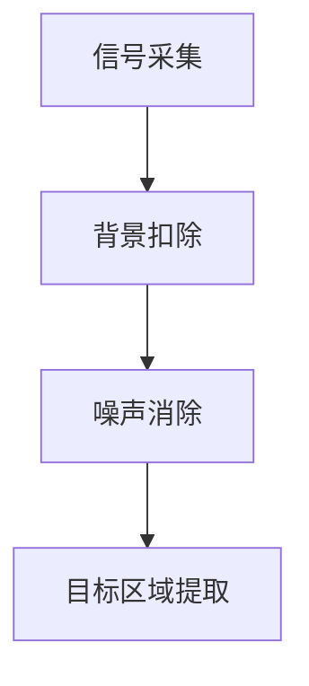
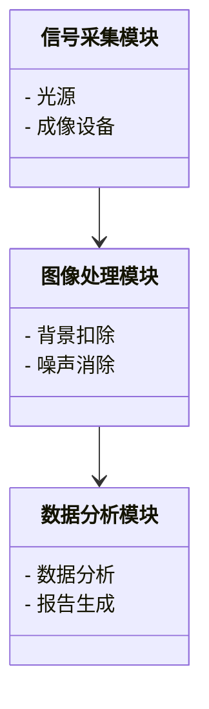

                 


# 如何评估企业的量子点生物成像技术应用

> 关键词：量子点、生物成像、技术评估、经济效益、风险分析

> 摘要：本文将详细介绍如何评估企业在量子点生物成像技术领域的应用。从技术背景到制备方法，从成像原理到系统架构，再到经济效益与风险分析，本文将全面解析量子点生物成像技术的评估方法，为企业提供实用的参考。

---

## 第一部分：量子点生物成像技术的背景与概念

### 第1章：量子点的定义与基本特性

#### 1.1 量子点的定义与基本特性

量子点（Quantum Dots，QDs）是一种纳米级半导体材料，通常由金属半导体核心（如CdSe、CdTe）和绝缘层（如ZnS）组成。其核心尺寸一般在2-10纳米之间，具有独特的光学和电子性质。

##### 量子点的定义
量子点是一种纳米级半导体材料，其发光特性依赖于尺寸和组成。与传统荧光标记物相比，量子点具有更宽的吸收光谱、更高的量子产率和更高的稳定性。

##### 量子点的核心特性
- **光谱可调性**：通过改变量子点的尺寸和成分，可以调节其吸收和发射光谱。
- **高量子产率**：量子点的发光效率远高于传统荧光物质。
- **化学稳定性**：量子点表面通常被保护层包裹，具有较高的化学稳定性。

#### 1.2 量子点的制备方法

量子点的制备方法主要包括：
1. **水热合成法**：在高温水中合成CdSe量子点。
2. **微波辅助合成法**：利用微波能快速合成量子点。
3. **化学气相沉积法**：在真空或惰性气体中沉积量子点。

#### 1.3 量子点与传统荧光标记物的对比

| 特性               | 量子点 | 传统荧光标记物 |
|--------------------|--------|---------------|
| 光谱范围           | 宽     | 较窄          |
| 量子产率           | 高     | 较低          |
| 稳定性             | 高     | 较低          |
| 成本               | 中等   | 较低          |

### 第2章：生物成像技术的发展历程

#### 2.1 生物成像技术的历史背景

生物成像技术经历了从光学显微镜到现代成像技术的演变，主要包括：
1. **光学显微镜**：分辨率有限，难以观察活细胞。
2. **荧光显微镜**：利用荧光标记物观察细胞结构。
3. **共聚焦显微镜**：具有高分辨率和高灵敏度。

#### 2.2 量子点技术在生物成像中的应用

量子点技术的引入极大提升了生物成像的性能：
- **多色成像**：通过调节量子点的尺寸，实现多种颜色标记。
- **实时成像**：量子点的高稳定性使其适用于长时间实时成像。

---

## 第二部分：量子点生物成像技术的核心概念

### 第3章：量子点的光学特性

#### 3.1 量子点的光谱分析

量子点的发射光谱可以通过调节其尺寸和组成来实现多色标记。

##### 量子点的发射光谱
通过改变量子点的成分（如CdSe、CdTe）和尺寸，可以实现从紫外到近红外的宽光谱发射。

##### 量子点的吸收光谱
量子点的吸收光谱较宽，适用于多种激发光源。

#### 3.2 量子点的量子产率

量子产率是量子点性能的重要指标，通常在50%到90%之间。

---

## 第三部分：量子点生物成像技术的算法与系统架构

### 第4章：成像算法的原理与实现

#### 4.1 成像算法的流程

成像算法的流程包括：
1. **信号采集**：获取量子点的荧光信号。
2. **图像处理**：包括背景扣除、噪声消除等。
3. **图像分析**：提取目标区域的特征。

##### 成像算法的流程图


#### 4.2 数学模型

##### 荧光信号的数学模型
荧光强度I与激发光强度E的关系：
$$ I = \alpha E + \beta $$

其中，α是荧光系数，β是背景噪声。

##### 降噪算法
常用高斯滤波器：
$$ I_{new}(x,y) = \frac{1}{\sigma^2 \sqrt{2\pi}} \sum_{i=-n}^{n} I(x+i,y) e^{-i^2/2\sigma^2} $$

---

## 第四部分：量子点生物成像技术的系统架构

### 第5章：系统架构设计

#### 5.1 系统功能设计

系统功能包括：
- **信号采集模块**：采集量子点的荧光信号。
- **图像处理模块**：处理图像并提取特征。
- **数据分析模块**：分析数据并生成报告。

##### 系统功能设计类图


---

## 第五部分：量子点生物成像技术的项目实战

### 第6章：项目实战与案例分析

#### 6.1 环境配置

项目需要以下环境：
- **硬件**：荧光显微镜、成像设备。
- **软件**：图像处理软件（如ImageJ）。

#### 6.2 代码实现

以下是量子点成像处理的Python代码示例：
```python
import numpy as np
from scipy import signal

# 模拟量子点荧光信号
x = np.linspace(0, 10, 100)
y = signal.gaussian(x, std=2) * np.sin(2*np.pi*x/5)

# 背景扣除
background = np.mean(y[:10])
y_corrected = y - background

# 高斯滤波
kernel = signal.windows.gaussian(5, std=1)
y_filtered = signal.convolve(y_corrected, kernel, mode='same')

# 绘制图形
import matplotlib.pyplot as plt
plt.plot(x, y, label='Original')
plt.plot(x, y_corrected, label='Background subtracted')
plt.plot(x, y_filtered, label='Filtered')
plt.legend()
plt.show()
```

#### 6.3 案例分析

以细胞成像为例，量子点技术可以实现多种颜色标记，便于追踪细胞内的多种标记物。

---

## 第六部分：总结与展望

### 第7章：总结与展望

#### 7.1 总结

量子点生物成像技术具有广阔的应用前景，但在实际应用中仍需克服一些技术挑战，如提高量子点的生物相容性和稳定性。

#### 7.2 展望

未来，量子点技术将在医学诊断、药物筛选等领域发挥重要作用。

---

通过以上分析，我们全面了解了量子点生物成像技术的评估方法，为企业提供了实用的参考。

