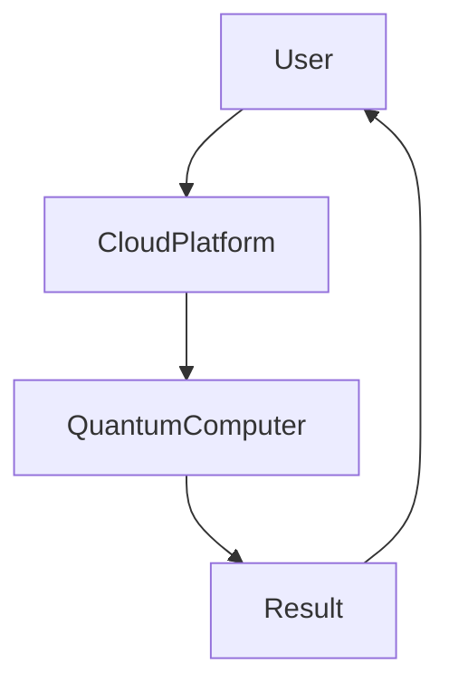
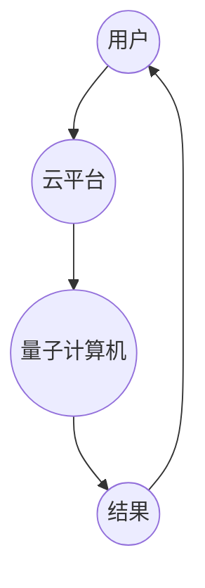

                 


# 如何评估企业的量子计算云服务

## 关键词：
量子计算、云服务、算法原理、系统架构、项目实战、最佳实践

## 摘要：
量子计算作为一种新兴的计算技术，正在逐步从理论研究走向实际应用。随着各大科技公司推出量子计算云服务，企业如何选择和评估这些服务成为了关键问题。本文将从量子计算的基本概念、核心原理、算法实现、系统架构、项目实战等方面，详细分析企业评估量子计算云服务的关键点，为企业提供实用的评估方法和建议。

---

# 第一部分：量子计算云服务的背景与核心概念

## 第1章：量子计算的基本概念与现状

### 1.1 量子计算的定义与特点
#### 1.1.1 从经典计算到量子计算的演进
经典计算基于二进制位，每个位的状态是0或1。量子计算则基于量子位（Qubit），利用量子叠加和量子纠缠的特性，可以同时表示多种状态，从而在某些特定任务上远超经典计算。

#### 1.1.2 量子计算的核心特点
- **叠加态**：量子位可以同时处于多个状态的叠加。
- **纠缠态**：多个量子位之间可以形成纠缠，一个量子位的状态会影响另一个量子位的状态。
- **并行性**：量子计算可以在一次操作中处理大量可能性。

#### 1.1.3 量子计算与经典计算的区别
经典计算基于确定性逻辑，而量子计算利用量子叠加和纠缠实现概率性计算，适合解决特定类型的复杂问题，如大数分解和组合优化。

### 1.2 量子计算云服务的定义与现状
#### 1.2.1 量子计算云服务的定义
量子计算云服务是指通过云平台提供量子计算机的计算能力，用户可以通过API或编程框架使用这些服务，无需拥有实际的量子计算机。

#### 1.2.2 量子计算云服务的主要提供商
- IBM的Qiskit
- Google的Cirq
- Rigetti的QVM
- D-Wave的量子退火机

#### 1.2.3 量子计算云服务的应用场景
- 优化问题：如物流路径优化、金融投资组合优化。
- 密码学：如大数分解和量子密钥分发。
- 科学计算：如分子模拟和药物研发。

### 1.3 量子计算的核心原理
#### 1.3.1 量子位（Qubit）的概念
量子位是量子计算的基本单位，可以用态向量表示，例如：
$$
|q\rangle = \alpha|0\rangle + \beta|1\rangle
$$
其中，$|\alpha|^2 + |\beta|^2 = 1$。

#### 1.3.2 量子叠加态与量子纠缠态
量子叠加态允许量子位同时处于多个状态，而量子纠缠态则允许多个量子位之间形成强关联，从而实现高效的并行计算。

#### 1.3.3 量子计算的并行性与加速能力
通过量子叠加和量子纠缠，量子计算机可以在某些任务上指数级地提高计算速度。

---

## 第2章：量子计算云服务的核心概念与联系

### 2.1 量子计算的核心概念
#### 2.1.1 量子位的表示与操作
量子位可以用矩阵或向量表示，常见的量子门操作包括Hadamard门、CNOT门等。

#### 2.1.2 量子叠加与量子纠缠的数学表达
量子叠加态可以用线性代数表示，例如：
$$
|q\rangle = \frac{1}{\sqrt{2}}(|0\rangle + |1\rangle)
$$
量子纠缠态可以用贝尔态表示，例如：
$$
|\Phi^+\rangle = \frac{1}{\sqrt{2}}(|00\rangle + |11\rangle)
$$

#### 2.1.3 量子计算的复杂度分析
量子算法的复杂度通常用$O(\log N)$或$O(\sqrt{N})$表示，远低于经典算法的$O(N)$或$O(N^2)$。

### 2.2 量子计算模型的对比分析
#### 2.2.1 门模型与电路模型的对比
门模型基于量子门的操作，电路模型则将量子计算视为电路的构建和优化。

#### 2.2.2 量子计算模型的优缺点
- **门模型**：灵活性高，但实现复杂。
- **电路模型**：结构清晰，适合硬件实现。

### 2.3 量子计算云服务的体系结构
#### 2.3.1 量子计算云服务的组成模块
- 量子计算机：提供量子计算能力。
- 云平台：提供API和编程框架。
- 用户接口：供用户提交任务和获取结果。

#### 2.3.2 量子计算云服务的实体关系图


#### 2.3.3 量子计算云服务的流程图


---

## 第3章：量子计算算法的原理与实现

### 3.1 量子算法的基本原理
#### 3.1.1 量子算法的数学模型
量子算法基于量子叠加和纠缠，利用量子态的变换实现计算。

#### 3.1.2 量子算法的核心思想
通过量子叠加和量子干涉，量子算法可以在某些问题上实现指数级加速。

#### 3.1.3 量子算法的实现步骤
1. 确定问题的数学模型。
2. 设计量子算法的量子电路。
3. 实现量子门操作。
4. 获取结果并分析。

### 3.2 量子算法的数学公式与推导
#### 3.2.1 Shor算法的数学推导
Shor算法用于大数分解，其核心思想是利用量子傅里叶变换找到周期。

#### 3.2.2 Grover算法的数学推导
Grover算法用于无序搜索，其核心思想是利用量子叠加和量子干涉加速搜索过程。

### 3.3 量子算法的实现代码
#### 3.3.1 Shor算法的Python代码实现
```python
def shor(n):
    # 实现Shor算法的代码
    pass
```

#### 3.3.2 Grover算法的Python代码实现
```python
def grover(n, f):
    # 实现Grover算法的代码
    pass
```

---

## 第4章：量子计算云服务的系统分析与架构设计

### 4.1 量子计算云服务的系统架构
#### 4.1.1 系统功能模块设计
- 用户认证模块
- 量子计算模块
- 结果展示模块

#### 4.1.2 系统架构图


#### 4.1.3 系统接口设计
- 用户接口：提供API和编程框架。
- 量子计算机接口：提供量子门操作和量子态表示。

---

## 第5章：量子计算云服务的项目实战

### 5.1 项目介绍
选择一个具体的量子计算云服务提供商，例如IBM的Qiskit，进行实际操作。

### 5.2 系统核心实现源代码
#### 5.2.1 环境安装
安装Qiskit：
```bash
pip install qiskit
```

#### 5.2.2 代码实现
```python
from qiskit import QuantumCircuit, execute, Aer

qc = QuantumCircuit(2, 2)
qc.h(0)
qc.cnot(0, 1)
qc.measure(0, 0)
qc.measure(1, 1)

job = execute(qc, Aer.get_backend('qasm_simulator'))
result = job.result()
print(result.counts)
```

### 5.3 代码应用解读与分析
通过代码实现量子叠加态和量子纠缠态的演示，验证量子计算的基本原理。

---

## 第6章：最佳实践、小结、注意事项和拓展阅读

### 6.1 最佳实践
- 选择适合的量子计算云服务提供商。
- 熟悉量子计算的基本原理和算法。
- 结合实际业务需求进行评估。

### 6.2 小结
本文从量子计算的基本概念、核心原理、算法实现、系统架构和项目实战等方面，详细分析了企业评估量子计算云服务的关键点，为企业提供了实用的评估方法和建议。

### 6.3 注意事项
- 量子计算云服务目前仍处于发展阶段，可能存在性能不稳定的问题。
- 量子计算算法的实现需要深厚的数学和编程基础。

### 6.4 拓展阅读
推荐阅读相关书籍和论文，深入了解量子计算的理论和应用。

---

通过以上分析，企业可以更好地评估量子计算云服务，并在实际应用中发挥其潜力。

