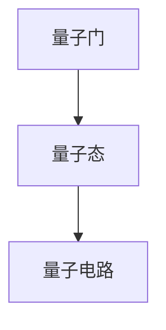
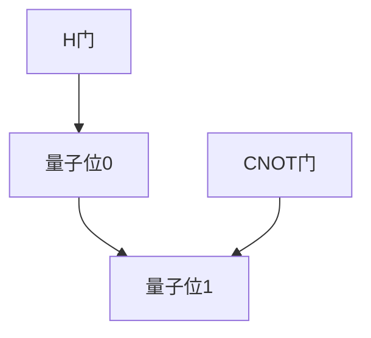
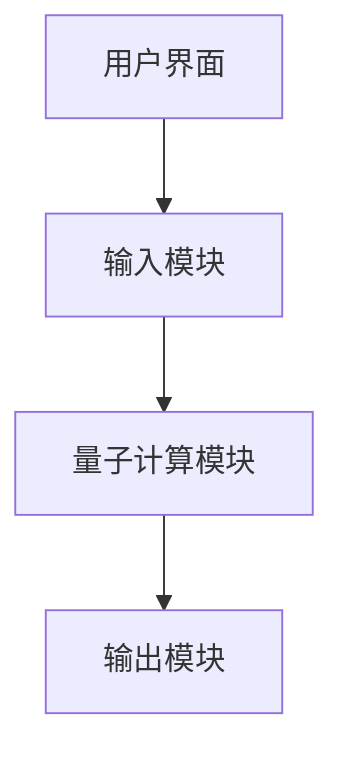

                 


# 如何评估企业的量子计算化学模拟应用

> 关键词：量子计算，化学模拟，企业评估，系统架构，算法优化，量子位，数学模型

> 摘要：本文详细探讨了如何评估企业在量子计算化学模拟应用中的技术实力与应用价值。从量子计算的基本概念到化学模拟的核心算法，从系统架构设计到实际项目实战，本文为企业提供了全面的评估方法和实践指导。文章结合实际案例，深入分析了量子计算在化学模拟中的潜力与挑战，并提出了优化建议。

---

# 第1章: 量子计算化学模拟应用概述

## 1.1 量子计算的基本概念

### 1.1.1 量子计算的定义
量子计算是一种基于量子力学原理的计算方式，利用量子位（qubit）进行信息处理。与经典计算中的二进制位（bit）不同，量子位可以同时处于多个状态的叠加态。

$$
|\psi\rangle = \alpha|0\rangle + \beta|1\rangle
$$

其中，$\alpha$ 和 $\beta$ 是复数，满足 $|\alpha|^2 + |\beta|^2 = 1$。

### 1.1.2 量子计算与经典计算的主要区别

| 特性 | 经典计算 | 量子计算 |
|------|----------|----------|
| 基础单位 | bit | qubit |
| 并行性 | 串行 | 并行 |
| 能耗 | 高 | 低 |

### 1.1.3 量子计算在化学模拟中的应用潜力
量子计算在化学模拟中可以解决传统方法难以处理的问题，例如：
1. 分子结构的精确计算。
2. 化学反应动力学的模拟。
3. 材料科学中的复杂问题。

## 1.2 化学模拟的核心问题

### 1.2.1 化学模拟的定义与目标
化学模拟通过计算方法研究化学系统的性质，包括分子结构、能量状态和化学反应过程。其目标是通过计算手段预测化学系统的实验结果。

### 1.2.2 传统化学模拟的局限性
1. 计算资源消耗大。
2. 精度受限于计算能力。
3. 难以处理多体问题。

### 1.2.3 量子计算如何解决传统模拟的难点
量子计算可以通过模拟量子系统的真实行为，提供更高的精度和效率。

## 1.3 量子计算化学模拟的背景与现状

### 1.3.1 量子计算技术的发展历程
1. **早期研究**：20世纪80年代，Richard Feynman提出量子模拟器的概念。
2. **实验阶段**：21世纪初，首个量子计算机原型出现。
3. **应用探索**：近年来，量子计算在化学、物理等领域的应用逐步展开。

### 1.3.2 量子计算在化学领域的研究现状
1. **分子模拟**：成功模拟小分子的量子态。
2. **材料科学**：研究新型材料的性质。
3. **药物研发**：加速新药的发现过程。

### 1.3.3 当前面临的主要挑战与未来发展方向
1. **技术挑战**：量子位的稳定性和纠错技术。
2. **算法优化**：开发高效的量子算法。
3. **应用拓展**：探索更多化学领域的应用场景。

## 1.4 本章小结
本章介绍了量子计算的基本概念，分析了化学模拟的核心问题，并探讨了量子计算在化学模拟中的潜力与现状。

---

# 第2章: 量子计算的核心概念与原理

## 2.1 量子位的基本原理

### 2.1.1 量子位的定义与特性
量子位是量子计算的基本单位，可以处于叠加态和纠缠态。

$$
|q\rangle = \alpha|0\rangle + \beta|1\rangle
$$

### 2.1.2 量子叠加与量子纠缠
- **叠加态**：$$ |+\rangle = \frac{1}{\sqrt{2}}(|0\rangle + |1\rangle) $$
- **纠缠态**：$$ |\psi\rangle = \frac{1}{\sqrt{2}}(|01\rangle + |10\rangle) $$

### 2.1.3 量子态的数学表示与操作
量子态的表示为向量，量子门的操作为矩阵。

$$
U|\psi\rangle = U \cdot |\psi\rangle
$$

### 2.1.4 量子门与量子电路
常用量子门包括H门（Hadamard）、X门（Pauli-X）和CNOT门（Controlled-NOT）。



## 2.2 量子计算的核心算法

### 2.2.1 Shor算法
Shor算法用于大整数分解，是量子计算的重要应用之一。

$$
n = pq \rightarrow p = \text{分解结果}
$$

### 2.2.2 Grover算法
Grover算法用于无序数据库的搜索，时间复杂度为$O(\sqrt{N})$。

### 2.2.3 HHL算法
HHL算法用于线性方程组的求解，适用于量子计算中的某些特定问题。

## 2.3 量子计算与化学模拟的结合

### 2.3.1 分子结构模拟
通过量子计算模拟分子的量子态，计算其能量和结构。

### 2.3.2 化学反应动力学
研究化学反应的量子动力学过程，预测反应路径。

### 2.3.3 材料科学应用
利用量子计算研究新型材料的性质，如超导材料和纳米材料。

## 2.4 本章小结
本章介绍了量子计算的核心概念，包括量子位、量子门和量子算法，并探讨了这些概念在化学模拟中的应用。

---

# 第3章: 量子计算化学模拟的核心数学模型

## 3.1 量子态的数学表示

### 3.1.1 量子态的向量表示
量子态可以用向量表示，例如二维量子态：

$$
|q\rangle = \begin{bmatrix} \alpha \\ \beta \end{bmatrix}
$$

### 3.1.2 量子态的基变换
通过幺正变换改变量子态的基：

$$
U|\psi\rangle = |\psi'\rangle
$$

### 3.1.3 量子态的测量
测量量子态时，结果为$|0\rangle$或$|1\rangle$，概率分别为$|\alpha|^2$和$|\beta|^2$。

## 3.2 量子门与量子电路的数学模型

### 3.2.1 常用量子门的矩阵表示
H门的矩阵表示为：

$$
H = \frac{1}{\sqrt{2}} \begin{bmatrix} 1 & 1 \\ 1 & -1 \end{bmatrix}
$$

### 3.2.2 量子电路的构建
通过组合量子门构建量子电路，例如：



## 3.3 化学模拟中的量子计算模型

### 3.3.1 Hamiltonian的量子表示
化学系统的Hamiltonian可以用量子算符表示：

$$
H = \sum_i h_i |i\rangle \langle i|
$$

### 3.3.2 量子动力学方程的求解
通过量子计算模拟系统的动力学演化：

$$
|\psi(t)\rangle = e^{-iHt/\hbar} |\psi(0)\rangle
$$`

### 3.3.3 量子态的演化与测量
通过量子门的操作，量子态从初始态演化到目标态，并通过测量获取结果。

## 3.4 本章小结
本章详细讲解了量子计算化学模拟的核心数学模型，包括量子态的表示、量子门的矩阵形式以及Hamiltonian的量子表示。

---

# 第4章: 量子计算化学模拟的系统架构与设计

## 4.1 系统架构概述

### 4.1.1 系统组成部分
量子计算系统通常包括量子计算平台、模拟算法和用户界面。

### 4.1.2 模块划分
- **输入模块**：接收化学问题的输入。
- **量子计算模块**：执行量子计算。
- **输出模块**：展示结果。

### 4.1.3 系统架构图


## 4.2 系统功能设计

### 4.2.1 输入模块
- **功能**：接收化学问题的参数。
- **流程**：
  1. 用户输入化学问题。
  2. 系统解析参数。

### 4.2.2 量子计算模块
- **功能**：执行量子计算算法。
- **流程**：
  1. 初始化量子态。
  2. 应用量子门。
  3. 测量结果。

### 4.2.3 输出模块
- **功能**：展示计算结果。
- **流程**：
  1. 接收量子计算模块的结果。
  2. 显示结果。

## 4.3 系统优化与实现

### 4.3.1 优化策略
- **算法优化**：减少计算步骤。
- **硬件优化**：提高量子位的稳定性。

### 4.3.2 实现细节
- **量子门的选择**：选择合适的量子门组合。
- **系统接口设计**：设计清晰的接口规范。

## 4.4 本章小结
本章详细探讨了量子计算化学模拟的系统架构与设计，包括模块划分和功能设计。

---

# 第5章: 量子计算化学模拟的算法实现与优化

## 5.1 算法实现的基础

### 5.1.1 量子计算算法的实现
通过量子编程语言（如Qiskit）实现量子算法。

### 5.1.2 化学模拟的量子算法
- **分子模拟**：计算分子的量子态。
- **化学反应模拟**：预测化学反应的过程。

## 5.2 算法优化策略

### 5.2.1 算法优化
- **减少量子门的数量**。
- **优化量子电路的深度**。

### 5.2.2 实现细节
- **量子门的选择**：选择最优的量子门组合。
- **系统参数的调整**：优化系统参数以提高计算效率。

## 5.3 本章小结
本章介绍了量子计算化学模拟的算法实现与优化策略，强调了算法优化的重要性。

---

# 第6章: 量子计算化学模拟的项目实战

## 6.1 项目环境安装

### 6.1.1 安装Qiskit
使用Python安装Qiskit库：

```bash
pip install qiskit
```

### 6.1.2 安装其他依赖
安装必要的依赖库，如numpy和matplotlib。

## 6.2 项目核心实现

### 6.2.1 量子计算代码实现
实现一个简单的量子计算算法，例如：

```python
from qiskit import QuantumCircuit, execute, Aer
from qiskit.visualization import plot_bloch_vector

qc = QuantumCircuit(1,1)
qc.h(0)
qc.measure(0,0)

job = execute(qc, Aer.get_backend('qasm_simulator'))
result = job.result()
print(result.get_counts(qc))
```

### 6.2.2 化学模拟的代码实现
实现分子结构的量子模拟：

```python
from qiskit import QuantumCircuit
from qiskit.aqua import Operator, get_qiskit_backend
from qiskit.aqua.algorithms import ExactDiagonalization

hamiltonian = Operator([[0,1],[1,0]])
algorithm = ExactDiagonalization(hamiltonian)
result = algorithm.run()
print(result.eigenstates)
```

## 6.3 项目实战小结
本章通过实际案例展示了量子计算化学模拟的实现过程，从环境安装到代码实现，帮助读者掌握基本技能。

---

# 第7章: 总结与展望

## 7.1 本章总结
本文详细探讨了如何评估企业的量子计算化学模拟应用，从量子计算的基本概念到系统架构设计，再到实际项目实战，为企业提供了全面的评估方法。

## 7.2 未来展望
量子计算在化学模拟中的应用前景广阔，未来需要进一步优化算法和系统架构，推动技术的产业化应用。

---

# 参考文献

1. Feynman, R. P. (1982). "Simulating physics with computers".
2. Shor, P. W. (1994). "Polynomial-time algorithms for prime factorization and discrete logarithms on a quantum computer".
3. Grover, L. K. (1997). "A quantum algorithm for searching an unordered database".

---

# 附录

## 附录A: 量子计算相关工具

### 1. Qiskit
Qiskit是IBM开发的量子计算工具包，提供丰富的量子算法和模拟器。

### 2. Q#

