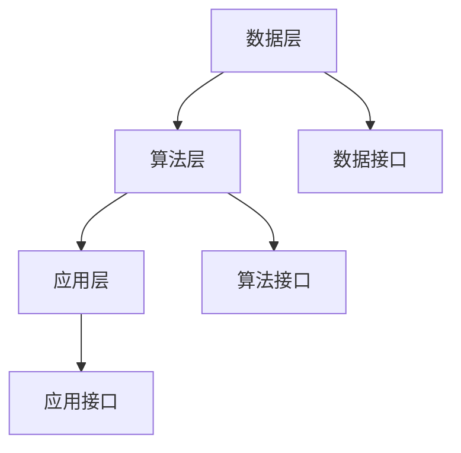
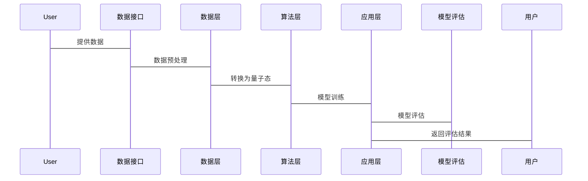

                 


# 如何评估企业的量子计算机器学习模型

## 关键词：量子计算，机器学习，模型评估，量子算法，计算复杂度，准确率，召回率

## 摘要：  
量子计算与机器学习的结合为企业提供了前所未有的计算能力和算法优化潜力。然而，评估量子计算机器学习模型的性能和适用性是一个复杂而关键的挑战。本文将详细探讨如何从多个维度评估量子计算机器学习模型，包括性能指标、算法原理、系统架构和实际应用案例。通过结合理论分析和实际操作，本文旨在为企业技术决策者和开发者提供实用的评估方法和工具，帮助他们在实际应用中更好地部署和优化量子计算机器学习模型。

---

# 第1章: 量子计算与机器学习模型评估的背景

## 1.1 量子计算的基本概念

### 1.1.1 量子位与经典位的区别

在量子计算中，量子位（qubit）是信息的基本单位，与经典计算中的比特（bit）不同。量子位可以同时处于多个状态的叠加态，而经典位只能是0或1。

- 量子位的叠加态表示为：$$|\psi\rangle = \alpha|0\rangle + \beta|1\rangle$$，其中$$\alpha$$和$$\beta$$是复数，满足$$|\alpha|^2 + |\beta|^2 = 1$$。
- 例如，当$$\alpha = \frac{1}{\sqrt{2}}$$和$$\beta = \frac{1}{\sqrt{2}}$$时，量子位处于$$|0\rangle$$和$$|1\rangle$$的等概率叠加态。

### 1.1.2 量子叠加与量子纠缠

- 量子叠加：量子系统可以同时处于多个状态的线性组合中，这使得量子计算能够并行处理多种可能性。
- 量子纠缠：两个或多个量子位之间存在强烈的关联，使得对一个量子位的操作会立即影响另一个量子位的状态。

### 1.1.3 量子计算的基本原理

量子计算通过量子位的操作和测量来实现计算。量子门（如Hadamard门、CNOT门）用于对量子位进行变换，而量子测量用于将量子状态转化为经典结果。

## 1.2 机器学习的基本概念

### 1.2.1 机器学习的定义与分类

机器学习是一种通过数据和经验来训练模型，使其能够进行预测或分类的技术。常见的机器学习算法包括线性回归、支持向量机（SVM）、神经网络等。

- 监督学习：给定标注数据，训练模型预测新数据的标签。
- 无监督学习：在未标注数据中发现模式或结构。
- 强化学习：通过与环境交互，学习最优策略。

### 1.2.2 机器学习的核心算法

- 线性回归：用于预测连续型变量。
- 支持向量机：用于分类和回归任务。
- 神经网络：通过多层结构模拟复杂的非线性关系。

## 1.3 量子计算与机器学习的结合

### 1.3.1 量子计算在机器学习中的优势

- 并行计算能力：量子计算机可以在指数级时间内处理复杂问题。
- 优化算法：量子计算在优化问题中表现优异，如旅行商问题、组合优化等。

### 1.3.2 量子机器学习的定义与特点

量子机器学习是利用量子计算机的特性，开发新型机器学习算法，以提高计算效率和模型性能。

### 1.3.3 量子计算与机器学习的未来发展趋势

随着量子计算技术的成熟，量子机器学习将在药物发现、金融建模、图像识别等领域发挥重要作用。

---

# 第2章: 量子计算机器学习模型的核心概念

## 2.1 量子计算模型的核心要素

### 2.1.1 量子位的表示与操作

- 量子位的表示：使用向量或矩阵形式表示量子态。
- 量子门操作：如Hadamard门、Pauli门等，用于对量子位进行变换。

### 2.1.2 量子叠加与量子纠缠

- 量子叠加：允许模型同时处理多种可能性。
- 量子纠缠：增强了模型的关联性，提高了分类准确性。

### 2.1.3 量子算法的基本结构

- 量子傅里叶变换：用于量子搜索和优化算法。
- 量子叠加算法：如Grover算法，用于无监督学习。

## 2.2 机器学习模型的核心要素

### 2.2.1 数据表示与特征提取

- 数据表示：将数据转化为量子态，便于量子计算处理。
- 特征提取：通过量子位操作提取数据的特征信息。

### 2.2.2 模型训练与优化

- 模型训练：利用量子计算机进行参数优化。
- 模型优化：通过量子搜索算法找到最优参数。

### 2.2.3 模型评估与预测

- 模型评估：通过量子测量得到模型的预测结果。
- 模型预测：利用量子计算机进行实时预测。

## 2.3 量子计算与机器学习的结合模型

### 2.3.1 量子支持向量机

- 量子支持向量机：利用量子计算机进行SVM的优化。

### 2.3.2 量子神经网络

- 量子神经网络：通过量子门操作模拟神经网络的层间关系。

### 2.3.3 量子聚类算法

- 量子聚类：利用量子纠缠进行数据聚类。

---

# 第3章: 量子计算机器学习模型的评估指标

## 3.1 评估指标的分类

### 3.1.1 分类任务的评估指标

- 准确率：模型正确分类的比例。
- 召回率：模型正确识别正类的比例。
- F1分数：准确率和召回率的调和平均数。

### 3.1.2 回归任务的评估指标

- 均方误差（MSE）：预测值与真实值的平方差的平均值。
- R平方（R²）：模型解释的方差比例。

### 3.1.3 聚类任务的评估指标

- 纯度：每个簇中数据点的相同标签的比例。
- 内部一致性：模型将相似的数据点分到同一簇的能力。

## 3.2 量子计算模型的性能评估

### 3.2.1 准确率与召回率

- 准确率：正确预测的样本数占总样本数的比例。
- 召回率：正确预测的正类样本数占所有正类样本数的比例。

### 3.2.2 F1分数与AUC曲线

- F1分数：准确率和召回率的调和平均数，$$F1 = 2 \times \frac{准确率 \times 召回率}{准确率 + 召回率}$$。
- AUC曲线：评估模型在不同阈值下的性能，面积越大，模型性能越好。

### 3.2.3 训练时间与计算复杂度

- 训练时间：模型训练所需的时间。
- 计算复杂度：模型计算所需的资源和时间。

## 3.3 量子计算模型的可解释性

### 3.3.1 模型解释性的定义

可解释性是指模型的预测结果能够被人类理解和解释的程度。

### 3.3.2 量子模型解释性的挑战

- 量子模型的复杂性使其难以解释。
- 量子纠缠使得模型的预测结果具有不确定性。

### 3.3.3 提高量子模型解释性的方法

- 使用经典解释性工具，如LIME或SHAP，对量子模型进行解释。
- 通过量子门操作分析模型的特征重要性。

## 3.4 本章小结

通过多种评估指标，可以从准确性、效率和可解释性等多个维度全面评估量子计算机器学习模型的性能。

---

# 第4章: 量子计算机器学习模型的评估方法

## 4.1 量子计算模型的性能评估

### 4.1.1 量子计算模型的分类任务评估

- 使用Grover算法进行分类任务的加速。
- 对比量子模型与经典模型的准确率和召回率。

### 4.1.2 量子计算模型的回归任务评估

- 使用量子傅里叶变换进行回归任务的优化。
- 对比量子模型与经典模型的MSE和R²值。

### 4.1.3 量子计算模型的聚类任务评估

- 使用量子聚类算法进行数据聚类。
- 对比量子模型与经典模型的纯度和内部一致性。

## 4.2 量子计算模型的可解释性评估

### 4.2.1 使用LIME工具对量子模型进行解释

- LIME（Local Interpretable Model-agnostic Explanations）是一种用于解释机器学习模型的工具，可以用于分析量子模型的预测结果。

### 4.2.2 使用SHAP值分析量子模型的特征重要性

- SHAP（SHapley Additive exPlanations）值是一种基于博弈论的解释方法，可以用于分析量子模型中各个特征的重要性。

## 4.3 量子计算模型的计算复杂度评估

### 4.3.1 量子模型的计算复杂度分析

- 量子算法的复杂度通常为O($$\sqrt{N}$$)，远低于经典算法的O(N)复杂度。

### 4.3.2 量子模型的训练时间评估

- 训练时间随着数据规模的增加而显著减少，显示出量子计算在大规模数据处理中的优势。

## 4.4 本章小结

通过多种评估方法，可以从性能、效率和可解释性等多个维度全面评估量子计算机器学习模型的优劣。

---

# 第5章: 量子计算机器学习模型的系统分析与架构设计

## 5.1 系统分析与设计

### 5.1.1 系统功能设计

- 数据输入与处理：将数据转换为量子态。
- 模型训练：利用量子算法进行模型训练。
- 模型评估：通过量子测量进行模型评估。

### 5.1.2 系统架构设计

- 使用分层架构，包括数据层、算法层和应用层。
- 数据层负责数据的输入和预处理，算法层负责量子算法的实现，应用层负责模型的训练和评估。

### 5.1.3 系统接口设计

- 数据接口：与经典数据库或量子数据库进行交互。
- 算法接口：与其他量子算法或经典算法进行交互。
- 应用接口：提供给最终用户进行模型的训练和评估。

## 5.2 系统架构图



## 5.3 系统交互图



## 5.4 本章小结

通过系统分析与架构设计，可以更好地理解量子计算机器学习模型的实现过程和评估方法。

---

# 第6章: 量子计算机器学习模型的项目实战

## 6.1 环境安装

### 6.1.1 安装必要的工具和库

- 安装Qiskit：```bash
pip install qiskit
```
- 安装NumPy和Scikit-learn：```bash
pip install numpy scikit-learn
```

### 6.1.2 配置量子计算环境

- 使用Qiskit的量子模拟器或真实量子计算机。

## 6.2 核心实现

### 6.2.1 量子支持向量机的实现

```python
from qiskit import QuantumCircuit, Aer, execute
from qiskit.circuit import Gate, QuantumRegister, ClassicalRegister
from qiskit.circuit.library import H, CNOT, Z

def build_quantumsvm_circuit(n_qubits):
    q = QuantumRegister(n_qubits, 'q')
    c = ClassicalRegister(n_qubits, 'c')
    qc = QuantumCircuit(q, c)
    # 构建量子支持向量机电路
    # 这里仅展示部分代码，完整的实现需要根据具体任务进行调整
    qc.h(q)
    qc.barrier()
    qc.z(q)
    qc.barrier()
    qc.measure(q, c)
    return qc
```

### 6.2.2 量子聚类算法的实现

```python
def quantum_clustering(qcircuit, data_points):
    # 这里仅展示部分代码，完整的实现需要根据具体任务进行调整
    # 使用量子聚类算法对数据点进行聚类
    pass
```

## 6.3 实际案例分析

### 6.3.1 分类任务案例

```python
# 示例：使用量子支持向量机进行分类任务
from sklearn.datasets import load_iris
from qiskit import BasicAer

iris = load_iris()
X = iris.data
y = iris.target

# 构建量子支持向量机电路
qc = build_quantumsvm_circuit(2)
backend = BasicAer.backends()[0]
job = execute(qc, backend)
result = job.result()
```

### 6.3.2 回归任务案例

```python
# 示例：使用量子傅里叶变换进行回归任务
import numpy as np
from qiskit.circuit import QuantumCircuit

def quantum_fourier_transform(qc, data):
    # 这里仅展示部分代码，完整的实现需要根据具体任务进行调整
    # 使用量子傅里叶变换对数据进行变换
    pass
```

## 6.4 本章小结

通过实际项目案例，可以更好地理解量子计算机器学习模型的实现和评估过程。

---

# 第7章: 总结与展望

## 7.1 本章总结

本文详细探讨了如何评估量子计算机器学习模型，包括性能指标、算法原理、系统架构和实际应用案例。通过理论分析和实际操作，帮助读者全面理解量子计算机器学习模型的评估方法。

## 7.2 未来展望

随着量子计算技术的不断发展，量子机器学习模型的评估方法和工具也将更加成熟。未来的研究方向包括提高量子模型的可解释性、优化量子算法的计算复杂度以及探索新的量子机器学习算法。

---

# 附录: 量子计算机器学习模型评估工具与资源

## 附录A: 量子计算工具推荐

- Qiskit：IBM的量子计算开发工具包。
- Q#：微软的量子计算开发工具。
- Cirq：Google的量子计算开发框架。

## 附录B: 量子计算机器学习模型评估的数学公式

- 准确率：$$准确率 = \frac{正确预测的样本数}{总样本数}$$
- 召回率：$$召回率 = \frac{正确预测的正类样本数}{所有正类样本数}$$
- F1分数：$$F1 = 2 \times \frac{准确率 \times 召回率}{准确率 + 召回率}$$

## 附录C: 量子计算模型的代码示例

```python
from qiskit import QuantumCircuit, Aer, execute
from qiskit.circuit import Gate, QuantumRegister, ClassicalRegister
from qiskit.circuit.library import H, CNOT, Z

def build_quantumsvm_circuit(n_qubits):
    q = QuantumRegister(n_qubits, 'q')
    c = ClassicalRegister(n_qubits, 'c')
    qc = QuantumCircuit(q, c)
    qc.h(q)
    qc.barrier()
    qc.z(q)
    qc.barrier()
    qc.measure(q, c)
    return qc

# 示例：使用量子支持向量机进行分类任务
qc = build_quantumsvm_circuit(2)
backend = Aer.get_backend('qasm_simulator')
job = execute(qc, backend)
result = job.result()
print(result.counts)
```

---

# END

