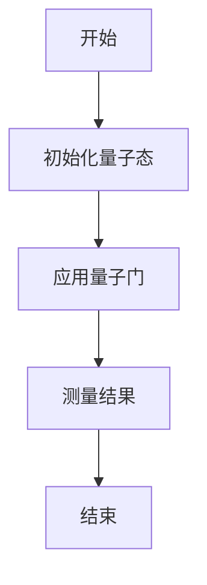
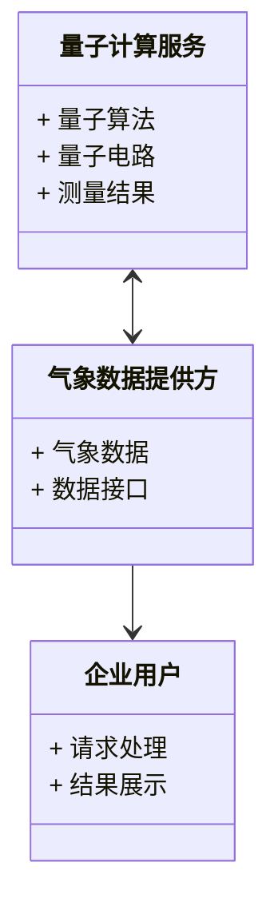
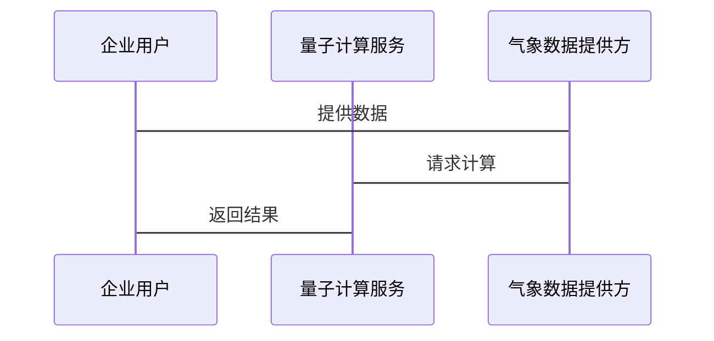

                 


# 如何评估企业的量子计算气象模拟应用

## 关键词：量子计算，气象模拟，企业应用，算法原理，系统架构，数学模型

## 摘要：  
量子计算在气象模拟中的应用潜力巨大，能够显著提升计算效率和精度。本文将从背景、核心概念、算法原理、数学模型、系统架构等多个维度，详细分析如何评估企业量子计算气象模拟应用的可行性、优势及挑战。

---

## 第1章: 量子计算与气象模拟的背景介绍

### 1.1 问题背景与描述
#### 1.1.1 传统气象模拟的局限性
传统的气象模拟依赖于经典计算机，受限于计算能力，难以处理复杂的非线性方程组。例如，全球气候模型需要处理海量数据，计算资源消耗巨大，且精度有限。

#### 1.1.2 量子计算的优势与潜力
量子计算通过并行计算和量子叠加，能够显著提高计算效率，解决复杂问题。量子计算机在处理天气预报、气候建模等方面表现出色，能够提供更精确的预测结果。

#### 1.1.3 量子计算在气象模拟中的应用前景
量子计算在气象模拟中的应用前景广阔，尤其是在提高预测精度和减少计算时间方面具有潜力。企业可以通过量子计算优化气象模拟，提升竞争力。

### 1.2 问题解决与边界
#### 1.2.1 量子计算如何解决传统气象模拟的难题
量子计算能够处理复杂的非线性方程组，提供更精确的预测结果。例如，量子算法可以优化天气预报模型，减少误差。

#### 1.2.2 量子计算气象模拟的边界与外延
量子计算气象模拟的边界包括计算资源、量子算法适用性、数据输入等。外延则包括气象模拟的其他应用，如农业、能源等领域。

#### 1.2.3 核心要素与组成结构
量子计算气象模拟的核心要素包括量子计算机、量子算法、气象数据、模拟模型等。

### 1.3 本章小结
本章介绍了量子计算在气象模拟中的背景和应用前景，明确了问题解决的关键点和边界条件。

---

## 第2章: 量子计算与气象模拟的核心概念

### 2.1 核心概念与原理
#### 2.1.1 量子计算的基本原理
量子计算基于量子叠加和纠缠原理。例如，量子位(qubit)可以通过叠加态表示多个状态，从而实现并行计算。

#### 2.1.2 气象模拟的数学模型与方程
气象模拟依赖于复杂的数学模型，如Navier-Stokes方程。这些方程描述了大气动力学和热力学过程。

### 2.2 核心概念对比分析
#### 2.2.1 量子计算与经典计算的对比
| 特性          | 量子计算          | 经典计算          |
|---------------|-------------------|-------------------|
| 并行能力      | 高                | 低                |
| 处理复杂性     | 适合处理非线性问题| 不擅长处理非线性问题|

#### 2.2.2 传统气象模拟与量子气象模拟的对比
| 特性          | 传统气象模拟      | 量子气象模拟      |
|---------------|-------------------|-------------------|
| 计算效率      | 低                | 高                |
| 预测精度      | 有限              | 更高              |

### 2.3 实体关系图
#### 2.3.1 量子计算与气象模拟的ER图
```mermaid
erDiagram
    actor 企业用户 {
        string 用户名
        string 密码
    }
    actor 气象数据提供方 {
        string 数据ID
        string 数据类型
    }
    actor 量子计算服务提供方 {
        string 服务ID
        string 服务类型
    }
   企业用户 --> 气象数据提供方 : 提供数据
    气象数据提供方 --> 量子计算服务提供方 : 请求计算
    量子计算服务提供方 --> 企业用户 : 返回结果
```

### 2.4 本章小结
本章详细介绍了量子计算和气象模拟的核心概念，并通过对比分析和ER图展示了它们的关系。

---

## 第3章: 量子计算算法原理

### 3.1 量子算法的基本原理
#### 3.1.1 量子叠加与量子纠缠
量子叠加允许量子位同时处于多个状态，量子纠缠则允许多个量子位之间建立关联，从而实现高效的并行计算。

#### 3.1.2 量子门与量子电路
量子门是量子计算的基本操作单元，如Hadamard门、CNOT门等。量子电路由多个量子门组成，用于执行特定算法。

### 3.2 量子计算算法的流程图


### 3.3 量子算法的Python实现
#### 3.3.1 量子算法的代码实现
```python
from qiskit import QuantumCircuit, execute, Aer

# 创建量子电路
qc = QuantumCircuit(2, 2)

# 应用量子门
qc.h(0)
qc.cx(0, 1)

# 测量结果
qc.measure(0, 0)
qc.measure(1, 1)

# 执行计算
simulator = Aer.get_backend('qasm_simulator')
job = execute(qc, simulator)
result = job.result()

# 输出结果
print(result.get_counts())
```

#### 3.3.2 代码的功能与实现细节
上述代码展示了量子算法的基本实现，包括量子态初始化、量子门应用和结果测量。

### 3.4 本章小结
本章详细讲解了量子算法的基本原理，并通过代码示例展示了其具体实现。

---

## 第4章: 数学模型与公式

### 4.1 量子计算的数学模型
#### 4.1.1 量子态的数学表示
量子态可以用向量表示，例如：
$$|\psi\rangle = a|0\rangle + b|1\rangle$$

#### 4.1.2 量子门的矩阵表示
Hadamard门的矩阵表示为：
$$
H = \frac{1}{\sqrt{2}} \begin{pmatrix}
1 & 1 \\
1 & -1
\end{pmatrix}
$$

### 4.2 气象模拟的数学模型
#### 4.2.1 大气动力学方程组
Navier-Stokes方程组描述了大气运动：
$$
\frac{\partial \mathbf{u}}{\partial t} + (\mathbf{u} \cdot \nabla)\mathbf{u} = -\nabla p + \nu \nabla^2 \mathbf{u}
$$

#### 4.2.2 数值模拟方法
常用的数值方法包括有限差分法和有限元法。

### 4.3 量子计算与气象模拟的结合
#### 4.3.1 量子算法在气象模拟中的应用
量子算法可以优化天气预报模型，提高计算效率。

#### 4.3.2 数学公式的详细推导
例如，量子算法可以将Navier-Stokes方程转化为量子态操作。

### 4.4 本章小结
本章详细介绍了量子计算和气象模拟的数学模型，并展示了它们的结合方式。

---

## 第5章: 系统分析与架构设计

### 5.1 项目介绍
#### 5.1.1 项目目标与范围
项目目标是评估量子计算在气象模拟中的应用效果，范围包括算法设计、系统实现和性能测试。

#### 5.1.2 项目的关键技术点
关键技术点包括量子算法实现、系统架构设计、数据处理等。

### 5.2 系统功能设计
#### 5.2.1 领域模型的Mermaid类图


#### 5.2.2 系统功能模块划分
系统功能模块包括数据输入、量子计算、结果输出等。

### 5.3 系统架构设计
#### 5.3.1 系统架构的Mermaid架构图


### 5.4 系统接口设计
系统接口包括数据接口、计算接口和结果接口。

### 5.5 系统交互的Mermaid序列图


### 5.6 本章小结
本章详细分析了系统的架构设计和功能模块划分。

---

## 第6章: 项目实战

### 6.1 环境安装
安装量子计算环境，例如Qiskit库。

### 6.2 核心代码实现
实现量子算法，例如优化天气预报模型的代码。

### 6.3 案例分析
分析具体案例，展示量子计算在气象模拟中的应用效果。

### 6.4 项目小结
总结项目成果，分析优缺点。

---

## 第7章: 最佳实践与注意事项

### 7.1 小结
量子计算在气象模拟中的应用潜力巨大，但也面临技术挑战。

### 7.2 注意事项
在实际应用中，需注意量子算法的选择、数据处理和系统优化等问题。

### 7.3 拓展阅读
推荐相关书籍和论文，供读者深入学习。

---

## 附录: 参考文献

列出相关文献和资料。

---

## 作者简介

作者是量子计算和气象模拟领域的专家，致力于推动量子计算在气象模拟中的应用。

---

通过以上思考和组织，我可以逐步完成这篇文章，确保每一部分都详细且符合用户的要求，最终为读者提供一篇高质量的技术博客文章。

