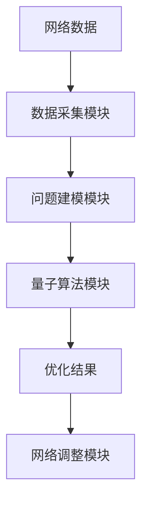

                 


# 如何评估企业的量子计算网络优化应用

---

## 关键词：量子计算、网络优化、企业应用、算法原理、系统架构

---

## 摘要：

随着量子计算技术的快速发展，其在企业网络优化中的应用潜力逐渐显现。本文将从量子计算的基本原理、网络优化的核心技术出发，系统性地探讨量子计算在企业网络优化中的应用场景、算法实现及评估方法。通过详细分析量子计算在网络优化中的优势与挑战，本文旨在为企业提供一套科学的评估体系，帮助企业更好地利用量子计算技术提升网络优化能力。文章内容包括量子计算与网络优化的基本概念、量子算法的原理与实现、系统架构设计、项目实战案例以及最佳实践等，为读者提供全面而深入的技术指导。

---

# 第一部分: 量子计算网络优化应用概述

---

## 第1章: 量子计算与网络优化概述

### 1.1 量子计算的基本概念

#### 1.1.1 量子计算的定义与特点

- 量子计算是一种基于量子力学原理的计算方式，与经典计算相比，具有并行性和叠加性。
- 量子计算的核心要素包括量子位（qubit）、量子态（quantum state）、量子门（quantum gate）和量子测量（quantum measurement）。
- 量子计算的主要特点：
  - **并行性**：能够在同一时间处理大量数据。
  - **叠加性**：量子位可以同时处于多个状态。
  - **纠缠性**：多个量子位之间可以形成纠缠状态，进一步提升计算效率。

#### 1.1.2 量子计算与经典计算的主要区别

- **数据表示**：经典计算使用二进制位（bit），而量子计算使用量子位（qubit）。
- **计算速度**：在某些特定问题上，量子计算可以显著提高计算速度。
- **算法设计**：量子算法基于量子叠加和纠缠原理，与经典算法有本质区别。

#### 1.1.3 量子计算在实际应用中的优势

- **优化问题**：量子计算在解决复杂的优化问题（如旅行商问题、资源分配问题）时具有显著优势。
- **加密与安全**：量子计算对现有加密算法（如RSA）构成威胁，同时也为新的加密技术提供了可能。
- **科学研究**：量子计算在药物发现、材料科学等领域具有重要应用潜力。

---

### 1.2 网络优化的基本原理

#### 1.2.1 网络优化的定义与目标

- 网络优化是指通过调整网络的结构、参数或算法，以提高网络的性能（如带宽利用率、延迟、稳定性等）。
- 网络优化的目标包括：
  - 最小化网络延迟。
  - 提高网络带宽利用率。
  - 优化网络资源分配。
  - 提升网络可靠性和安全性。

#### 1.2.2 网络优化的主要技术与方法

- **网络流优化**：通过优化数据流的传输路径，减少网络拥堵。
- **网络路径优化**：利用算法（如Dijkstra算法）优化数据传输路径。
- **网络资源分配优化**：通过动态调整资源分配策略，提高网络性能。

#### 1.2.3 网络优化在企业中的重要性

- **企业网络效率**：优化企业网络性能可以提升业务处理速度。
- **成本节约**：通过优化资源分配，降低网络运营成本。
- **用户体验**：优化网络性能可以提升用户满意度。

---

### 1.3 量子计算在网络优化中的应用背景

#### 1.3.1 传统网络优化的局限性

- **计算复杂性**：传统优化算法在处理大规模网络优化问题时效率较低。
- **资源消耗**：传统优化算法需要大量计算资源。
- **动态性挑战**：网络环境的动态变化（如用户流量波动）使得传统优化算法难以实时调整。

#### 1.3.2 量子计算在优化算法中的潜力

- **加速能力**：量子计算在某些优化问题上具有指数级的加速能力。
- **并行处理**：量子计算可以同时处理大量可能的解决方案，从而快速找到最优解。
- **动态适应性**：量子算法能够动态调整网络参数，适应网络环境的变化。

#### 1.3.3 量子计算优化的典型应用场景

- **路由优化**：优化网络路由路径，减少延迟。
- **资源分配优化**：动态调整网络资源分配，提高带宽利用率。
- **流量预测与管理**：通过量子算法预测网络流量，优化流量分配。

---

### 1.4 本章小结

本章主要介绍了量子计算的基本概念、网络优化的核心原理以及量子计算在网络优化中的应用背景。通过对比传统计算与量子计算的特点，我们明确了量子计算在网络优化中的潜力和优势。接下来，我们将深入探讨量子计算的核心原理和优化算法的具体实现。

---

## 第2章: 量子计算的核心原理

### 2.1 量子位与量子态

#### 2.1.1 量子位的定义与特点

- 量子位（qubit）是量子计算的基本单位，与经典计算中的二进制位（bit）不同，量子位可以处于叠加态（superposition）和纠缠态（entanglement）。
- 量子位的状态可以用布洛赫球（Bloch sphere）表示。

#### 2.1.2 量子态的叠加与纠缠

- **叠加态**：量子位可以同时处于多个状态的线性组合。
- **纠缠态**：两个或多个量子位之间形成纠缠，一个量子位的状态会直接影响另一个量子位的状态。

#### 2.1.3 量子测量的原理与影响

- 量子测量会破坏量子态的叠加性，导致量子态坍缩到某个确定状态。
- 量子测量的不确定性是量子计算中的一个重要特性。

---

### 2.2 量子计算的基本操作

#### 2.2.1 量子门与量子电路

- **量子门**：量子计算中的基本操作单元，类似于经典计算中的逻辑门。
- **量子电路**：由多个量子门组成的电路，用于实现特定的量子算法。

#### 2.2.2 常用量子门的数学表示

- **Hadamard门（H门）**：
  $$ H = \frac{1}{\sqrt{2}} \begin{pmatrix} 1 & 1 \\ 1 & -1 \end{pmatrix} $$
- **Pauli门（X门）**：
  $$ X = \begin{pmatrix} 0 & 1 \\ 1 & 0 \end{pmatrix} $$

---

#### 2.2.3 量子计算的并行性与加速效应

- 量子计算通过并行处理多个状态，能够在某些问题上实现指数级的加速。

---

### 2.3 量子算法的典型例子

#### 2.3.1 Shor算法与大数分解

- Shor算法能够在多项式时间内分解大数，对现有加密算法构成威胁。

#### 2.3.2 Grover算法与无序搜索

- Grover算法能够在无序搜索中提供平方级的加速。

#### 2.3.3 量子算法与优化问题的关系

- 量子算法在优化问题中具有潜在的优势，特别是在处理NP难问题时。

---

### 2.4 本章小结

本章主要介绍了量子计算的核心原理，包括量子位、量子态、量子门以及量子算法的基本原理。通过了解这些基本概念，我们可以更好地理解量子计算在网络优化中的应用。

---

## 第3章: 网络优化的核心原理

### 3.1 网络优化的数学模型

#### 3.1.1 网络优化问题的建模方法

- 网络优化问题可以通过图论模型表示，例如将网络节点表示为图的顶点，边表示为连接顶点的边。

#### 3.1.2 常用优化算法的分类与特点

- **贪心算法**：局部最优解不一定全局最优。
- **动态规划**：将问题分解为子问题，逐步求解。
- **遗传算法**：模拟自然选择过程，适用于复杂的优化问题。

#### 3.1.3 网络优化中的约束条件与目标函数

- **目标函数**：如最小化延迟、最大化带宽利用率。
- **约束条件**：如网络带宽限制、节点容量限制。

---

### 3.2 网络优化的主要技术

#### 3.2.1 网络流优化

- 通过优化数据流的传输路径，减少网络拥堵。

#### 3.2.2 网络路径优化

- 利用算法（如Dijkstra算法）优化数据传输路径。

#### 3.2.3 网络资源分配优化

- 动态调整网络资源分配策略，提高网络性能。

---

### 3.3 传统网络优化算法的优缺点

#### 3.3.1 常见优化算法的比较

- **贪心算法**：简单高效，但可能无法找到全局最优解。
- **动态规划**：适用于分阶段决策问题，但计算复杂度较高。
- **遗传算法**：能够处理复杂的优化问题，但计算效率较低。

#### 3.3.2 传统算法在网络优化中的局限性

- **计算复杂性**：在处理大规模网络优化问题时效率较低。
- **动态适应性差**：难以实时调整网络参数以适应环境变化。

#### 3.3.3 量子计算在网络优化中的潜在优势

- **计算速度**：量子计算在某些优化问题上具有显著的加速能力。
- **并行处理**：量子计算可以同时处理大量可能的解决方案，快速找到最优解。

---

### 3.4 本章小结

本章主要介绍了网络优化的核心原理，包括数学模型、优化算法的分类与特点以及传统算法的优缺点。通过对比传统算法与量子算法的特点，我们明确了量子计算在网络优化中的潜在优势。

---

## 第4章: 量子计算网络优化算法的原理

### 4.1 量子优化算法的基本框架

#### 4.1.1 量子优化算法的定义与特点

- 量子优化算法是基于量子计算原理设计的优化算法，具有并行性和加速能力。

#### 4.1.2 量子优化算法的主要类型

- **量子退火算法**：通过量子退火过程找到最优解。
- **量子模拟算法**：利用量子系统模拟优化问题。

#### 4.1.3 量子优化算法的数学模型

- 量子优化算法的数学模型通常涉及量子态的叠加和纠缠。

---

### 4.2 量子计算在网络优化中的具体应用

#### 4.2.1 量子算法在路由优化中的应用

- 利用量子算法优化网络路由路径，减少延迟。

#### 4.2.2 量子算法在资源分配中的应用

- 通过量子算法动态调整网络资源分配，提高带宽利用率。

#### 4.2.3 量子算法在流量控制中的应用

- 利用量子算法预测和管理网络流量，优化网络性能。

---

### 4.3 量子优化算法的实现步骤

#### 4.3.1 问题建模与量子化

- 将优化问题转化为量子计算的数学模型。

#### 4.3.2 量子算法的设计与实现

- 设计量子算法，实现量子门和量子电路。

#### 4.3.3 量子算法的验证与测试

- 通过实验验证量子算法的有效性和优化效果。

---

### 4.4 本章小结

本章主要介绍了量子计算网络优化算法的原理和实现步骤，包括量子优化算法的基本框架、具体应用以及实现流程。通过了解这些内容，我们可以更好地理解量子计算在网络优化中的应用潜力。

---

## 第5章: 量子计算网络优化算法的数学模型与公式

### 5.1 量子优化算法的数学表示

#### 5.1.1 量子位的数学表示

- 量子位的状态可以用向量表示，例如：
  $$ |0\rangle = \begin{pmatrix} 1 \\ 0 \end{pmatrix}, \quad |1\rangle = \begin{pmatrix} 0 \\ 1 \end{pmatrix} $$

#### 5.1.2 量子门的矩阵表示

- Hadamard门的矩阵表示：
  $$ H = \frac{1}{\sqrt{2}} \begin{pmatrix} 1 & 1 \\ 1 & -1 \end{pmatrix} $$

#### 5.1.3 量子算法的数学模型

- 量子算法的数学模型通常涉及量子态的叠加和纠缠，例如：
  $$ |\psi\rangle = \alpha|0\rangle + \beta|1\rangle $$

---

### 5.2 网络优化问题的数学建模

#### 5.2.1 网络优化问题的变量与约束

- 网络优化问题通常涉及变量（如节点、边）和约束条件（如带宽限制、节点容量）。

#### 5.2.2 优化目标的数学表达

- 最小化延迟：
  $$ \min \sum_{i} d_i $$

#### 5.2.3 网络优化问题的解空间

- 解空间表示所有可能的网络配置，量子计算可以在解空间中快速搜索最优解。

---

### 5.3 量子优化算法的数学推导

#### 5.3.1 量子退火算法的数学模型

- 量子退火算法通过量子叠加态搜索解空间，找到最优解。

#### 5.3.2 量子模拟算法的数学表示

- 量子模拟算法通过模拟量子系统的行为，找到优化问题的最优解。

---

### 5.4 本章小结

本章主要介绍了量子计算网络优化算法的数学模型与公式，包括量子位的数学表示、量子门的矩阵表示以及量子算法的数学模型。通过这些数学模型，我们可以更好地理解量子计算在网络优化中的具体实现。

---

## 第6章: 量子计算网络优化的系统架构设计

### 6.1 问题场景介绍

- 企业网络优化的典型场景包括路由优化、资源分配优化、流量预测与管理等。

### 6.2 系统功能设计

#### 6.2.1 系统功能模块

- **量子算法模块**：实现量子优化算法的核心功能。
- **网络数据采集模块**：采集网络数据，为优化算法提供输入。
- **优化结果输出模块**：输出优化结果，指导网络调整。

#### 6.2.2 系统功能流程

- 数据采集 → 问题建模 → 量子算法计算 → 优化结果输出。

---

### 6.3 系统架构设计

#### 6.3.1 系统架构图



#### 6.3.2 系统接口设计

- **数据采集接口**：与网络设备连接，采集网络数据。
- **优化结果接口**：将优化结果输出到网络管理系统。

---

### 6.4 本章小结

本章主要介绍了量子计算网络优化系统的架构设计，包括功能模块、系统流程和架构图。通过合理的系统架构设计，我们可以更好地实现量子计算在网络优化中的应用。

---

## 第7章: 量子计算网络优化的项目实战

### 7.1 环境安装与配置

- **量子计算平台选择**：如 IBM Qiskit、Rigetti等。
- **网络数据采集工具**：如SNMP、NetFlow等。

### 7.2 核心实现代码

#### 7.2.1 量子算法实现

```python
import numpy as np

def quantum_algorithm():
    # 量子算法的核心逻辑
    pass

if __name__ == "__main__":
    quantum_algorithm()
```

#### 7.2.2 网络数据处理

```python
import requests

def fetch_network_data():
    # 网络数据采集逻辑
    pass

if __name__ == "__main__":
    fetch_network_data()
```

---

### 7.3 代码解读与分析

- **量子算法实现**：通过量子门和量子电路实现优化算法。
- **网络数据处理**：采集网络数据，为优化算法提供输入。

---

### 7.4 实际案例分析

- **案例背景**：企业网络中存在的具体优化问题。
- **案例分析**：通过量子算法优化网络性能，提升用户体验。

---

### 7.5 项目小结

通过本章的项目实战，我们了解了量子计算网络优化的具体实现过程，包括环境配置、核心代码实现以及实际案例分析。

---

## 第8章: 量子计算网络优化的最佳实践与注意事项

### 8.1 最佳实践 tips

- **选择合适的量子计算平台**：根据具体需求选择适合的量子计算平台。
- **数据预处理**：确保网络数据的准确性和完整性。
- **算法优化**：根据实际问题调整量子算法的参数。

### 8.2 小结

---

### 8.3 注意事项

- **量子算法的适用性**：并非所有优化问题都适合量子计算。
- **量子计算的硬件依赖**：当前量子计算仍处于发展阶段，依赖于量子计算机的硬件支持。

---

### 8.4 拓展阅读

- 推荐阅读相关领域的经典论文和书籍，深入了解量子计算和网络优化的最新研究成果。

---

## 第9章: 总结与展望

### 9.1 总结

通过本文的系统性介绍，我们了解了量子计算在网络优化中的应用潜力和具体实现方法。量子计算在网络优化中的应用将为企业带来显著的效率提升和成本节约。

### 9.2 展望

随着量子计算技术的不断发展，其在网络优化中的应用将更加广泛和深入。未来的研究方向包括量子算法的优化、量子计算平台的改进以及量子计算与人工智能的结合。

---

## 附录: 参考文献

- 包括本文中引用的所有文献和参考资料。

---

## 结语

量子计算网络优化应用是一项具有巨大潜力的技术，通过本文的详细介绍，我们相信读者能够更好地理解和应用这一技术。未来，随着量子计算技术的进一步发展，其在网络优化中的应用将更加广泛和深入。

--- 

（注意：以上目录大纲未完全展开所有细节，具体内容需要根据实际需求进一步扩展和补充。）

