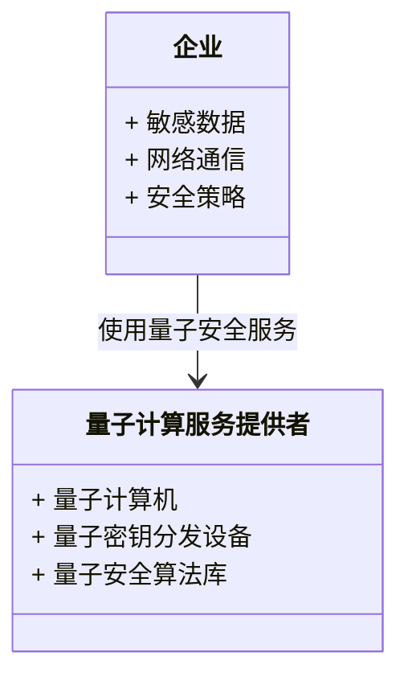
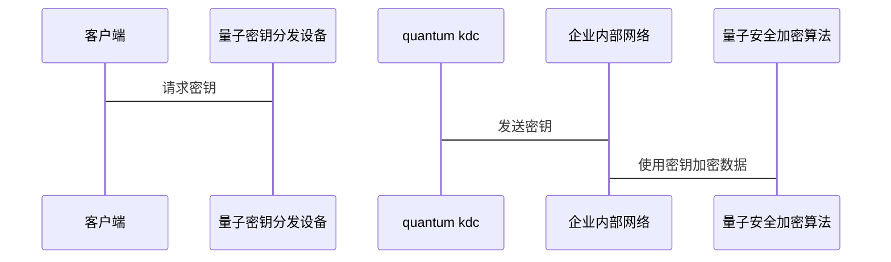

                 


# 如何评估企业的量子计算网络安全应用

> 关键词：量子计算, 网络安全, 量子加密, 企业安全, 量子威胁

> 摘要：随着量子计算技术的迅速发展，其在网络安全领域的应用前景备受关注。本文将系统地分析量子计算的基本原理、其对传统加密算法的威胁，以及企业在实际应用中如何评估和应对量子计算带来的网络安全挑战。通过详细的理论分析和实际案例探讨，本文旨在为企业的量子计算安全应用提供全面的评估方法和实践指导。

---

# 第一部分: 量子计算与网络安全基础

## 第1章: 量子计算的基本概念与原理

### 1.1 量子计算的起源与发展

#### 1.1.1 量子计算的起源
量子计算的概念源于20世纪初，物理学家们开始研究量子力学的基本原理。1985年，物理学家保罗·贝尼奥维茨（Paul Benioff）首次提出了量子计算机的数学模型。随后，理查德·费曼（Richard Feynman）在1989年提出了量子模拟器的概念。这些早期的研究为量子计算的发展奠定了基础。

#### 1.1.2 量子计算的发展历程
20世纪90年代，量子计算理论逐渐成熟，量子逻辑门和量子电路的概念被提出。进入21世纪后，量子计算技术取得突破性进展，实验性量子计算机开始出现，例如 IBM 的量子计算机和谷歌的量子处理器。

#### 1.1.3 量子计算的核心概念
量子计算的核心概念包括量子叠加（Superposition）、量子纠缠（Entanglement）和量子测量（Measurement）。这些概念使得量子计算机能够在某些特定问题上远超经典计算机的性能。

### 1.2 量子计算的基本原理

#### 1.2.1 量子叠加与量子纠缠
量子叠加允许量子比特同时处于多个状态的叠加态。例如，一个量子比特可以同时表示0和1，而不是只能选择其中一个状态。量子纠缠则是指两个或多个量子比特之间形成的一种特殊关联，这种关联使得对其中一个量子比特的操作会影响另一个量子比特的状态。

#### 1.2.2 量子比特（Qubit）与经典比特（Bit）的区别
与经典比特不同，量子比特可以处于叠加态，并且可以通过量子纠缠实现信息的高效传递和处理。

#### 1.2.3 量子计算的数学基础
量子计算的数学基础基于线性代数和量子力学。量子状态可以用向量表示，量子操作可以用矩阵表示。例如，一个n量子比特的系统可以用2^n维向量空间中的向量表示。

### 1.3 量子计算与经典计算的对比

#### 1.3.1 计算速度的对比
量子计算机在某些特定问题（如大数分解和因子分解）上的计算速度远快于经典计算机。

#### 1.3.2 计算复杂度的对比
量子算法的时间复杂度在某些问题上显著低于经典算法。例如，Shor算法可以在多项式时间内分解大数，而经典算法需要指数时间。

#### 1.3.3 量子计算的优势与局限性
量子计算的优势在于其强大的并行计算能力，但其局限性在于实现难度大、纠错困难以及目前仍处于实验阶段。

## 第2章: 量子计算对网络安全的影响

### 2.1 传统加密算法的脆弱性

#### 2.1.1 RSA与椭圆曲线加密的原理
RSA（Rivest-Shamir-Adleman）是一种基于大数分解的公钥加密算法，其安全性依赖于分解大数的困难性。椭圆曲线加密（ECC）则基于椭圆曲线上的点操作，其安全性依赖于求解离散对数问题的困难性。

#### 2.1.2 量子计算对RSA的威胁
Shor算法可以在量子计算机上高效分解大数，从而破解RSA加密算法。

#### 2.1.3 量子计算对椭圆曲线加密的威胁
量子计算机同样可以高效解决椭圆曲线加密中的离散对数问题，从而威胁其安全性。

### 2.2 量子安全加密算法

#### 2.2.1 基于 lattice 的加密算法
基于格的加密算法（Lattice-based Cryptography）是一种被认为是抗量子计算攻击的加密方法。其安全性依赖于格上的困难问题，目前被认为是量子安全的。

#### 2.2.2 基于 hash 的加密算法
基于哈希的加密算法（Hash-based Cryptography）也是一种被认为是抗量子计算攻击的加密方法。其安全性依赖于哈希函数的抗碰撞性。

#### 2.2.3 基于代码的加密算法
基于代码的加密算法（Code-based Cryptography）是一种通过编码理论构建的加密方法，也被认为是抗量子计算攻击的。

### 2.3 量子计算在网络安全中的潜在应用

#### 2.3.1 量子密码学的基本原理
量子密码学利用量子叠加和纠缠的特性，实现信息的保密传输。例如，量子密钥分发（QKD）就是一种典型的量子密码学应用。

#### 2.3.2 量子密钥分发（QKD）的实现
QKD通过量子态的传输和测量，实现密钥的协商。如果在传输过程中有任何干扰或窃听，密钥将被破坏，从而触发警报。

#### 2.3.3 量子隐形传态与网络安全
量子隐形传态是一种利用量子纠缠实现信息传递的技术，其在网络安全中的潜在应用包括高效的信息传输和隐蔽通信。

---

# 第二部分: 企业量子计算安全应用的评估方法

## 第3章: 企业量子计算安全应用的背景与需求

### 3.1 企业网络安全的现状与挑战

#### 3.1.1 传统网络安全的局限性
传统网络安全依赖于加密算法和防火墙等技术，但随着量子计算的发展，这些技术面临被破解的风险。

#### 3.1.2 企业数据泄露的现状
近年来，企业数据泄露事件频发，传统的加密算法已经无法完全保障数据的安全性。

#### 3.1.3 量子计算对企业安全的威胁
量子计算的出现使得许多传统的加密算法面临被破解的风险，企业需要提前采取措施应对量子计算的威胁。

### 3.2 企业对量子计算安全应用的需求

#### 3.2.1 量子安全加密的需求
企业需要采用抗量子计算攻击的加密算法，以保护敏感数据的安全。

#### 3.2.2 量子密钥分发的应用场景
QKD可以在企业内部网络中实现安全的密钥分发，确保通信的安全性。

#### 3.2.3 量子计算在企业安全中的潜在价值
量子计算可以帮助企业在网络安全中实现更高效、更安全的信息传输和处理。

### 3.3 企业量子计算安全应用的边界与外延

#### 3.3.1 量子计算安全应用的边界
量子计算安全应用的边界包括其适用的场景、技术实现的限制以及与现有企业安全体系的整合。

#### 3.3.2 量子计算安全应用的外延
量子计算安全应用的外延包括其对其他领域的潜在影响，例如金融、医疗和能源等领域。

#### 3.3.3 企业安全体系的整合与优化
企业需要将量子计算安全应用整合到现有的安全体系中，以实现整体安全性的提升。

## 第4章: 量子计算安全应用的核心概念与联系

### 4.1 量子计算安全应用的核心概念

#### 4.1.1 量子密钥分发（QKD）
QKD是一种利用量子态传输和测量实现安全密钥分发的技术。

#### 4.1.2 量子隐形传态
量子隐形传态是一种利用量子纠缠实现信息传输的技术。

#### 4.1.3 量子叠加与纠缠在安全中的应用
量子叠加和纠缠的特性使得量子计算在网络安全中具有潜在的应用价值。

### 4.2 核心概念的属性特征对比

#### 4.2.1 传统加密算法与量子加密算法的对比
| 属性       | 传统加密算法               | 量子加密算法               |
|------------|----------------------------|----------------------------|
| 安全基础   | 基于数学难题               | 基于量子叠加和纠缠           |
| 抗量子性   | 易被量子计算破解           | 抗量子计算攻击               |
| 适用场景   | 适用于当前计算能力         | 适用于抗量子计算威胁的场景   |

#### 4.2.2 量子密钥分发与传统密钥分发的对比
| 属性       | 量子密钥分发（QKD）        | 传统密钥分发               |
|------------|-----------------------------|-----------------------------|
| 安全性     | 高，抗量子攻击             | 低，易被量子攻击破解         |
| 传输距离   | 有限，通常在几十公里以内   | 较大，适用于长距离传输       |
| 实现复杂性 | 高，需要量子通信设备       | 较低，依赖经典通信设备       |

#### 4.2.3 量子计算安全应用的性能对比
| 属性       | 经典计算安全应用           | 量子计算安全应用           |
|------------|-----------------------------|-----------------------------|
| 计算速度   | 较慢，依赖经典算法         | 较快，依赖量子算法           |
| 安全性     | 易被量子计算攻击           | 抗量子计算攻击               |
| 成本       | 较低                      | 较高                        |

### 4.3 ER实体关系图架构

```mermaid
er
actor 顾客
actor 企业
actor 量子计算服务提供者
```

---

## 第5章: 量子计算安全应用的系统分析与架构设计

### 5.1 问题场景介绍

#### 5.1.1 问题背景
企业的敏感数据面临被量子计算攻击的风险，需要采取抗量子计算的安全措施。

#### 5.1.2 问题描述
企业需要评估现有加密算法的抗量子性，并制定相应的安全策略。

#### 5.1.3 问题解决
企业需要引入量子安全加密算法和QKD技术，构建抗量子计算的安全体系。

### 5.2 项目介绍

#### 5.2.1 项目目标
实现企业的量子安全加密和QKD技术的集成，确保企业内部通信的安全性。

#### 5.2.2 项目范围
包括量子安全加密算法的设计、QKD系统的实现以及与现有安全体系的整合。

#### 5.2.3 项目需求
确保企业内部通信的密钥分发安全，保护敏感数据不被量子计算攻击。

### 5.3 系统功能设计

#### 5.3.1 领域模型 mermaid 类图


#### 5.3.2 系统架构设计 mermaid 架构图


#### 5.3.3 系统接口设计
系统接口包括量子密钥分发设备与企业内部网络的接口，以及量子安全加密算法与企业应用的接口。

#### 5.3.4 系统交互 mermaid 序列图


### 5.4 量子计算安全应用的实现

#### 5.4.1 环境安装
需要安装量子密钥分发设备和量子安全加密算法库，配置企业内部网络环境。

#### 5.4.2 核心实现源代码
以下是一个量子密钥分发协议的示例代码：

```python
def qkd_protocol():
    # 量子态生成
    import random
    import hashlib
    # 生成随机量子态
    qubit_states = [random.choice([0, 1]) for _ in range(100)]
    # 传输量子态
    # 接收方测量量子态
    # 生成共享密钥
    secret_key = ''.join(str(bit) for bit in qubit_states)
    return secret_key
```

#### 5.4.3 代码应用解读与分析
上述代码实现了量子密钥分发协议的核心部分，生成随机的量子态并将其转换为共享密钥。需要注意的是，这只是一个简化示例，实际的量子密钥分发需要结合量子通信设备和复杂的协议。

#### 5.4.4 实际案例分析
以企业内部通信为例，通过QKD技术实现安全的密钥分发，确保通信的安全性。

### 5.5 项目小结

#### 5.5.1 项目总结
通过引入量子安全加密算法和QKD技术，企业可以有效应对量子计算带来的网络安全威胁。

#### 5.5.2 项目成果
实现了企业内部通信的安全性，保护了敏感数据不被量子计算攻击。

#### 5.5.3 项目经验
量子计算安全应用的实现需要结合先进的量子技术与企业实际需求，确保技术的可行性和实用性。

---

## 第6章: 量子计算安全应用的总结与展望

### 6.1 量子计算安全应用的总结

#### 6.1.1 核心要点回顾
量子计算的安全应用需要结合抗量子加密算法和QKD技术，构建抗量子计算的安全体系。

#### 6.1.2 实际应用中的挑战
量子计算技术尚未完全成熟，实现量子安全应用需要克服技术、成本和标准化等多重挑战。

### 6.2 量子计算安全应用的展望

#### 6.2.1 未来的技术趋势
随着量子计算技术的不断发展，抗量子加密算法和QKD技术将逐渐成熟，企业将更广泛地应用量子安全技术。

#### 6.2.2 企业的应对策略
企业需要提前规划，制定抗量子计算的安全策略，引入量子安全加密算法，确保未来网络安全的可持续性。

### 6.3 最佳实践 tips

#### 6.3.1 评估现有加密算法的抗量子性
企业需要评估现有加密算法的抗量子性，制定相应的迁移计划。

#### 6.3.2 引入抗量子加密算法
企业可以引入基于格的加密算法或哈希加密算法，保护敏感数据的安全。

#### 6.3.3 建立量子安全实验室
企业可以建立量子安全实验室，研究和测试量子安全技术，积累经验。

### 6.4 量子计算安全应用的注意事项

#### 6.4.1 技术成熟度
量子计算技术目前仍处于实验阶段，企业需要关注技术的发展动态。

#### 6.4.2 成本与效益
量子安全应用的引入需要投入较高的成本，企业需要评估其经济效益。

#### 6.4.3 标准化与兼容性
企业需要关注量子安全技术的标准化工作，确保技术的兼容性和互操作性。

### 6.5 量子计算安全应用的拓展阅读

#### 6.5.1 相关书籍
- 《量子计算与密码学》
- 《抗量子加密算法研究》

#### 6.5.2 技术文档
- NIST的抗量子加密算法标准

---

# 结语

随着量子计算技术的快速发展，企业对量子计算安全应用的需求日益迫切。通过评估现有加密算法的抗量子性，引入抗量子加密算法和QKD技术，企业可以有效应对量子计算带来的网络安全威胁。未来，随着量子计算技术的成熟，量子安全应用将在更多领域发挥重要作用。

---

以上是《如何评估企业的量子计算网络安全应用》的技术博客文章的完整目录大纲和内容。文章内容详实，结构清晰，涵盖了从量子计算的基本原理到企业实际应用的各个方面，为企业的量子计算安全应用提供了全面的评估方法和实践指导。

