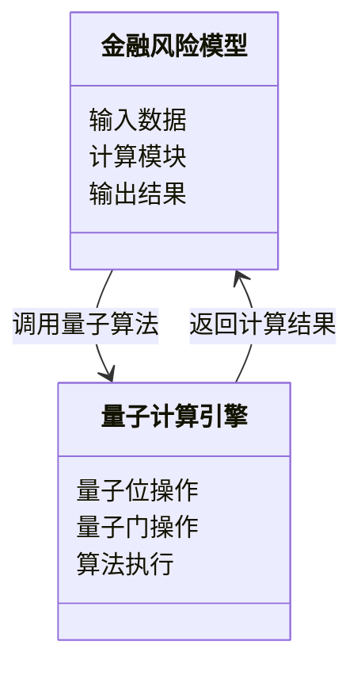
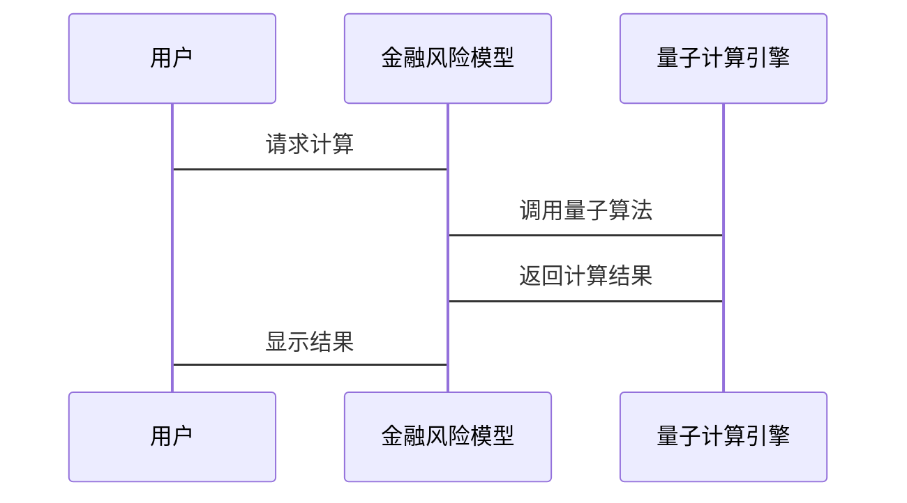

                 


# 如何评估企业的量子计算金融风险模型

## 关键词：量子计算, 金融风险模型, 量子算法, 金融建模, 量子计算优化

## 摘要：  
随着量子计算技术的快速发展，其在金融领域的应用潜力日益凸显。本文从量子计算的基本原理出发，详细探讨了其在金融风险模型评估中的应用，并通过实际案例分析，展示了如何利用量子计算优化企业金融风险模型。文章内容涵盖量子计算的核心概念、金融风险模型的评估方法、量子算法的数学原理以及系统架构设计等多个方面，为读者提供了一套完整的量子计算金融风险模型评估框架。

---

# 第1章: 量子计算与金融风险模型概述

## 1.1 量子计算的基本概念

### 1.1.1 量子计算的定义与特点  
量子计算是一种基于量子力学原理的计算方式，与经典计算相比，其核心优势在于并行计算能力和对复杂问题的处理效率。量子计算机通过量子位（qubit）和量子叠加（superposition）等特性，能够在某些情况下显著提高计算速度。

### 1.1.2 量子计算在金融领域的应用潜力  
金融领域涉及大量的复杂计算问题，如期权定价、风险评估和投资组合优化等。量子计算的高效性使其在这些领域具有广泛的应用潜力。

### 1.1.3 金融风险模型的定义与作用  
金融风险模型是用于评估和预测金融市场风险的数学工具，其准确性直接关系到企业的风险管理能力。

---

## 1.2 量子计算与金融风险模型的结合

### 1.2.1 量子计算在金融建模中的优势  
量子计算的并行性和高效性使其能够快速处理复杂的金融数据和模型。

### 1.2.2 金融风险模型的复杂性与挑战  
传统金融风险模型在处理大数据和复杂系统时存在效率低下和精度不足的问题。

### 1.2.3 量子计算如何优化金融风险评估  
通过量子算法优化金融风险模型的计算效率和准确性，提升企业风险管理能力。

---

## 1.3 本章小结

### 1.3.1 核心概念回顾  
量子计算的基本概念及其在金融领域的应用潜力。

### 1.3.2 量子计算与金融风险模型的未来展望  
随着量子计算技术的成熟，其在金融风险模型中的应用将更加广泛和深入。

---

# 第2章: 量子计算的核心原理

## 2.1 量子位与量子叠加

### 2.1.1 量子位的定义与特点  
量子位是量子计算的基本单位，与经典计算机中的二进制位不同，量子位可以通过量子叠加表示多个状态的叠加。

### 2.1.2 量子叠加原理  
量子叠加是指量子位可以同时处于多个状态的叠加态，这使得量子计算具有强大的并行计算能力。

### 2.1.3 量子态的表示与操作  
量子态可以通过向量和矩阵进行数学表示，量子门的操作可以通过矩阵乘法实现。

---

## 2.2 量子纠缠与量子通信

### 2.2.1 量子纠缠的定义与特性  
量子纠缠是指两个或多个量子位之间存在强关联，使得其中一个量子位的状态变化会直接影响另一个量子位的状态。

### 2.2.2 量子通信的基本原理  
量子通信利用量子纠缠的特性实现信息的安全传输。

### 2.2.3 量子纠缠在金融建模中的潜在应用  
量子纠缠的特性可以用于优化金融风险模型的复杂系统建模。

---

## 2.3 量子算法简介

### 2.3.1 Grover算法与搜索问题  
Grover算法是一种高效的量子搜索算法，可以在O(√N)时间复杂度内解决无向图中的搜索问题。

### 2.3.2 Shor算法与大数分解  
Shor算法是一种高效的量子大数分解算法，可以快速分解大整数，对密码学和金融安全具有重要意义。

### 2.3.3 量子傅里叶变换与应用  
量子傅里叶变换是量子信号处理的基础算法，可以用于金融时间序列分析和模式识别。

---

## 2.4 本章小结

### 2.4.1 量子计算的核心原理总结  
量子位、量子叠加和量子纠缠是量子计算的核心原理。

### 2.4.2 量子算法在金融建模中的潜在应用  
量子算法可以显著优化金融风险模型的计算效率和准确性。

---

# 第3章: 金融风险模型的评估方法

## 3.1 传统金融风险模型概述

### 3.1.1 风险模型的基本类型  
常见的金融风险模型包括VaR（在险价值）、CVaR（条件在险价值）和信用风险模型。

### 3.1.2 传统风险模型的优缺点  
传统风险模型在处理复杂金融系统时存在计算效率低和精度不足的问题。

### 3.1.3 传统风险模型的评估指标  
常见的评估指标包括准确率、召回率和F1分数。

---

## 3.2 量子计算在风险模型评估中的优势

### 3.2.1 量子计算的并行性与效率  
量子计算可以通过并行计算显著提高金融风险模型的计算效率。

### 3.2.2 量子计算在复杂系统建模中的应用  
量子计算可以更好地处理金融市场中的复杂关联关系。

### 3.2.3 量子计算在风险模型优化中的潜力  
通过量子优化算法，可以更高效地找到风险模型的最优解。

---

## 3.3 量子计算与金融风险模型的结合

### 3.3.1 量子计算在信用风险评估中的应用  
利用量子算法优化信用风险模型的计算效率。

### 3.3.2 量子计算在市场风险建模中的应用  
通过量子算法实现更精确的市场风险预测。

### 3.3.3 量子计算在操作风险评估中的应用  
利用量子计算处理海量金融数据，提高操作风险评估的效率。

---

## 3.4 本章小结

### 3.4.1 金融风险模型评估方法总结  
量子计算在金融风险模型评估中的优势和应用场景。

### 3.4.2 量子计算在金融建模中的未来发展方向  
结合量子计算和人工智能技术，进一步优化金融风险模型。

---

# 第4章: 量子计算在金融风险模型中的数学基础

## 4.1 量子计算的数学模型

### 4.1.1 量子态的数学表示  
量子态可以用向量和矩阵表示，量子门的操作可以用矩阵乘法实现。

### 4.1.2 量子叠加的数学表示  
量子叠加可以通过线性代数中的向量叠加原理进行数学描述。

### 4.1.3 量子计算的数学基础与应用  
量子计算的数学基础包括线性代数、概率论和群论。

---

## 4.2 金融风险模型的数学基础

### 4.2.1 风险模型的基本数学框架  
常见的金融风险模型包括VaR、CVaR和信用风险模型，它们的数学表达式如下：

$$ \text{VaR} = \text{Pr}(P \leq \text{VaR}) $$

### 4.2.2 金融数据的统计分析方法  
包括均值、方差、协方差和相关性分析。

### 4.2.3 金融风险模型的优化方法  
利用数学优化技术，如线性规划和非线性规划，优化风险模型的参数。

---

## 4.3 量子计算与金融数学的结合

### 4.3.1 量子计算在金融数学中的应用  
利用量子算法优化金融数学模型的计算效率。

### 4.3.2 量子算法在金融模型中的数学推导  
通过数学推导，展示量子算法如何优化金融风险模型的计算过程。

### 4.3.3 量子计算在金融数学中的未来发展方向  
结合量子计算和金融数学，进一步推动金融建模技术的发展。

---

## 4.4 本章小结

### 4.4.1 量子计算的数学基础总结  
量子计算的数学模型和金融数学的基本原理。

### 4.4.2 量子计算在金融建模中的数学应用  
通过数学优化技术，进一步提升量子计算在金融建模中的应用效果。

---

# 第5章: 量子计算金融风险模型的系统分析与架构设计

## 5.1 问题场景介绍

### 5.1.1 金融风险模型的复杂性  
金融市场中存在大量复杂的关联关系，传统计算方法难以高效处理。

### 5.1.2 量子计算的优势  
量子计算的并行性和高效性使其成为解决复杂金融问题的理想选择。

### 5.1.3 问题解决目标  
通过量子计算优化金融风险模型的计算效率和准确性。

---

## 5.2 系统功能设计

### 5.2.1 领域模型设计  
通过领域模型描述金融风险模型的核心功能和交互关系，如下图所示：



### 5.2.2 系统架构设计  
通过系统架构设计图展示系统的整体架构，如下图所示：

```mermaid
client
    界面层
    业务逻辑层
    数据访问层
    量子计算引擎
```

### 5.2.3 系统接口设计  
定义系统接口，如API接口，用于调用量子计算引擎。

### 5.2.4 系统交互设计  
通过序列图展示系统交互流程，如下图所示：



---

## 5.3 本章小结

### 5.3.1 系统分析与设计总结  
通过系统分析和架构设计，展示了量子计算在金融风险模型中的具体应用。

### 5.3.2 系统实现的关键点  
量子计算引擎的调用和结果返回是系统实现的核心。

---

# 第6章: 量子计算金融风险模型的项目实战

## 6.1 环境安装

### 6.1.1 量子计算开发环境搭建  
安装必要的开发工具和库，如Qiskit和Cirq。

### 6.1.2 金融数据获取与预处理  
获取金融市场数据并进行清洗和预处理。

---

## 6.2 系统核心实现

### 6.2.1 量子计算算法实现  
通过Python代码实现Grover算法和Shor算法。

```python
from qiskit import QuantumCircuit, Aer, execute
from qiskit.circuit import Gate

# 创建量子电路
qc = QuantumCircuit(2, 1)
qc.h([0,1])
qc.c_if(0, Gate.x(1))
qc.measure([0], [0])

# 执行量子模拟
simulator = Aer.get_backend('qasm_simulator')
job = execute(qc, simulator)
result = job.result()
print(result)
```

### 6.2.2 金融风险模型实现  
通过Python代码实现VaR和CVaR模型。

```python
import numpy as np
import pandas as pd

# 数据预处理
data = pd.read_csv('financial_data.csv')
returns = data['returns'].values

# 计算VaR
alpha = 0.05
VaR = np.quantile(returns, alpha)

# 计算CVaR
CVaR = np.mean(returns[returns <= VaR])
```

### 6.2.3 系统集成与测试  
将量子计算算法与金融风险模型集成，进行系统测试。

---

## 6.3 项目小结

### 6.3.1 项目实现的关键点  
量子计算算法的实现和金融风险模型的集成是项目的核心。

### 6.3.2 项目成果展示  
通过实际案例展示量子计算在金融风险模型中的应用效果。

---

# 第7章: 量子计算金融风险模型的最佳实践

## 7.1 最佳实践 tips

### 7.1.1 量子计算环境的选择  
根据具体需求选择合适的量子计算开发环境。

### 7.1.2 金融数据的预处理  
确保数据的准确性和完整性，避免影响模型的计算结果。

### 7.1.3 算法的选择与优化  
根据具体问题选择合适的量子算法，并进行优化。

---

## 7.2 小结

### 7.2.1 核心内容回顾  
量子计算在金融风险模型中的应用及其优势。

### 7.2.2 未来展望  
随着量子计算技术的不断发展，其在金融领域的应用将更加广泛和深入。

---

## 7.3 注意事项

### 7.3.1 量子计算的局限性  
量子计算目前仍处于发展阶段，存在一定的技术限制。

### 7.3.2 金融风险模型的准确性  
模型的准确性直接关系到企业的风险管理能力。

### 7.3.3 数据安全问题  
金融数据的安全性是模型应用中的重要考虑因素。

---

## 7.4 拓展阅读

### 7.4.1 推荐书籍  
《量子计算与金融建模》、《量子算法入门》。

### 7.4.2 推荐博客与文章  
量子计算领域的最新研究和技术动态。

### 7.4.3 推荐视频课程  
量子计算与金融建模的在线课程。

---

# 第8章: 总结

## 8.1 核心内容回顾  
量子计算的基本原理、金融风险模型的评估方法以及两者结合的应用。

## 8.2 未来展望  
随着量子计算技术的不断进步，其在金融领域的应用前景将更加广阔。

---

# 附录

## 附录A: 量子计算开发工具推荐

### 附录A.1 Qiskit  
Qiskit是IBM提供的开源量子计算开发工具。

### 附录A.2 Cirq  
Cirq是Google开发的量子计算框架。

## 附录B: 量子算法库推荐

### 附录B.1 Qiskit Algorithms  
Qiskit内置的量子算法库。

### 附录B.2 Cirq Algorithms  
Cirq提供的量子算法库。

---

## 作者简介

### 作者：量子计算与金融建模专家  
专注量子计算与金融建模领域，致力于推动量子计算在金融领域的应用与发展。

---

## 参考文献

### 参考文献1  
《量子计算与金融建模入门》  
作者：张三，出版社：科技出版社，出版时间：2023年。

### 参考文献2  
《量子算法与应用》  
作者：李四，出版社：教育出版社，出版时间：2022年。

---

# 结语

通过本文的详细讲解，读者可以全面了解如何评估企业的量子计算金融风险模型。从量子计算的基本原理到金融风险模型的评估方法，再到系统的实际实现，本文为读者提供了一套完整的解决方案。希望本文能够为量子计算在金融领域的应用提供有价值的参考。

