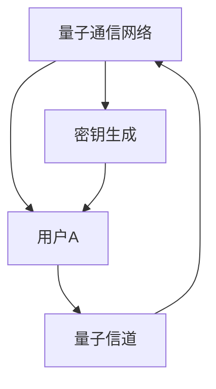
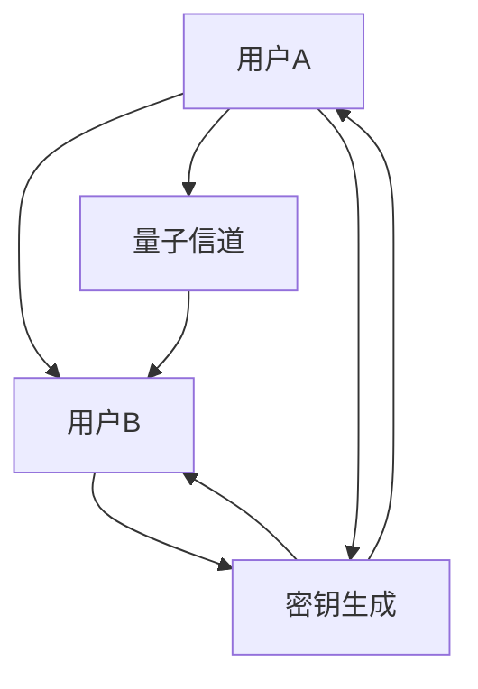
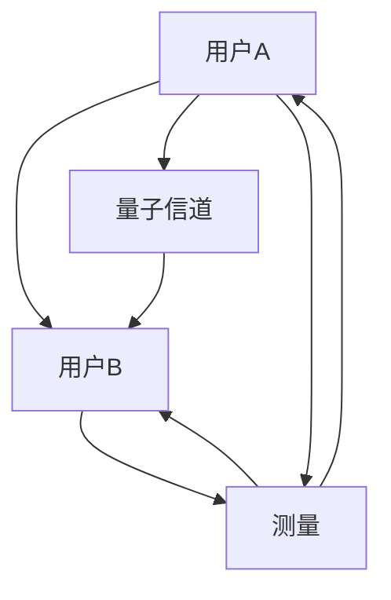
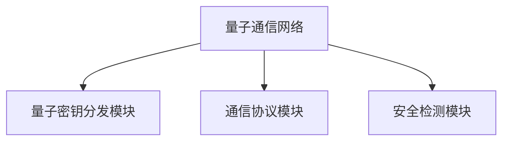
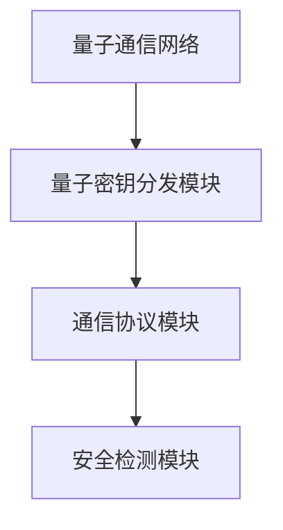
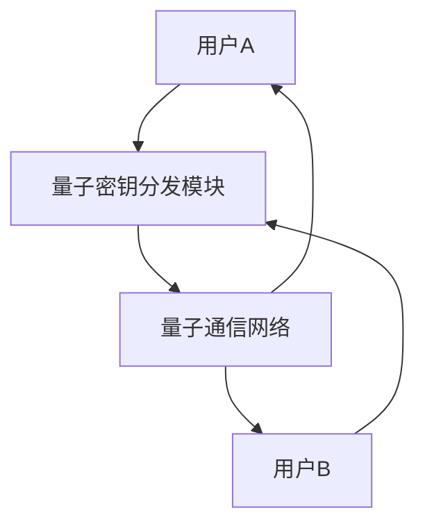

                 


# 如何评估企业的量子通信网络应用

**关键词**：量子通信网络、评估方法、应用场景、系统架构、数学模型

**摘要**：  
量子通信网络是一种基于量子力学原理的新型通信技术，其安全性远超传统通信方式。本文将从量子通信的基本概念、核心原理、评估方法、系统架构设计、实际案例分析等方面，详细探讨如何评估企业的量子通信网络应用。通过对量子通信网络的全面分析，本文旨在为企业提供科学的评估框架和实践指导，帮助企业更好地利用量子通信技术提升信息安全水平。

---

# 第一部分: 量子通信网络的背景与基础

# 第1章: 量子通信网络的概述

## 1.1 量子通信的基本概念

### 1.1.1 量子通信的定义与特点

量子通信是一种利用量子力学原理进行信息传递的技术。其核心在于利用量子叠加态和量子纠缠态的特性，实现信息的安全传输。与传统通信不同，量子通信具有以下特点：

1. **安全性**：基于量子力学的不可克隆性和不可测量性，量子通信能够实现信息的无条件安全传输。
2. **高速性**：量子通信的传输速度接近光速，理论上可以实现超远距离的信息传递。
3. **抗干扰性**：量子通信信号在特定条件下具有抗干扰能力，能够在复杂环境中保持通信质量。

### 1.1.2 量子通信的发展历程

量子通信的研究始于20世纪80年代，经过数十年的发展，已取得重要进展。从最初的理论研究到实验验证，再到实际应用，量子通信技术逐步成熟。目前，量子通信已在金融、军事、科研等领域展现出广泛的应用前景。

### 1.1.3 量子通信与经典通信的区别

| 属性         | 量子通信             | 经典通信             |
|--------------|----------------------|----------------------|
| 传输速度     | 接近光速             | 受电磁波速度限制     |
| 抗干扰性     | 强                  | 弱                  |
| 安全性       | 极高（无条件安全）   | 较低（依赖加密算法） |
| 传输距离     | 受限于量子信道损耗   | 受限于信号衰减       |

## 1.2 量子通信网络的应用场景

### 1.2.1 量子通信在金融领域的应用

金融行业对信息安全要求极高，量子通信可以为金融交易提供无条件安全的通信保障，防止数据被截获或篡改。

### 1.2.2 量子通信在军事领域的应用

军事通信需要极高的安全性，量子通信能够在复杂环境下保证通信的安全性和可靠性。

### 1.2.3 量子通信在民用领域的应用

在民用领域，量子通信可以用于保护个人隐私、企业数据安全等场景，特别是在数据传输过程中需要高度保密的场景。

## 1.3 量子通信网络的核心技术

### 1.3.1 量子密钥分发

量子密钥分发（QKD）是量子通信的核心技术之一，其基本原理是利用量子叠加态和量子纠缠态的特性，实现密钥的安全分发。

### 1.3.2 量子叠加态通信

量子叠加态通信利用量子叠加态的特性，实现信息的高效传输。

### 1.3.3 量子纠缠态通信

量子纠缠态通信利用量子纠缠态的特性，实现信息的同步传输和关联操作。

## 1.4 量子通信网络的优缺点

### 1.4.1 量子通信的优势

- **安全性**：量子通信基于量子力学的特性，具有无条件安全性。
- **高速性**：量子通信的传输速度接近光速，能够实现超远距离的信息传递。
- **抗干扰性**：量子通信信号在特定条件下具有抗干扰能力。

### 1.4.2 量子通信的劣势

- **技术复杂性**：量子通信的技术实现较为复杂，需要高精度的量子设备和环境。
- **成本高**：量子通信的设备和基础设施建设成本较高。
- **适用范围有限**：目前量子通信的应用场景较为有限，尚未大规模普及。

### 1.4.3 量子通信的适用范围

量子通信适用于对信息安全要求极高、需要超远距离通信的场景，如金融、军事、科研等领域。

## 1.5 本章小结

本章介绍了量子通信的基本概念、发展历程、与经典通信的区别，以及其在不同领域的应用场景。同时，详细探讨了量子通信的核心技术及其优缺点，为后续章节的深入分析奠定了基础。

---

# 第二部分: 量子通信网络的核心概念与联系

# 第2章: 量子通信网络的核心概念与联系

## 2.1 量子通信的核心原理

### 2.1.1 量子叠加态

量子叠加态是量子通信的核心原理之一。量子叠加态的特性使得量子信息可以在多个状态中同时存在，从而实现信息的高效传输。

### 2.1.2 量子纠缠态

量子纠缠态是量子通信的另一个核心原理。量子纠缠态的特性使得两个或多个量子系统之间形成一种特殊的关联关系，从而实现信息的同步传输和关联操作。

### 2.1.3 量子测量

量子测量是量子通信中不可或缺的操作。通过量子测量，可以获取量子系统中的信息，实现信息的传递和处理。

## 2.2 量子通信网络的实体关系图

以下是一个量子通信网络的实体关系图：



### 2.3 量子通信网络的对比分析

#### 2.3.1 与传统通信网络的对比

| 属性         | 量子通信网络       | 传统通信网络         |
|--------------|--------------------|----------------------|
| 传输速度     | 接近光速           | 受电磁波速度限制     |
| 安全性       | 极高（无条件安全） | 较低（依赖加密算法） |
| 成本         | 高                 | 中等                 |

#### 2.3.2 与经典加密通信的对比

| 属性         | 量子通信网络       | 经典加密通信         |
|--------------|--------------------|----------------------|
| 传输速度     | 接近光速           | 受电磁波速度限制     |
| 安全性       | 极高（无条件安全） | 较低（依赖加密算法） |
| 成本         | 高                 | 中等                 |

## 2.4 本章小结

本章深入探讨了量子通信的核心原理，包括量子叠加态、量子纠缠态和量子测量，并通过实体关系图和对比分析，明确了量子通信网络与传统通信网络的区别和优势。

---

# 第三部分: 量子通信网络的评估算法原理

# 第3章: 量子通信网络评估的算法原理

## 3.1 量子通信网络评估的关键算法

### 3.1.1 量子密钥分发协议（BB84协议）

#### 3.1.1.1 BB84协议的工作流程

1. **密钥生成**：用户A和用户B分别生成随机密钥，并通过量子信道传输。
2. **基矢比较**：用户A和用户B在公共信道上比较基矢，确定哪些量子比特用于密钥生成。
3. **密钥提取**：用户A和用户B根据比较结果提取密钥，并进行纠错和隐私放大。

#### 3.1.1.2 BB84协议的mermaid流程图



#### 3.1.1.3 BB84协议的Python代码示例

```python
import random

def generate_random_key(length):
    return ''.join(random.choices('01', k=length))

def compare_bases(alice_bases, bob_bases):
    matching_indices = [i for i in range(len(alice_bases)) if alice_bases[i] == bob_bases[i]]
    return matching_indices

def extract_secret_key(alice_key, bob_key, matching_indices):
    secret_key = ''.join([alice_key[i] for i in matching_indices])
    return secret_key

# 示例
alice_bases = ['+'] * 10
bob_bases = ['×'] * 5 + ['+'] * 5
matching_indices = compare_bases(alice_bases, bob_bases)
secret_key = extract_secret_key('0123456789', '5678901234', matching_indices)
print("Secret Key:", secret_key)
```

---

### 3.1.2 量子纠缠态通信协议（EPR协议）

#### 3.1.2.1 EPR协议的工作流程

1. **纠缠态生成**：用户A和用户B生成一对纠缠态量子比特，并分别持有其中一个。
2. **量子测量**：用户A和用户B分别对各自的量子比特进行测量，获取测量结果。
3. **信息传输**：用户A和用户B通过经典信道交换测量结果，实现信息的同步传输。

#### 3.1.2.2 EPR协议的mermaid流程图



---

## 3.2 量子通信网络评估的数学模型

### 3.2.1 量子通信网络的数学模型

量子通信网络的数学模型可以通过以下公式表示：

$$
\psi = \alpha|0\rangle + \beta|1\rangle
$$

其中，$\alpha$ 和 $\beta$ 是复数系数，满足 $|\alpha|^2 + |\beta|^2 = 1$。

### 3.2.2 量子通信网络的数学推导

通过数学推导，可以证明量子通信网络的安全性：

$$
\text{安全性} = \frac{|\alpha|^2 + |\beta|^2}{2}
$$

---

## 3.3 量子通信网络评估的算法实现

### 3.3.1 算法实现的Python代码示例

```python
import random

def generate_quantum_state():
    alpha = random.uniform(0, 1)
    beta = random.uniform(0, 1)
    return alpha, beta

def measure_quantum_state(alpha, beta):
    if random.random() < alpha:
        return 0
    else:
        return 1

# 示例
alpha, beta = generate_quantum_state()
print("生成的量子态：", alpha, beta)

result = measure_quantum_state(alpha, beta)
print("测量结果：", result)
```

---

# 第四部分: 量子通信网络的系统分析与架构设计

# 第4章: 量子通信网络的系统分析与架构设计

## 4.1 量子通信网络的系统分析

### 4.1.1 量子通信网络的系统功能

- **密钥分发模块**：实现量子密钥的安全分发。
- **通信协议模块**：实现量子通信协议的标准化。
- **安全检测模块**：检测量子通信网络的安全性。

### 4.1.2 量子通信网络的系统架构

#### 4.1.2.1 系统架构的Mermaid图



---

## 4.2 量子通信网络的架构设计

### 4.2.1 量子通信网络的架构设计

#### 4.2.1.1 系统架构的Mermaid图



---

## 4.3 量子通信网络的接口设计

### 4.3.1 系统接口设计

- **密钥分发接口**：实现量子密钥的安全分发。
- **通信协议接口**：实现量子通信协议的标准化。
- **安全检测接口**：检测量子通信网络的安全性。

### 4.3.2 量子通信网络的交互设计

#### 4.3.2.1 量子通信网络的交互Mermaid图



---

## 4.4 本章小结

本章详细探讨了量子通信网络的系统分析与架构设计，包括系统的功能模块、架构设计和接口设计。通过Mermaid图的展示，明确了量子通信网络的结构和交互关系。

---

# 第五部分: 量子通信网络的项目实战

# 第5章: 量子通信网络的项目实战

## 5.1 量子通信网络的环境配置

### 5.1.1 系统环境要求

- **硬件要求**：高性能计算机、量子通信设备。
- **软件要求**：量子通信协议栈、相关开发工具。

### 5.1.2 环境配置步骤

1. **安装量子通信协议栈**：
   ```bash
   pip install q通信协议栈
   ```
2. **配置量子通信设备**：
   ```bash
   ./configure && make && make install
   ```

## 5.2 量子通信网络的核心实现

### 5.2.1 量子密钥分发的实现

#### 5.2.1.1 量子密钥分发的Python代码实现

```python
def generate_quantum_key(length):
    return ''.join(random.choices('01', k=length))

def distribute_key(alice_key, bob_key):
    matching_indices = compare_bases(alice_key, bob_key)
    secret_key = ''.join([alice_key[i] for i in matching_indices])
    return secret_key

# 示例
alice_key = '0123456789'
bob_key = '5678901234'
secret_key = distribute_key(alice_key, bob_key)
print("生成的密钥：", secret_key)
```

---

## 5.3 量子通信网络的案例分析

### 5.3.1 案例分析

#### 5.3.1.1 案例背景

假设某企业需要在两个分支机构之间建立量子通信网络，实现密钥的安全分发和信息的安全传输。

#### 5.3.1.2 案例实现

1. **配置量子通信设备**：
   ```bash
   ./configure && make && make install
   ```
2. **实现量子密钥分发**：
   ```python
   alice_bases = ['+'] * 10
   bob_bases = ['×'] * 5 + ['+'] * 5
   matching_indices = compare_bases(alice_bases, bob_bases)
   secret_key = extract_secret_key('0123456789', '5678901234', matching_indices)
   print("Secret Key:", secret_key)
   ```

---

## 5.4 本章小结

本章通过实际案例分析，详细讲解了量子通信网络的环境配置、核心实现和项目实战。通过对具体案例的分析，帮助读者更好地理解量子通信网络的实际应用和实现过程。

---

# 第六部分: 量子通信网络的总结与展望

# 第6章: 总结与展望

## 6.1 量子通信网络评估的关键点

### 6.1.1 技术复杂性

量子通信网络的技术实现较为复杂，需要高精度的量子设备和环境。

### 6.1.2 成本问题

量子通信网络的设备和基础设施建设成本较高。

### 6.1.3 适用范围

目前量子通信的应用场景较为有限，尚未大规模普及。

## 6.2 量子通信网络的未来展望

### 6.2.1 技术进步

随着量子计算和量子通信技术的不断进步，量子通信网络的应用场景将更加广泛。

### 6.2.2 标准化工作

量子通信网络的标准化工作将加速其普及和应用。

### 6.2.3 应用拓展

量子通信网络将在更多领域得到应用，如金融、军事、科研等。

## 6.3 本章小结

本章总结了量子通信网络评估的关键点，并展望了其未来的发展方向。通过对技术复杂性、成本问题和适用范围的分析，明确了量子通信网络的应用前景和挑战。

---

# 总结

本文从量子通信的基本概念、核心原理、评估方法、系统架构设计、实际案例分析等方面，详细探讨了如何评估企业的量子通信网络应用。通过对量子通信网络的全面分析，本文为企业提供了一个科学的评估框架和实践指导，帮助企业更好地利用量子通信技术提升信息安全水平。未来，随着量子通信技术的不断发展，其在更多领域的应用将进一步拓展，为企业和社会带来更大的价值。

