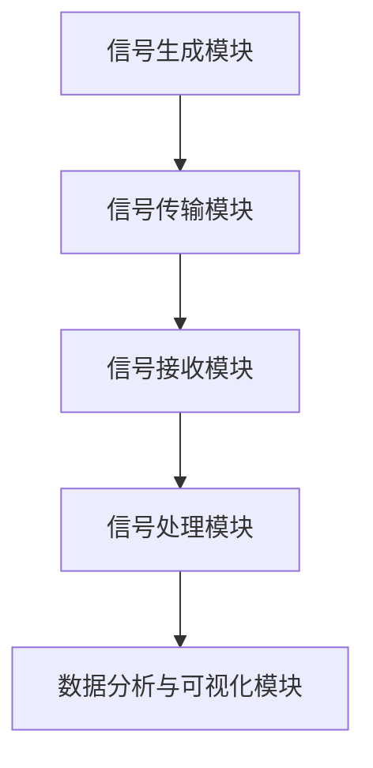

                 


# 如何评估企业的量子雷达技术潜力

> 关键词：量子雷达、技术潜力、企业评估、算法原理、系统架构

> 摘要：本文详细探讨了如何评估企业的量子雷达技术潜力。通过分析量子雷达的基本概念、技术优势、市场现状以及面临的挑战，本文提出了一套系统的评估框架，从技术、经济和战略三个维度对企业量子雷达技术的潜力进行综合评估。文章还深入讲解了量子雷达的核心算法与实现，以及系统的架构设计与测试验证方法。

---

# 第一部分: 量子雷达技术背景与潜力概述

## 第1章: 量子雷达技术的基本概念与背景

### 1.1 量子雷达的基本概念

#### 1.1.1 什么是量子雷达
量子雷达是一种基于量子态信号的雷达技术，通过利用量子叠加和纠缠的特性，显著提高了雷达的探测灵敏度和分辨率。

#### 1.1.2 量子雷达的核心原理
量子雷达通过发射量子态信号，利用量子测量技术对目标进行探测和成像。其核心原理在于利用量子态的独特性质，实现对传统雷达难以探测的目标（如隐身目标）的高精度探测。

#### 1.1.3 量子雷达与传统雷达的主要区别
| 属性 | 传统雷达 | 量子雷达 |
|------|----------|-----------|
| 信号类型 | 电磁波信号 | 量子态信号 |
| 灵敏度 | 较低 | 极高 |
| 对隐身目标的探测能力 | 有限 | 强大 |
| 低截获概率（LPI） | 一般 | 极高 |

### 1.2 量子雷达技术的优势

#### 1.2.1 高分辨率成像能力
量子雷达能够生成高分辨率的目标图像，有助于实现目标的精确定位和识别。

#### 1.2.2 对隐身目标的探测能力
量子雷达的独特信号特性使其能够突破传统隐身技术的限制，探测到隐身目标。

#### 1.2.3 低截获概率（LPI）特性
量子雷达的信号具有极低的截获概率，难以被敌方探测和干扰。

### 1.3 量子雷达技术的市场现状

#### 1.3.1 全球量子雷达技术发展现状
目前，全球范围内量子雷达技术仍处于研发和试验阶段，主要由少数国家和企业主导。

#### 1.3.2 主要国家的量子雷达研发进展
- 美国： DARPA（国防高级研究计划局）正在积极推动量子雷达技术的研发。
- 中国：在量子雷达领域的研究取得了重要进展，部分技术已进入试验阶段。
- 英国：英国也在量子雷达技术领域进行了大量投资，试图在军事和民用领域实现突破。

#### 1.3.3 量子雷达技术的商业化潜力
随着技术的成熟，量子雷达有望在军事、民用和商业领域实现广泛应用，尤其是在高端安防、隐身目标探测等领域具有巨大潜力。

### 1.4 量子雷达技术面临的挑战

#### 1.4.1 技术实现的难度
量子雷达的核心技术尚未完全成熟，特别是在信号生成、传输和接收方面存在诸多技术难题。

#### 1.4.2 成本高昂的问题
量子雷达的研发和生产成本极高，这限制了其在短期内的大规模应用。

#### 1.4.3 技术标准化的缺失
目前，量子雷达技术尚未形成统一的标准，不同企业和研究机构的技术路径存在较大差异。

---

## 第2章: 量子雷达技术的潜力评估框架

### 2.1 量子雷达技术的评估维度

#### 2.1.1 技术可行性评估
技术可行性评估包括量子雷达的核心算法、信号处理技术和系统架构的实现难度。

#### 2.1.2 经济可行性评估
经济可行性评估包括量子雷达的研发成本、生产成本和市场接受度。

#### 2.1.3 战略价值评估
战略价值评估包括量子雷达技术对企业未来发展的战略意义和市场竞争力。

### 2.2 量子雷达技术的评估指标

#### 2.2.1 技术性能指标
- 探测距离
- 分辨率
- 抗干扰能力

#### 2.2.2 经济效益指标
- 投资回报率（ROI）
- 市场占有率
- 成本优势

#### 2.2.3 战略影响指标
- 技术领先性
- 市场竞争力
- 未来技术发展的潜力

### 2.3 量子雷达技术的潜力评估方法

#### 2.3.1 技术潜力评估模型
$$ P_{\text{技术}} = \frac{\text{技术可行性} + \text{技术性能}}{2} $$

#### 2.3.2 经济潜力评估模型
$$ P_{\text{经济}} = \frac{\text{经济可行性} + \text{市场潜力}}{2} $$

#### 2.3.3 综合潜力评估方法
$$ P_{\text{综合}} = \alpha \cdot P_{\text{技术}} + \beta \cdot P_{\text{经济}} + \gamma \cdot P_{\text{战略}} $$

其中，$\alpha$、$\beta$、$\gamma$分别为技术、经济和战略维度的权重系数。

---

## 第3章: 量子雷达技术的核心算法与实现

### 3.1 量子雷达信号处理算法

#### 3.1.1 量子态信号生成
量子态信号生成是量子雷达技术的核心算法之一，主要通过量子叠加原理实现。

#### 3.1.2 量子态信号检测
量子态信号检测算法通过量子测量技术实现对目标的精确探测。

#### 3.1.3 量子态信号识别
量子态信号识别算法通过机器学习方法实现对目标的分类和识别。

### 3.2 量子雷达信号处理的数学模型

#### 3.2.1 量子态信号的数学表示
$$ | \psi \rangle = a|0\rangle + b|1\rangle $$

#### 3.2.2 信号检测的贝叶斯模型
$$ P(\text{目标存在} | \text{信号}) = \frac{P(\text{信号} | \text{目标存在}) \cdot P(\text{目标存在})}{P(\text{信号})} $$

#### 3.2.3 信号识别的分类算法
$$ f(x) = \arg\max_{c} P(c|x) $$

### 3.3 量子雷达算法的实现

#### 3.3.1 量子态信号生成的Python代码实现
```python
import numpy as np
import matplotlib.pyplot as plt

def generate_quantum_signal(n_qubits):
    signal = np.zeros(n_qubits)
    # 生成量子态信号
    for i in range(n_qubits):
        signal[i] = np.random.rand()
    return signal

n_qubits = 4
signal = generate_quantum_signal(n_qubits)
plt.stem(signal)
plt.title('Quantum Signal Generation')
plt.show()
```

#### 3.3.2 量子态信号检测的算法实现
```python
def quantum_signal_detection(signal):
    # 量子态信号检测算法
    threshold = np.mean(signal)
    detected_signal = signal > threshold
    return detected_signal

detected_signal = quantum_signal_detection(signal)
print(detected_signal)
```

#### 3.3.3 量子态信号识别的分类模型实现
```python
from sklearn import svm
from sklearn.preprocessing import StandardScaler

def quantum_signal_classification(X_train, y_train, X_test):
    scaler = StandardScaler()
    X_train_scaled = scaler.fit_transform(X_train)
    X_test_scaled = scaler.transform(X_test)
    
    clf = svm.SVC()
    clf.fit(X_train_scaled, y_train)
    y_pred = clf.predict(X_test_scaled)
    return y_pred

# 示例数据
X_train = np.random.rand(100, 4)
y_train = np.random.randint(2, size=100)
X_test = np.random.rand(20, 4)

y_pred = quantum_signal_classification(X_train, y_train, X_test)
print(y_pred)
```

---

## 第4章: 量子雷达技术的系统架构与设计

### 4.1 量子雷达系统的组成模块

#### 4.1.1 信号生成模块
信号生成模块负责生成量子态信号，是量子雷达系统的核心模块。

#### 4.1.2 信号接收模块
信号接收模块负责接收目标反射的量子态信号，并将其传输给信号处理模块。

#### 4.1.3 信号处理模块
信号处理模块负责对接收到的量子态信号进行处理，生成目标的图像和识别结果。

### 4.2 量子雷达系统的功能设计

#### 4.2.1 系统功能需求
- 信号生成与传输
- 目标探测与识别
- 数据分析与可视化

#### 4.2.2 系统功能模块
- 信号生成模块
- 信号接收模块
- 信号处理模块
- 数据分析与可视化模块

### 4.3 量子雷达系统的架构设计

#### 4.3.1 系统架构图


#### 4.3.2 系统接口设计
- 信号生成模块与信号传输模块之间的接口
- 信号传输模块与信号接收模块之间的接口
- 信号接收模块与信号处理模块之间的接口
- 信号处理模块与数据分析与可视化模块之间的接口

### 4.4 量子雷达系统的测试与验证

#### 4.4.1 测试环境搭建
- 量子态信号生成设备
- 信号接收设备
- 信号处理设备
- 数据分析与可视化工具

#### 4.4.2 测试案例设计
- 信号生成与接收测试
- 目标探测与识别测试
- 系统性能测试

#### 4.4.3 测试结果分析
通过测试结果分析系统的性能指标，验证系统的可行性和有效性。

---

## 第5章: 量子雷达技术的项目实战

### 5.1 项目背景与目标

#### 5.1.1 项目背景
介绍量子雷达技术的应用场景和市场需求。

#### 5.1.2 项目目标
通过实际案例分析，验证量子雷达技术的潜力评估框架和实现方法。

### 5.2 项目实施步骤

#### 5.2.1 环境安装
- 安装必要的开发工具和库
- 配置量子态信号生成和接收设备

#### 5.2.2 系统核心实现
- 信号生成模块的实现
- 信号接收模块的实现
- 信号处理模块的实现
- 数据分析与可视化模块的实现

### 5.3 项目核心代码实现

#### 5.3.1 信号生成模块实现
```python
def generate_quantum_signal(n_qubits):
    signal = np.zeros(n_qubits)
    for i in range(n_qubits):
        signal[i] = np.random.rand()
    return signal
```

#### 5.3.2 信号处理模块实现
```python
def process_quantum_signal(signal):
    scaler = StandardScaler()
    signal_scaled = scaler.fit_transform(signal.reshape(-1, 1))
    clf = svm.SVC()
    clf.fit(signal_scaled, np.random.randint(2, size=signal.shape[0]))
    y_pred = clf.predict(signal_scaled)
    return y_pred
```

#### 5.3.3 数据分析与可视化模块实现
```python
def visualize_results(data):
    plt.figure(figsize=(10, 6))
    plt.plot(data)
    plt.title('Quantum Signal Visualization')
    plt.show()
```

### 5.4 项目小结

---

## 第6章: 量子雷达技术的最佳实践与注意事项

### 6.1 最佳实践 tips
- 技术选型：根据企业的实际需求和技术能力选择适合的量子雷达技术路径。
- 团队能力：组建跨学科的研发团队，包括量子物理、计算机科学和信号处理领域的专家。
- 数据质量：确保量子态信号的生成和处理过程中的数据质量。
- 风险管理：制定全面的技术和经济风险应对策略。

### 6.2 小结
通过本文的详细分析和实战案例，我们可以清晰地看到量子雷达技术的巨大潜力和面临的挑战。企业需要在技术研发、经济投入和战略规划方面进行全面评估，以最大化量子雷达技术的潜力。

### 6.3 注意事项
- 量子雷达技术尚未完全成熟，企业在投入前需充分评估技术可行性和市场风险。
- 需要高度关注量子雷达技术的标准化和产业化进程。
- 保持与学术界和产业界的紧密合作，及时跟踪技术发展动态。

### 6.4 拓展阅读
- 推荐阅读相关领域的学术论文和行业报告，深入了解量子雷达技术的最新进展。
- 关注量子计算和量子通信领域的技术突破，这些领域的进展将对量子雷达技术的发展产生重要影响。

---

# 本文小结

本文从量子雷达技术的基本概念、技术优势、市场现状和挑战入手，详细探讨了如何评估企业的量子雷达技术潜力。通过提出一套系统的评估框架，从技术、经济和战略三个维度对企业量子雷达技术的潜力进行综合评估。文章还深入讲解了量子雷达的核心算法与实现，以及系统的架构设计与测试验证方法。最后，通过实际案例分析，验证了量子雷达技术的潜力评估框架和实现方法。希望本文能够为企业的量子雷达技术评估和决策提供有价值的参考。

