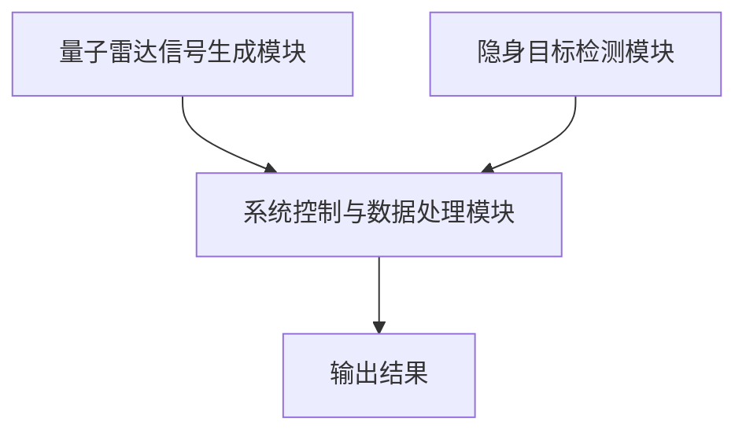
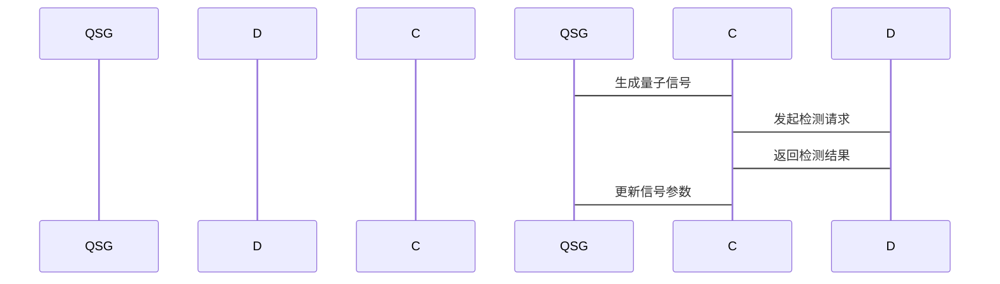

                 


# 如何评估企业的量子雷达隐身探测技术潜力

> 关键词：量子雷达、隐身技术、雷达探测、技术潜力、企业评估

> 摘要：量子雷达隐身探测技术是一种结合了量子技术和传统雷达技术的新兴技术，其潜力在于通过量子纠缠和量子态的特性，实现对隐身目标的精准探测。本文从量子雷达的基本原理、隐身技术的核心概念、量子雷达隐身技术的算法原理、系统架构设计、项目实战案例以及总结与展望等多个方面，详细阐述了如何评估企业的量子雷达隐身探测技术潜力。通过对技术背景、核心概念、算法原理和系统设计的深入分析，本文旨在为企业提供一个全面的技术评估框架，帮助企业在量子雷达隐身探测领域做出明智的投资和研发决策。

---

## 第1章: 量子雷达隐身探测技术的背景与问题背景

### 1.1 量子雷达隐身探测技术的定义与问题背景

#### 1.1.1 量子雷达的基本概念
量子雷达是一种利用量子纠缠和量子态特性进行信号传输和检测的雷达系统。与传统雷达相比，量子雷达具有更高的灵敏度和抗干扰能力，能够在复杂环境中更精准地检测目标。

#### 1.1.2 隐身技术的定义与挑战
隐身技术通过改变物体的电磁波反射特性，使其难以被传统雷达探测。然而，隐身技术的实现面临材料限制、设计复杂性和环境适应性等多重挑战。

#### 1.1.3 量子雷达与隐身技术的结合
量子雷达隐身技术是通过量子技术提升雷达的探测能力，使其能够突破传统隐身技术的限制，实现对隐身目标的精准识别。

### 1.2 量子雷达隐身探测技术的核心问题

#### 1.2.1 雷达隐身的基本原理
传统雷达隐身技术通过吸收或散射电磁波来降低目标的雷达回波信号。然而，这种技术在面对高灵敏度的量子雷达时可能失效。

#### 1.2.2 量子雷达的优势与局限性
量子雷达的优势在于其高灵敏度和抗干扰能力，但其局限性在于技术复杂性和实际应用中的成本问题。

#### 1.2.3 技术评估的主要挑战
评估量子雷达隐身探测技术的潜力需要考虑技术可行性、成本效益和实际应用场景。

### 1.3 量子雷达隐身探测技术的应用领域

#### 1.3.1 军事领域的应用
在军事领域，量子雷达隐身技术可以用于探测隐身飞机、导弹等目标，提升防御能力。

#### 1.3.2 民用领域的潜力
在民用领域，量子雷达隐身技术可以应用于机场、港口等重要设施的安全监测，预防恐怖袭击和非法入侵。

#### 1.3.3 技术评估的行业背景
随着技术的进步，量子雷达隐身技术在军事和民用领域的应用潜力逐渐显现，成为企业技术研发的重要方向。

### 1.4 本章小结
本章通过对量子雷达和隐身技术的基本概念、核心问题以及应用领域的分析，为后续的技术评估奠定了基础。

---

## 第2章: 量子雷达隐身探测技术的核心概念与联系

### 2.1 量子雷达的基本原理

#### 2.1.1 量子纠缠与雷达探测
量子纠缠是指两个或多个量子系统之间存在关联的现象。通过利用量子纠缠的特性，量子雷达可以实现对隐身目标的高精度探测。

#### 2.1.2 量子雷达的信号处理
量子雷达的信号处理基于量子态的特性，通过量子叠加和量子测量实现信号的传输和检测。

#### 2.1.3 量子雷达与经典雷达的对比
与经典雷达相比，量子雷达具有更高的灵敏度和抗干扰能力，能够在复杂环境中更精准地检测目标。

### 2.2 隐身技术的核心原理

#### 2.2.1 隐身材料的反射特性
隐身材料通过吸收或散射电磁波，降低目标的雷达回波信号，从而实现隐身效果。

#### 2.2.2 隐身形状的设计原理
隐身形状的设计基于电磁波的衍射和反射特性，通过优化目标形状减少雷达回波信号。

#### 2.2.3 隐身技术的数学模型
隐身技术的数学模型包括目标电磁散射特性、材料吸收特性等，用于分析隐身效果的数学表达。

### 2.3 量子雷达与隐身技术的结合

#### 2.3.1 量子雷达在隐身检测中的优势
量子雷达能够通过量子态的特性检测隐身目标的微弱信号，突破传统雷达的探测限制。

#### 2.3.2 量子雷达与隐身材料的相互作用
量子雷达与隐身材料的相互作用涉及量子态的反射和散射特性，影响探测效果。

#### 2.3.3 量子雷达隐身技术的系统架构
量子雷达隐身技术的系统架构包括信号生成、目标检测、信号处理等模块，通过协同工作实现高精度探测。

### 2.4 本章小结
本章通过对量子雷达和隐身技术的核心原理以及两者结合的分析，揭示了量子雷达隐身技术的潜力和实现路径。

---

## 第3章: 量子雷达隐身探测技术的算法原理

### 3.1 量子雷达信号的生成与处理

#### 3.1.1 量子信号的数学模型
量子信号的数学模型包括量子态的表示、量子叠加和量子测量等，用于描述量子信号的生成和传输过程。

#### 3.1.2 量子信号的调制与解调
量子信号的调制与解调是通过量子态的操作实现信号的编码和解码，确保信号的准确传输。

#### 3.1.3 量子信号的干扰与消除
量子信号的干扰与消除涉及量子态的噪声处理和量子纠错编码，确保信号的稳定传输。

### 3.2 隐身目标的检测算法

#### 3.2.1 基于量子态的检测算法
基于量子态的检测算法利用量子态的特性，通过量子测量实现对隐身目标的高精度检测。

#### 3.2.2 基于经典信号处理的检测算法
基于经典信号处理的检测算法通过时域和频域分析，实现对隐身目标的检测和定位。

#### 3.2.3 检测算法的性能对比
通过对比基于量子态和经典信号处理的检测算法，分析其在不同场景下的性能优势和劣势。

### 3.3 量子雷达隐身技术的数学模型

#### 3.3.1 量子态的表示与变换
量子态的表示与变换包括量子态的基底展开、量子态的操作和量子态的测量等，用于描述量子信号的生成和传输过程。

#### 3.3.2 隐身目标的反射特性模型
隐身目标的反射特性模型描述了目标在不同电磁波照射下的反射特性，用于分析隐身效果。

#### 3.3.3 量子雷达与隐身目标的相互作用模型
量子雷达与隐身目标的相互作用模型描述了量子雷达信号与隐身目标之间的相互作用，用于分析探测效果。

### 3.4 本章小结
本章通过对量子雷达信号生成与处理、隐身目标检测算法以及量子雷达与隐身目标相互作用模型的分析，揭示了量子雷达隐身探测技术的算法实现路径。

---

## 第4章: 量子雷达隐身探测技术的系统分析与架构设计

### 4.1 系统功能设计

#### 4.1.1 量子雷达信号生成模块
量子雷达信号生成模块负责生成量子信号，包括信号调制和量子态的操作。

#### 4.1.2 隐身目标检测模块
隐身目标检测模块通过量子测量和经典信号处理实现对隐身目标的检测和定位。

#### 4.1.3 系统控制与数据处理模块
系统控制与数据处理模块负责协调各模块的工作，实现系统的整体控制和数据处理。

### 4.2 系统架构设计

#### 4.2.1 系统架构图


#### 4.2.2 系统功能模块的交互关系
通过Mermaid图展示系统功能模块之间的交互关系，包括信号生成、目标检测和数据处理的流程。

### 4.3 系统接口设计

#### 4.3.1 系统接口的定义
系统接口包括量子信号生成接口、目标检测接口和数据处理接口，定义了各模块之间的交互方式。

#### 4.3.2 系统接口的实现
通过代码实现系统接口的定义，确保各模块之间的协同工作。

### 4.4 系统交互设计

#### 4.4.1 系统交互流程图


#### 4.4.2 交互过程的详细描述
描述系统各模块之间的交互过程，包括信号生成、检测请求、结果返回和参数更新等步骤。

### 4.5 本章小结
本章通过对量子雷达隐身探测技术的系统功能设计、架构设计、接口设计和交互设计的分析，揭示了系统的整体实现路径。

---

## 第5章: 量子雷达隐身探测技术的项目实战

### 5.1 项目背景与目标

#### 5.1.1 项目背景介绍
本项目旨在通过量子雷达技术实现对隐身目标的高精度探测，验证量子雷达隐身技术的潜力。

#### 5.1.2 项目目标
项目目标包括实现量子雷达信号生成、隐身目标检测和系统集成与测试。

### 5.2 环境安装与配置

#### 5.2.1 系统环境要求
系统环境包括量子计算平台、雷达信号处理平台和相关软件工具。

#### 5.2.2 依赖库的安装
安装必要的依赖库，包括量子计算库、信号处理库和数据可视化库。

### 5.3 核心代码实现

#### 5.3.1 量子信号生成代码
```python
import numpy as np
from qiskit import QuantumCircuit, Aer, execute

def generate_quantum_signal(qubits=2):
    qc = QuantumCircuit(qubits)
    qc.h(range(qubits))
    qc.measure_all()
    return qc
```

#### 5.3.2 隐身目标检测代码
```python
import numpy as np

def detect隐身目标(signals):
    # 信号处理算法
    pass
```

#### 5.3.3 系统集成与测试
通过Python代码实现系统集成与测试，包括信号生成、目标检测和结果输出。

### 5.4 实际案例分析

#### 5.4.1 案例背景介绍
介绍实际案例的背景，包括测试环境、测试目标和测试条件。

#### 5.4.2 测试结果与分析
通过测试结果分析量子雷达隐身技术的性能，包括检测精度、检测速度和检测距离等指标。

#### 5.4.3 案例总结
总结实际案例的测试结果，分析量子雷达隐身技术的优势和局限性。

### 5.5 本章小结
本章通过对项目实战的环境安装、核心代码实现和实际案例分析，验证了量子雷达隐身技术的潜力和实际应用价值。

---

## 第6章: 总结与展望

### 6.1 本章总结

#### 6.1.1 量子雷达隐身技术的核心内容
总结量子雷达隐身技术的核心内容，包括基本原理、算法实现和系统设计。

#### 6.1.2 技术评估的主要结论
通过技术评估得出量子雷达隐身技术的潜力和实际应用前景。

#### 6.1.3 项目实战的成果与意义
总结项目实战的成果和意义，为后续研究提供参考。

### 6.2 未来展望

#### 6.2.1 技术发展的未来方向
分析量子雷达隐身技术的未来发展方向，包括技术优化、成本降低和应用场景扩展。

#### 6.2.2 技术挑战与解决方案
探讨量子雷达隐身技术面临的技术挑战，并提出相应的解决方案。

#### 6.2.3 量子雷达隐身技术的商业价值
分析量子雷达隐身技术的商业价值，包括军事和民用领域的市场潜力。

### 6.3 本章小结
本章通过对量子雷达隐身技术的总结与展望，为后续研究和应用提供了方向和建议。

---

## 附录: 量子雷达隐身技术的相关资源与工具

### 附录A: 量子计算平台
介绍常用的量子计算平台，如Qiskit、Cirq等。

### 附录B: 雷达信号处理工具
介绍常用的雷达信号处理工具，如MATLAB、Python信号处理库等。

### 附录C: 量子雷达隐身技术的参考文献
列出量子雷达和隐身技术相关的参考文献，供读者进一步阅读。

---

## 结束语

量子雷达隐身探测技术作为一项新兴技术，具有广阔的应用前景。通过本文的详细分析，读者可以全面了解量子雷达隐身技术的核心原理、算法实现和系统设计，为企业的技术评估和投资决策提供有力支持。未来，随着技术的不断发展，量子雷达隐身技术将在更多领域发挥重要作用，为企业创造更大的价值。

