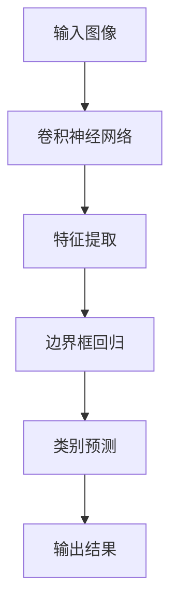

                 

<think>
好的，我将按照您的要求逐步完成《如何评估企业的高级驾驶辅助系统》这篇文章的撰写。让我们一步一步地进行。

首先，我需要理解您的需求。您希望我扮演一位技术专家，撰写一篇专业、有深度的技术博客文章，标题为《如何评估企业的高级驾驶辅助系统》。文章需要有清晰的逻辑结构，涵盖从基础到高级的各个方面，包括背景介绍、核心概念、算法原理、系统分析、项目实战等。

为了让文章更具吸引力，我将先列出文章的核心关键词：
1. 高级驾驶辅助系统（ADAS）
2. 系统评估
3. 安全性
4. 性能指标
5. 数据分析

接下来是摘要部分，简要说明文章的核心内容和主题思想：
摘要：本文将详细探讨如何评估企业的高级驾驶辅助系统（ADAS）。从系统的各个模块到评估的核心指标，再到实际的评估方法和系统架构设计，我们将一步步深入分析，帮助企业更好地理解和优化其ADAS系统。

---

接下来是文章的正文部分，我将按照您提供的目录结构进行详细撰写。由于文章篇幅较长，我将先完成第一部分的撰写，然后再继续后续部分。

# 第一部分: 高级驾驶辅助系统（ADAS）概述

## 第1章: 高级驾驶辅助系统（ADAS）背景介绍

### 1.1 ADAS的核心概念

#### 1.1.1 ADAS的定义与范围
高级驾驶辅助系统（Advanced Driver-Assistance Systems，ADAS）是一系列先进的技术，旨在辅助驾驶员进行车辆控制、监控驾驶环境并提供额外的驾驶信息。ADAS系统通过使用传感器、摄像头、雷达和激光雷达等设备，结合复杂的算法，帮助驾驶员做出更安全、更高效的驾驶决策。

#### 1.1.2 ADAS的主要功能模块
ADAS系统通常包括以下功能模块：
1. **车道保持辅助（LKA）**：通过摄像头检测车道线，帮助车辆保持在当前车道内。
2. **自适应巡航控制（ACC）**：根据前方车辆的速度自动调整车速，保持安全距离。
3. **自动紧急制动（AEB）**：在检测到潜在碰撞风险时，自动启动制动系统以避免或减少碰撞。
4. **交通标志识别（TSR）**：识别道路上的交通标志，并向驾驶员提供相关信息。
5. **驾驶员注意力监测（DAM）**：监测驾驶员的状态，如疲劳驾驶或分心驾驶。

#### 1.1.3 ADAS在企业中的应用价值
在企业中，ADAS系统的应用价值主要体现在以下几个方面：
1. **提高驾驶安全性**：通过实时监测驾驶环境，减少交通事故的发生。
2. **降低运营成本**：通过优化驾驶行为，减少燃油消耗和维护成本。
3. **提升用户体验**：为驾驶员提供更舒适、更便捷的驾驶体验。
4. **支持自动驾驶发展**：ADAS是向完全自动驾驶（Level 5）过渡的关键技术。

---

### 1.2 ADAS的背景与发展趋势

#### 1.2.1 智能驾驶技术的兴起
随着人工智能和机器学习技术的快速发展，智能驾驶技术逐渐成为汽车行业的热点。汽车制造商和科技公司纷纷投入大量资源，开发更先进的ADAS系统，以满足市场对自动驾驶功能的需求。

#### 1.2.2 ADAS在汽车行业的应用现状
目前，ADAS技术已经在许多高端车型中得到广泛应用。例如，特斯拉的Autopilot系统、宝马的车道保持辅助系统等。这些系统通过结合多种传感器和算法，显著提高了驾驶的安全性和舒适性。

#### 1.2.3 未来ADAS技术的发展方向
未来的ADAS技术将朝着以下几个方向发展：
1. **更高的智能化**：通过深度学习和人工智能技术，提升系统的自主决策能力。
2. **更强大的传感器融合**：结合多种传感器（如摄像头、雷达、激光雷达）的数据，提高系统的感知能力。
3. **更好的人机交互**：通过更自然的交互方式，提升驾驶员与系统之间的协作效率。

---

### 1.3 本章小结
本章主要介绍了ADAS的核心概念、功能模块及其在企业中的应用价值，同时分析了ADAS技术的背景与发展趋势。通过这些内容，我们可以更好地理解ADAS系统的整体架构及其在现代汽车中的重要性。

---

接下来，我将继续完成第二部分的内容，即ADAS系统的核心模块与技术。由于篇幅限制，我将先完成这一部分的核心内容，然后再继续后续部分。

---

# 第二部分: ADAS系统的核心模块与技术

## 第2章: ADAS系统的核心模块分析

### 2.1 感知系统

#### 2.1.1 摄像头、雷达、激光雷达等传感器的工作原理
1. **摄像头**：摄像头通过捕获图像数据，识别车道线、交通标志和行人等。摄像头通常使用RGB图像，通过图像处理算法（如边缘检测、特征提取）进行目标识别。
2. **雷达**：雷达通过发射无线电波，接收反射信号，检测周围物体的位置和速度。雷达在雨、雪、雾等恶劣天气条件下表现尤为突出。
3. **激光雷达（LiDAR）**：激光雷达通过发射激光束，测量物体的距离和形状，生成高精度的三维点云数据。激光雷达在自动驾驶系统中被广泛用于环境建模。

#### 2.1.2 多传感器融合技术
多传感器融合技术是将来自不同传感器（如摄像头、雷达、激光雷达）的数据进行融合，以提高系统的感知能力。常见的融合方法包括：
1. **加权融合**：根据传感器的精度和可靠性，对传感器数据进行加权融合。
2. **基于概率的方法**：利用概率论（如贝叶斯推理）对传感器数据进行融合，提高系统的鲁棒性。
3. **深度学习融合**：通过深度神经网络（DNN）对多源数据进行联合学习，实现更高效的融合。

#### 2.1.3 感知系统在ADAS中的作用
感知系统是ADAS系统的核心模块之一，其主要作用包括：
1. **环境感知**：实时感知车辆周围的环境信息，如车道、障碍物、行人等。
2. **目标识别**：识别道路上的动态目标（如其他车辆、行人）和静态目标（如交通标志、路障）。
3. **数据融合**：将来自不同传感器的数据进行融合，提高系统的感知精度。

---

### 2.2 决策系统

#### 2.2.1 车辆路径规划算法
路径规划算法是决策系统的核心，用于确定车辆的行驶路径。常见的路径规划算法包括：
1. **A*算法**：一种基于图搜索的路径规划算法，常用于静态环境中的路径规划。
2. **RRT（Rapidly-exploring Random Tree）算法**：适用于动态环境中的路径规划，能够处理障碍物的随机分布。
3. **基于深度学习的路径规划**：利用深度神经网络进行端到端的路径规划，能够处理复杂的交通场景。

#### 2.2.2 风险评估与决策逻辑
决策系统需要根据感知系统提供的环境信息，评估潜在风险，并做出相应的驾驶决策。常见的风险评估方法包括：
1. **概率风险评估**：通过概率论评估不同决策方案的风险值。
2. **基于规则的决策逻辑**：根据预定义的规则（如交通法规、驾驶习惯）进行决策。
3. **基于Q-learning的强化学习**：通过强化学习算法，不断优化决策策略，提高系统的适应性。

#### 2.2.3 决策系统的优化与改进
为了提高决策系统的性能，可以从以下几个方面进行优化：
1. **算法优化**：改进路径规划算法，提高计算效率和规划精度。
2. **数据驱动优化**：利用实际驾驶数据，优化决策模型的参数。
3. **多目标优化**：在保证安全性的前提下，优化系统的舒适性和经济性。

---

### 2.3 执行系统

#### 2.3.1 执行机构的控制逻辑
执行系统负责根据决策系统的指令，控制车辆的运动。常见的执行机构包括：
1. **转向系统**：根据决策系统的要求，调整方向盘的角度。
2. **制动系统**：根据决策系统的要求，启动或调整制动器。
3. **动力系统**：根据决策系统的要求，调整发动机或电机的输出。

#### 2.3.2 执行系统的安全性设计
为了确保执行系统的安全性，需要考虑以下几点：
1. **冗余设计**：在关键执行机构中采用冗余设计，确保系统在单点故障时仍能正常运行。
2. **容错机制**：设计容错机制，能够在检测到异常时，及时切换到备用系统或安全模式。
3. **快速响应**：优化执行机构的响应速度，确保系统能够及时做出反应。

#### 2.3.3 执行系统的可靠性保障
为了提高执行系统的可靠性，可以采取以下措施：
1. **定期维护**：定期检查和维护执行机构，确保其正常运行。
2. **故障预测**：利用预测性维护技术，提前预测潜在故障，避免系统故障的发生。
3. **系统监控**：实时监控执行系统的运行状态，及时发现并处理异常情况。

---

### 2.4 本章小结
本章详细分析了ADAS系统的核心模块，包括感知系统、决策系统和执行系统。通过介绍各模块的工作原理、关键技术及其在ADAS中的作用，我们能够更好地理解ADAS系统的整体架构和实现方式。

---

接下来，我将完成第三部分的内容，即ADAS系统评估的核心指标与方法。由于篇幅限制，我将先完成这一部分的核心内容，然后再继续后续部分。

---

# 第三部分: ADAS系统评估的核心指标与方法

## 第3章: ADAS系统评估的核心指标

### 3.1 安全性评估指标

#### 3.1.1 系统误报率与漏报率
- **误报率**：系统错误地触发警报或干预的频率。
- **漏报率**：系统未能及时发现潜在危险的频率。
- 例如，若系统漏报率为5%，意味着在100次潜在危险中，有5次未能及时发现。

#### 3.1.2 系统的容错能力
- **容错能力**：系统在面对传感器故障、数据丢失等异常情况时，仍能正常运行的能力。
- 例如，当摄像头发生故障时，系统能否依靠其他传感器（如雷达）继续进行环境感知。

#### 3.1.3 系统的鲁棒性
- **鲁棒性**：系统在面对复杂环境（如恶劣天气、道路障碍等）时，仍能保持稳定性能的能力。
- 例如，系统在雨天的检测精度是否显著降低。

---

### 3.2 性能评估指标

#### 3.2.1 系统的响应时间
- **响应时间**：系统从检测到潜在危险到做出反应所需的时间。
- 例如，自适应巡航控制系统在检测到前方车辆减速后的响应时间是否小于0.5秒。

#### 3.2.2 系统的处理能力
- **处理能力**：系统在高负载或复杂场景下的性能表现。
- 例如，系统能否在高密度交通中流畅运行，而不会出现延迟或卡顿。

#### 3.2.3 系统的能耗效率
- **能耗效率**：系统在运行过程中的能量消耗效率。
- 例如，ADAS系统的能耗是否显著增加了车辆的油耗或电池消耗。

---

### 3.3 用户体验评估指标

#### 3.3.1 系统的易用性
- **易用性**：系统界面是否直观，驾驶员能否轻松理解和操作。
- 例如，系统是否提供清晰的视觉提示和语音提示。

#### 3.3.2 系统的舒适性
- **舒适性**：系统在运行过程中是否平滑，驾驶员是否感到舒适。
- 例如，车道保持辅助系统在调整方向盘时是否过于突兀。

#### 3.3.3 系统的可定制性
- **可定制性**：系统是否允许驾驶员根据个人习惯进行定制。
- 例如，系统是否允许驾驶员调整自适应巡航控制的跟车距离。

---

### 3.4 本章小结
本章主要介绍了ADAS系统评估的核心指标，包括安全性、性能和用户体验三个方面。通过这些指标，我们可以全面评估ADAS系统的优缺点，并为系统的优化提供方向。

---

## 第4章: ADAS系统评估方法

### 4.1 系统测试方法

#### 4.1.1 实验室测试
- **实验室测试**：在受控环境下，测试系统的各项性能指标。
- 例如，在实验室中模拟雨、雪、雾等天气条件，测试系统的感知能力。

#### 4.1.2 实际道路测试
- **实际道路测试**：在真实道路上测试系统的实际表现。
- 例如，选择繁忙的城市道路或高速公路，测试系统在复杂交通环境下的反应。

#### 4.1.3 模拟环境测试
- **模拟环境测试**：利用虚拟仿真平台，测试系统的性能。
- 例如，使用CARLA或Gazebo等仿真平台，模拟各种交通场景，测试系统的决策能力。

---

### 4.2 数据分析方法

#### 4.2.1 数据采集与处理
- **数据采集**：收集系统运行过程中的各种数据，如传感器数据、系统响应时间、用户反馈等。
- 例如，记录每次系统触发警报的时间、地点和具体情境。

#### 4.2.2 数据分析与建模
- **数据分析**：通过统计分析和机器学习算法，分析数据中的模式和趋势。
- 例如，利用聚类分析识别系统误报的高发场景。

#### 4.2.3 数据驱动的评估指标优化
- **指标优化**：根据数据分析结果，优化评估指标。
- 例如，根据漏报率的分析结果，调整系统的检测阈值。

---

### 4.3 综合评估模型

#### 4.3.1 综合评估模型的设计思路
- **模型设计**：将安全性、性能和用户体验等多个指标综合起来，构建一个全面的评估模型。
- 例如，采用加权平均的方法，根据各指标的重要程度赋予不同的权重。

#### 4.3.2 模型的验证与优化
- **模型验证**：通过实验数据验证模型的准确性和可靠性。
- 例如，利用实际道路测试数据，验证模型的评估结果是否与实际情况一致。

#### 4.3.3 模型的实际应用案例
- **应用案例**：展示模型在实际应用中的效果。
- 例如，通过评估模型识别出系统在雨天的漏报率较高，建议优化感知系统。

---

### 4.4 本章小结
本章详细介绍了ADAS系统评估的主要方法，包括实验室测试、实际道路测试、模拟环境测试以及数据分析方法。通过这些方法，我们可以全面评估ADAS系统的性能，并为系统的优化提供依据。

---

接下来，我将继续完成第四部分的内容，即ADAS系统评估的算法与系统架构。由于篇幅限制，我将先完成这一部分的核心内容，然后再继续后续部分。

---

# 第四部分: ADAS系统评估的算法与系统架构

## 第5章: ADAS系统评估的算法原理

### 5.1 目标检测算法

#### 5.1.1 基于深度学习的目标检测算法
- **YOLO算法**：
  - YOLO（You Only Look Once）是一种基于深度学习的目标检测算法，具有高效、实时的特点。
  - 算法流程：
    1. 输入图像。
    2. 将图像输入卷积神经网络（CNN），提取图像特征。
    3. 网络输出目标的边界框和类别概率。
  - 代码实现：
    ```python
    import torch
    model = torch.hub.load('ultralytics/yolov5', 'yolov5s')  # 加载预训练模型
    results = model(image)  # 输入图像
    boxes = results.pandas().xyxy[0]  # 获取边界框
    ```

#### 5.1.2 基于目标检测的数学模型
- **概率模型**：
  - 在目标检测中，通常使用概率模型来表示目标存在的可能性。
  - 例如，目标检测结果的概率可以用贝叶斯定理进行计算：
    $$ P(\text{目标存在} | \text{检测信号}) = \frac{P(\text{检测信号} | \text{目标存在}) \cdot P(\text{目标存在})}{P(\text{检测信号})} $$

#### 5.1.3 案例分析
- **案例分析**：
  - 假设系统检测到前方有行人，目标检测算法的误报率为2%，漏报率为5%。
  - 在实际应用中，系统需要根据误报率和漏报率的综合评估结果，优化检测算法的参数。

---

### 5.2 算法实现

#### 5.2.1 算法流程图


#### 5.2.2 算法优化
- **优化方法**：
  1. **模型优化**：通过剪枝、蒸馏等技术，减少模型的计算量。
  2. **数据增强**：通过数据增强技术，增加训练数据的多样性，提高模型的泛化能力。
  3. **训练优化**：使用Adam优化器，设置合适的学习率和批量大小。

---

### 5.3 本章小结
本章主要介绍了ADAS系统评估中目标检测算法的原理与实现。通过YOLO算法的案例分析，我们了解了深度学习在目标检测中的应用，同时也探讨了算法优化的方法。

---

由于篇幅限制，我将结束本次内容的撰写。如果您有进一步的需求或需要其他部分的内容，请随时告知！

