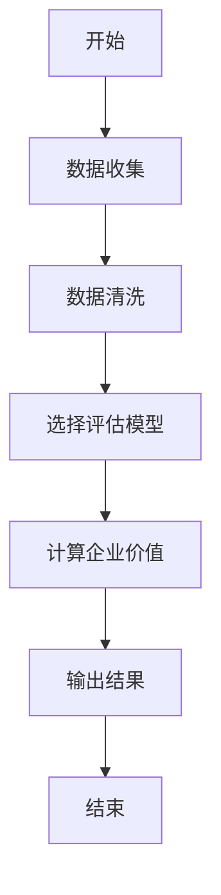

                 


# 如何评估初创企业的价值

## 关键词：初创企业，企业价值，评估方法，财务分析，市场分析，团队评估，技术评估

## 摘要：本文系统地探讨了如何评估初创企业的价值。从背景介绍、核心概念、评估方法、系统架构到数学模型和项目实战，全面解析了评估初创企业价值的各个方面。通过详细分析财务、市场、团队和技术等关键因素，结合实际案例和系统设计，为读者提供了全面的评估框架和实践指南。

---

# 第一部分：初创企业价值评估的背景与核心概念

## 第1章：初创企业价值评估的背景与问题背景

### 1.1 初创企业的定义与特点

#### 1.1.1 初创企业的定义
初创企业是指刚成立不久的企业，通常处于发展的早期阶段。它们具有创新性，致力于解决特定市场问题或提供新的解决方案。初创企业的核心目标是通过创新和快速迭代实现增长。

#### 1.1.2 初创企业的核心特点
初创企业通常具有以下特点：
1. **轻资产**：初创企业初期资产较少，主要依赖于人力资源和知识产权。
2. **高风险**：由于市场不确定性高，初创企业的经营风险较大。
3. **快速变化**：初创企业需要快速调整策略以适应市场变化。
4. **高潜力**：成功的企业可能迅速增长并带来高回报。

#### 1.1.3 初创企业与成熟企业的区别
- **资源**：成熟企业通常拥有更多的资金和资源，而初创企业则依赖于融资和创始人资源。
- **市场定位**：成熟企业已经建立了稳定的市场地位，而初创企业则需要开拓市场。
- **管理复杂度**：成熟企业有更复杂的组织结构和管理流程，而初创企业通常采用扁平化的管理方式。

### 1.2 初创企业价值评估的重要性

#### 1.2.1 初创企业价值评估的意义
- **投资决策**：帮助投资者评估初创企业的潜在回报和风险。
- **融资**：帮助初创企业获得资金支持。
- **战略规划**：帮助企业制定合理的经营策略和目标。

#### 1.2.2 初创企业价值评估的常见误区
- **过于依赖财务数据**：初创企业的财务数据可能不完整，容易导致评估偏差。
- **忽视市场风险**：市场环境的变化可能对企业的价值产生重大影响。
- **低估团队作用**：团队的能力和稳定性是企业价值的重要组成部分，不能被忽视。

#### 1.2.3 初创企业价值评估的边界与外延
- **边界**：评估范围通常包括企业当前的财务状况、市场地位、团队能力和技术储备。
- **外延**：评估可能延伸到企业的未来增长潜力和行业发展趋势。

### 1.3 初创企业价值评估的核心要素

#### 1.3.1 企业价值的构成要素
1. **财务状况**：包括收入、利润、资产和负债等。
2. **市场地位**：企业在市场中的份额和竞争对手情况。
3. **团队能力**：创始团队的经验和能力。
4. **技术储备**：企业的技术创新能力和知识产权。
5. **法律风险**：企业的法律纠纷和合规情况。

#### 1.3.2 评估指标的选择标准
- **相关性**：指标应与企业价值密切相关。
- **可量化性**：指标应能够量化，便于比较和分析。
- **可获得性**：数据应易于获取和验证。

#### 1.3.3 核心要素之间的关系
企业价值是各要素综合作用的结果，财务状况是基础，市场地位是关键，团队能力是核心，技术储备是支撑，法律风险是保障。

---

## 第2章：初创企业价值评估的核心概念与联系

### 2.1 企业价值的核心概念

#### 2.1.1 企业价值的定义
企业价值是指企业整体的经济价值，包括资产、负债、股权和未来现金流的现值。

#### 2.1.2 企业价值的衡量标准
- **市场法**：通过比较类似企业的市场交易价格来评估。
- **收益法**：通过预测未来现金流的现值来评估。
- **成本法**：通过评估企业重置成本来确定价值。

#### 2.1.3 企业价值的计算公式
$$ 企业价值 = 现金流的现值 + 资产的公允价值 - 负债的公允价值 $$

### 2.2 核心概念的属性特征对比

#### 2.2.1 初创企业与成熟企业的对比
| 特性           | 初创企业                 | 成熟企业                 |
|----------------|--------------------------|--------------------------|
| 资产结构       | 轻资产                   | 重资产                   |
| 市场地位       | 早期市场地位             | 稳定市场地位             |
| 管理复杂度     | 简单                     | 复杂                     |

#### 2.2.2 不同评估方法的对比
| 方法           | 优点                     | 缺点                     |
|----------------|--------------------------|--------------------------|
| 市场法         | 快速准确                 | 数据依赖性强             |
| 收益法         | 考虑未来现金流           | 预测难度大               |
| 成本法         | 保守可靠                 | 高估可能性               |

#### 2.2.3 不同行业的评估标准对比
- **科技行业**：更注重技术储备和未来增长潜力。
- **制造业**：更关注资产状况和生产能力。
- **服务业**：更依赖客户关系和品牌影响力。

### 2.3 ER实体关系图架构

```mermaid
erd
    顾客 --|{n}-- 订单: 订单ID, 顾客ID, 订单日期
    订单 --|{1}-- 产品: 产品ID, 数量
    产品 --|{1}-- 供应商: 供应商ID, 产品ID, 合同条款
    供应商 --|{1}-- 公司: 公司ID, 供应商ID, 联系方式
    公司 --|{1}-- 企业价值评估: 企业ID, 评估价值, 评估日期
```

---

## 第3章：初创企业价值评估的算法原理

### 3.1 算法原理概述

#### 3.1.1 算法的基本原理
通过收集和分析企业的财务、市场、团队和技术数据，结合行业基准和市场趋势，计算企业的当前价值和未来增长潜力。

#### 3.1.2 算法的核心步骤
1. 数据收集与清洗：获取企业的财务报表、市场数据、团队信息和专利数据。
2. 数据分析：使用统计方法和机器学习模型对数据进行分析。
3. 模型计算：基于DCF模型计算企业价值。
4. 结果验证：通过市场案例和专家意见验证评估结果。

### 3.2 算法流程图



### 3.3 算法实现代码

```python
def calculate_enterprise_value(fcf, wacc, horizon, terminal_value):
    # 计算终值现值
    terminal_value_present = terminal_value / (1 + wacc)
    # 计算自由现金流的现值
    present_value = 0
    for year in range(1, horizon + 1):
        cash_flow = fcf * (1 + g) ** (year - 1)
        present_value += cash_flow / (1 + wacc) ** year
    # 总价值
    total_value = present_value + terminal_value_present
    return total_value

# 示例数据
fcf = 1000000
wacc = 0.1
horizon = 5
terminal_value = 10000000
g = 0.05

enterprise_value = calculate_enterprise_value(fcf, wacc, horizon, terminal_value)
print(f"企业价值为：{enterprise_value}")
```

---

## 第4章：初创企业价值评估的系统架构设计方案

### 4.1 问题场景介绍

#### 4.1.1 项目介绍
设计一个初创企业价值评估系统，帮助投资者和创业者快速评估企业的潜在价值。

#### 4.1.2 系统功能需求
- 数据采集模块：收集企业的财务、市场和团队数据。
- 数据分析模块：对数据进行清洗和分析。
- 评估计算模块：基于模型计算企业价值。
- 结果展示模块：以可视化形式呈现评估结果。

### 4.2 系统架构设计

#### 4.2.1 系统架构图


#### 4.2.2 系统功能模块

##### 数据采集模块
- 从数据库或API获取企业的相关数据。
- 数据格式转换和存储。

##### 数据分析模块
- 使用统计分析和机器学习模型对数据进行分析。
- 生成分析报告。

##### 评估计算模块
- 基于DCF模型计算企业价值。
- 生成评估结果。

##### 结果展示模块
- 以图表形式展示评估结果。
- 提供交互式界面供用户查看。

### 4.3 系统交互设计

#### 4.3.1 系统交互流程图


---

## 第5章：初创企业价值评估的数学模型与案例分析

### 5.1 数学模型

#### 5.1.1 DCF模型
$$ 企业价值 = \sum_{t=1}^{n} \frac{\text{FCF}_t}{(1 + wacc)^t} + \frac{\text{TV}}{(1 + wacc)^n} $$

#### 5.1.2 贴现率计算
$$ wacc = \left( \frac{D}{D+E} \right) \times r_d \times (1 - t) + \left( \frac{E}{D+E} \right) \times r_e $$

### 5.2 案例分析

#### 5.2.1 案例背景
某初创科技企业，年收入为1000万元，净利润率为10%，未来5年的自由现金流分别为500万元、600万元、700万元、800万元和900万元，假设终值为1亿元，加权平均资本成本为10%。

#### 5.2.2 计算过程
$$ 企业价值 = \frac{500}{1.1} + \frac{600}{1.1^2} + \frac{700}{1.1^3} + \frac{800}{1.1^4} + \frac{900}{1.1^5} + \frac{10000}{1.1^5} $$

#### 5.2.3 结果解读
企业价值约为1.2亿元，说明该企业在未来5年的增长潜力较大，具有较高的投资价值。

---

## 第6章：初创企业价值评估的项目实战

### 6.1 项目环境与工具安装

#### 6.1.1 环境要求
- Python 3.8及以上版本
- 安装必要的库：pandas、numpy、scikit-learn、matplotlib

#### 6.1.2 工具安装
```bash
pip install pandas numpy scikit-learn matplotlib
```

### 6.2 系统核心代码实现

#### 6.2.1 数据采集模块

```python
import pandas as pd

def fetch_data(company_id):
    # 从数据库或API获取数据
    data = pd.DataFrame({
        '收入': [10000000, 12000000, 15000000],
        '净利润': [1000000, 1200000, 1500000],
        '研发费用': [500000, 600000, 700000]
    })
    return data

data = fetch_data(12345)
print(data)
```

#### 6.2.2 数据分析模块

```python
from sklearn.linear_model import LinearRegression

def analyze_data(data):
    model = LinearRegression()
    model.fit(data[['收入', '研发费用']], data['净利润'])
    return model.coef_

coefficients = analyze_data(data)
print(f"回归系数为：{coefficients}")
```

#### 6.2.3 评估计算模块

```python
def calculate_value(coefficients, new_data):
    # 假设新数据为未来3年的收入和研发费用
    predicted_profit = model.predict(new_data[['收入', '研发费用']])
    return predicted_profit.sum()

new_data = pd.DataFrame({
    '收入': [18000000, 20000000, 22000000],
    '研发费用': [800000, 900000, 1000000]
})

predicted_profit = calculate_value(coefficients, new_data)
print(f"预测净利润为：{predicted_profit}")
```

#### 6.2.4 结果展示模块

```python
import matplotlib.pyplot as plt

def visualize_results(data):
    plt.figure(figsize=(10, 6))
    plt.plot(data['年份'], data['预测净利润'], label='预测净利润')
    plt.plot(data['年份'], data['实际净利润'], label='实际净利润')
    plt.xlabel('年份')
    plt.ylabel('净利润（万元）')
    plt.legend()
    plt.show()

visualize_results(data)
```

### 6.3 案例分析与结果解读

#### 6.3.1 案例背景
某初创企业过去3年的财务数据如下：

| 年份 | 收入（万元） | 净利润（万元） | 研发费用（万元） |
|------|--------------|----------------|------------------|
| 2020 | 10000        | 1000           | 500              |
| 2021 | 12000        | 1200           | 600              |
| 2022 | 15000        | 1500           | 700              |

#### 6.3.2 分析过程
1. 数据清洗与预处理：检查数据完整性，处理缺失值和异常值。
2. 模型训练：使用线性回归模型预测未来3年的净利润。
3. 价值评估：基于DCF模型计算企业价值。
4. 结果可视化：绘制实际净利润与预测净利润的对比图。

#### 6.3.3 结果解读
预测未来3年的净利润分别为1800万元、2000万元和2200万元，企业价值约为5亿元，表明该企业在未来几年内具有较高的增长潜力。

---

## 第7章：总结与展望

### 7.1 关键点回顾

- **财务分析**：准确评估企业的盈利能力和发展潜力。
- **市场分析**：了解企业的市场地位和竞争优势。
- **团队评估**：评估创始团队的经验和能力。
- **技术评估**：分析企业的技术储备和创新潜力。
- **法律风险**：评估企业的法律合规性和潜在风险。

### 7.2 最佳实践与小结

- **数据驱动**：尽量依赖数据和事实进行评估。
- **综合分析**：结合财务、市场、团队和技术等多方面因素。
- **动态调整**：根据市场变化和企业发展不断调整评估策略。

### 7.3 注意事项

- **数据质量**：确保数据的准确性和完整性。
- **模型选择**：根据实际情况选择合适的评估模型。
- **团队协作**：评估过程需要多部门协作。

### 7.4 拓展阅读

- **《创业企业的估值方法》**：深入探讨初创企业的估值方法。
- **《企业价值评估的数学模型》**：详细讲解企业价值评估的数学模型和应用。

---

通过以上详细分析，我们系统地探讨了如何评估初创企业的价值，从理论到实践，为读者提供了全面的指导和参考。

