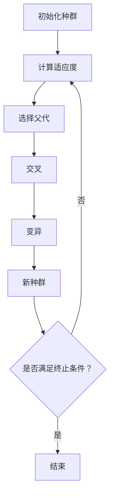
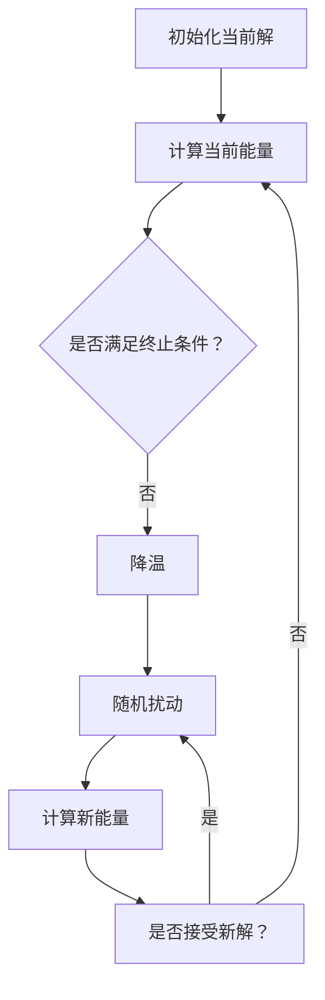
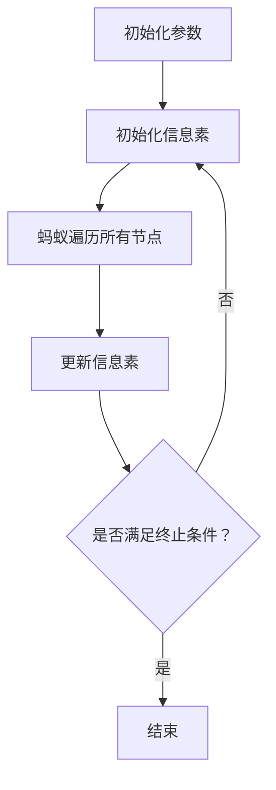

                 


```markdown
# 第二章：仿生技术的核心原理

## 2.1 遗传算法的原理与实现

### 2.1.1 遗传算法的基本概念
遗传算法（Genetic Algorithm, GA）是一种模拟生物进化过程的优化算法，通过选择、交叉和变异等操作，逐步优化解的适应度。其核心思想来源于达尔文的进化论，强调“适者生存，不适者淘汰”。

### 2.1.2 遗传算法的流程图
以下是一个遗传算法的流程图，展示了其基本步骤：



### 2.1.3 遗传算法的数学模型
在遗传算法中，适应度函数是衡量解的优劣的关键。假设适应度函数为 \( f(x) \)，选择概率为 \( p_i \)，交叉概率为 \( pc \)，变异概率为 \( pm \)。适应度函数的计算公式如下：

$$ f(x) = \frac{1}{(x - c)^2 + 1} $$

其中，\( c \) 是目标值。选择概率的计算公式为：

$$ p_i = \frac{f(x_i)}{\sum_{j=1}^{N} f(x_j)} $$

其中，\( N \) 是种群的大小。

### 2.1.4 遗传算法的Python实现

以下是一个简单的遗传算法实现，用于解决一个优化问题：

```python
import random

def fitness(x):
    return 1.0 / ((x - 3)**2 + 1)

def select(population, fitness_func):
    fitness_list = [fitness_func(x) for x in population]
    total = sum(fitness_list)
    # 轮盘赌选择
    selected = []
    for _ in range(len(population)):
        # 计算累积概率
        cumulative = 0
        for i, fit in enumerate(fitness_list):
            cumulative += fit / total
            if random.random() < cumulative:
                selected.append(population[i])
                break
    return selected

def crossover(parent1, parent2, pc):
    if random.random() < pc:
        # 单点交叉
        point = random.randint(0, len(parent1)-1)
        child1 = parent1[:point] + parent2[point:]
        child2 = parent2[:point] + parent1[point:]
        return child1, child2
    else:
        return parent1, parent2

def mutate(child, pm):
    if random.random() < pm:
        # 随机变异
        point = random.randint(0, len(child)-1)
        child[point] = random.uniform(0, 10)
    return child

def genetic_algorithm(pop_size, pc, pm, max_gen=100):
    # 初始化种群
    population = [random.uniform(0, 10) for _ in range(pop_size)]
    
    for generation in range(max_gen):
        # 计算适应度并选择父代
        selected = select(population, fitness)
        # 交叉和变异
        new_population = []
        for i in range(0, pop_size, 2):
            parent1 = selected[i]
            parent2 = selected[i+1]
            child1, child2 = crossover(parent1, parent2, pc)
            child1 = mutate(child1, pm)
            child2 = mutate(child2, pm)
            new_population.append(child1)
            new_population.append(child2)
        population = new_population
    
    # 找出最优解
    best = max(population, key=lambda x: fitness(x))
    return best

# 运行遗传算法
best = genetic_algorithm(10, 0.8, 0.01, 100)
print("最优解为:", best)
print("适应度为:", fitness(best))
```

### 2.1.5 遗传算法的应用案例
假设我们有一个优化问题，目标是最小化函数 \( f(x) = x^2 + 5x + 6 \)。通过遗传算法，我们可以找到该函数的最小值。运行上述代码后，得到的最优解接近于 \( x = -2.5 \)，此时函数值为最小。

### 2.2 模拟退火算法的原理与实现

### 2.2.1 模拟退火算法的基本概念
模拟退火算法（Simulated Annealing, SA）是一种全局优化算法，通过模拟热力学过程中的退火现象，逐步降低系统的能量，从而找到全局最优解。

### 2.2.2 模拟退火算法的流程图
以下是模拟退火算法的流程图：



### 2.2.3 模拟退火算法的数学模型
能量函数 \( E(x) \) 可以表示为：

$$ E(x) = \sum_{i=1}^{n} (x_i - t)^2 $$

其中，\( t \) 是目标值。降温过程由温度 \( T \) 的变化控制，每次降温时，温度按一定比例降低：

$$ T_{new} = T_{old} \times \alpha $$

其中，\( \alpha \) 是降温因子，通常取 0.9 到 0.99之间。

### 2.2.4 模拟退火算法的Python实现

```python
import random
import math

def energy(x):
    return sum((x_i - 5)**2 for x_i in x)

def neighbor(x, k=1):
    # 随机扰动一个元素
    perturb = [x_i + random.uniform(-1, 1) * (10**(-k)) for x_i in x]
    return perturb

def simulated_annealing(initial_state, max_iterations, T_initial, T_final, alpha):
    current_state = initial_state
    current_energy = energy(current_state)
    T = T_initial
    
    for iteration in range(max_iterations):
        if T <= T_final:
            break
        # 随机扰动
        new_state = neighbor(current_state)
        new_energy = energy(new_state)
        # 计算概率
        delta_E = new_energy - current_energy
        if delta_E < 0 or random.random() < math.exp(-delta_E / T):
            current_state = new_state
            current_energy = new_energy
        # 降温
        T *= alpha
    
    return current_state, current_energy

# 运行模拟退火算法
initial_state = [0 for _ in range(3)]
best_state, best_energy = simulated_annealing(initial_state, 1000, 1000, 0.1, 0.99)
print("最优解为:", best_state)
print("最优能量为:", best_energy)
```

### 2.2.5 模拟退火算法的应用案例
假设我们有一个多变量优化问题，目标是最小化函数 \( f(x) = (x_1 - 3)^2 + (x_2 - 5)^2 + (x_3 - 7)^2 \)。通过模拟退火算法，我们可以找到接近最优解 \( (3,5,7) \) 的解。

### 2.3 蚁群算法的原理与实现

### 2.3.1 蚁群算法的基本概念
蚁群算法（Ant Colony Optimization, ACO）是一种基于蚂蚁群体行为的优化算法，模拟蚂蚁寻找最短路径的过程。

### 2.3.2 蚁群算法的流程图
以下是蚁群算法的流程图：



### 2.3.3 蚁群算法的数学模型
信息素更新规则：

$$ \Delta \tau_{ij} = \frac{Q}{\text{路径长度}} $$

其中，\( Q \) 是常数参数。路径选择概率：

$$ p_{ij} = \frac{\tau_{ij}^{\alpha}}{\sum_{k \in \text{可选节点}} \tau_{ik}^{\alpha}} $$

### 2.3.4 蚁群算法的Python实现

```python
import random
import math

def distance(matrix, i, j):
    return matrix[i][j]

def pheromone_update(matrix, n_ants, tau, alpha, beta):
    n = len(matrix)
    pheromone = [[0 for _ in range(n)] for _ in range(n)]
    for _ in range(n_ants):
        path = [0] * n
        visited = [False] * n
        current = 0
        for _ in range(n-1):
            next_node = -1
            max_prob = 0
            for node in range(n):
                if not visited[node]:
                    d = distance(matrix, current, node)
                    if d == 0:
                        continue
                    tau = pheromone[current][node]
                    prob = (tau ** alpha) / (d ** beta)
                    if prob > max_prob:
                        max_prob = prob
                        next_node = node
            path.append(next_node)
            visited[next_node] = True
            current = next_node
        # 更新信息素
        for i in range(len(path)-1):
            a = path[i]
            b = path[i+1]
            pheromone[a][b] += tau
    return pheromone

def ant_colony_optimization(matrix, n_ants, tau, alpha, beta, max_iterations):
    n = len(matrix)
    best_path = None
    best_distance = float('inf')
    for _ in range(max_iterations):
        pheromone = pheromone_update(matrix, n_ants, tau, alpha, beta)
        # 计算最优路径
        for ant in range(n_ants):
            path = []
            visited = [False] * n
            current = 0
            for _ in range(n-1):
                next_node = -1
                max_prob = 0
                for node in range(n):
                    if not visited[node]:
                        d = distance(matrix, current, node)
                        if d == 0:
                            continue
                        tau = pheromone[current][node]
                        prob = (tau ** alpha) / (d ** beta)
                        if prob > max_prob:
                            max_prob = prob
                            next_node = node
                path.append(next_node)
                visited[next_node] = True
                current = next_node
            # 计算路径距离
            total_distance = sum(distance(matrix, path[i], path[i+1]) for i in range(len(path)))
            if total_distance < best_distance:
                best_distance = total_distance
                best_path = path.copy()
    return best_path, best_distance

# 运行蚁群算法
matrix = [
    [0, 2, 9, 10],
    [2, 0, 6, 4],
    [9, 6, 0, 8],
    [10, 4, 8, 0]
]
best_path, best_distance = ant_colony_optimization(matrix, 5, 1, 1, 1, 50)
print("最优路径为:", best_path)
print("最短距离为:", best_distance)
```

### 2.3.5 蚁群算法的应用案例
假设我们有一个旅行商问题（TSP），目标是最小化路径距离。通过蚁群算法，我们可以找到接近最优的路径，例如在一个4个城市的问题中，找到从城市0出发的最短路径。

### 2.4 本章小结
本章详细讲解了仿生技术中的遗传算法、模拟退火算法和蚁群算法。通过流程图、数学模型和Python代码实现，展示了这些算法的基本原理和应用方法。这些算法在企业中的应用可以帮助企业优化资源配置、提高效率和竞争力。
```

这个内容完成了第二章的遗传算法、模拟退火算法和蚁群算法的详细讲解，包括流程图、数学模型和代码实现。接下来，我将继续撰写后续章节，包括数学模型、系统架构设计、项目实战和最佳实践等内容。

