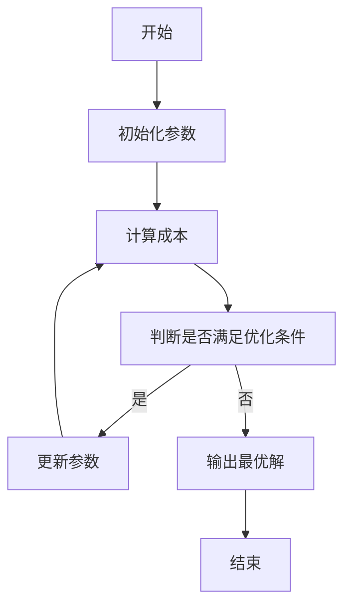
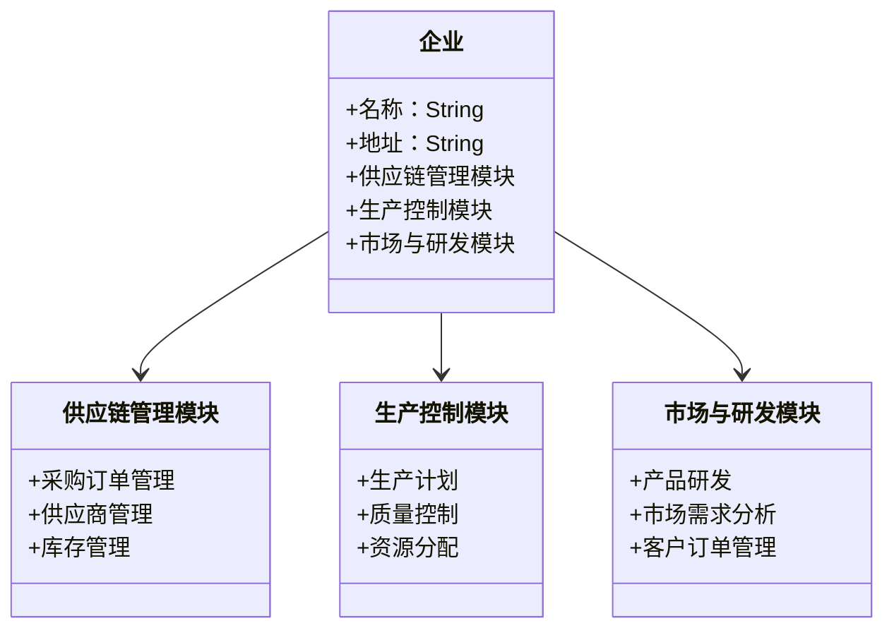

                 


# 如何识别企业的垂直整合优势

> 关键词：企业战略, 供应链管理, 垂直整合, 产业优势, 资源整合

> 摘要：本文将深入探讨如何识别企业的垂直整合优势，从概念解析、优势分析、识别方法、行业案例到技术实现，全面解析垂直整合对企业竞争力的影响。

---

# 第1章 什么是垂直整合

## 1.1 垂直整合的定义与背景
### 1.1.1 垂直整合的定义
垂直整合是指企业整合从原材料采购到产品最终交付的整个价值链，通过内部化关键业务流程，增强对供应链的控制能力。这种整合方式能够优化资源分配，提升效率和降低成本。

### 1.1.2 垂直整合的背景与演变
随着全球化和市场竞争的加剧，企业需要更高效地管理复杂的价值链。垂直整合作为一种战略选择，帮助企业应对供应链波动和外部风险，增强抗风险能力。

### 1.1.3 垂直整合与企业竞争力的关系
垂直整合能够提升企业的市场响应速度和产品创新能力，从而在竞争中占据优势。通过控制关键资源和生产环节，企业可以更快适应市场变化，满足客户需求。

---

## 1.2 垂直整合的核心概念
### 1.2.1 垂直整合的类型
垂直整合可以分为前向整合和后向整合：
- **前向整合**：从生产延伸到销售、分销等环节。
- **后向整合**：从销售延伸到供应商和生产环节。

### 1.2.2 垂直整合的关键特征
- **垂直一体化**：企业控制从原材料到最终产品的整个流程。
- **内部协同**：通过内部资源整合实现高效运作。
- **风险控制**：降低外部供应链的不确定性和风险。

### 1.2.3 垂直整合的边界与外延
垂直整合的边界在于企业是否需要完全控制每个环节，而外延则涉及合作伙伴的选择和外部资源整合。

---

# 第2章 垂直整合的核心原理

## 2.1 垂直整合的原理分析
### 2.1.1 供应链整合
通过整合供应链，企业可以减少对外部供应商的依赖，降低采购成本，并确保原材料的稳定供应。

### 2.1.2 生产过程控制
企业通过控制生产过程，优化生产效率，降低生产成本，同时提高产品质量。

### 2.1.3 市场与研发的垂直整合
通过整合市场和研发部门，企业能够更快地将客户需求转化为产品，提升创新能力。

---

## 2.2 垂直整合的核心属性对比
### 2.2.1 垂直整合与水平整合的对比
| 特性             | 垂直整合          | 水平整合          |
|------------------|-------------------|-------------------|
| 范围             | 整个价值链         | 单一业务领域       |
| 控制力           | 高               | 低               |
| 成本优化         | 显著             | 有限             |

### 2.2.2 垂直整合与外包模式的对比
- **垂直整合**：企业控制关键环节，减少外部依赖。
- **外包模式**：依赖外部供应商，灵活性高但控制力弱。

---

## 2.3 垂直整合的ER实体关系图
```mermaid
erd
  title 垂直整合实体关系图
  Hospital {
    id
    name
    address
    phone
  }
  Doctor {
    id
    name
    specialty
    hospital_id
  }
  Patient {
    id
    name
    age
    gender
    doctor_id
  }
  Appointment {
    id
    date
    time
    patient_id
    doctor_id
  }
  constraint:
    外键：Doctor.hospital_id --> Hospital.id
    外键：Patient.doctor_id --> Doctor.id
    外键：Appointment.patient_id --> Patient.id
    外键：Appointment.doctor_id --> Doctor.id
  }
```

---

# 第3章 垂直整合的算法与数学模型

## 3.1 垂直整合的算法概述
### 3.1.1 垂直整合算法的基本概念
通过优化整合后的业务流程，企业能够实现资源的最优配置和成本的最小化。

### 3.1.2 垂直整合算法的核心思想
利用数学模型和优化算法，模拟垂直整合的效果，找到最优整合方案。

---

## 3.2 垂直整合算法的流程


---

## 3.3 垂直整合的数学模型
通过线性规划模型优化整合后的成本：
$$ \text{Min} \quad \sum_{i=1}^{n} c_i x_i $$
$$ \text{Subject to} \quad \sum_{i=1}^{n} a_i x_i \leq b $$
其中，$$c_i$$为各环节的成本，$$x_i$$为整合变量，$$a_i$$为资源消耗系数，$$b$$为总资源限制。

---

## 3.4 本章小结
通过算法和数学模型，企业可以科学地识别垂直整合的优势，优化资源配置，降低运营成本。

---

# 第4章 垂直整合的系统分析与架构设计

## 4.1 项目背景与需求分析
### 4.1.1 项目背景
企业希望通过垂直整合优化供应链管理，提升竞争力。

### 4.1.2 项目需求
- 实现供应链的垂直整合。
- 优化业务流程，降低成本。

---

## 4.2 系统功能设计


---

## 4.3 系统架构设计


---

## 4.4 系统接口设计
通过API实现各模块之间的数据交互，例如：
- 采购订单API：`/api/purchase-order`
- 生产计划API：`/api/production-plan`
- 市场需求API：`/api/market-demand`

---

## 4.5 本章小结
通过系统分析与架构设计，企业能够构建高效的垂直整合系统，优化业务流程。

---

# 第5章 项目实战与优化建议

## 5.1 环境安装
安装必要的工具和软件，例如：
- 数据库：MySQL
- 开发工具：IntelliJ IDEA
- 依赖管理：Maven

---

## 5.2 系统核心实现源代码
### 5.2.1 数据库表结构
```sql
CREATE TABLE `purchase_order` (
  `id` INT PRIMARY KEY,
  `supplier_id` INT,
  `order_date` DATE,
  `order_quantity` INT,
  FOREIGN KEY (`supplier_id`) REFERENCES `supplier`(`id`)
);
```

### 5.2.2 业务逻辑代码
```java
public class PurchaseOrder {
    private int id;
    private int supplierId;
    private Date orderDate;
    private int orderQuantity;

    public void processOrder() {
        // 处理采购订单逻辑
        System.out.println("采购订单已处理");
    }
}
```

---

## 5.3 代码应用解读与分析
通过上述代码，企业可以实现采购订单的管理，确保供应链的稳定性和高效性。

---

## 5.4 实际案例分析
以某制造企业为例，通过垂直整合优化供应链管理，成功降低了成本，并提高了生产效率。

---

## 5.5 最佳实践 tips
- 确保垂直整合的每个环节都经过优化。
- 定期评估整合效果，及时调整策略。

---

## 5.6 本章小结
通过项目实战，企业可以深入了解垂直整合的实际应用，并不断优化整合策略。

---

# 第6章 总结与展望

## 6.1 总结
垂直整合是企业提升竞争力的重要策略，通过整合供应链、生产流程和市场需求，企业能够实现资源的最优配置。

## 6.2 展望
未来，随着技术的不断发展，垂直整合将更加智能化和数字化，企业需要不断适应变化，优化整合模式。

---

# 参考文献
1. Michael E. Porter, "Competitive Strategy", 1980.
2. W. Chan Kim, Renée Mauborgne, "Blue Ocean Strategy", 2005.

---

通过以上结构，本文全面解析了如何识别企业的垂直整合优势，并提供了从理论到实践的详细指导。希望对企业的战略规划和管理优化有所帮助。

