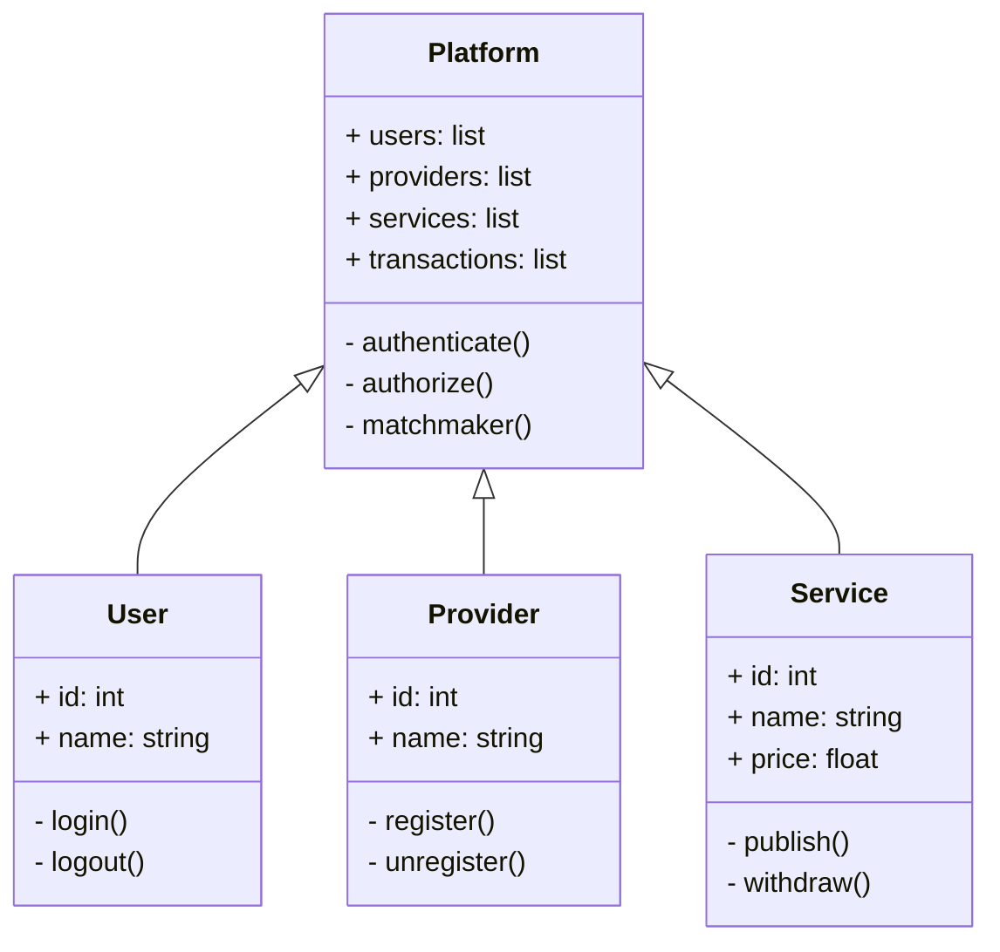
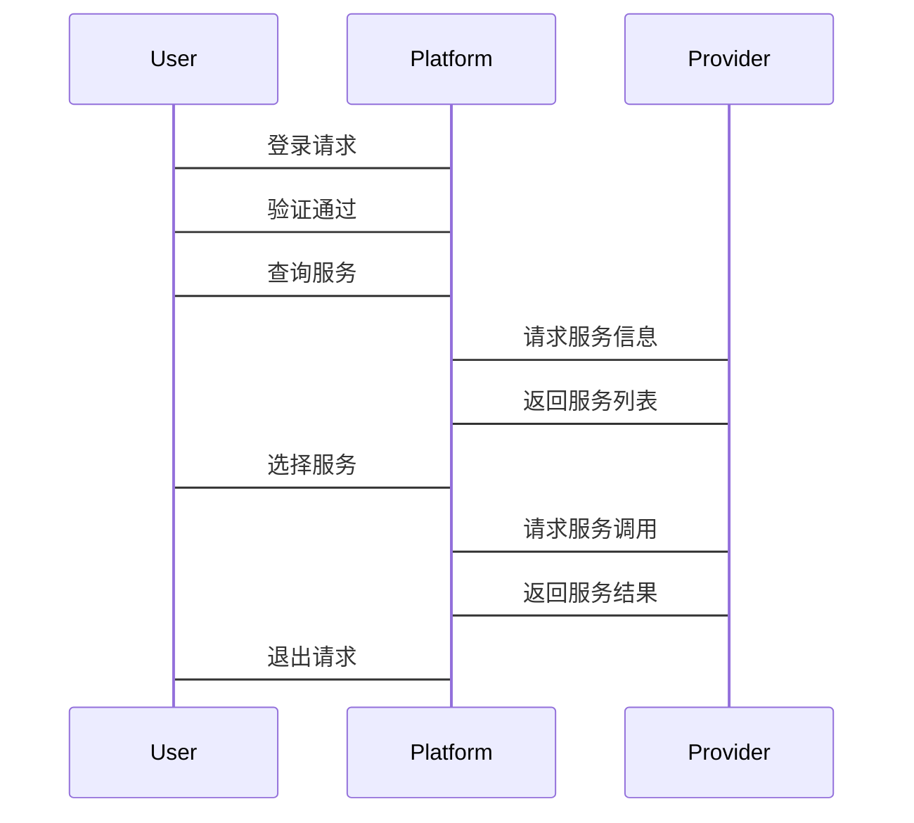

                 


# 如何识别企业的平台化转型优势

## 关键词：
- 平台化转型
- 企业数字化
- 平台架构
- 商业模式创新
- 数字化战略

## 摘要：
企业平台化转型是当前数字化浪潮中的关键趋势，旨在通过构建平台化架构和生态系统，实现企业内外资源的高效整合与协同创新。本文系统性地分析了平台化转型的核心概念、算法原理、系统架构设计以及实战案例，深入探讨了企业在平台化转型中的优势识别、实施路径及挑战应对。通过本文章，读者将能够全面理解平台化转型的本质，掌握识别和构建平台化优势的方法论。

---

## 目录

### 第1章: 企业平台化转型的背景与核心概念

#### 1.1 平台化转型的背景与意义
- 1.1.1 数字化转型的全球趋势
- 1.1.2 平台化转型对企业竞争力的提升
- 1.1.3 平台化转型的核心驱动力

#### 1.2 平台化转型的定义与内涵
- 1.2.1 平台化转型的定义
- 1.2.2 平台化转型的特点
- 1.2.3 平台化转型与其他转型模式的对比

#### 1.3 平台化转型的关键问题
- 1.3.1 平台化转型的核心问题
- 1.3.2 平台化转型的边界与外延
- 1.3.3 平台化转型的生态系统构建

### 第2章: 平台化转型的核心概念与联系

#### 2.1 平台化转型的核心概念
- 2.1.1 平台的定义与分类
- 2.1.2 平台的参与者分析
- 2.1.3 平台的功能模块与系统架构

#### 2.2 平台化转型的核心要素
- 2.2.1 平台的商业模式
- 2.2.2 平台的网络效应
- 2.2.3 平台的生态系统构建

#### 2.3 平台化转型的核心原理
- 2.3.1 平台的双边市场理论
- 2.3.2 平台的网络效应与规模经济
- 2.3.3 平台的生态系统构建与价值共创

#### 2.4 平台化转型的对比分析
- 2.4.1 平台化转型与传统企业转型的对比
- 2.4.2 平台化转型与数字化转型的区别
- 2.4.3 平台化转型的挑战与风险

### 第3章: 平台化转型的算法原理与数学模型

#### 3.1 平台化转型的算法原理
- 3.1.1 平台化转型的算法概述
- 3.1.2 平台化转型的算法流程
- 3.1.3 平台化转型的算法实现

#### 3.2 平台化转型的数学模型
- 3.2.1 平台化转型的收益模型
$$收益 = 价格 \times 数量 - 成本$$
- 3.2.2 平台化转型的成本模型
$$成本 = 固定成本 + 变动成本$$
- 3.2.3 平台化转型的风险评估模型
$$风险 = 概率 \times 影响$$

#### 3.3 平台化转型的算法实现
- 3.3.1 平台化转型的算法实现步骤
- 3.3.2 平台化转型的Python代码示例
```python
def platform_transformation_algorithm(data):
    # 算法实现
    return result
```

### 第4章: 平台化转型的系统分析与架构设计

#### 4.1 系统分析
- 4.1.1 问题场景介绍
- 4.1.2 项目介绍
- 4.1.3 系统功能设计（领域模型 Mermaid 类图）


#### 4.2 系统架构设计
- 4.2.1 系统架构设计（Mermaid 架构图）


#### 4.3 系统接口设计
- 4.3.1 API 接口定义
- 4.3.2 接口交互流程（Mermaid 序列图）


### 第5章: 企业平台化转型的项目实战

#### 5.1 实战案例分析
- 5.1.1 案例背景介绍
- 5.1.2 平台化转型的优势识别
- 5.1.3 平台化转型的实施过程
- 5.1.4 实战结果与分析

#### 5.2 代码实现与解读
- 5.2.1 环境安装与配置
- 5.2.2 系统核心功能实现
```python
class Platform:
    def __init__(self):
        self.users = []
        self.providers = []
        self.services = []
    
    def authenticate(self, user):
        pass
    
    def authorize(self, user, service):
        pass
    
    def matchmaker(self, user, service):
        pass
```

#### 5.3 项目总结与经验分享
- 5.3.1 项目小结
- 5.3.2 实战中的关键点
- 5.3.3 可优化的方面
- 5.3.4 经验总结

### 第6章: 平台化转型的总结与展望

#### 6.1 本章小结
- 6.1.1 平台化转型的核心内容回顾
- 6.1.2 平台化转型的关键成功要素
- 6.1.3 平台化转型的未来发展趋势

#### 6.2 平台化转型的未来展望
- 6.2.1 技术创新对平台化转型的影响
- 6.2.2 平台化转型的全球化趋势
- 6.2.3 平台化转型与可持续发展

#### 6.3 平台化转型的注意事项与建议
- 6.3.1 实施平台化转型的关键注意事项
- 6.3.2 平台化转型的最佳实践 tips
- 6.3.3 对企业领导者的建议

#### 6.4 拓展阅读与学习资源
- 6.4.1 推荐书籍
- 6.4.2 推荐文章
- 6.4.3 推荐在线课程

### 附录

#### 附录A: 平台化转型相关术语解释
- 术语1：平台
- 术语2：网络效应
- 术语3：双边市场

#### 附录B: 平台化转型的数学模型扩展
- 扩展公式1
- 扩展公式2
- 扩展公式3

#### 附录C: 平台化转型的代码库链接
- 代码库1：GitHub链接
- 代码库2：GitLab链接
- 代码库3：Gitee链接

---

通过以上目录结构，本文系统性地从背景、概念、算法、系统架构、实战案例、总结等多个维度深入探讨了如何识别企业的平台化转型优势，为企业领导者和技术从业者提供了全面的理论支持和实践指导。

