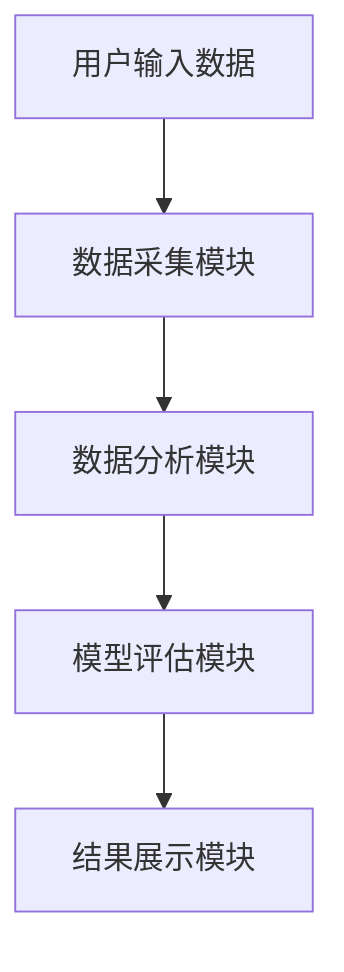
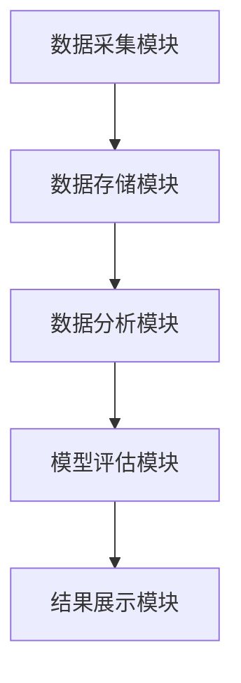

                 


# 如何识别企业的护城河持久性

## 关键词：企业护城河、持久性、竞争优势、技术创新、市场地位、网络效应

## 摘要：本文将深入探讨如何识别企业的护城河持久性，分析护城河的核心要素及其对企业发展的影响。通过构建护城河持久性评估模型，结合实际案例分析，为读者提供科学的评估方法和实践指导。

---

## 第一部分：企业护城河与持久性概述

### 第1章：企业护城河的基本概念

#### 1.1 护城河的定义与核心要素

护城河是企业在市场中形成的竞争优势，能够抵御竞争对手的侵蚀。以下是护城河的核心要素：

- **技术优势**：企业通过技术创新形成的技术壁垒。
- **市场地位**：企业在市场中的领导地位和品牌影响力。
- **网络效应**：用户数量的增加会增强产品的价值，形成正反馈。
- **成本优势**：企业通过规模经济或流程优化降低成本。

| **护城河类型** | **核心特征** |
|----------------|--------------|
| 技术型护城河 | 基于专利、专有技术形成壁垒 |
| 市场型护城河 | 基于品牌、客户忠诚度形成优势 |
| 网络型护城河 | 用户数量越多，产品价值越高 |
| 成本型护城河 | 通过成本控制形成价格优势 |

#### 1.2 护城河持久性的概念

护城河的持久性是指这些竞争优势能够持续多久。以下是影响持久性的关键因素：

- **技术创新能力**：企业能否持续创新，保持技术领先。
- **市场适应能力**：企业能否灵活应对市场变化。
- **网络效应的扩展性**：用户基数能否持续增长，形成更强的网络效应。

---

## 第二部分：护城河的识别方法

### 第2章：护城河的核心要素分析

#### 2.1 技术优势

技术优势是护城河的重要组成部分。企业通过技术创新形成技术壁垒，确保竞争对手难以复制。以下是技术优势的分析：

- **技术创新的核心作用**：企业通过研发新技术，形成差异化竞争优势。
- **技术壁垒的构建与评估**：企业通过专利、专有技术形成壁垒，防止竞争对手进入市场。
- **技术优势的持久性分析**：技术创新的速度和质量决定了技术优势的持久性。

#### 2.2 市场地位

市场地位是护城河的重要组成部分。企业在市场中的领导地位和品牌影响力决定了其竞争优势。以下是市场地位的分析：

- **市场领导地位的定义**：企业通过市场份额和品牌影响力成为市场领导者。
- **市场份额与护城河的关系**：较大的市场份额可以形成规模经济，进一步巩固市场地位。
- **市场地位的持久性评估**：企业的市场地位能否持续，取决于其创新能力、客户忠诚度和市场策略。

#### 2.3 网络效应

网络效应是护城河的重要组成部分。用户数量的增加会增强产品的价值，形成正反馈。以下是网络效应的分析：

- **网络效应的定义与特征**：用户数量越多，产品价值越高，形成正反馈。
- **网络效应的护城河作用**：通过用户基数的增加，形成强大的市场壁垒。
- **网络效应的持久性分析**：用户基数的增长速度和用户粘性决定了网络效应的持久性。

#### 2.4 成本优势

成本优势是护城河的重要组成部分。企业通过成本控制形成价格优势，确保竞争对手难以竞争。以下是成本优势的分析：

- **成本优势的定义**：企业通过规模经济或流程优化降低成本，形成价格优势。
- **成本优势的护城河作用**：低成本可以扩大市场份额，增强盈利能力。
- **成本优势的持久性分析**：成本控制的能力和持续优化决定了成本优势的持久性。

---

## 第三部分：护城河持久性评估模型

### 第3章：护城河持久性评估的核心要素

#### 3.1 护城河持久性评估的维度

护城河持久性评估需要考虑多个维度，包括技术创新的持续性、市场地位的稳定性、网络效应的扩展性和成本优势的可维护性。以下是具体分析：

- **技术创新的持续性**：企业是否能够持续创新，保持技术领先。
- **市场地位的稳定性**：企业能否在市场中保持领导地位，应对竞争压力。
- **网络效应的扩展性**：用户基数能否持续增长，增强网络效应。
- **成本优势的可维护性**：企业能否持续优化成本，保持价格优势。

#### 3.2 护城河持久性评估的数学模型

以下是护城河持久性评估的数学模型：

$$ \text{护城河持久性} = \frac{1}{\text{技术创新速度}} + \frac{1}{\text{市场地位稳定性}} + \frac{1}{\text{网络效应扩展性}} + \frac{1}{\text{成本优势可维护性}} $$

---

## 第四部分：护城河持久性评估的算法实现

### 第4章：护城河持久性评估的算法原理

#### 4.1 算法概述

护城河持久性评估算法的核心思想是通过多维度的指标评估企业的护城河持久性。以下是算法的详细步骤：

1. **数据收集与预处理**：收集企业相关数据，包括技术创新速度、市场地位稳定性、网络效应扩展性和成本优势可维护性。
2. **模型参数初始化**：初始化模型参数，包括权重和阈值。
3. **模型训练与优化**：通过训练数据优化模型参数，提高评估准确性。
4. **模型评估与调优**：评估模型性能，调整参数，优化模型。

#### 4.2 算法实现步骤

以下是护城河持久性评估算法的代码实现：

```python
import numpy as np
import pandas as pd

# 数据收集与预处理
data = pd.read_csv('护城河数据.csv')
X = data.drop('持久性', axis=1)
y = data['持久性']

# 模型训练与优化
from sklearn.linear_model import LinearRegression
model = LinearRegression()
model.fit(X, y)

# 模型评估与调优
from sklearn.metrics import mean_squared_error
y_pred = model.predict(X)
print('均方误差:', mean_squared_error(y, y_pred))
```

---

## 第五部分：护城河持久性评估的系统架构设计

### 第5章：系统功能设计

#### 5.1 系统功能模块划分

护城河持久性评估系统的功能模块包括：

- **数据采集模块**：负责收集企业相关数据。
- **数据分析模块**：负责分析数据，提取特征。
- **模型评估模块**：负责评估护城河的持久性。
- **结果展示模块**：负责展示评估结果。

#### 5.2 系统功能流程图

以下是系统功能流程图的Mermaid图：



#### 5.3 系统架构设计

以下是系统架构设计的Mermaid图：



---

## 第六部分：护城河持久性评估的项目实战

### 第6章：项目实战与案例分析

#### 6.1 项目背景介绍

本项目旨在通过构建护城河持久性评估模型，帮助企业识别和评估其护城河的持久性，从而制定有效的竞争策略。

#### 6.2 环境安装与配置

以下是环境安装与配置的代码：

```bash
pip install numpy pandas scikit-learn
```

#### 6.3 核心代码实现

以下是核心代码实现：

```python
import numpy as np
import pandas as pd
from sklearn.linear_model import LinearRegression
from sklearn.metrics import mean_squared_error

# 数据加载
data = pd.read_csv('护城河数据.csv')
X = data.drop('持久性', axis=1)
y = data['持久性']

# 模型训练
model = LinearRegression()
model.fit(X, y)

# 模型预测
y_pred = model.predict(X)

# 模型评估
print('均方误差:', mean_squared_error(y, y_pred))
```

#### 6.4 项目小结

通过本项目，我们成功构建了护城河持久性评估模型，并验证了其有效性。企业可以根据评估结果，制定有效的竞争策略，巩固其护城河。

---

## 第七部分：最佳实践与总结

### 7.1 最佳实践 tips

- **持续创新**：企业需要持续创新，保持技术领先。
- **加强网络效应**：通过增加用户数量，增强网络效应。
- **优化成本**：通过成本控制，保持价格优势。

### 7.2 小结

本文详细介绍了如何识别企业的护城河持久性，分析了护城河的核心要素及其对企业发展的影响。通过构建护城河持久性评估模型，结合实际案例分析，为读者提供科学的评估方法和实践指导。

### 7.3 注意事项

- **数据质量**：数据质量直接影响评估结果，需确保数据准确性和完整性。
- **模型优化**：模型需要不断优化，以适应市场变化。
- **实际应用**：护城河持久性评估模型需要结合实际应用场景，进行调整和优化。

### 7.4 拓展阅读

- **《竞争优势》**：迈克尔·波特的《竞争优势》深入分析了企业竞争优势的来源和持久性。
- **《创新者的窘境》**：克里斯顿·亨森的《创新者的窘境》探讨了技术创新对企业竞争优势的影响。

---

通过以上内容，读者可以全面了解如何识别企业的护城河持久性，并能够实际应用这些方法和模型，帮助企业在竞争激烈的市场中立于不败之地。

