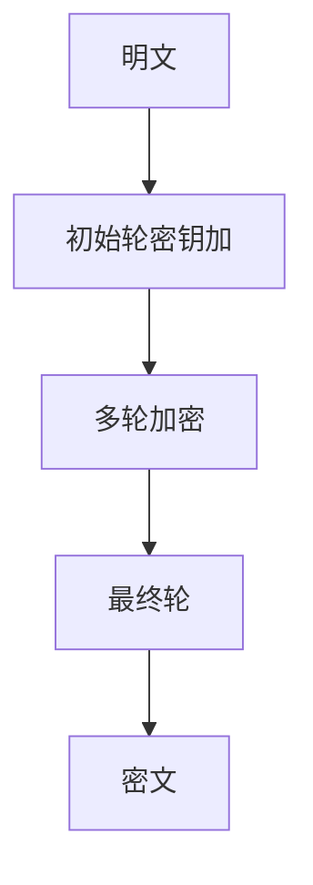
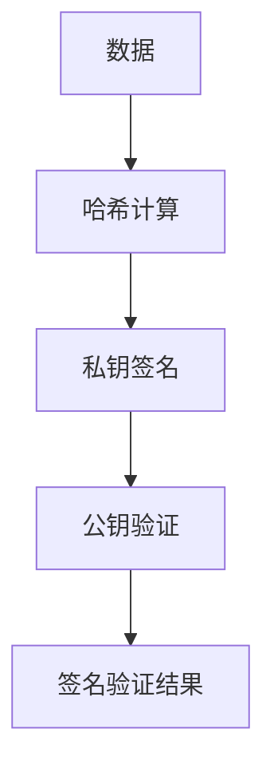
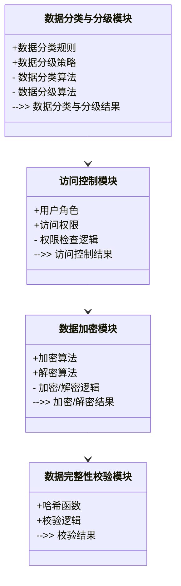
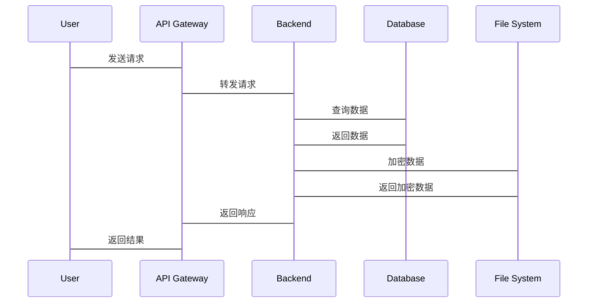

                 


# 如何识别企业的数据安全优势

> 关键词：数据安全，企业优势，安全策略，加密技术，访问控制，系统架构

> 摘要：本文旨在探讨如何识别企业的数据安全优势，通过分析数据安全的核心概念、算法原理、系统架构以及实际案例，为企业提供有效的方法和策略。文章从数据分类与分级、访问控制、加密技术等核心概念出发，结合实际案例分析，帮助企业识别和提升数据安全优势。

---

# 第1章 数据安全的核心概念与背景

## 1.1 数据安全的定义与核心要素

### 1.1.1 数据安全的定义
数据安全是指通过技术手段和管理措施，保护数据的机密性、完整性、可用性和隐私性，防止数据被未经授权的访问、泄露、篡改或破坏。数据安全是企业在数字化转型中不可或缺的一部分。

### 1.1.2 数据安全的核心要素
数据安全的核心要素包括：
1. **机密性（Confidentiality）**：确保只有授权人员能够访问数据。
2. **完整性（Integrity）**：保证数据在存储和传输过程中不被篡改。
3. **可用性（Availability）**：确保数据在需要时能够被访问。
4. **隐私性（Privacy）**：保护个人数据不被滥用。

### 1.1.3 数据安全与企业业务的关系
数据是企业的核心资产，数据安全直接关系到企业的业务连续性和声誉。数据泄露可能导致巨大的经济损失和法律风险，因此，数据安全是企业生存和发展的基础。

---

## 1.2 企业数据安全的现状与挑战

### 1.2.1 当前企业数据安全的现状
随着数字化转型的推进，企业数据量急剧增加，数据分布广泛，数据安全风险也随之增加。许多企业已经意识到数据安全的重要性，但仍然存在以下问题：
1. 数据分类不清，导致安全策略难以实施。
2. 缺乏统一的安全策略，各部门之间的安全措施不一致。
3. 数据加密技术应用不足，导致数据容易被破解。

### 1.2.2 数据安全面临的挑战
1. **技术挑战**：数据量大、分布广，传统的安全措施难以应对。
2. **管理挑战**：数据安全需要跨部门协作，管理复杂。
3. **合规挑战**：各国数据保护法规日益严格，企业需要满足多种合规要求。

### 1.2.3 数据安全对企业的影响
数据安全直接影响企业的业务运行和声誉。数据泄露可能导致客户信任度下降，甚至引发法律诉讼和罚款。因此，识别和提升数据安全优势是企业的重要任务。

---

## 1.3 数据安全优势的识别与重要性

### 1.3.1 数据安全优势的定义
数据安全优势是指企业在数据安全管理、技术应用和策略制定方面相对于竞争对手的领先地位。这种优势可以通过高效的管理、先进的技术和严格的安全策略来实现。

### 1.3.2 识别数据安全优势的意义
1. 提高数据安全性，保护企业核心资产。
2. 增强客户信任，提升企业声誉。
3. 符合法规要求，避免法律风险。

### 1.3.3 数据安全优势与企业竞争力的关系
数据安全优势是企业竞争力的重要组成部分。具备数据安全优势的企业可以在市场中更具竞争力，赢得客户的信任，并在数字化转型中占据领先地位。

---

## 1.4 本章小结
本章介绍了数据安全的核心概念，分析了企业数据安全的现状与挑战，并探讨了数据安全优势的识别与重要性。下一章将深入探讨数据安全的核心概念与联系。

---

# 第2章 数据安全的核心概念与联系

## 2.1 数据分类与分级

### 2.1.1 数据分类的定义
数据分类是指根据数据的类型、用途和敏感程度，将数据划分为不同的类别。常见的分类方式包括按数据类型（结构化数据、非结构化数据）和按敏感程度（公开数据、内部数据、机密数据）。

### 2.1.2 数据分级标准
数据分级标准是根据数据的重要性和敏感程度，对数据进行分级。常见的分级标准包括：
1. **公开数据**：可以自由访问的数据。
2. **内部数据**：仅限于企业内部访问的数据。
3. **机密数据**：高度敏感，仅限于特定人员访问的数据。

### 2.1.3 数据分类与分级的实现方法
数据分类与分级的实现方法包括：
1. **数据标签化**：通过标签标记数据的分类和级别。
2. **访问控制**：根据数据的分类和分级设置访问权限。
3. **数据加密**：对机密数据进行加密存储和传输。

---

## 2.2 数据访问控制

### 2.2.1 访问控制的定义
访问控制是指通过技术手段，限制对数据的访问权限，确保只有授权人员可以访问特定的数据。

### 2.2.2 常见的访问控制模型
1. **基于角色的访问控制（RBAC）**：根据用户角色分配权限。
2. **基于属性的访问控制（ABAC）**：根据用户属性和上下文分配权限。
3. **基于规则的访问控制（RBAC）**：根据预定义的规则控制访问。

### 2.2.3 数据访问控制的实现方式
数据访问控制的实现方式包括：
1. **身份验证**：通过用户名和密码验证用户身份。
2. **权限管理**：根据用户角色分配权限。
3. **审计与监控**：记录用户的访问行为，及时发现异常。

---

## 2.3 数据加密技术

### 2.3.1 加密技术的定义
加密技术是指将明文转换为密文的技术，确保数据在传输和存储过程中不被 unauthorized 读取。

### 2.3.2 对称加密与非对称加密的区别
1. **对称加密**：加密和解密使用相同的密钥，速度快，适用于大数据量加密。
2. **非对称加密**：加密和解密使用不同的密钥，安全性高，适用于数字签名和身份验证。

### 2.3.3 常见加密算法的优缺点
1. **AES加密算法**：对称加密算法，速度快，安全性高。
2. **RSA加密算法**：非对称加密算法，安全性依赖于密钥长度。
3. **哈希函数**：用于数据完整性校验，常见的哈希函数有MD5、SHA-1、SHA-256等。

---

## 2.4 数据安全属性对比表格

| 数据属性 | 定义 | 实现方法 | 示例 |
|----------|------|----------|------|
| 机密性 | 数据仅限授权人员访问 | 对称加密（AES）、非对称加密（RSA） | 使用AES加密保护客户数据 |
| 完整性 | 数据在存储和传输过程中不被篡改 | 哈希函数（SHA-256）、数字签名 | 使用SHA-256校验数据完整性 |
| 可用性 | 数据在需要时可以被访问 | 容灾备份、高可用架构 | 使用负载均衡确保数据可用 |

---

## 2.5 数据安全的ER实体关系图

```mermaid
erDiagram
    user {
        id INT PRIMARY KEY AUTO_INCREMENT
        username VARCHAR(255)
        password VARCHAR(255)
        role VARCHAR(255)
    }
    data {
        id INT PRIMARY KEY AUTO_INCREMENT
        name VARCHAR(255)
        type VARCHAR(255)
        sensitivity_level INT
        classification VARCHAR(255)
    }
    access_control {
        id INT PRIMARY KEY AUTO_INCREMENT
        user_id INT
        data_id INT
        permission VARCHAR(255)
        FOREIGN KEY (user_id) REFERENCES user(id)
        FOREIGN KEY (data_id) REFERENCES data(id)
    }
```

---

## 2.6 本章小结
本章详细讲解了数据分类与分级、数据访问控制和数据加密技术的核心概念，并通过对比表格和ER实体关系图展示了这些概念之间的联系。下一章将深入探讨数据安全算法的原理与实现。

---

# 第3章 数据安全算法原理

## 3.1 数据加密算法

### 3.1.1 AES加密算法的原理
AES（Advanced Encryption Standard）是一种对称加密算法，广泛应用于数据加密。其工作原理如下：

1. **明文准备**：将明文填充为16字节的倍数。
2. **初始轮密钥加**：将明文与初始轮密钥进行异或操作。
3. **多轮加密**：通过多轮的加法、非线性变换和移位操作，逐步加密数据。
4. **最终轮**：在最后一轮不执行移位操作。

### 3.1.2 AES加密算法的Python实现

```python
from cryptography.hazmat.primitives.ciphers import (
    Cipher, algorithms, modes
)
from cryptography.hazmat.primitives.asymmetric import padding
from cryptography.hazmat.primitives import hashes
from cryptography.hazmat.backends import default_backend

def aes_encrypt(plaintext, key):
    backend = default_backend()
    cipher = Cipher(algorithms.AES(key), modes.ECB(), backend)
    encryptor = cipher.encryptor()
    ciphertext = encryptor.update(plaintext) + encryptor.finalize()
    return ciphertext

def aes_decrypt(ciphertext, key):
    backend = default_backend()
    cipher = Cipher(algorithms.AES(key), modes.ECB(), backend)
    decryptor = cipher.decryptor()
    plaintext = decryptor.update(ciphertext) + decryptor.finalize()
    return plaintext

# 示例
key = b'16-character-long-key'  # 16字节的密钥
plaintext = b'Hello, World!'
ciphertext = aes_encrypt(plaintext, key)
decrypted_text = aes_decrypt(ciphertext, key)
```

### 3.1.3 AES加密算法的数学模型
AES加密算法基于有限域GF(256)上的线性变换。其核心操作包括：
1. **S-盒变换**：将每个字节映射到另一个字节。
2. **线性变换**：通过矩阵乘法实现。

### 3.1.4 AES加密算法的流程图



---

## 3.2 数据完整性校验

### 3.2.1 哈希函数的原理
哈希函数是一种将任意长度的输入数据映射为固定长度的哈希值的函数。常见的哈希函数包括MD5、SHA-1、SHA-256等。

### 3.2.2 哈希函数的Python实现

```python
import hashlib

def compute_hash(data):
    # 创建哈希对象
    hash_object = hashlib.sha256(data)
    # 获取哈希值的十六进制表示
    hex_dig = hash_object.hexdigest()
    return hex_dig

# 示例
data = b'Hello, World!'
hash_value = compute_hash(data)
print(hash_value)  # 输出哈希值
```

### 3.2.3 哈希函数的数学模型
哈希函数的数学模型可以表示为：
$$ H(x) = \sum_{i=0}^{n-1} x_i \cdot w_i \mod P $$
其中，\( x_i \) 是输入数据的第i个字节，\( w_i \) 是预定义的权重，\( P \) 是大质数。

---

## 3.3 数字签名技术

### 3.3.1 数字签名的定义
数字签名是一种通过加密技术验证数据完整性和身份的技术。数字签名通常使用非对称加密算法实现。

### 3.3.2 数字签名的Python实现

```python
from cryptography.hazmat.primitives.asymmetric import padding
from cryptography.hazmat.primitives.asymmetric import padding
from cryptography.hazmat.primitives import hashes
from cryptography.hazmat.backends import default_backend

def sign_data(data, private_key):
    # 创建签名器
    signer = private_key.signer(padding.PKCSv1_5(), hashes.SHA256())
    # 计算签名
    signature = signer.sign(data)
    return signature

def verify_signature(data, signature, public_key):
    # 创建验证器
    verifier = public_key.verifier(signature, hashes.SHA256())
    # 验证签名
    verifier.update(data)
    return verifier.verify()

# 示例
private_key = ...  # 非对称加密的私钥
public_key = ...    # 非对称加密的公钥
data = b'Hello, World!'
signature = sign_data(data, private_key)
verified = verify_signature(data, signature, public_key)
```

### 3.3.3 数字签名的流程图



---

## 3.4 本章小结
本章详细讲解了数据加密算法和数字签名技术的原理与实现，并通过Python代码示例展示了如何实现这些算法。下一章将探讨数据安全的系统架构设计与实现。

---

# 第4章 数据安全的系统架构设计与实现

## 4.1 系统分析与设计

### 4.1.1 系统功能设计
1. **数据分类与分级**：根据数据类型和敏感程度进行分类和分级。
2. **访问控制**：基于角色或属性设置数据访问权限。
3. **数据加密**：对机密数据进行加密存储和传输。
4. **数据完整性校验**：使用哈希函数校验数据完整性。

### 4.1.2 系统功能模块设计



### 4.1.3 系统架构设计


---

## 4.2 系统接口设计

### 4.2.1 数据分类与分级接口

```http
POST /api/data/classify
Content-Type: application/json

{
    "data": "用户信息",
    "sensitivity_level": "高"
}
```

### 4.2.2 访问控制接口

```http
GET /api/data/access
Authorization: Bearer token
```

### 4.2.3 数据加密接口

```http
POST /api/data/encrypt
Content-Type: application/json

{
    "plaintext": "Hello, World!"
}
```

---

## 4.3 系统交互流程图



---

## 4.4 本章小结
本章通过系统分析与设计，详细讲解了数据安全系统的功能模块、架构设计和接口设计。下一章将通过实际案例分析，展示如何识别和提升企业的数据安全优势。

---

# 第5章 项目实战：识别企业的数据安全优势

## 5.1 项目背景

### 5.1.1 项目介绍
某企业希望通过数据安全优势识别，提升数据安全性，保护客户隐私，符合GDPR等法规要求。

## 5.2 项目实现

### 5.2.1 环境安装
1. **安装Python依赖**：
   ```bash
   pip install cryptography
   pip install mermaid
   ```

2. **安装系统依赖**：
   ```bash
   sudo apt-get install python3 python3-dev
   ```

### 5.2.2 核心代码实现

#### 数据分类与分级模块

```python
def classify_data(data_type, sensitivity_level):
    if sensitivity_level == '高':
        return '机密'
    elif sensitivity_level == '中':
        return '内部'
    else:
        return '公开'
```

#### 访问控制模块

```python
def access_control(user_role, data_access_level):
    if user_role == '管理员':
        return '允许'
    elif data_access_level == '机密':
        if user_role == '普通用户':
            return '不允许'
        else:
            return '允许'
    else:
        return '允许'
```

#### 数据加密模块

```python
def encrypt_data(plaintext, key):
    # 使用AES加密
    cipher = Cipher(algorithms.AES(key), modes.ECB(), backend)
    encryptor = cipher.encryptor()
    return encryptor.update(plaintext) + encryptor.finalize()
```

### 5.2.3 代码应用解读与分析
1. **数据分类与分级模块**：根据数据类型和敏感程度进行分类，确保数据存储和访问权限的合理设置。
2. **访问控制模块**：基于用户角色和数据访问级别，控制数据访问权限。
3. **数据加密模块**：对机密数据进行加密存储，确保数据在传输过程中的安全性。

## 5.3 实际案例分析

### 5.3.1 案例分析
某企业客户数据泄露事件分析：
1. **问题描述**：客户数据被未授权访问，导致数据泄露。
2. **原因分析**：
   - 数据分类不清，导致数据访问权限设置不合理。
   - 数据加密措施不足，数据存储明文。
3. **解决方案**：
   - 重新梳理数据分类与分级规则。
   - 强化数据加密措施，确保机密数据加密存储。
   - 定期进行安全审计和漏洞扫描。

### 5.3.2 问题解决与经验总结
1. **问题解决**：
   - 通过数据分类与分级模块，明确数据访问权限。
   - 使用AES加密算法，确保数据存储安全。
2. **经验总结**：
   - 数据分类与分级是数据安全管理的基础。
   - 数据加密是保护机密数据的关键措施。

---

## 5.4 本章小结
本章通过实际案例分析，展示了如何识别和提升企业的数据安全优势。通过数据分类、访问控制和数据加密等技术手段，帮助企业构建高效的安全体系。

---

# 第6章 数据安全的最佳实践与总结

## 6.1 最佳实践

### 6.1.1 数据分类与分级
- 定期梳理数据资产，明确数据分类和分级规则。
- 根据数据敏感程度制定相应的安全策略。

### 6.1.2 数据访问控制
- 基于角色的访问控制（RBAC）是实现细粒度权限管理的有效方法。
- 定期审计用户权限，避免权限冗余和越权访问。

### 6.1.3 数据加密
- 对机密数据进行加密存储和传输，确保数据安全性。
- 使用强加密算法，如AES和RSA，提升数据保护能力。

### 6.1.4 数据完整性校验
- 使用哈希函数校验数据完整性，确保数据在传输过程中不被篡改。
- 定期进行数据备份和恢复演练，确保数据可用性。

### 6.1.5 安全审计与监控
- 建立安全审计系统，记录用户的访问行为。
- 使用安全监控工具，及时发现和应对安全威胁。

## 6.2 小结
数据安全是企业数字化转型中的重要组成部分。通过识别和提升数据安全优势，企业可以更好地保护数据资产，提升客户信任度，确保业务的持续发展。

## 6.3 注意事项
- 数据安全是一个持续的过程，需要企业长期投入和关注。
- 在实施数据安全措施时，需要充分考虑企业的实际情况，制定合理的安全策略。
- 数据安全技术的应用需要结合企业的业务需求，避免过度依赖技术手段而忽视管理措施。

## 6.4 拓展阅读
- 《 cybersecurity: A Comprehensive Overview》
- 《Data Encryption and Its Importance in Modern Computing》
- 《Role-Based Access Control: Theory and Practice》

---

# 附录

## 附录A: 数据分类与分级标准
1. **公开数据**：可以自由访问的数据，如公司公开信息。
2. **内部数据**：仅限于企业内部访问的数据，如内部邮件。
3. **机密数据**：高度敏感，仅限于特定人员访问的数据，如客户隐私数据。

## 附录B: 数据安全相关工具
1. **加密工具**：AES加密工具、openssl。
2. **访问控制工具**：Apache Shiro、Spring Security。
3. **数据完整性校验工具**：Hashcat、 OpenSSL。

## 附录C: 数据安全相关法规
1. **GDPR**：《通用数据保护条例》（欧盟）。
2. **CCPA**：《加州消费者隐私法案》（美国）。
3. **ISO 27001**：信息安全管理体系国际标准。

---

# 结语

通过本文的详细讲解，我们了解了如何识别和提升企业的数据安全优势。从核心概念到算法原理，从系统架构设计到实际案例分析，我们为企业提供了全面的解决方案。希望本文能为企业的数据安全管理提供有价值的参考。

