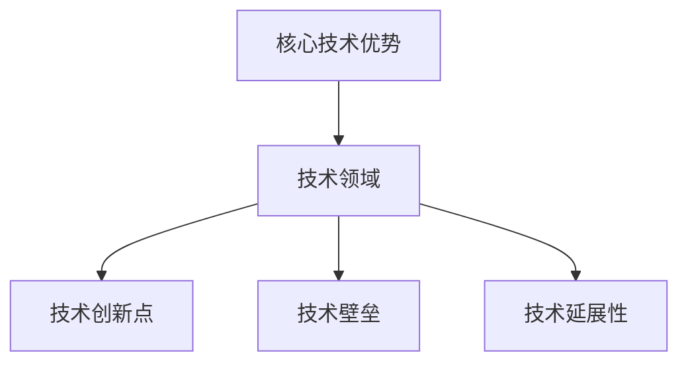
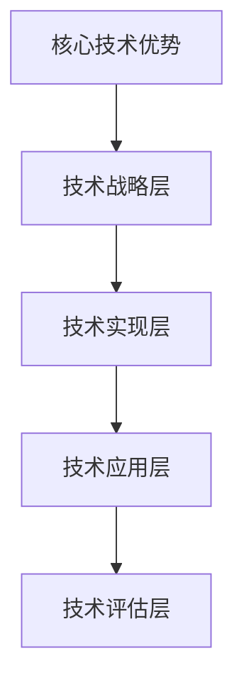
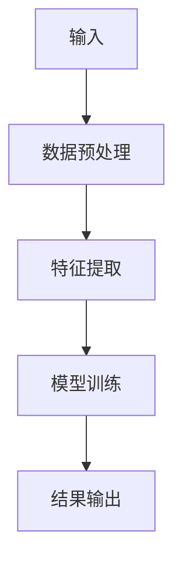

                 


# 如何识别企业的核心技术优势

## 关键词：
核心技术优势，企业识别方法，技术分析，系统架构，竞争力评估

## 摘要：
识别企业的核心技术优势是企业在激烈竞争中保持领先地位的关键。本文从技术分析、系统架构、算法原理等多个维度，详细讲解如何识别和评估企业的核心技术优势。通过实际案例分析和系统设计，帮助读者掌握识别核心技术优势的方法，为企业制定有效的技术战略提供指导。

---

## 第一部分：企业核心技术优势的背景与概念

### 第1章：核心技术优势的定义与背景

#### 1.1 核心技术优势的概念

##### 1.1.1 核心技术的定义
核心技术是企业在特定领域中具有独特性和不可替代性的技术能力，是企业竞争优势的核心来源。

##### 1.1.2 核心技术优势的内涵
核心技术优势是指企业在技术领域中具备的技术创新性、技术壁垒和技术延展性等优势，能够为企业创造超额价值。

##### 1.1.3 核心技术优势与企业竞争力的关系
核心技术优势是企业竞争力的核心驱动力。企业通过拥有核心技术优势，可以在市场上获得定价权、客户忠诚度和竞争优势。

#### 1.2 识别核心技术优势的重要性

##### 1.2.1 核心技术优势对企业战略的意义
核心技术优势是企业制定技术战略的基础，决定了企业在技术领域的投资方向和资源分配。

##### 1.2.2 识别核心技术优势的必要性
识别核心技术优势可以帮助企业发现自身技术瓶颈，优化技术布局，提升技术竞争力。

##### 1.2.3 核心技术优势与企业可持续发展的关系
核心技术优势是企业可持续发展的关键，能够为企业提供长期的技术支持和市场竞争力。

### 第2章：核心技术优势的识别与分析

#### 2.1 核心技术优势的识别方法

##### 2.1.1 基于技术生命周期的分析
技术生命周期包括技术萌芽期、成长期、成熟期和衰退期。识别核心技术优势需要分析企业在技术生命周期中的位置。

##### 2.1.2 基于竞争环境的分析
通过分析竞争对手的技术布局，识别自身技术优势，制定差异化竞争策略。

##### 2.1.3 基于市场价值的分析
从市场需求和技术应用角度，评估技术优势的市场价值和商业潜力。

#### 2.2 核心技术优势的属性特征对比

##### 2.2.1 技术创新性对比
通过对比企业技术与行业平均水平，评估技术的创新性和领先性。

##### 2.2.2 技术壁垒对比
分析技术的专利数量、技术复杂性和替代难度，评估技术壁垒的高低。

##### 2.2.3 技术延展性对比
评估技术的可扩展性和应用场景，判断技术的延展性。

#### 2.3 核心技术优势的ER实体关系图



### 第3章：核心技术优势的系统分析与架构设计

#### 3.1 核心技术优势的系统分析

##### 3.1.1 系统分析方法
采用系统工程方法，从技术、经济、社会等多维度分析企业核心技术优势。

##### 3.1.2 核心技术优势的系统边界
明确技术分析的范围和边界，避免分析过于宽泛或过于狭窄。

##### 3.1.3 核心技术优势的系统功能模块
包括技术数据采集、技术分析、技术评估和结果输出等模块。

#### 3.2 核心技术优势的系统架构设计



#### 3.3 核心技术优势的系统接口设计

##### 3.3.1 系统接口定义
明确系统与外部接口的数据格式、通信协议和接口规范。

##### 3.3.2 系统接口实现
通过代码实现系统接口，确保数据的正确传输和处理。

##### 3.3.3 系统接口测试
通过测试验证系统接口的功能和性能，确保系统的稳定性和可靠性。

### 第4章：核心技术优势的算法原理与数学模型

#### 4.1 核心技术优势的识别算法

##### 4.1.1 算法原理
基于技术数据，采用机器学习算法，识别核心技术优势。

##### 4.1.2 算法流程图



##### 4.1.3 算法实现代码

```python
def identify_core_technology优势(data):
    # 数据预处理
    preprocessed_data = preprocess(data)
    # 特征提取
    features = extract_features(preprocessed_data)
    # 模型训练
    model = train_model(features)
    # 结果输出
    result = predict(model, features)
    return result
```

#### 4.2 核心技术优势的数学模型

##### 4.2.1 核心技术优势的评估公式

$$
\text{核心技术优势指数} = \frac{\text{技术创新性} + \text{技术壁垒} + \text{技术延展性}}{3}
$$

##### 4.2.2 评估公式的解释
技术创新性、技术壁垒和技术延展性分别占总指数的三分之一，综合评估企业的核心技术优势。

---

## 第二部分：企业核心技术优势的识别与应用

### 第5章：核心技术优势的识别与应用

#### 5.1 核心技术优势的识别方法

##### 5.1.1 基于技术生命周期的识别
通过技术生命周期模型，识别企业在技术发展中的优势。

##### 5.1.2 基于竞争环境的识别
分析竞争对手的技术布局，发现自身技术优势。

##### 5.1.3 基于市场价值的识别
从市场需求和技术应用角度，评估技术优势的市场价值。

#### 5.2 核心技术优势的系统架构设计

##### 5.2.1 系统功能设计
包括技术数据采集、技术分析、技术评估和结果输出等功能。

##### 5.2.2 系统架构图


##### 5.2.3 系统接口设计
明确系统接口的数据格式、通信协议和接口规范。

### 第6章：核心技术优势的项目实战

#### 6.1 项目背景与目标

##### 6.1.1 项目背景
以某企业为例，识别其核心技术优势，优化技术布局。

##### 6.1.2 项目目标
通过技术分析和系统设计，识别企业的核心技术优势。

#### 6.2 项目实施过程

##### 6.2.1 环境安装
安装必要的开发工具和数据分析平台。

##### 6.2.2 核心代码实现

```python
def identify_core_technology优势(data):
    # 数据预处理
    preprocessed_data = preprocess(data)
    # 特征提取
    features = extract_features(preprocessed_data)
    # 模型训练
    model = train_model(features)
    # 结果输出
    result = predict(model, features)
    return result
```

##### 6.2.3 代码解读与分析
通过代码实现核心技术优势的识别，输出评估结果。

#### 6.3 项目小结

##### 6.3.1 项目总结
总结项目的实施过程和取得的成果，提出改进建议。

##### 6.3.2 项目经验
分享项目中的经验教训，为后续项目提供参考。

---

## 第三部分：企业核心技术优势的优化与提升

### 第7章：核心技术优势的优化与提升

#### 7.1 核心技术优势的持续优化

##### 7.1.1 技术创新
通过技术研发和创新，保持核心技术优势的领先地位。

##### 7.1.2 技术升级
根据市场需求和技术发展，及时升级核心技术。

#### 7.2 核心技术优势的提升策略

##### 7.2.1 技术培训
通过技术培训提升员工的技术能力，增强企业技术优势。

##### 7.2.2 技术合作
与外部技术机构合作，引进先进技术和管理经验。

### 第8章：核心技术优势的最佳实践

#### 8.1 最佳实践 tips

##### 8.1.1 持续监测
定期监测技术市场和技术发展，及时发现技术优势的变化。

##### 8.1.2 技术培训
通过技术培训提升员工的技术能力，增强企业技术优势。

##### 8.1.3 技术创新
鼓励技术创新，保持核心技术优势的领先地位。

#### 8.2 小结与展望

##### 8.2.1 小结
总结全文内容，强调识别核心技术优势的重要性。

##### 8.2.2 展望
展望未来技术发展，提出企业在技术领域的未来发展方向。

---

## 第四部分：总结与展望

### 第9章：总结与展望

#### 9.1 总结

识别企业的核心技术优势是企业在激烈竞争中保持领先地位的关键。本文从技术分析、系统架构、算法原理等多个维度，详细讲解了如何识别和评估企业的核心技术优势。

#### 9.2 展望

随着技术的发展和市场的变化，企业需要不断优化和提升核心技术优势。未来，核心技术优势的识别将更加智能化和数据化，企业需要积极应对技术挑战，保持技术领先。

---

## 第五部分：附录

### 附录A：相关工具与资源

#### 1. 技术分析工具
推荐使用的技术分析工具和平台，如Python的机器学习库（Scikit-learn、TensorFlow）等。

#### 2. 技术资料与文献
推荐相关技术文献和书籍，供读者深入学习和研究。

### 附录B：术语解释

#### 1. 核心技术优势
核心技术优势是指企业在技术领域中具备的技术创新性、技术壁垒和技术延展性等优势，是企业竞争优势的核心来源。

#### 2. 技术生命周期
技术生命周期包括技术萌芽期、成长期、成熟期和衰退期，是技术发展的自然过程。

#### 3. 技术壁垒
技术壁垒是指技术的专利数量、技术复杂性和替代难度，是企业技术优势的重要组成部分。

---

通过以上详细的内容，读者可以全面了解如何识别和评估企业的核心技术优势，并在实际应用中灵活运用这些方法，为企业制定有效的技术战略提供指导。

