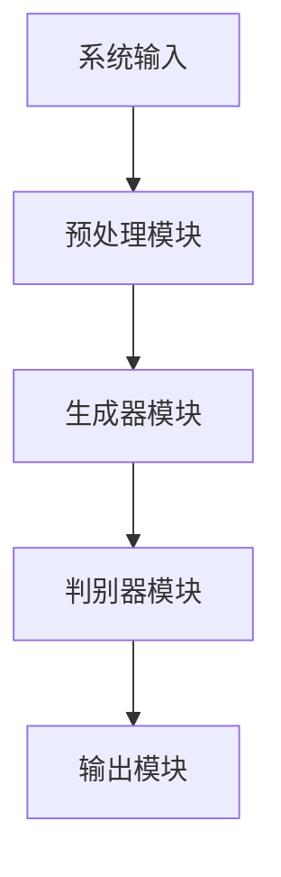
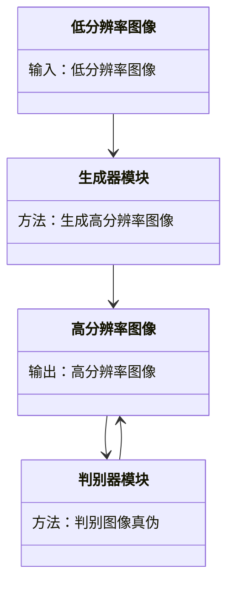
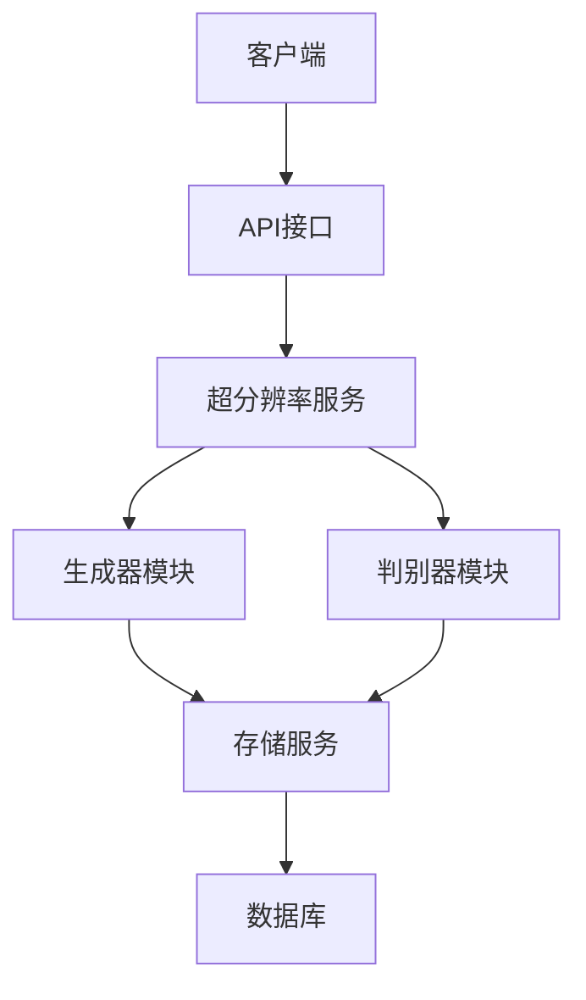
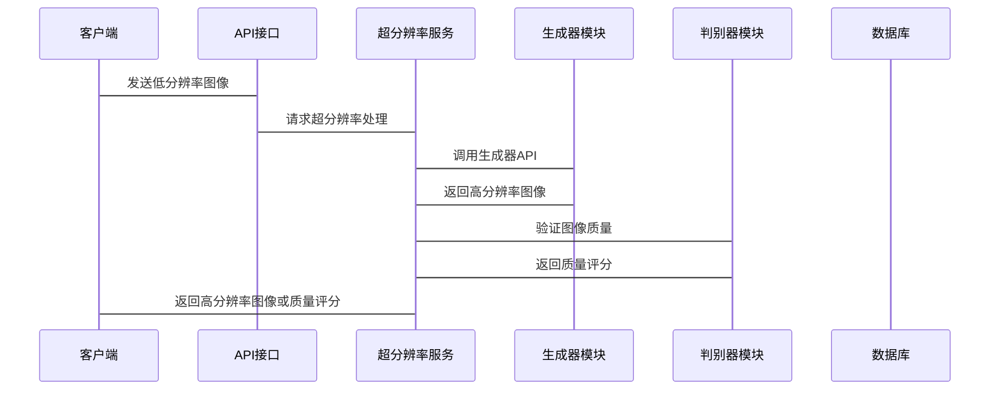

                 


# 《如何识别企业的深度学习图像超分辨率优势》

## 关键词：深度学习，图像超分辨率，生成对抗网络，卷积神经网络，企业应用

## 摘要：本文深入探讨了深度学习技术在图像超分辨率中的应用，分析了SRC和ESRGAN模型的优势，结合企业实际应用场景，详细讲解了系统架构设计和项目实战，并提出了最佳实践建议。

---

## 第三章: 深度学习图像超分辨率的核心算法原理

### 3.2 ESRGAN模型的原理与实现

#### 3.2.1 ESRGAN模型的结构
ESRGAN模型基于生成对抗网络（GAN），由生成器和判别器组成。生成器使用残差学习结构，增强低分辨率图像的特征提取能力。判别器采用更深的网络结构，提高区分能力。

#### 3.2.2 ESRGAN模型的训练过程
1. **预训练阶段**：生成器使用SRC模型进行预训练，提取低分辨率图像的特征。
2. **对抗训练阶段**：生成器和判别器交替训练，生成器优化以欺骗判别器，判别器则不断提升识别能力。

#### 3.2.3 ESRGAN模型的数学公式
生成器的损失函数：
$$ L_{\text{total}} = \lambda L_{\text{content}} + L_{\text{GAN}} $$
其中，$ L_{\text{content}} $ 是基于VGG网络的内容损失，计算公式为：
$$ L_{\text{content}} = ||V(G(I_LR)) - V(I_HR)||_2 $$
$ L_{\text{GAN}} $ 是对抗损失，计算为：
$$ L_{\text{GAN}} = \mathbb{E}_{I_LR}[\log(D(G(I_LR))) + \log(1 - D(I_HR))] $$

#### 3.2.4 模型对比分析
| 模型 | 优势 | 局限 |
|------|------|------|
| SRC | 结构简单，训练速度快 | 生成质量有限 |
| ESRGAN | 生成质量高，细节丰富 | 训练时间长，资源消耗大 |

---

## 第四章: 深度学习图像超分辨率的系统分析与架构设计

### 4.1 企业级图像超分辨率系统的整体架构



### 4.2 系统功能设计

#### 4.2.1 领域模型


### 4.3 系统架构设计



### 4.4 系统接口设计

- **输入接口**：接收低分辨率图像文件，支持多种格式（如JPEG、PNG）。
- **输出接口**：返回高分辨率图像文件，或返回质量评分指标（如PSNR、SSIM）。

### 4.5 系统交互流程



---

## 第五章: 深度学习图像超分辨率的项目实战

### 5.1 环境配置

```bash
# 安装必要的库
pip install numpy
pip install tensorflow
pip install opencv-python
pip install matplotlib
```

### 5.2 系统核心实现源代码

#### 5.2.1 生成器模块实现

```python
import tensorflow as tf
import numpy as np

def residual_block(x):
    residual = tf.keras.layers.Conv2D(64, (3,3), padding='same', activation='relu')(x)
    residual = tf.keras.layers.Conv2D(64, (3,3), padding='same')(residual)
    return tf.keras.layers.Add()([x, residual])

def generator_model(input_shape):
    inputs = tf.keras.Input(shape=input_shape)
    x = tf.keras.layers.Conv2D(64, (3,3), padding='same', activation='relu')(inputs)
    x = tf.keras.layers.Conv2D(64, (3,3), padding='same')(x)
    for _ in range(5):
        x = residual_block(x)
    x = tf.keras.layers.Conv2DTranspose(64, (3,3), strides=(2,2), padding='same', activation='relu')(x)
    x = tf.keras.layers.Conv2D(3, (3,3), padding='same', activation='sigmoid')(x)
    return tf.keras.Model(inputs=inputs, outputs=x)
```

#### 5.2.2 判别器模块实现

```python
def discriminator_model(input_shape):
    inputs = tf.keras.Input(shape=input_shape)
    x = tf.keras.layers.Conv2D(64, (3,3), padding='same', activation='relu')(inputs)
    x = tf.keras.layers.Conv2D(64, (3,3), padding='same', activation='relu')(x)
    x = tf.keras.layers.MaxPool2D(pool_size=(2,2))(x)
    x = tf.keras.layers.Conv2D(128, (3,3), padding='same', activation='relu')(x)
    x = tf.keras.layers.Conv2D(128, (3,3), padding='same', activation='relu')(x)
    x = tf.keras.layers.MaxPool2D(pool_size=(2,2))(x)
    x = tf.keras.layers.Conv2D(256, (3,3), padding='same', activation='relu')(x)
    x = tf.keras.layers.Conv2D(256, (3,3), padding='same', activation='relu')(x)
    x = tf.keras.layers.GlobalAveragePooling2D()(x)
    x = tf.keras.layers.Dense(1, activation='sigmoid')(x)
    return tf.keras.Model(inputs=inputs, outputs=x)
```

### 5.3 模型训练与结果分析

#### 5.3.1 训练过程

```python
# 初始化生成器和判别器
generator = generator_model((None, None, 3))
discriminator = discriminator_model((None, None, 3))

# 定义损失函数和优化器
generator.compile(loss='binary_crossentropy', optimizer='adam')
discriminator.compile(loss='binary_crossentropy', optimizer='adam')

# 训练循环
for epoch in range(100):
    for batch in dataloader:
        low_res_images = batch['low_res']
        high_res_images = batch['high_res']
        
        # 训练判别器
        generated_images = generator.predict(low_res_images)
        d_loss_real = discriminator.train_on_batch(high_res_images, np.ones((len(high_res_images), 1)))
        d_loss_fake = discriminator.train_on_batch(generated_images, np.zeros((len(generated_images), 1)))
        
        # 训练生成器
        g_loss = generator.train_on_batch(low_res_images, np.ones((len(low_res_images), 1)))
```

#### 5.3.2 实际案例分析

**输入：低分辨率图像**

```python
import cv2

low_res_image = cv2.imread('input.jpg', cv2.IMREAD_COLOR)
low_res_image = cv2.resize(low_res_image, (128, 128))
```

**输出：高分辨率图像**

```python
high_res_image = generator.predict(np.array([low_res_image]))
cv2.imwrite('output.jpg', high_res_image[0])
```

---

## 第六章: 深度学习图像超分辨率的最佳实践

### 6.1 小结
本文系统地介绍了深度学习在图像超分辨率中的应用，详细分析了SRC和ESRGAN模型的优势，并通过项目实战展示了如何在企业场景中实现图像超分辨率技术。

### 6.2 注意事项
1. **数据质量**：确保训练数据的多样性和代表性，避免过拟合。
2. **计算资源**：深度学习模型训练需要大量的计算资源，建议使用GPU加速。
3. **模型选择**：根据具体需求选择合适的模型，SRC适合快速实现，ESRGAN适合高质量生成。

### 6.3 未来的发展方向
1. **模型优化**：进一步优化生成器和判别器的结构，提升生成图像的质量和速度。
2. **多任务学习**：结合其他任务（如图像分割）进行联合优化，提高模型的泛化能力。
3. **应用场景扩展**：探索在更多领域的应用，如医学影像、自动驾驶等。

---

## 附录: 参考文献

1. "Image super-resolution using convolutional neural networks (SRCNN)" by Chunmei Hu et al.
2. "ESRGAN: Enhanced Super-Resolution Generative Adversarial Networks" by Xintao Wu et al.
3. TensorFlow官方文档：https://tensorflow.org

---

通过本文的详细讲解，读者可以系统地了解深度学习图像超分辨率的优势，并能够在实际的企业应用场景中有效地识别和利用这些优势。

