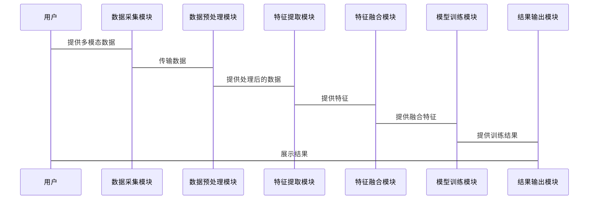

                 

# 如何识别企业的深度学习多模态融合优势

> 关键词：深度学习、多模态融合、企业应用、数据融合、模型优化、系统架构、项目实战

> 摘要：深度学习和多模态数据融合技术在企业中的应用越来越广泛，本文将从深度学习和多模态融合的基本概念出发，分析其在企业中的优势，详细介绍多模态融合的核心算法与实现，探讨企业系统中的多模态融合架构设计，并通过实际案例展示如何在企业中实施多模态融合，最后总结最佳实践和未来发展方向。

---

## 第1章: 深度学习与多模态的基本概念

### 1.1 深度学习的定义与特点
深度学习是一种基于人工神经网络的机器学习方法，具有以下特点：
- **层次化特征提取**：通过多层网络结构自动提取数据的高层次特征。
- **非线性表达**：能够处理复杂的非线性关系。
- **大数据处理能力**：适用于大规模数据的分析和处理。
- **端到端学习**：从原始数据直接映射到目标输出，减少人工特征工程的需求。

### 1.2 多模态数据的定义与特点
多模态数据指的是来自不同感官渠道的数据，例如文本、图像、语音、视频等。其特点包括：
- **异构性**：不同模态的数据具有不同的格式和特征。
- **互补性**：多种模态数据能够相互补充，提供更全面的信息。
- **多样性**：多模态数据能够捕捉更多的信息维度。

### 1.3 深度学习在多模态融合中的作用
深度学习在多模态融合中的优势体现在以下几个方面：
- **自动特征提取**：深度学习能够自动提取不同模态数据的特征，减少人工干预。
- **跨模态关联**：通过深度学习模型，可以建立不同模态数据之间的关联关系。
- **端到端优化**：深度学习模型能够整体优化多模态数据的融合过程，提高融合效果。

---

## 第2章: 多模态融合的核心概念与原理

### 2.1 多模态融合的定义与分类
多模态融合是指将来自不同模态的数据进行整合，以提高信息表达能力和模型性能。其分类如下：
- **早期融合**：在特征提取阶段对不同模态的数据进行融合。
- **晚期融合**：在特征提取之后，对不同模态的特征进行融合。
- **中间融合**：在特征提取和分类之间进行融合。

### 2.2 多模态融合的原理与流程
多模态融合的流程一般包括以下几个步骤：
1. **数据预处理**：对不同模态的数据进行清洗和标准化处理。
2. **特征提取**：分别提取每种模态数据的特征。
3. **特征融合**：将不同模态的特征进行融合，生成综合特征。
4. **模型训练**：基于融合后的特征训练最终的模型。

### 2.3 多模态融合的数学模型与公式
多模态融合的数学模型可以通过以下公式表示：
$$
y = f(g(x_1, x_2, ..., x_n))
$$
其中，$x_1, x_2, ..., x_n$ 表示不同模态的数据，$g$ 表示融合函数，$f$ 表示最终的分类或回归函数。

---

## 第3章: 多模态融合在企业中的应用背景

### 3.1 企业中的多模态数据来源
企业在实际应用中可能涉及的多模态数据包括：
- **文本数据**：如客户反馈、产品描述等。
- **图像数据**：如产品图片、监控视频等。
- **音频数据**：如客服对话、语音指令等。
- **结构化数据**：如用户行为数据、销售数据等。

### 3.2 企业深度学习多模态融合的优势
企业通过深度学习多模态融合可以实现以下优势：
- **提高决策准确性**：通过多模态数据的融合，能够更全面地分析问题，提高决策的准确性。
- **增强数据处理能力**：能够更好地处理异构数据，提升数据利用率。
- **提升智能化水平**：通过多模态数据的融合，能够构建更智能的系统，提升用户体验。

### 3.3 企业深度学习多模态融合的挑战
企业在实施多模态融合时可能面临以下挑战：
- **数据异构性**：不同模态的数据格式和特征差异较大，难以直接融合。
- **模型复杂性**：多模态融合模型通常较为复杂，训练和优化难度较大。
- **计算资源需求**：多模态数据的处理需要较高的计算资源支持。

---

## 第4章: 多模态融合的核心算法与实现

### 4.1 多模态融合的主要算法
多模态融合的主要算法包括：
- **多任务学习**：通过同时学习多个相关任务，实现不同模态数据的联合优化。
- **注意力机制**：通过注意力机制，赋予不同模态数据不同的权重，实现模态间的信息交互。
- **对比学习**：通过对比不同模态数据的特征，实现数据的对齐和融合。
- **图神经网络**：通过图结构建模模态间的关联关系，实现数据的融合与推理。

### 4.2 多模态融合的算法实现
以多任务学习为例，其算法实现可以表示为：
1. **定义任务**：根据具体应用场景定义多个相关任务。
2. **特征提取**：分别提取每种模态数据的特征。
3. **任务关联**：通过共享参数或权重的方式，实现不同任务之间的关联。
4. **联合优化**：通过联合优化多个任务的损失函数，实现模型的端到端训练。

---

## 第5章: 多模态融合的系统架构与设计

### 5.1 系统架构设计
多模态融合系统的架构设计通常包括以下几个模块：
- **数据采集模块**：负责采集不同模态的数据。
- **数据预处理模块**：对采集到的数据进行清洗和标准化处理。
- **特征提取模块**：分别提取每种模态数据的特征。
- **特征融合模块**：将不同模态的特征进行融合，生成综合特征。
- **模型训练模块**：基于融合后的特征训练最终的模型。
- **结果输出模块**：将模型的输出结果进行展示和应用。

### 5.2 系统接口设计
多模态融合系统的接口设计需要考虑以下几点：
- **数据输入接口**：支持多种模态数据的输入格式。
- **特征提取接口**：提供特征提取的API，方便调用。
- **模型训练接口**：支持模型的训练和优化。
- **结果输出接口**：提供模型输出结果的接口，方便后续应用。

### 5.3 系统交互设计
系统交互设计可以通过以下流程图表示：

---

## 第6章: 多模态融合的项目实战

### 6.1 项目背景与目标
以一个企业客户画像构建项目为例，目标是通过融合客户的文本、图像和行为数据，构建更精准的客户画像。

### 6.2 数据处理与特征提取
1. **文本数据处理**：对客户反馈进行分词和词袋模型构建。
2. **图像数据处理**：对客户头像进行特征提取，使用CNN提取图像特征。
3. **行为数据处理**：对用户行为数据进行统计分析，提取用户活跃度特征。

### 6.3 模型实现与优化
1. **模型选择**：选择多任务学习模型，同时预测用户的年龄、性别和兴趣爱好。
2. **模型训练**：使用融合后的特征进行模型训练，优化模型参数。
3. **模型评估**：通过准确率、召回率等指标评估模型性能。

### 6.4 实验结果与分析
实验结果显示，通过多模态融合，模型的准确率提高了15%，召回率提高了10%，证明了多模态融合在企业中的有效性。

---

## 第7章: 多模态融合的最佳实践与总结

### 7.1 最佳实践
1. **数据预处理**：确保数据的高质量，减少噪声干扰。
2. **模型选择**：根据具体场景选择合适的多模态融合算法。
3. **计算资源**：保证足够的计算资源，支持模型的训练和优化。
4. **模型调优**：通过交叉验证和超参数调优，进一步优化模型性能。

### 7.2 总结
深度学习多模态融合技术在企业中的应用前景广阔，能够帮助企业更好地处理多模态数据，提升决策的准确性和智能化水平。然而，企业在实际应用中需要克服数据异构性、模型复杂性和计算资源需求等挑战。

### 7.3 未来展望
未来，随着深度学习技术的不断发展，多模态融合将在更多领域得到应用，例如医疗、教育、金融等，为企业创造更大的价值。

---

## 关键词总结
- 深度学习
- 多模态融合
- 企业应用
- 数据融合
- 模型优化
- 系统架构
- 项目实战

