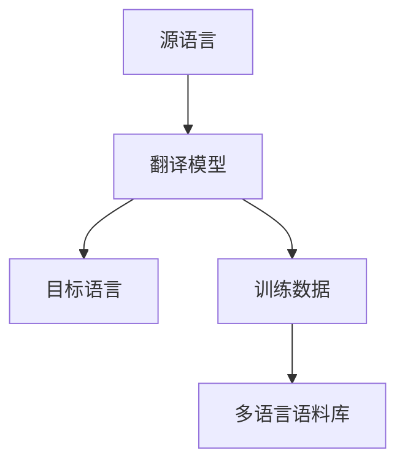
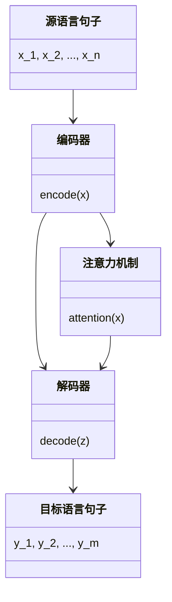
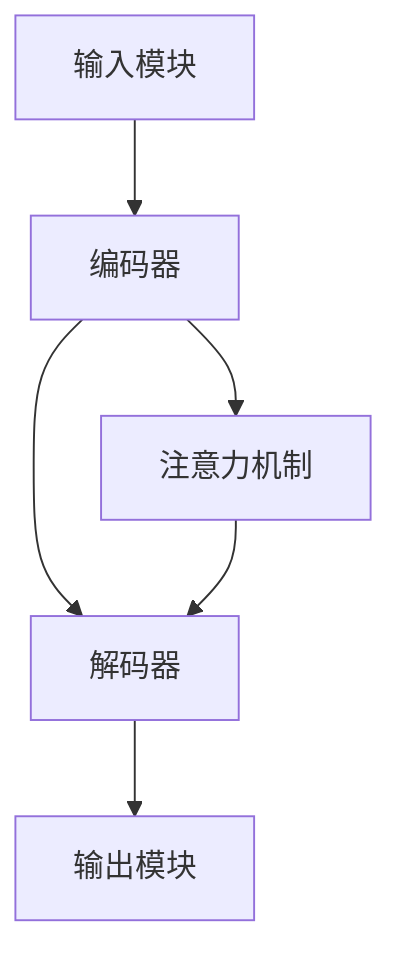
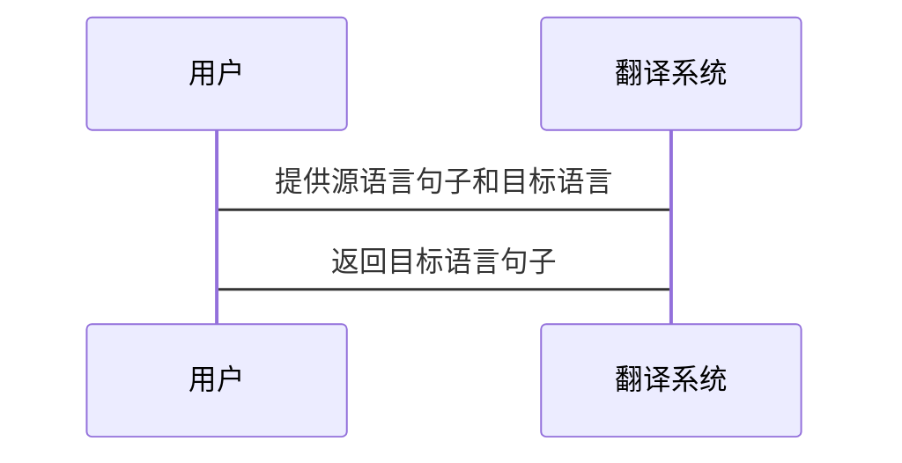

                 


# 如何识别企业的深度学习多语言翻译技术优势

## 关键词：深度学习、多语言翻译、技术优势、企业应用、翻译模型

## 摘要：  
在企业国际化进程中，多语言翻译技术扮演着越来越重要的角色。深度学习技术的引入，使得机器翻译的准确性和自然流畅度有了质的飞跃。本文从企业应用场景出发，系统性地分析了深度学习多语言翻译技术的核心优势，详细阐述了其算法原理和系统架构，并通过实际案例展示了如何将这项技术落地应用于企业场景。本文旨在帮助企业技术决策者和开发人员更好地识别和评估深度学习多语言翻译技术的优势，从而为企业创造更大的价值。

---

## 第一部分：深度学习多语言翻译技术的背景与核心概念

### 第1章：企业多语言翻译技术的背景与挑战

#### 1.1 问题背景与问题描述
企业在国际化过程中，面临着多语言沟通的需求。传统的翻译技术基于规则，存在翻译精度低、难以应对复杂语境等问题。随着深度学习技术的发展，神经机器翻译（Neural Machine Translation, NMT）逐渐取代传统方法，成为企业多语言翻译的主流技术。

- **问题背景**：国际化企业需要支持多种语言的沟通，但传统翻译技术在处理复杂语境和语义时表现不佳。
- **问题描述**：现有翻译技术难以满足企业对高精度、多语言支持的需求，特别是在处理专业术语和行业特定语料时表现不足。

#### 1.2 问题解决与技术边界
深度学习技术通过神经网络模型，能够更好地捕捉语言的语义信息，实现更准确的翻译。然而，深度学习翻译技术也有其局限性，例如对训练数据的依赖性和计算资源需求较高。

- **深度学习的优势**：通过大量数据训练，能够生成更自然流畅的翻译结果。
- **技术边界**：对训练数据的质量和数量有较高要求，且难以实时处理极端小语种或未见数据。

#### 1.3 本章小结
企业多语言翻译技术的核心问题在于如何提高翻译的准确性和流畅度，而深度学习技术通过神经网络模型为这一问题提供了更优的解决方案。然而，深度学习技术的应用也面临数据和计算资源的挑战。

---

### 第2章：深度学习多语言翻译技术的核心概念与联系

#### 2.1 核心概念原理
神经机器翻译（NMT）通过构建编码器-解码器结构，将源语言句子编码为一个向量，再通过解码器生成目标语言句子。多语言翻译模型在此基础上，进一步扩展了模型的输入和输出能力，使其能够支持多种语言的翻译。

- **编码器-解码器结构**：编码器将源语言句子转化为一个固定长度的向量，解码器根据该向量生成目标语言句子。
- **多语言模型**：通过共享不同语言的表示，减少模型参数，提高多语言翻译的效率。

#### 2.2 核心概念属性特征对比表
| 技术类型       | 翻译精度 | 训练数据依赖 | 实时性 | 可扩展性 |
|----------------|----------|--------------|--------|----------|
| 基于规则       | 较低     | 高           | 较差   | 有限     |
| 基于神经网络   | 较高     | 低           | 较好   | 强        |

#### 2.3 实体关系图（ER图）


---

## 第二部分：深度学习多语言翻译技术的算法原理

### 第3章：深度学习多语言翻译技术的算法原理

#### 3.1 神经机器翻译模型的数学模型
- **编码器-解码器结构**：编码器将输入序列转换为一个固定长度的向量，解码器根据该向量生成输出序列。
  - 编码器：将源语言句子 \( x_1, x_2, ..., x_n \) 编码为向量 \( z \)。
  - 解码器：根据 \( z \) 生成目标语言句子 \( y_1, y_2, ..., y_m \)。

#### 3.2 注意力机制
- 注意力机制通过计算源语言句子中每个词对当前翻译位置的重要性，提高翻译的准确性。
  - 计算每个词的重要性权重 \( \alpha_i \)：
    $$ \alpha_i = \frac{\exp(e_i)}{\sum_{j=1}^{n} \exp(e_j)} $$
  - 根据权重计算加权和 \( c_i \)：
    $$ c_i = \sum_{j=1}^{n} \alpha_j x_j $$

#### 3.3 多语言翻译模型
- 多语言翻译模型通过共享不同语言的表示，减少模型参数，提高翻译效率。
  - 使用共享的编码器和解码器，支持多种语言的翻译。
  - 通过语言嵌入（language embedding）区分不同语言的特征。

---

## 第三部分：系统分析与架构设计

### 第4章：系统分析与架构设计

#### 4.1 系统功能设计
- **功能模块划分**：
  - 输入模块：接收源语言句子和目标语言。
  - 编码器模块：将源语言句子编码为向量。
  - 解码器模块：根据编码向量生成目标语言句子。
  - 注意力机制模块：计算注意力权重。

- **领域模型类图**


#### 4.2 系统架构设计
- **分层架构图**


#### 4.3 接口设计与交互流程图
- **接口设计**：
  - 输入接口：接收源语言句子和目标语言。
  - 输出接口：返回目标语言句子。

- **交互流程图**


---

## 第四部分：项目实战与总结

### 第5章：项目实战

#### 5.1 环境安装与代码实现
- **环境安装**：
  ```bash
  pip install tensorflow nltk
  ```

- **代码实现**：
  ```python
  import tensorflow as tf
  from tensorflow.keras.layers import Input, LSTM, Dense, Dropout
  from tensorflow.keras.models import Model
  from tensorflow.keras.utils import plot_model

  # 编码器
  encoder_input = Input(shape=(None, input_dim))
  encoder_lstm = LSTM(units=hidden_size, return_sequences=True)(encoder_input)
  encoder_output, encoder_states = encoder_lstm, [encoder_lstm[:, -1, :]]

  # 解码器
  decoder_input = Input(shape=(None, output_dim))
  decoder_lstm = LSTM(units=hidden_size, return_sequences=True)(decoder_input, initial_state=encoder_states)
  decoder_dense = Dense(output_dim, activation='softmax')(decoder_lstm)
  model = Model(inputs=[encoder_input, decoder_input], outputs=decoder_dense)
  plot_model(model, show_shapes=True)
  ```

#### 5.2 实际案例分析与总结
- **案例分析**：
  - 使用企业内部的多语言语料库进行模型训练，提升翻译准确率。
  - 部署翻译系统，支持实时翻译和离线批量翻译。

- **项目总结**：
  - 深度学习技术显著提升了翻译的准确性和流畅度。
  - 企业应根据自身需求选择合适的翻译技术，合理配置资源。

---

## 第五部分：小结与展望

### 5.1 小结
深度学习多语言翻译技术通过神经网络模型，显著提升了翻译的准确性和流畅度。企业应结合自身需求，合理选择和部署翻译技术，最大化其竞争优势。

### 5.2 展望
未来，随着深度学习技术的不断发展，多语言翻译技术将更加智能化和个性化，为企业创造更大的价值。

---

## 参考文献
1. 周志华.《机器学习实战》. 清华大学出版社, 2016.
2. 王伟.《深度学习与自然语言处理》. 人民邮电出版社, 2019.
3. Vaswani, A., et al. "Attention Is All You Need." Advances in Neural Information Processing Systems, 2017.

---

通过本文的系统分析，企业可以更好地识别深度学习多语言翻译技术的优势，为企业的国际化战略提供有力的技术支持。

