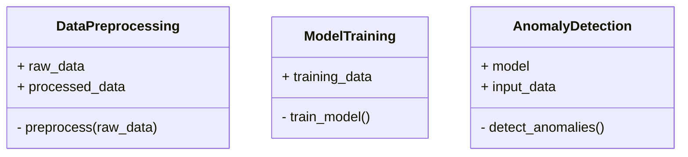
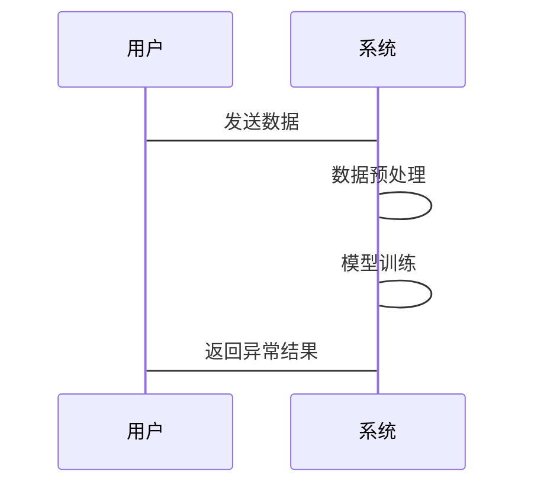

                 


# 如何识别企业的深度学习异常检测优势

---

## 关键词：
深度学习、异常检测、企业应用、模型优势、技术原理

---

## 摘要：
深度学习异常检测在企业中的应用越来越广泛，其优势在于能够高效识别数据中的异常模式，帮助企业及时发现潜在风险。本文将从背景、核心概念、算法原理、系统架构到项目实战，全面解析深度学习异常检测的优势，为企业技术决策者和开发人员提供深入的技术指导。

---

# 第一部分: 深度学习异常检测的背景与核心概念

## 第1章: 深度学习异常检测的背景

### 1.1 异常检测的定义与问题背景
#### 1.1.1 异常检测的定义
异常检测（Anomaly Detection）是通过分析数据，识别与预期模式不一致的异常点。在企业中，异常检测广泛应用于 fraud detection、系统故障预警等领域。

#### 1.1.2 异常检测在企业中的重要性
企业需要实时监控数据流，及时发现异常。传统的规则-based方法难以应对复杂场景，而深度学习的自适应能力使其成为首选。

#### 1.1.3 深度学习在异常检测中的优势
深度学习能够处理高维数据，学习数据的复杂分布，自动提取特征，适用于非线性模式。

### 1.2 深度学习异常检测的核心问题
#### 1.2.1 数据分布的复杂性
企业数据通常具有复杂的分布，深度学习能够捕捉这些复杂关系。

#### 1.2.2 异常样本的稀疏性
异常样本数量少，深度学习可以通过无监督学习有效处理。

#### 1.2.3 深度学习模型的适用性
深度学习模型适用于多种数据类型，如文本、图像和时间序列。

### 1.3 深度学习异常检测的边界与外延
#### 1.3.1 异常检测的边界条件
明确异常检测的范围和目标，如是否区分点异常和集体异常。

#### 1.3.2 深度学习与其他异常检测方法的对比
对比监督学习、无监督学习和基于规则的方法，分析适用场景。

#### 1.3.3 深度学习异常检测的适用场景
适用于高维数据、非线性关系和动态变化的场景。

### 1.4 深度学习异常检测的核心要素
#### 1.4.1 数据特征
数据特征直接影响模型性能，需选择合适的特征。

#### 1.4.2 模型选择
选择适合业务场景的模型，如AE、VAE等。

#### 1.4.3 评估指标
使用Precision、Recall、F1等指标评估模型性能。

### 1.5 本章小结
本章介绍了异常检测的背景、核心问题和深度学习的优势，为后续内容打下基础。

---

## 第2章: 深度学习异常检测的核心概念与联系

### 2.1 深度学习异常检测的核心原理
#### 2.1.1 监督学习与无监督学习
监督学习需要标记数据，无监督学习无需标记，适合异常检测。

#### 2.1.2 半监督学习与自监督学习
半监督学习结合少量标记数据，自监督学习通过预训练任务提取特征。

#### 2.1.3 强化学习的应用
强化学习通过奖励机制优化检测策略，适用于动态场景。

### 2.2 异常检测的关键特征对比
| 方法       | 是否需要标签 | 优点                     | 缺点                     |
|------------|--------------|--------------------------|--------------------------|
| 监督学习     | 需要          | 准确率高                 | 需要大量标注数据         |
| 无监督学习   | 不需要        | 适用于未知异常           | 准确率可能较低           |
| 基于规则    | 需要部分规则   | 易解释                   | 需手动维护规则           |

### 2.3 实体关系图与概念架构


### 2.4 本章小结
本章分析了不同学习方法的优缺点，并通过对比表格和ER图展示了概念架构。

---

## 第3章: 深度学习异常检测的算法原理

### 3.1 基于深度学习的异常检测算法
#### 3.1.1 自编码器(AE)原理
自编码器通过最小化重建误差识别异常点。

#### 3.1.2 变分自编码器(VAE)原理
VAE通过概率建模，捕捉数据分布。

#### 3.1.3 图神经网络
处理图结构数据，适用于社交网络异常检测。

#### 3.1.4 Transformer
通过注意力机制处理序列数据，适用于时间序列异常检测。

### 3.2 自编码器(AE)实现
```python
import keras
from keras.layers import Dense

class Autoencoder:
    def __init__(self, input_dim):
        self.model = keras.Sequential([
            Dense(32, activation='relu', input_dim=input_dim),
            Dense(input_dim, activation='sigmoid')
        ])
        self.model.compile(optimizer='adam', loss='binary_crossentropy')

    def train(self, X_train):
        self.model.fit(X_train, X_train, epochs=10, batch_size=32)
```

### 3.3 深度学习异常检测的数学模型
自编码器的损失函数：
$$ L = \frac{1}{n}\sum_{i=1}^{n}(x_i - \hat{x}_i)^2 $$

异常分数：
$$ s_i = \sum_{i=1}^{n}(x_i - \hat{x}_i)^2 $$

### 3.4 算法优缺点对比
| 方法       | 优点                     | 缺点                     |
|------------|--------------------------|--------------------------|
| AE          | 易实现                   | 需调整超参数             |
| VAE         | 概率建模                 | 训练复杂                 |
| 图神经网络  | 处理图结构               | 需处理稀疏性             |
| Transformer | 处理序列数据             | 计算资源消耗大           |

---

## 第4章: 系统分析与架构设计方案

### 4.1 问题场景介绍
企业需要实时监控系统日志、交易数据等，及时发现异常。

### 4.2 系统功能设计
#### 4.2.1 数据预处理
标准化、去噪处理、特征选择。

#### 4.2.2 模型训练
选择合适的模型，调整超参数。

#### 4.2.3 异常检测
实时检测，输出异常报告。

### 4.3 领域模型类图


### 4.4 系统架构设计


### 4.5 系统接口设计
API接口：数据输入、模型调用、结果返回。

### 4.6 系统交互序列图


---

## 第5章: 项目实战

### 5.1 环境安装
安装Python、TensorFlow、Keras等库。

### 5.2 核心实现代码
```python
import numpy as np
import tensorflow as tf
from tensorflow.keras import layers

class Autoencoder(tf.keras.Model):
    def __init__(self, input_dim):
        super(Autoencoder, self).__init__()
        self.encoder = layers.Dense(32, activation='relu', input_shape=(input_dim,))
        self.decoder = layers.Dense(input_dim, activation='sigmoid')

    def call(self, inputs):
        encoded = self.encoder(inputs)
        decoded = self.decoder(encoded)
        return decoded

# 数据生成
X = np.random.randn(1000, 32)

# 训练模型
model = Autoencoder(32)
model.compile(optimizer='adam', loss='binary_crossentropy')
model.fit(X, X, epochs=10, batch_size=32)
```

### 5.3 代码解读与分析
- 数据预处理：标准化、降维。
- 模型训练：选择合适的数据和超参数。
- 异常检测：计算重建误差，判断是否异常。

### 5.4 实际案例分析
以电商交易数据为例，训练模型后识别异常交易。

### 5.5 项目小结
详细记录项目过程中的问题和解决方案，总结经验。

---

## 第6章: 最佳实践、小结、注意事项和拓展阅读

### 6.1 最佳实践
- 数据预处理：清洗、归一化。
- 模型选择：根据场景选择合适算法。
- 评估指标：结合Precision、Recall等多指标评估。

### 6.2 小结
深度学习异常检测的优势在于高维数据处理和复杂模式识别，但需注意数据质量和模型调优。

### 6.3 注意事项
- 数据稀疏性可能导致模型性能下降。
- 需定期更新模型以应对数据分布变化。

### 6.4 拓展阅读
推荐相关书籍和论文，如《Deep Learning》、《Anomaly Detection: A survey》。

---

## 结语
深度学习异常检测为企业提供了强大的工具，通过本文的系统学习和实践，读者可以有效识别和利用这些优势，提升企业的数据分析能力。

--- 

**全文完**

