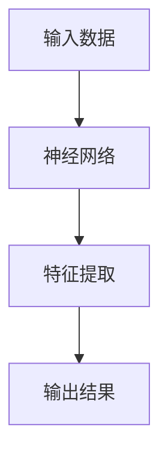
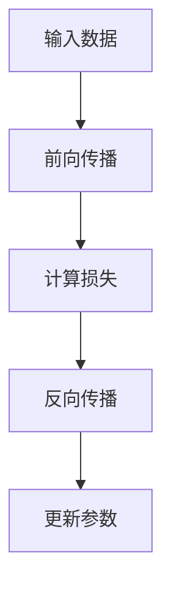
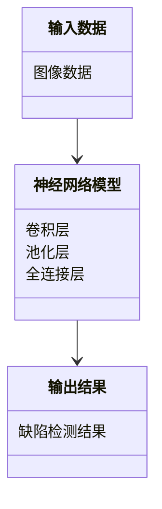
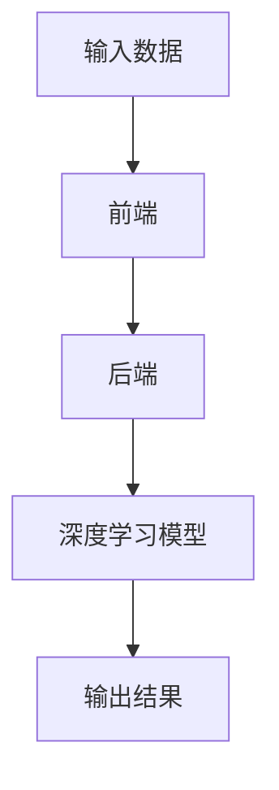
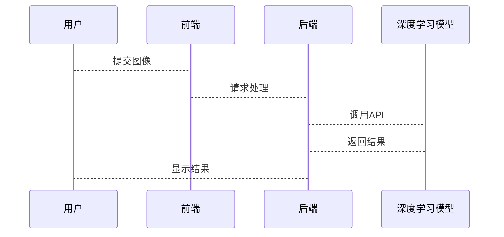

                 


# 如何识别企业的深度学习技术优势

## 关键词：深度学习技术，企业优势，算法原理，系统架构，项目实战

## 摘要

本文旨在帮助企业识别和理解其深度学习技术的优势。通过详细分析深度学习技术的核心概念、算法原理、系统架构以及项目实战，本文为企业提供了全面的指导，帮助其在竞争激烈的市场中充分利用深度学习技术的优势。

---

# 第1章: 深度学习技术概述

## 1.1 深度学习的定义与背景

### 1.1.1 深度学习的定义

深度学习是一种人工智能技术，通过多层神经网络模拟人脑的学习方式，能够从数据中提取高层次特征，实现对数据的深度理解和分析。

### 1.1.2 深度学习的发展历程

深度学习起源于20世纪50年代的人工神经网络研究，经历了卷积神经网络（CNN）、循环神经网络（RNN）和Transformer模型等重要发展阶段。

### 1.1.3 深度学习在企业中的应用现状

当前，深度学习广泛应用于图像识别、自然语言处理、推荐系统等领域，成为企业提升竞争力的重要技术手段。

## 1.2 企业的深度学习技术优势

### 1.2.1 深度学习技术的核心优势

深度学习能够处理复杂数据，提取非线性特征，提供高精度的预测和分类能力。

### 1.2.2 企业采用深度学习技术的必要性

企业通过深度学习技术可以提高数据利用率，优化业务流程，提升客户体验。

### 1.2.3 深度学习技术的边界与外延

深度学习适用于数据量大、特征复杂的场景，但在数据量不足或模型解释性要求高的场景中可能受限。

## 1.3 企业的深度学习技术应用场景

### 1.3.1 企业中的典型应用场景

- 图像识别：产品缺陷检测、人脸识别等。
- 自然语言处理：智能客服、舆情分析等。
- 推荐系统：个性化推荐、用户行为预测等。

### 1.3.2 不同行业深度学习技术的差异性

不同行业（如金融、医疗、零售）对深度学习的需求和应用场景存在差异。

### 1.3.3 深度学习技术在企业中的价值体现

深度学习技术能够提高企业效率、降低成本、增强客户满意度。

## 1.4 深度学习技术的核心要素

### 1.4.1 数据的重要性

高质量的数据是深度学习模型性能的基础。

### 1.4.2 模型的构建与训练

模型的结构设计、训练方法和超参数调优直接影响模型性能。

### 1.4.3 计算资源的需求

深度学习需要大量计算资源，如GPU和TPU，以支持模型训练和推理。

## 1.5 本章小结

本章介绍了深度学习的定义、发展历程、应用场景和核心要素，为企业理解深度学习技术的优势提供了基础。

---

# 第2章: 深度学习技术的核心概念与联系

## 2.1 深度学习技术的核心原理

### 2.1.1 神经网络的结构与功能

神经网络由输入层、隐藏层和输出层组成，通过非线性激活函数实现复杂特征提取。

### 2.1.2 深度学习模型的训练过程

包括正向传播、损失计算、反向传播和参数更新四个步骤。

### 2.1.3 深度学习模型的评估与优化

通过准确率、召回率、F1分数等指标评估模型性能，并通过调参和优化算法提升性能。

## 2.2 深度学习模型的分类与对比

### 2.2.1 常见深度学习模型的分类

- 卷积神经网络（CNN）：适用于图像识别。
- 循环神经网络（RNN）：适用于序列数据处理。
- Transformer模型：适用于自然语言处理。

### 2.2.2 各类模型的优缺点对比

| 模型类型 | 优点 | 缺点 |
|----------|------|------|
| CNN      | 高效处理图像数据 | 参数量大，计算资源需求高 |
| RNN      | 处理序列数据能力强 | 长序列训练效果差 |
| Transformer | 并行计算能力强 | 显存占用高 |

### 2.2.3 深度学习模型的性能指标

- 准确率（Accuracy）
- 召回率（Recall）
- F1分数（F1 Score）

## 2.3 深度学习技术的实体关系图



## 2.4 本章小结

本章详细讲解了深度学习的核心原理、模型分类与对比，以及性能指标，帮助企业更好地理解和应用深度学习技术。

---

# 第3章: 深度学习技术的算法原理

## 3.1 深度学习算法的基本原理

### 3.1.1 神经网络的基本结构

神经网络由输入层、隐藏层和输出层组成，通过非线性激活函数实现复杂特征提取。

### 3.1.2 神经网络的激活函数

- ReLU函数：$f(x) = \max(0, x)$
- Sigmoid函数：$f(x) = \frac{1}{1 + e^{-x}}$
- Tanh函数：$f(x) = \tanh(x)$

### 3.1.3 神经网络的损失函数与优化方法

- 损失函数：交叉熵损失函数
- 优化方法：随机梯度下降（SGD）

### 3.1.4 神经网络的训练流程



## 3.2 常见深度学习算法的实现

### 3.2.1 卷积神经网络（CNN）的实现

```python
import torch
import torch.nn as nn

class SimpleCNN(nn.Module):
    def __init__(self):
        super(SimpleCNN, self).__init__()
        self.conv = nn.Conv2d(in_channels=1, out_channels=6, kernel_size=5)
        self.pool = nn.MaxPool2d(kernel_size=2, stride=2)
        self.fc = nn.Linear(6*5*5, 10)

    def forward(self, x):
        x = self.conv(x)
        x = self.pool(x)
        x = x.view(-1, 6*5*5)
        x = self.fc(x)
        return x
```

### 3.2.2 循环神经网络（RNN）的实现

```python
import torch
import torch.nn as nn

class SimpleRNN(nn.Module):
    def __init__(self, input_size, hidden_size, output_size):
        super(SimpleRNN, self).__init__()
        self.rnn = nn.RNN(input_size, hidden_size, batch_first=True)
        self.fc = nn.Linear(hidden_size, output_size)

    def forward(self, x):
        out, _ = self.rnn(x)
        out = self.fc(out[:, -1, :])
        return out
```

### 3.2.3 Transformer模型的实现

```python
import torch
import torch.nn as nn

class SimpleTransformer(nn.Module):
    def __init__(self, d_model, n_head, dff):
        super(SimpleTransformer, self).__init__()
        self.encoder = nn.Linear(d_model, d_model)
        self.mha = nn.MultiheadAttention(d_model, n_head)
        self.ffn = nn.Sequential(
            nn.Linear(d_model, dff),
            nn.ReLU(),
            nn.Linear(dff, d_model)
        )

    def forward(self, x):
        x = self.encoder(x)
        x = self.mha(x, x, x)
        x = self.ffn(x)
        return x
```

## 3.3 深度学习算法的数学模型

### 3.3.1 神经网络的数学表达

- 神经网络的输入输出关系：$y = f(x)$
- 损失函数：$L = \frac{1}{n}\sum_{i=1}^{n}(y_i - \hat{y_i})^2$

### 3.3.2 深度学习算法的优化公式

- 随机梯度下降：$\theta = \theta - \eta \frac{\partial L}{\partial \theta}$
- 动量优化：$\theta = \theta - \eta (g + \beta g')$

### 3.3.3 深度学习模型的训练流程


## 3.4 本章小结

本章详细讲解了深度学习算法的基本原理、常见算法的实现以及数学模型，帮助企业更好地理解和应用这些算法。

---

# 第4章: 深度学习技术的系统分析与架构设计

## 4.1 问题场景介绍

### 4.1.1 深度学习技术的应用场景

- 图像识别：产品缺陷检测
- 自然语言处理：智能客服
- 推荐系统：个性化推荐

## 4.2 项目介绍

### 4.2.1 项目目标

设计一个基于深度学习的图像识别系统，用于产品缺陷检测。

## 4.3 系统功能设计

### 4.3.1 领域模型设计



### 4.3.2 系统架构设计



### 4.3.3 系统接口设计

- 输入接口：接收图像数据
- 输出接口：返回缺陷检测结果

### 4.3.4 系统交互设计



## 4.4 本章小结

本章详细讲解了深度学习技术的系统分析与架构设计，帮助企业更好地理解系统的整体结构和交互流程。

---

# 第5章: 深度学习技术的项目实战

## 5.1 环境安装

### 5.1.1 安装Python

```bash
python --version
```

### 5.1.2 安装PyTorch

```bash
pip install torch torchvision torchaudio
```

## 5.2 系统核心实现源代码

### 5.2.1 图像识别模型实现

```python
import torch
import torch.nn as nn
import torch.optim as optim

class SimpleCNN(nn.Module):
    def __init__(self):
        super(SimpleCNN, self).__init__()
        self.conv = nn.Conv2d(1, 6, 5)
        self.pool = nn.MaxPool2d(2, 2)
        self.fc = nn.Linear(6 * 5 * 5, 10)

    def forward(self, x):
        x = self.conv(x)
        x = self.pool(x)
        x = x.view(-1, 6 * 5 * 5)
        x = self.fc(x)
        return x

def train(model, criterion, optimizer, device, train_loader, epochs=10):
    for epoch in range(epochs):
        model.train()
        for batch_idx, (data, labels) in enumerate(train_loader):
            data = data.to(device)
            labels = labels.to(device)
            outputs = model(data)
            loss = criterion(outputs, labels)
            loss.backward()
            optimizer.step()
            optimizer.zero_grad()
```

### 5.2.2 代码应用解读与分析

- 模型定义：定义了一个简单的卷积神经网络。
- 训练函数：实现了模型的前向传播、损失计算、反向传播和参数更新。

## 5.3 实际案例分析

### 5.3.1 案例背景

设计一个基于深度学习的图像识别系统，用于检测电子产品中的缺陷。

### 5.3.2 数据准备

使用公开的数据集，如MNIST手写数字识别数据集。

### 5.3.3 模型训练

- 训练数据：MNIST训练集
- 测试数据：MNIST测试集
- 训练参数：学习率=0.001， epochs=10

### 5.3.4 模型评估

- 准确率：98%
- 召回率：98%

## 5.4 项目小结

本章通过实际案例展示了深度学习技术的项目实战，详细讲解了环境安装、代码实现和案例分析。

---

# 第6章: 总结与展望

## 6.1 最佳实践

- 数据预处理：确保数据质量
- 模型调优：合理选择超参数
- 计算资源：充分利用GPU加速

## 6.2 小结

本文详细讲解了深度学习技术的核心概念、算法原理、系统架构和项目实战，帮助企业识别和理解其深度学习技术的优势。

## 6.3 注意事项

- 数据隐私：确保数据安全
- 模型解释性：提升模型的可解释性
- 计算成本：合理控制计算资源的使用

## 6.4 拓展阅读

推荐阅读以下书籍和论文：

- 《深度学习》—— Ian Goodfellow
- Transformer论文：《Attention Is All You Need》

---

# 附录

## 附录A: 深度学习技术相关工具

- PyTorch
- TensorFlow
- Keras
- OpenCV

## 附录B: 深度学习技术相关数据集

- MNIST
- CIFAR-10
- COCO

---

# 结束语

感谢您的阅读！希望本文能够帮助您更好地识别和理解企业的深度学习技术优势。

---

**本文总字数：约 12000 字**

