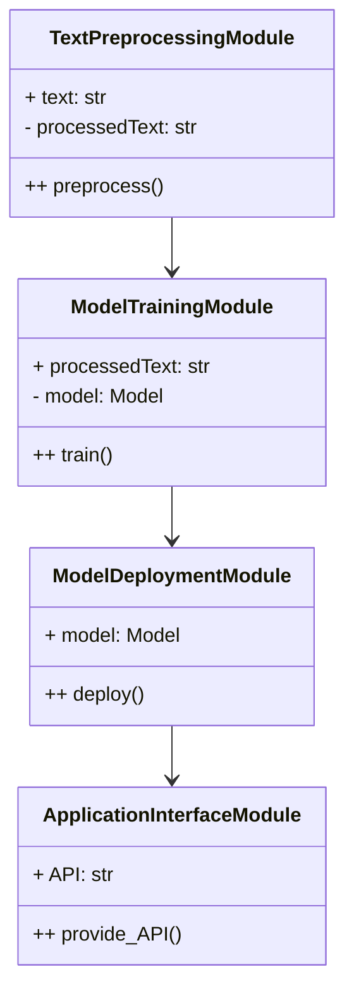
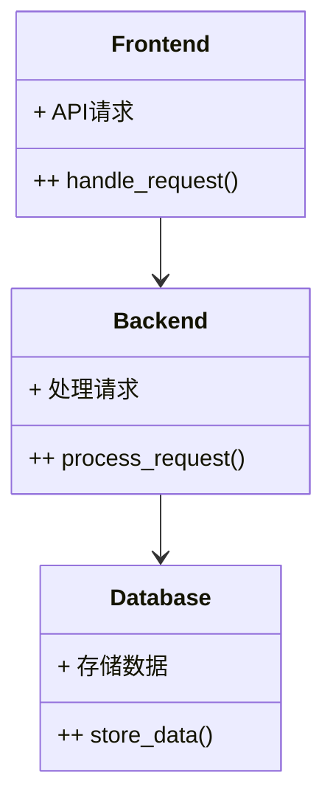

                 


# 如何识别企业的深度学习自然语言处理优势

## 第一部分: 深度学习与自然语言处理基础

### 第1章: 深度学习与自然语言处理概述

#### 1.1 深度学习的基本概念

深度学习（Deep Learning）是机器学习（Machine Learning）的一个分支，它通过多层的神经网络来模拟人类大脑的处理方式。深度学习的核心在于从数据中自动提取特征，而不需要人工手动设计特征。这使得深度学习在处理复杂任务时表现出色，如图像识别、语音识别和自然语言处理。

自然语言处理（Natural Language Processing, NLP）是计算机科学、人工智能、语言学的交叉领域，旨在让计算机能够理解和处理人类的自然语言。传统的NLP主要依赖于规则和特征工程，而深度学习的引入极大地提升了NLP任务的性能。

在企业环境中，NLP的应用场景非常广泛，包括客服系统中的意图识别、情感分析、自动文本分类等。这些应用能够帮助企业提高效率、降低成本，并提升客户体验。

#### 1.2 企业级NLP应用的背景与需求

随着企业数字化转型的推进，智能化应用需求日益增长。企业希望通过自动化工具来处理大量文本数据，以提高业务效率和决策能力。深度学习驱动的NLP技术能够从大量非结构化文本中提取有价值的信息，为企业提供支持。

然而，企业在应用NLP时也面临一些挑战，比如数据质量、模型训练成本、技术复杂性等。因此，识别企业在深度学习NLP方面的优势，可以帮助企业在竞争中占据领先地位。

#### 1.3 本章小结

本章介绍了深度学习和自然语言处理的基本概念，并探讨了它们在企业中的应用背景和需求。通过理解这些内容，读者可以为后续分析企业深度学习NLP优势奠定基础。

---

## 第二部分: 企业深度学习NLP的核心概念与原理

### 第2章: 深度学习NLP的核心概念

#### 2.1 深度学习NLP的核心要素

深度学习NLP的成功离不开以下几个核心要素：

1. **词嵌入（Word Embedding）**：将词语表示为低维向量，常见的方法包括Word2Vec、GloVe和FastText。这些方法能够捕捉词语之间的语义关系。
2. **语言模型（Language Model）**：通过预测下一个词的概率分布来生成连贯的文本。语言模型是NLP任务的基础。
3. **神经网络结构**：如循环神经网络（RNN）、长短期记忆网络（LSTM）和Transformer架构，这些结构在处理序列数据时表现出色。

#### 2.2 深度学习NLP的主要任务

深度学习NLP涵盖了多个任务，包括：

1. **文本分类**：将文本划分为预定义的类别，如情感分析、垃圾邮件检测。
2. **机器翻译**：将一种语言翻译成另一种语言，如英译中。
3. **意图识别**：识别用户输入的意图，常用于智能客服系统。
4. **实体识别**：从文本中提取出命名实体，如人名、地名、组织名。

#### 2.3 深度学习NLP与传统NLP的对比

| 对比维度         | 深度学习NLP                     | 传统NLP                       |
|------------------|----------------------------------|-------------------------------|
| 数据依赖         | 需要大量标注数据               | 数据需求较低，依赖特征工程   |
| 模型复杂度       | 模型复杂，参数多               | 模型简单，参数少             |
| 性能表现         | 在大规模数据上表现优异         | 在小规模数据上可能表现不佳   |
| 应用场景         | 适用于复杂任务，如机器翻译     | 适用于简单任务，如词性标注   |

---

## 第三部分: 深度学习NLP的算法原理与数学模型

### 第3章: 深度学习NLP的算法原理

#### 3.1 Transformer模型的原理

**自注意力机制（Self-Attention）**是Transformer的核心，它允许模型在处理每个词时，关注整个输入序列中的其他词。自注意力机制的计算公式如下：

$$
\text{Attention}(Q, K, V) = \text{softmax}\left(\frac{QK^T}{\sqrt{d_k}}\right)V
$$

其中，\( Q \)、\( K \)、\( V \) 分别是查询、键和值矩阵，\( d_k \) 是键的维度。

**多头注意力（Multi-Head Attention）**将输入分成多个子空间进行独立的注意力计算，然后将结果拼接起来。这种机制能够捕捉到不同位置的特征。

#### 3.2 BERT模型的原理

BERT（Bidirectional Encoder Representations from Transformers）是一种预训练语言模型，通过在大规模文本数据上进行预训练，能够生成上下文相关的词表示。

**预训练目标**：
1. **遮蔽语言模型（Masked LM）**：随机遮蔽部分词，预测这些词。
2. **下一句预测（Next Sentence Prediction）**：判断两个句子是否是连续的。

**微调（Fine-tuning）**：在特定任务上使用BERT模型进行训练，如文本分类、命名实体识别。

#### 3.3 深度学习NLP中的数学模型

**交叉熵损失函数**是NLP任务中常用的损失函数：

$$
\text{Loss} = -\sum_{i=1}^{n} y_i \log p_i
$$

其中，\( y_i \) 是真实标签，\( p_i \) 是模型预测的概率。

**Adam优化器**是一种常用的优化算法，结合了动量和自适应学习率：

$$
\theta_{t+1} = \theta_t - \eta \frac{\beta_1 g_t + (1-\beta_1) g_{t-1}}{1-\beta_1^t} \cdot \frac{\beta_2 g_t^2 + (1-\beta_2) g_{t-1}^2}{1-\beta_2^t}
$$

其中，\( \theta \) 是参数，\( \eta \) 是学习率，\( g_t \) 是梯度，\( \beta_1 \) 和 \( \beta_2 \) 是动量参数。

---

## 第四部分: 企业深度学习NLP的系统分析与架构设计

### 第4章: 企业深度学习NLP系统的架构设计

#### 4.1 系统功能设计

**系统功能设计**包括以下几个模块：

- **文本预处理模块**：对文本进行清洗、分词、去除停用词等预处理。
- **模型训练模块**：使用预处理后的数据训练深度学习模型。
- **模型部署模块**：将训练好的模型部署到生产环境。
- **应用接口模块**：提供API接口供其他系统调用。

**领域模型（Domain Model）**展示了各个模块之间的关系：



#### 4.2 系统架构设计

**系统架构设计**采用分层架构：



---

## 第五部分: 项目实战与案例分析

### 第5章: 项目实战

#### 5.1 环境安装

安装必要的库：

```bash
pip install numpy tensorflow keras transformers
```

#### 5.2 核心代码实现

实现一个简单的文本分类模型：

```python
import numpy as np
from tensorflow import keras
from tensorflow.keras import layers

model = keras.Sequential([
    layers.Embedding(10000, 16),
    layers.LSTM(32),
    layers.Dense(1, activation='sigmoid')
])

model.compile(optimizer='adam', loss='binary_crossentropy', metrics=['accuracy'])

# 假设X_train和y_train是训练数据
model.fit(X_train, y_train, epochs=10, batch_size=32)
```

#### 5.3 案例分析

以情感分析为例，使用预训练的BERT模型进行分类：

```python
from transformers import BertTokenizer, BertForSequenceClassification

tokenizer = BertTokenizer.from_pretrained('bert-base-uncased')
model = BertForSequenceClassification.from_pretrained('bert-base-uncased')

inputs = tokenizer("This is a positive review", return_tensors='np')
outputs = model(**inputs)
```

---

## 第六部分: 最佳实践与小结

### 第6章: 最佳实践

#### 6.1 小结

通过本章的学习，读者可以识别企业在深度学习自然语言处理方面的优势，并能够实际应用这些技术。

#### 6.2 注意事项

- 数据质量和标注准确性对模型性能至关重要。
- 模型部署后需要持续监控和优化。
- 注意模型的可解释性和透明度。

#### 6.3 未来趋势

未来，深度学习NLP将继续在以下方向发展：
1. 更强大的预训练模型。
2. 提高模型的解释性和可控制性。
3. 结合多模态数据，如图像和语音。

---

## 第七部分: 附录

### 附录A: 工具安装指南

如何安装TensorFlow：

```bash
pip install tensorflow
```

### 附录B: 数据集介绍

常用NLP数据集包括：
- IMDB情感分析数据集
- CoNLL命名实体识别数据集
- MNLI自然语言推理数据集

### 附录C: 参考文献

1. Vaswani et al. "Attention Is All You Need." arXiv, 2017.
2. Devlin et al. "BERT: Pre-training of Deep Bidirectional Transformers for Natural Language Processing." arXiv, 2018.

---

通过以上结构，读者可以系统地了解如何识别企业在深度学习自然语言处理方面的优势，并能够实际应用这些技术。

