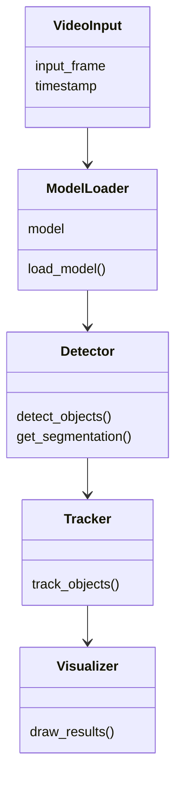
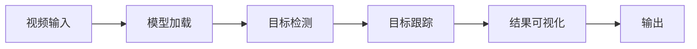

                 


# 如何识别企业的深度学习视频理解技术优势

## 关键词：深度学习、视频理解、目标检测、语义分割、算法原理、系统架构

## 摘要：深度学习视频理解技术是计算机视觉领域的重要分支，通过分析视频中的多模态数据，实现对视频内容的智能化理解。本文将从技术背景、核心概念、算法原理、系统架构、项目实战等多个维度，详细阐述如何识别和评估企业在深度学习视频理解技术上的优势，为企业技术选型和优化提供指导。

---

## 第一章：深度学习视频理解技术的背景

### 1.1 技术背景

随着视频数据的爆炸式增长，如何高效地理解和分析视频内容成为企业面临的重要挑战。传统的视频分析技术主要依赖于基于规则的方法，存在检测精度低、实时性差等问题。深度学习的兴起为企业提供了更高效的解决方案。

深度学习通过卷积神经网络（CNN）和三维卷积神经网络（3D CNN）等模型，能够自动提取视频中的特征信息，实现对目标检测、语义分割、动作识别等任务的高效处理。

---

### 1.2 问题背景与技术挑战

#### 1.2.1 传统视频分析的局限性
- **检测精度低**：基于规则的方法难以应对复杂场景中的多种目标。
- **实时性差**：传统算法在处理复杂视频时，计算效率较低，难以满足实时性要求。
- **适应性差**：难以应对光照变化、目标遮挡等复杂场景。

#### 1.2.2 深度学习带来的突破
- **自动特征提取**：深度学习模型能够自动提取视频中的多层级特征。
- **高精度检测**：通过端到端的深度学习模型，目标检测和语义分割的精度显著提高。
- **实时性提升**：基于轻量化模型的设计，使得视频分析的实时性得到保障。

#### 1.2.3 技术实现中的主要挑战
- **计算资源需求高**：深度学习模型的训练和推理需要大量的计算资源。
- **数据标注成本高**：高质量的标注数据是模型训练的基础。
- **模型优化困难**：如何在保证精度的前提下，降低模型的计算复杂度是一个重要挑战。

---

## 第二章：深度学习视频理解的核心概念与联系

### 2.1 核心概念

#### 2.1.1 多目标检测
- **目标检测**：通过深度学习模型，定位视频中的多个目标并进行分类。
- **多目标检测**：在复杂场景中，同时检测多个目标并标注其位置和类别。

#### 2.1.2 语义分割
- **语义分割**：将视频中的每个像素进行分类，识别出不同目标的区域。
- **实例分割**：进一步区分同一类别中的不同实例。

#### 2.1.3 动作识别
- **动作识别**：通过分析视频中人体的动作，识别出具体的行为类型。
- **行为理解**：结合上下文，理解动作的语义含义。

---

### 2.2 核心概念的原理与联系

#### 2.2.1 多目标检测与跟踪
- **多目标检测**：基于目标检测模型（如YOLO、Faster R-CNN等），在视频中定位多个目标。
- **目标跟踪**：通过目标检测结果，利用光流法或匈牙利算法，实现对目标的连续跟踪。

#### 2.2.2 语义分割与场景理解
- **语义分割**：利用深度学习模型（如U-Net、Mask R-CNN等），对视频中的每个像素进行分类。
- **场景理解**：结合语义分割结果，理解视频中的场景布局。

#### 2.2.3 动作识别与行为分析
- **动作识别**：通过3D CNN或I3D模型，分析视频中的时空特征，识别人体动作。
- **行为分析**：结合动作识别结果，分析行为的上下文和意图。

---

## 第三章：深度学习视频理解的算法原理

### 3.1 主流算法原理

#### 3.1.1 YOLO（You Only Look Once）
- **原理**：YOLO将目标检测问题转化为回归问题，在单个网络中同时预测边界框和类别。
- **流程图**：
  ```mermaid
  graph TD
    A[输入图像] --> B[特征提取]
    B --> C[预测边界框和类别]
    C --> D[输出结果]
  ```

#### 3.1.2 Faster R-CNN
- **原理**：基于区域建议网络（RPN）生成候选框，通过RoI pooling提取特征，最终进行分类和回归。
- **流程图**：
  ```mermaid
  graph TD
    A[输入图像] --> B[生成候选框]
    B --> C[RoI pooling]
    C --> D[分类和回归]
    D --> E[输出结果]
  ```

#### 3.1.3 3D CNN
- **原理**：在时间维度上引入卷积，同时提取空间和时间特征，用于动作识别。
- **流程图**：
  ```mermaid
  graph TD
    A[输入视频] --> B[3D卷积提取特征]
    B --> C[分类器预测动作]
    C --> D[输出结果]
  ```

---

### 3.2 算法实现与代码解读

#### 3.2.1 YOLO目标检测代码示例
```python
import numpy as np
import tensorflow as tf

# 加载预训练模型
model = tf.keras.models.load_model('yolov4.h5')

# 输入图像预处理
def preprocess_image(image):
    image = tf.image.resize(image, (416, 416))
    image = image / 255.0
    return image

# 检测函数
def detect_objects(image):
    preprocessed_image = preprocess_image(image)
    predictions = model.predict(tf.expand_dims(preprocessed_image, axis=0))
    return predictions

# 解析结果
def parse_predictions(predictions):
    boxes = predictions[0]
    labels = predictions[1]
    return boxes, labels
```

#### 3.2.2 数学模型解析
- **卷积层**：
  $$ \text{Conv}(k, s) $$
  其中，\(k\) 是卷积核大小，\(s\) 是步长。
- **池化层**：
  $$ \text{Pool}(k, s) $$
  其中，\(k\) 是池化核大小，\(s\) 是步长。
- **损失函数（如YOLO）**：
  $$ \text{Loss} = \lambda_{\text{xy}} \cdot (x - \hat{x})^2 + \lambda_{\text{wh}} \cdot (w - \hat{w})^2 + \lambda_{\text{cls}} \cdot \text{CrossEntropy} $$

---

## 第四章：深度学习视频理解的系统分析与架构设计

### 4.1 系统功能设计

#### 4.1.1 领域模型（类图）


#### 4.1.2 系统架构（架构图）


---

## 第五章：深度学习视频理解技术的项目实战

### 5.1 项目实战

#### 5.1.1 安装必要的库
```bash
pip install tensorflow==2.5.0
pip install opencv-python==4.5.5
pip install matplotlib==3.5.1
```

#### 5.1.2 核心代码实现
```python
import cv2
import tensorflow as tf
import numpy as np

# 加载预训练模型
model = tf.keras.models.load_model('video_classifier.h5')

# 视频流处理
cap = cv2.VideoCapture(0)
while cap.is_opened():
    ret, frame = cap.read()
    if not ret:
        break
    preprocessed_frame = tf.image.resize(frame, (224, 224))
    preprocessed_frame = preprocessed_frame / 255.0
    prediction = model.predict(tf.expand_dims(preprocessed_frame, axis=0))
    # 解析预测结果
    cv2.imshow('Video Stream', frame)
    if cv2.waitKey(1) & 0xFF == ord('q'):
        break
cap.release()
cv2.destroyAllWindows()
```

#### 5.1.3 实际案例分析
- **案例1**：智能安防中的目标检测
  - **场景**：实时监控视频中的异常行为检测。
  - **实现**：利用YOLO模型检测视频流中的人员和车辆，结合行为分析模块，识别潜在的危险行为。

#### 5.1.4 项目小结
- **关键点**：模型选择、数据预处理、实时性优化。
- **经验总结**：模型调优和数据增强是提升检测精度的关键。

---

## 第六章：深度学习视频理解技术的最佳实践

### 6.1 最佳实践 Tips

#### 6.1.1 数据预处理
- **数据增强**：通过旋转、翻转、缩放等操作，增加数据多样性。
- **数据标注**：使用工具（如LabelImg）进行高质量的标注。

#### 6.1.2 模型调优
- **学习率调整**：使用Adam优化器，动态调整学习率。
- **批量归一化**：在卷积层后添加Batch Normalization，加速训练并提高泛化能力。

#### 6.1.3 实时性优化
- **轻量化模型**：选择MobileNet、EfficientNet等轻量化模型。
- **硬件加速**：利用GPU或TPU加速模型推理。

---

## 第七章：总结与展望

### 7.1 本章小结
- **技术优势**：深度学习视频理解技术在目标检测、语义分割、动作识别等方面具有显著优势。
- **应用价值**：为企业提供智能化的视频分析能力，提升业务效率和决策能力。

### 7.2 展望
- **多模态融合**：结合语音、文本等信息，提升视频理解的准确性。
- **实时性优化**：通过模型压缩和边缘计算，进一步降低计算成本。
- **行业应用拓展**：在医疗、教育、娱乐等领域，深度学习视频理解技术将发挥更大的作用。

---

## 第八章：注意事项与拓展阅读

### 8.1 注意事项
- **数据隐私**：在处理视频数据时，需注意数据的隐私保护。
- **模型鲁棒性**：确保模型在复杂场景下的稳定性和健壮性。
- **计算资源管理**：合理分配计算资源，避免资源浪费。

### 8.2 拓展阅读
- **推荐书籍**：
  - 《Deep Learning》 - Ian Goodfellow
  - 《Convolutional Neural Networks》 - Adrian Rosebrock
- **推荐博客与论文**：
  - [YOLO官方博客](https://pjreddie.com/darknet/yolo/)
  - [Faster R-CNN论文](https://arxiv.org/abs/1506.01492)

---

通过以上章节的详细阐述，读者可以系统地了解深度学习视频理解技术的核心概念、算法原理和实际应用，从而帮助企业识别和评估技术优势，为技术选型和优化提供有力支持。

