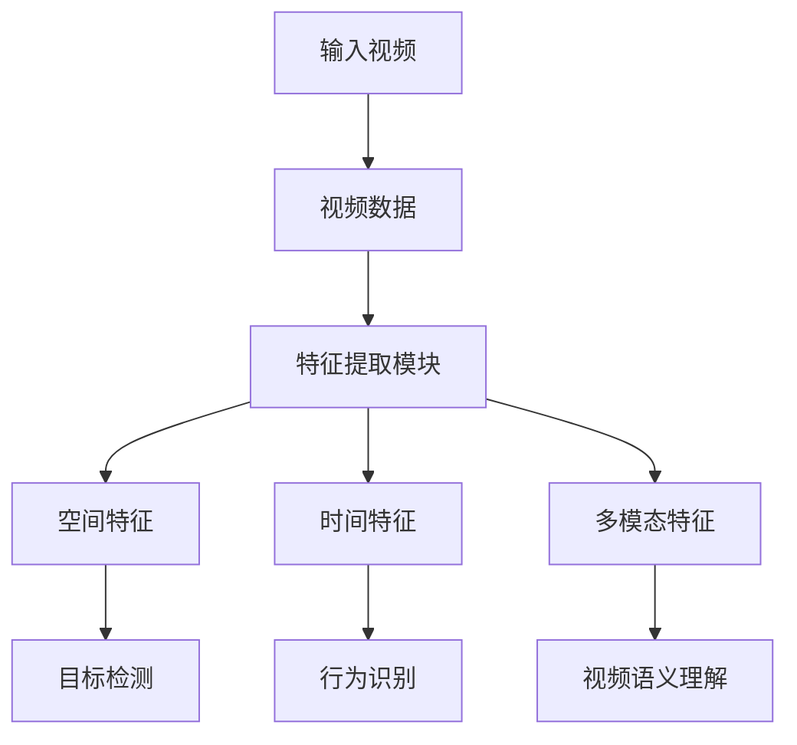

                 


# 如何识别企业的深度学习视频理解技术优势

> **关键词**：深度学习，视频理解，企业技术优势，算法原理，系统架构

> **摘要**：深度学习技术在视频理解领域的应用为企业带来了显著的竞争优势。本文详细探讨了深度学习视频理解技术的核心概念、算法原理、系统架构，并通过实际案例分析，帮助企业识别和提升其深度学习视频理解技术的优势。文章内容涵盖理论与实践，旨在为企业技术决策者和开发者提供实用的指导。

---

## 第一部分: 深度学习视频理解技术概述

### 第1章: 深度学习与视频理解技术概述

#### 1.1 深度学习的基本概念

##### 1.1.1 深度学习的定义与特点
深度学习（Deep Learning）是机器学习（Machine Learning）的一个分支，通过多层非线性变换模拟人脑神经网络的工作方式，具有以下特点：
- **非线性特征提取**：能够捕捉数据中的复杂非线性关系。
- **层次化特征学习**：通过多层次的神经网络结构提取不同层次的特征。
- **自适应学习能力**：能够自动调整模型参数以适应数据分布的变化。

##### 1.1.2 视频理解技术的核心概念
视频理解技术旨在通过深度学习模型对视频内容进行分析、识别和理解，主要包括以下内容：
- **视频分析**：对视频中的视觉信息进行检测、识别和跟踪。
- **视频语义理解**：理解视频内容的情感、意图和语境。
- **视频生成**：基于深度学习模型生成合成视频或修复低质量视频。

##### 1.1.3 深度学习在视频理解中的作用
深度学习在视频理解中的作用体现在以下几个方面：
- **特征提取**：通过卷积神经网络（CNN）提取视频中的空间特征。
- **序列建模**：通过循环神经网络（RNN）建模视频的时间序列信息。
- **跨模态融合**：将视频中的多模态信息（如图像、文本、语音）进行融合，提升理解能力。

#### 1.2 视频理解技术的发展历程

##### 1.2.1 传统视频分析技术的局限性
传统视频分析技术主要依赖于手工设计的特征提取方法和浅层学习模型，存在以下局限性：
- **特征表达能力有限**：难以捕捉复杂的视觉特征。
- **计算效率低**：需要大量人工干预和计算资源。
- **鲁棒性不足**：在光照变化、视角变换等复杂场景下表现较差。

##### 1.2.2 深度学习技术的崛起
随着计算能力的提升和深度学习模型的发展，深度学习在视频理解领域的应用逐渐崛起，主要得益于以下因素：
- **计算能力的提升**：GPU和TPU的出现使得训练深度模型成为可能。
- **数据量的增加**：大规模标注视频数据的积累为深度学习提供了丰富的训练样本。
- **算法的创新**：3D卷积、自注意力机制等创新算法推动了视频理解技术的进步。

##### 1.2.3 当前深度学习视频理解技术的现状
当前，深度学习视频理解技术已取得显著进展，主要体现在以下几个方面：
- **视频分类与检测**：基于2D和3D CNN的视频分类和目标检测技术已广泛应用于视频监控和内容审核。
- **视频分割与跟踪**：基于分割网络（如Mask R-CNN）的视频目标分割和跟踪技术在自动驾驶和机器人领域得到应用。
- **视频生成与修复**：基于GAN和Transformer的视频生成和修复技术在视频增强和特效生成中表现出色。

#### 1.3 企业应用场景与价值

##### 1.3.1 视频监控中的深度学习应用
在视频监控领域，深度学习技术主要用于异常行为检测、人脸识别和车辆识别。例如：
- **异常行为检测**：通过实时分析监控视频，识别打架、摔倒等异常行为。
- **人脸识别**：通过人脸识别技术实现人员身份验证和出入管理。
- **车辆识别**：通过车牌识别技术实现交通监控和违法车辆的追踪。

##### 1.3.2 视频内容分析在企业中的应用
在视频内容分析中，深度学习技术广泛应用于视频分类、内容审核和推荐系统。例如：
- **视频分类**：将视频内容自动分类为娱乐、教育、新闻等类别。
- **内容审核**：通过深度学习模型识别并过滤低俗、暴力等内容。
- **推荐系统**：基于用户的观看历史和偏好推荐相关内容。

##### 1.3.3 深度学习视频理解技术对企业竞争优势的影响
深度学习视频理解技术能够显著提升企业的竞争优势，主要体现在以下几个方面：
- **提高效率**：通过自动化视频分析减少人工审核成本。
- **增强用户体验**：通过个性化推荐和内容增强提升用户满意度。
- **拓展应用场景**：深度学习技术的应用扩展了企业的业务范围，如智能安防、虚拟试衣等。

#### 1.4 与传统视频分析技术的对比

##### 1.4.1 传统视频分析技术的优缺点
- **优点**：实现简单，易于部署，成本较低。
- **缺点**：特征提取能力有限，难以应对复杂场景，鲁棒性不足。

##### 1.4.2 深度学习视频理解技术的优缺点
- **优点**：特征提取能力强，适应性好，能够处理复杂场景。
- **缺点**：计算资源需求高，模型训练复杂，需要大量标注数据。

##### 1.4.3 两种技术的对比分析
从性能、实现复杂度和应用场景的角度对比传统视频分析技术和深度学习视频理解技术，可以发现深度学习技术在特征提取和复杂场景处理方面具有显著优势，但需要更高的计算资源和数据支持。

---

### 第2章: 深度学习视频理解技术的核心概念与联系

#### 2.1 深度学习模型的基本原理

##### 2.1.1 神经网络的基本结构
神经网络由输入层、隐藏层和输出层组成，通过权重和激活函数实现信息的传递和处理。

##### 2.1.2 卷积神经网络（CNN）的原理
CNN通过卷积层、池化层和全连接层提取图像的空间特征，适用于视频帧的特征提取。

##### 2.1.3 循环神经网络（RNN）的原理
RNN通过循环结构建模序列数据，适用于视频的时间特征建模。

##### 2.1.4 图神经网络（GNN）的原理
GNN通过图结构建模数据之间的关系，适用于视频中的目标关系建模。

#### 2.2 视频理解技术的关键算法

##### 2.2.1 2D-CNN在视频理解中的应用
2D-CNN将视频帧作为图像处理，提取空间特征，适用于视频分类和目标检测。

##### 2.2.2 3D-CNN在视频理解中的应用
3D-CNN在2D-CNN的基础上增加时间维度，直接建模视频的时间特征，适用于视频分类和行为识别。

##### 2.2.3 Transformer在视频理解中的应用
Transformer通过自注意力机制建模视频的全局关系，适用于视频分割和生成任务。

#### 2.3 视频数据的特征提取与表示

##### 2.3.1 视频数据的多模态特征
视频数据包含图像、文本、语音等多种模态信息，通过多模态特征提取可以提升理解能力。

##### 2.3.2 视频特征的表示方法
常用的视频特征表示方法包括：
- **光流法**：通过计算相邻帧的光流变化捕捉视频的运动信息。
- **2D/3D CNN特征**：通过CNN提取的视频特征表示。
- **Transformer特征**：通过自注意力机制提取的全局特征表示。

##### 2.3.3 视频特征的对比学习
对比学习通过最大化视频片段之间的相似性，提升模型的特征表示能力。

#### 2.4 深度学习视频理解技术的实体关系图



---

## 第三部分: 算法原理与实现

### 第3章: 视频理解技术的关键算法原理与实现

#### 3.1 视频分类与检测算法

##### 3.1.1 基于2D-CNN的视频分类
- **算法原理**：将视频分为多个帧，通过2D-CNN提取每个帧的特征，最后通过全连接层进行分类。
- **代码实现**：
  ```python
  import torch
  import torch.nn as nn

  class VideoClassifier(nn.Module):
      def __init__(self):
          super(VideoClassifier, self).__init__()
          self.cnn = nn.Sequential(
              nn.Conv2d(3, 64, kernel_size=3, stride=1, padding=1),
              nn.ReLU(),
              nn.MaxPool2d(kernel_size=2, stride=2),
              nn.Conv2d(64, 128, kernel_size=3, stride=1, padding=1),
              nn.ReLU(),
              nn.MaxPool2d(kernel_size=2, stride=2)
          )
          self.fc = nn.Linear(128, 10)

      def forward(self, x):
          x = self.cnn(x)
          x = x.view(x.size(0), -1)
          x = self.fc(x)
          return x
  ```

##### 3.1.2 基于3D-CNN的目标检测
- **算法原理**：在2D-CNN的基础上增加时间维度，提取3D特征进行目标检测。
- **代码实现**：
  ```python
  import torch
  import torch.nn as nn

  class VideoDetector(nn.Module):
      def __init__(self):
          super(VideoDetector, self).__init__()
          self.cnn = nn.Sequential(
              nn.Conv3d(3, 64, kernel_size=(1,3,3), stride=(1,1,1), padding=(0,1,1)),
              nn.ReLU(),
              nn.MaxPool3d(kernel_size=(1,2,2), stride=(1,2,2)),
              nn.Conv3d(64, 128, kernel_size=(1,3,3), stride=(1,1,1), padding=(0,1,1)),
              nn.ReLU(),
              nn.MaxPool3d(kernel_size=(1,2,2), stride=(1,2,2))
          )
          self.fc = nn.Linear(128, 10)

      def forward(self, x):
          x = self.cnn(x)
          x = x.view(x.size(0), -1)
          x = self.fc(x)
          return x
  ```

#### 3.2 视频分割与跟踪算法

##### 3.2.1 基于分割网络的视频分割
- **算法原理**：使用分割网络（如Mask R-CNN）对视频中的目标进行逐帧分割。
- **代码实现**：
  ```python
  import torch
  import torch.nn as nn

  class VideoSegmentator(nn.Module):
      def __init__(self):
          super(VideoSegmentator, self).__init__()
          self.backbone = nn.Sequential(
              nn.Conv2d(3, 64, kernel_size=3, stride=1, padding=1),
              nn.ReLU(),
              nn.MaxPool2d(kernel_size=2, stride=2)
          )
          self.mask_head = nn.Sequential(
              nn.ConvTranspose2d(64, 64, kernel_size=2, stride=2, padding=0),
              nn.Conv2d(64, 2, kernel_size=1, stride=1)
          )

      def forward(self, x):
          features = self.backbone(x)
          mask = self.mask_head(features)
          return mask
  ```

##### 3.2.2 基于光流的视频跟踪
- **算法原理**：通过计算相邻帧的光流变化，实现视频中目标的跟踪。
- **代码实现**：
  ```python
  import cv2
  import numpy as np

  def compute_optical_flow(prev_frame, curr_frame):
      # 计算光流
      prev_gray = cv2.cvtColor(prev_frame, cv2.COLOR_BGR2GRAY)
      curr_gray = cv2.cvtColor(curr_frame, cv2.COLOR_BGR2GRAY)
      flow = cv2.optflow.DualTVL1OpticalFlow.create().compute(prev_gray, curr_gray)
      return flow
  ```

#### 3.3 视频生成与修复算法

##### 3.3.1 基于GAN的视频生成
- **算法原理**：使用生成对抗网络（GAN）生成高质量的视频内容。
- **代码实现**：
  ```python
  import torch
  import torch.nn as nn

  class Generator(nn.Module):
      def __init__(self):
          super(Generator, self).__init__()
          self.main = nn.Sequential(
              nn.ConvTranspose2d(100, 64, kernel_size=4, stride=2, padding=1),
              nn.ReLU(),
              nn.ConvTranspose2d(64, 3, kernel_size=4, stride=2, padding=1),
              nn.Tanh()
          )

      def forward(self, x):
          return self.main(x)

  class Discriminator(nn.Module):
      def __init__(self):
          super(Discriminator, self).__init__()
          self.main = nn.Sequential(
              nn.Conv2d(3, 64, kernel_size=4, stride=2, padding=1),
              nn.LeakyReLU(0.2),
              nn.Conv2d(64, 128, kernel_size=4, stride=2, padding=1),
              nn.LeakyReLU(0.2),
              nn.Conv2d(128, 1, kernel_size=4, stride=2, padding=1)
          )

      def forward(self, x):
          return self.main(x)
  ```

##### 3.3.2 基于Transformer的视频修复
- **算法原理**：通过Transformer模型建模视频的全局关系，修复低质量或损坏的视频内容。
- **代码实现**：
  ```python
  import torch
  import torch.nn as nn

  class TransformerBlock(nn.Module):
      def __init__(self, embed_dim, num_heads):
          super(TransformerBlock, self).__init__()
          self.self_attn = nn.MultiheadAttention(embed_dim, num_heads)
          self.norm = nn.LayerNorm(embed_dim)
          self.dropout = nn.Dropout(0.1)

      def forward(self, x):
          out = self.self_attn(x, x, x)
          out = self.dropout(out)
          out = self.norm(out)
          return out

  class VideoReconstructor(nn.Module):
      def __init__(self, embed_dim, num_heads):
          super(VideoRe

