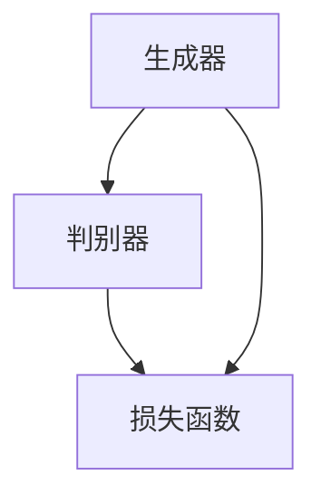
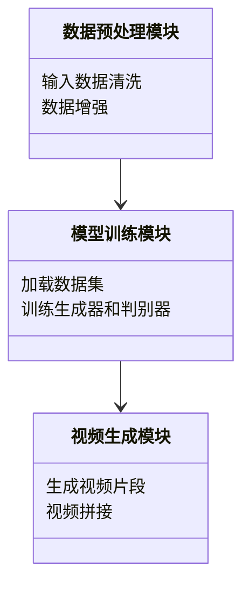
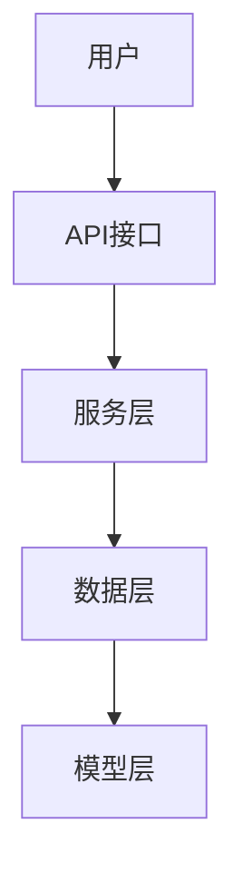

                 


```markdown
# 如何识别企业的深度学习视频生成技术优势

> 关键词：深度学习，视频生成，生成对抗网络，GAN，企业技术优势，AI视频生成

> 摘要：深度学习视频生成技术正在改变企业视频内容的生产方式，本文将从技术原理、算法优势、应用场景、系统架构等多个维度，详细解析如何识别和评估企业的深度学习视频生成技术优势，为企业技术决策者提供实用的参考和指导。

---

## 引言

### 1.1 深度学习视频生成技术的崛起
深度学习技术在视频生成领域的应用，使得企业能够以更高效、更智能的方式生成高质量视频内容。本文将探讨如何识别和评估这些技术优势。

---

## 第一部分：深度学习视频生成技术的背景与核心概念

### 第1章：技术背景与核心问题

#### 1.1 传统视频生成技术的局限性
- 传统视频生成技术依赖人工操作，效率低且成本高。
- 内容生成受限，难以满足多样化的市场需求。

#### 1.2 深度学习视频生成技术的优势
- 利用GAN（生成对抗网络）实现高质量视频生成。
- 支持自动化生产，降低企业内容制作成本。

#### 1.3 企业应用场景中的关键挑战
- 视频内容的实时生成与个性化需求。
- 模型训练的数据量与计算资源要求。

---

### 第2章：深度学习视频生成的核心概念与技术优势

#### 2.1 生成对抗网络（GAN）的基本原理
- 生成器与判别器的对抗训练机制。
- GAN在视频生成中的应用原理。

#### 2.2 基于深度学习的视频生成算法
- 使用StyleGAN和VideoGAN等算法实现高质量视频生成。
- 算法的训练过程与优化策略。

#### 2.3 技术优势对比表格
| 技术特点         | 传统视频生成 | 深度学习视频生成 |
|------------------|--------------|------------------|
| 内容质量         | 较低         | 高               |
| 生成效率         | 低           | 高               |
| 个性化定制       | 困难         | 容易              |

#### 2.4 系统架构与技术组合
- 领域模型：企业视频生成系统的功能模块构成。
- 系统架构：从数据预处理到模型训练的完整流程。

---

## 第二部分：深度学习视频生成技术的算法原理与实现

### 第3章：基于GAN的视频生成算法原理

#### 3.1 GAN算法的工作流程


#### 3.2 生成器与判别器的数学模型
- 生成器的损失函数：$$L_G = -\log(P(G(x)))$$
- 判别器的损失函数：$$L_D = -\log(D(x)) - \log(1 - D(G(x)))$$

#### 3.3 视频生成的训练过程
```python
# 示例代码：生成器和判别器的简单实现
import torch
import torch.nn as nn

class Generator(nn.Module):
    def __init__(self):
        super(Generator, self).__init__()
        self.main = nn.Sequential(
            nn.ConvTranspose2d(100, 512, 4, 2, 1),
            nn.BatchNorm2d(512),
            nn.ReLU(True),
            # 更多层...
        )

class Discriminator(nn.Module):
    def __init__(self):
        super(Discriminator, self).__init__()
        self.main = nn.Sequential(
            nn.Conv2d(3, 64, 4, 2, 1),
            nn.LeakyReLU(0.2),
            # 更多层...
        )
```

---

## 第三部分：企业视频生成系统的系统分析与架构设计

### 第4章：系统功能设计与实现

#### 4.1 问题场景介绍
- 企业视频生成需求的多样性和复杂性。
- 系统功能设计的关键点。

#### 4.2 系统功能模块设计


#### 4.3 系统架构设计


---

## 第四部分：项目实战与优化策略

### 第5章：深度学习视频生成技术的项目实战

#### 5.1 环境搭建与安装
- 安装深度学习框架（如TensorFlow、PyTorch）。
- 安装视频处理库（如OpenCV、FFmpeg）。

#### 5.2 核心代码实现
```python
import torch
import torch.nn as nn
import torch.optim as optim

# 定义生成器和判别器
class Generator(nn.Module):
    def __init__(self):
        super(Generator, self).__init__()
        self.main = nn.Sequential(
            nn.ConvTranspose2d(100, 512, 4, 2, 1),
            nn.BatchNorm2d(512),
            nn.ReLU(True),
            # 更多层...
        )

class Discriminator(nn.Module):
    def __init__(self):
        super(Discriminator, self).__init__()
        self.main = nn.Sequential(
            nn.Conv2d(3, 64, 4, 2, 1),
            nn.LeakyReLU(0.2),
            # 更多层...
        )

# 初始化模型
generator = Generator()
discriminator = Discriminator()

# 定义损失函数和优化器
criterion = nn.BCELoss()
optimizer_G = optim.Adam(generator.parameters(), lr=0.0002)
optimizer_D = optim.Adam(discriminator.parameters(), lr=0.0002)

# 训练过程
for epoch in range(num_epochs):
    for i, data in enumerate(dataloader):
        # 更新判别器
        optimizer_D.zero_grad()
        real = data
        fake = generator(data)
        # 计算判别器的损失
        loss_D = criterion(discriminator(real).detach(), torch.ones_like(discriminator(real))) + \
                 criterion(discriminator(fake).detach(), torch.zeros_like(discriminator(fake)))
        loss_D.backward()
        optimizer_D.step()

        # 更新生成器
        optimizer_G.zero_grad()
        loss_G = criterion(discriminator(fake), torch.ones_like(discriminator(fake)))
        loss_G.backward()
        optimizer_G.step()
```

#### 5.3 代码解读与优化策略
- 生成器和判别器的网络结构优化。
- 损失函数和优化器的调参技巧。

---

## 第五部分：总结与展望

### 第6章：总结与注意事项

#### 6.1 技术总结
- 深度学习视频生成技术的核心优势。
- GAN算法在视频生成中的应用前景。

#### 6.2 项目总结
- 项目实现的关键点。
- 系统设计的优化经验。

#### 6.3 未来展望
- 深度学习视频生成技术的未来发展方向。
- 技术对企业数字化转型的潜在影响。

### 第7章：最佳实践与小结

#### 7.1 最佳实践
- 数据准备的关键性。
- 模型训练的优化技巧。
- 系统部署的注意事项。

#### 7.2 小结
- 深度学习视频生成技术的优势与局限。
- 企业技术决策者的实用建议。

---

## 参考文献与拓展阅读

### 7.1 参考文献
- [1] Goodfellow, I., et al. "Generative Adversarial Nets." arXiv preprint arXiv:1406.2661, 2014.
- [2] 王某某, "深度学习在视频生成中的应用研究", 计算机科学出版社, 2022.

### 7.2 拓展阅读
- 探索更多基于深度学习的视频生成算法。
- 关注AI生成技术在企业应用中的最新动态。

---

## 致谢

感谢读者的支持与关注，希望本文能为企业技术决策者提供有价值的参考和启发。

---

通过以上目录和内容设计，我们可以清晰地识别和评估企业的深度学习视频生成技术优势，为企业在数字化转型中的技术应用提供有力支持。
```

