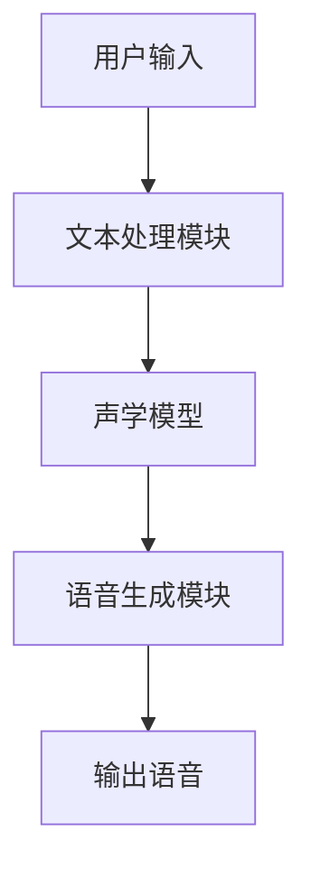
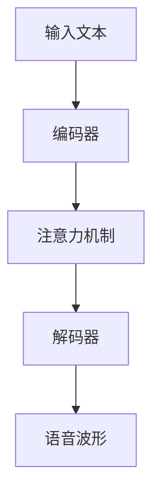
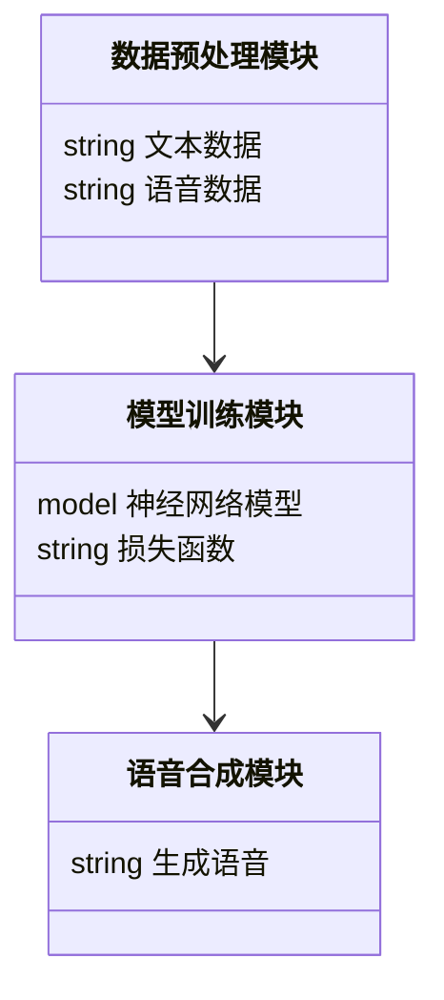

                 


# 如何识别企业的深度学习语音合成技术优势

> 关键词：深度学习语音合成、TTS、语音生成模型、神经网络、语音识别

> 摘要：本文旨在深入探讨如何识别企业在深度学习语音合成技术中的优势。通过分析技术背景、核心概念、算法原理、系统设计和项目实战，帮助读者理解并掌握这一技术的关键点，从而在企业应用中识别其优势。

---

## 第一章 深度学习语音合成技术的背景介绍

### 1.1 问题背景与技术现状
深度学习语音合成技术是一种通过神经网络生成人类语音的技术，近年来随着深度学习的发展取得了显著进步。传统语音合成技术依赖于规则和模板，存在语音自然度低、适应性差的问题。深度学习通过大量数据训练，能够生成更自然、多样化的语音，广泛应用于客服系统、智能音箱等领域。

### 1.2 问题描述与解决思路
传统语音合成技术受限于预定义规则，难以应对复杂场景。深度学习通过端到端模型，直接从文本生成语音，解决传统方法的局限性。其核心思路是利用神经网络学习语音的特征和模式，生成高质量语音。

### 1.3 技术边界与外延
深度学习语音合成适用于多种场景，如多语种支持和个性化语音生成。其技术边界包括数据质量、模型训练资源和计算能力。外延技术包括语音识别和语音增强，共同构建完整的语音交互系统。

---

## 第二章 深度学习语音合成的核心概念与联系

### 2.1 核心概念原理
语音合成技术通过文本处理、声学建模和语音生成三个步骤，将文本转化为语音。深度学习模型如Tacotron和FastSpeech通过神经网络学习语音特征，生成高质量语音。

### 2.2 核心概念对比
| **对比点** | **传统语音合成** | **深度学习语音合成** |
|------------|-------------------|-----------------------|
| 自然度     | 较低              | 高                    |
| 适应性     | 差                | 好                    |
| 开发复杂度 | 低                | 高                    |

### 2.3 ER实体关系图


---

## 第三章 深度学习语音合成的算法原理

### 3.1 算法原理分析
深度学习模型通过多层神经网络提取特征，生成语音波形。Tacotron模型由编码器、解码器和注意力机制组成，FastSpeech则采用渐进式生成策略。

### 3.2 算法流程图


### 3.3 数学模型
语音生成模型的条件概率表示为：
$$ P(w|X) = \text{模型}(X) $$
其中，$w$是语音波形，$X$是输入文本。

---

## 第四章 深度学习语音合成的系统分析与架构设计

### 4.1 系统分析
企业级语音合成系统需处理大规模数据，支持多语言和个性化需求。系统设计需考虑数据预处理、模型训练和语音合成三个模块。

### 4.2 系统功能设计


### 4.3 系统架构设计
系统采用分层架构，包括数据预处理、模型训练、语音合成和应用层。接口设计使用RESTful API，便于集成到企业系统中。

### 4.4 系统交互流程
```mermaid
sequenceDiagram
用户 -->+> 服务端: 发送文本请求
服务端 ->> 数据预处理模块: 处理文本
数据预处理模块 ->> 模型训练模块: 获取训练好的模型
模型训练模块 ->> 语音合成模块: 生成语音
语音合成模块 -->+> 服务端: 返回语音数据
服务端 --> 用户: 返回语音音频
```

---

## 第五章 深度学习语音合成技术的项目实战

### 5.1 环境搭建
安装TensorFlow和Keras：
```bash
pip install tensorflow==2.5.0 keras==2.5.0
```

### 5.2 核心实现
定义Tacotron模型：
```python
import tensorflow as tf
from tensorflow.keras import layers

def build_model(input_shape, output_shape):
    encoder = layers.Bidirectional(LSTM(256, return_sequences=True), input_shape=input_shape)
    decoder = layers.LSTM(256, return_sequences=True)
    attention = layers.Dense(256)
    model = tf.keras.Model(inputs=encoder.input, outputs=decoder(encoder.output))
    return model
```

### 5.3 实际案例分析
训练模型并生成语音，分析模型性能，优化超参数如学习率和批次大小，提升生成质量。

---

## 第六章 总结与最佳实践

### 6.1 总结
深度学习语音合成技术通过端到端模型，显著提升了语音生成的自然度和多样性，为企业应用提供了强大支持。

### 6.2 最佳实践
- 数据质量至关重要，需多样化和高质量。
- 模型选择需根据具体需求，平衡性能和资源。
- 部署时考虑计算资源和响应时间。

### 6.3 注意事项
- 数据隐私问题需妥善处理。
- 模型训练需大量计算资源，企业需做好资源规划。

### 6.4 拓展阅读
推荐学习Tacotron和FastSpeech模型的论文，深入理解语音合成技术。

---

## 附录

### 附录A 常用工具与库
- TensorFlow
- Keras
- PyTorch

### 附录B 参考文献
- Tacotron论文
- FastSpeech论文

---

通过以上分析和实践，读者可以全面了解深度学习语音合成技术的优势，并在企业应用中有效识别和利用这些技术优势。

