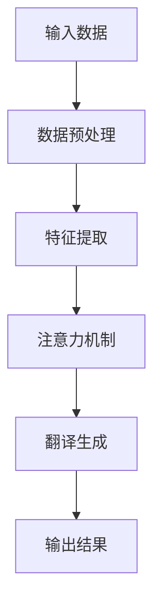
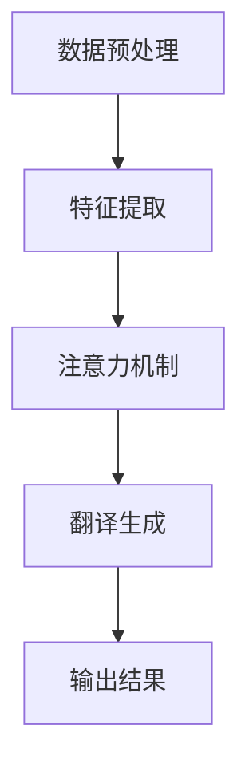
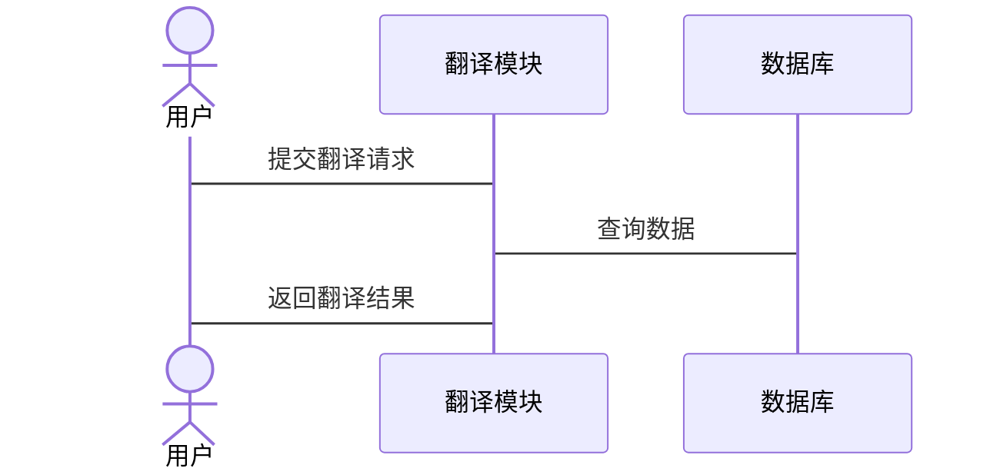

                 


# 如何识别企业的深度学习跨模态翻译技术优势

> 关键词：深度学习，跨模态翻译，技术优势，企业应用，算法原理

> 摘要：本文将详细分析深度学习跨模态翻译技术的核心概念、算法原理、系统架构以及企业中的应用场景，帮助读者识别和评估该技术在企业中的优势。通过实际案例和最佳实践，本文将为技术决策者提供有价值的参考。

---

## 第一章: 深度学习跨模态翻译技术概述

### 1.1 跨模态翻译技术的定义与背景

#### 1.1.1 跨模态翻译技术的定义
跨模态翻译技术是一种结合多种数据模态（如文本、图像、语音等）进行翻译的技术。它不仅处理单一种类的数据，还能在多种模态之间建立关联，从而提升翻译的准确性和语境理解能力。

#### 1.1.2 技术背景与应用前景
随着人工智能技术的快速发展，跨模态翻译技术在多个领域展现出巨大的潜力。例如，在医疗领域，可以通过结合文本和图像进行疾病诊断翻译；在教育领域，可以实现多语言学习资源的跨模态整合。

#### 1.1.3 企业应用中的价值与优势
跨模态翻译技术能够帮助企业实现多语言、多模态的高效沟通，提升客户体验和业务效率。特别是在全球化背景下，这种技术能够帮助企业在国际市场中更具竞争力。

### 1.2 跨模态翻译技术的核心要素

#### 1.2.1 多模态数据的定义与特点
多模态数据指的是多种类型的数据，如文本、图像、语音等。每种数据类型都有其独特的特征，例如文本的语义信息和图像的视觉信息。

#### 1.2.2 跨模态翻译的核心算法
跨模态翻译的核心算法包括多模态特征提取、注意力机制和翻译生成。这些算法能够有效地整合不同模态的数据，提升翻译的质量。

#### 1.2.3 技术实现的关键步骤
跨模态翻译的关键步骤包括数据预处理、特征提取、注意力机制设计和翻译生成。每个步骤都需要精心设计，以确保翻译结果的准确性和流畅性。

---

## 第二章: 跨模态翻译技术的核心概念与联系

### 2.1 跨模态翻译的核心概念

#### 2.1.1 多模态数据的整合与处理
多模态数据的整合与处理是跨模态翻译的基础。通过有效的数据预处理和特征提取，可以将不同模态的数据转化为统一的表示形式。

#### 2.1.2 跨模态翻译的数学模型
跨模态翻译的数学模型通常包括编码器和解码器两部分。编码器负责将输入数据转换为统一的表示，解码器则根据这些表示生成目标语言的文本。

#### 2.1.3 技术实现的流程图
以下是跨模态翻译技术的流程图：



### 2.2 跨模态翻译技术的属性特征对比

#### 2.2.1 不同模态数据的特征分析
以下是一个对比表格，展示了不同模态数据的特征：

| 模态类型 | 特征描述 |
|----------|----------|
| 文本      | 语义丰富，结构化 |
| 图像      | 视觉信息，非结构化 |
| 语音      | 音调和节奏信息 |

#### 2.2.2 各种翻译算法的优劣势对比
以下是几种常见的翻译算法对比：

| 算法类型       | 优势                 | 劣势                 |
|----------------|----------------------|----------------------|
| 基于统计的翻译 | 简单易实现           | 精度较低             |
| 基于规则的翻译 | 准确性高             | 无法处理复杂语境     |
| 神经机器翻译   | 高精度，语境理解能力强 | 需要大量计算资源     |

#### 2.2.3 核心技术的ER实体关系图
以下是跨模态翻译技术的ER实体关系图：

```mermaid
erDiagram
    actor 用户 {
        string 用户ID
        string 用户名
    }
    module 翻译模块 {
        string 模块ID
        string 模块名称
    }
    database 数据库 {
        string 数据ID
        string 数据内容
    }
    用户 --> 翻译模块: 提交翻译请求
    翻译模块 --> 数据库: 查询数据
    翻译模块 --> 用户: 返回翻译结果
```

---

## 第三章: 跨模态翻译技术的算法原理

### 3.1 跨模态翻译算法的原理

#### 3.1.1 多模态特征提取
多模态特征提取是跨模态翻译的关键步骤。通过卷积神经网络（CNN）和循环神经网络（RNN）可以有效地提取文本、图像和语音的特征。

#### 3.1.2 注意力机制
注意力机制能够帮助模型关注输入数据中的重要部分，从而提升翻译的准确性和流畅性。

#### 3.1.3 翻译生成
翻译生成是基于提取的特征和注意力机制，通过解码器生成目标语言的文本。

### 3.2 算法实现的流程图

以下是跨模态翻译算法的流程图：


### 3.3 翻译生成的数学模型

#### 3.3.1 编码器
编码器的数学模型如下：

$$
\text{编码器} = \text{特征提取} + \text{注意力机制}
$$

#### 3.3.2 解码器
解码器的数学模型如下：

$$
\text{解码器} = \text{翻译生成} + \text{损失函数}
$$

---

## 第四章: 跨模态翻译技术的系统分析与架构设计

### 4.1 系统功能设计

#### 4.1.1 系统的功能模块划分
跨模态翻译系统的功能模块包括数据预处理、特征提取、注意力机制和翻译生成。

#### 4.1.2 功能模块的详细描述
- 数据预处理模块：负责将输入数据转换为统一的格式。
- 特征提取模块：通过CNN和RNN提取数据的特征。
- 注意力机制模块：关注输入数据中的重要部分。
- 翻译生成模块：基于提取的特征生成目标语言的文本。

### 4.2 系统架构设计

#### 4.2.1 系统架构图
以下是跨模态翻译系统的架构图：



#### 4.2.2 接口设计
跨模态翻译系统的接口设计包括输入接口和输出接口。输入接口接收多种模态的数据，输出接口返回翻译结果。

#### 4.2.3 交互流程
以下是交互流程图：



---

## 第五章: 跨模态翻译技术的项目实战

### 5.1 项目实战环境安装

#### 5.1.1 环境配置
需要安装Python、TensorFlow和Keras等库。

#### 5.1.2 安装命令
```bash
pip install numpy
pip install tensorflow
pip install keras
```

### 5.2 核心代码实现

#### 5.2.1 数据预处理代码
```python
import numpy as np

def preprocess_data(data):
    # 数据预处理代码
    return processed_data
```

#### 5.2.2 特征提取代码
```python
import tensorflow as tf

def extract_features(input_data):
    model = tf.keras.Sequential()
    model.add(tf.keras.layers.Conv2D(32, (3,3), activation='relu', input_shape=(img_height, img_width, 3)))
    model.add(tf.keras.layers.MaxPooling2D((2,2)))
    model.add(tf.keras.layers.Flatten())
    model.add(tf.keras.layers.Dense(64, activation='relu'))
    return model(input_data)
```

#### 5.2.3 注意力机制代码
```python
def attention机制(input_features):
    attention_layer = tf.keras.layers.Dense(64, activation='softmax')
    attention_weights = attention_layer(input_features)
    return attention_weights
```

#### 5.2.4 翻译生成代码
```python
def translate(features, attention_weights):
    decoder = tf.keras.Sequential()
    decoder.add(tf.keras.layers.Dense(64, activation='relu'))
    decoder.add(tf.keras.layers.Dense(output_dim, activation='softmax'))
    translated_output = decoder(features * attention_weights)
    return translated_output
```

### 5.3 实际案例分析

#### 5.3.1 案例背景
假设我们有一个跨模态翻译系统，需要将中文文本翻译成英文。

#### 5.3.2 数据预处理
对输入的中文文本进行分词和向量化处理。

#### 5.3.3 模型训练
使用预处理的数据训练跨模态翻译模型。

#### 5.3.4 翻译结果分析
通过模型生成翻译结果，并与人工翻译进行对比，评估模型的准确性和流畅性。

---

## 第六章: 跨模态翻译技术的最佳实践与小结

### 6.1 最佳实践

#### 6.1.1 数据质量的重要性
高质量的数据是跨模态翻译技术成功的关键。需要确保数据的多样性和一致性。

#### 6.1.2 模型选择与优化
选择适合的模型架构，并通过调参和优化算法提升翻译效果。

#### 6.1.3 系统性能的优化
通过并行计算和内存优化等技术提升系统的运行效率。

### 6.2 小结

跨模态翻译技术在企业中的应用潜力巨大。通过合理的设计和优化，可以显著提升翻译的准确性和效率，为企业创造更大的价值。

### 6.3 参考文献

- 《深度学习》
- 《神经机器翻译》
- 《跨模态数据处理技术》

### 6.4 附录

#### 6.4.1 工具与框架
- TensorFlow
- Keras
- PyTorch

#### 6.4.2 代码示例
```python
import numpy as np
import tensorflow as tf

def preprocess_data(data):
    return processed_data

def extract_features(input_data):
    model = tf.keras.Sequential()
    model.add(tf.keras.layers.Conv2D(32, (3,3), activation='relu', input_shape=(img_height, img_width, 3)))
    model.add(tf.keras.layers.MaxPooling2D((2,2)))
    model.add(tf.keras.layers.Flatten())
    model.add(tf.keras.layers.Dense(64, activation='relu'))
    return model(input_data)

def attention机制(input_features):
    attention_layer = tf.keras.layers.Dense(64, activation='softmax')
    attention_weights = attention_layer(input_features)
    return attention_weights

def translate(features, attention_weights):
    decoder = tf.keras.Sequential()
    decoder.add(tf.keras.layers.Dense(64, activation='relu'))
    decoder.add(tf.keras.layers.Dense(output_dim, activation='softmax'))
    translated_output = decoder(features * attention_weights)
    return translated_output
```

---

以上是《如何识别企业的深度学习跨模态翻译技术优势》的技术博客文章的完整目录大纲。

