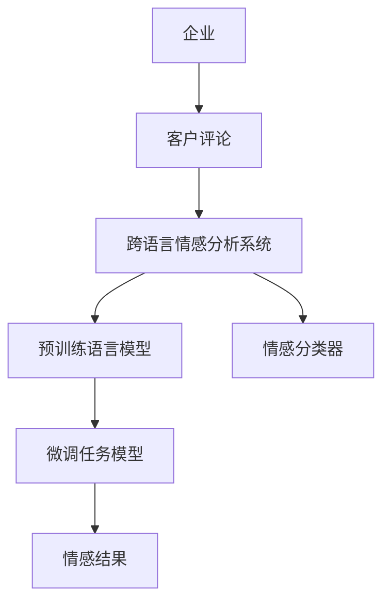
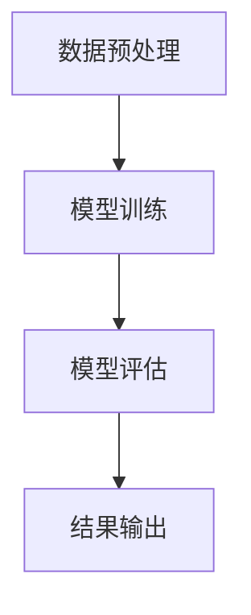
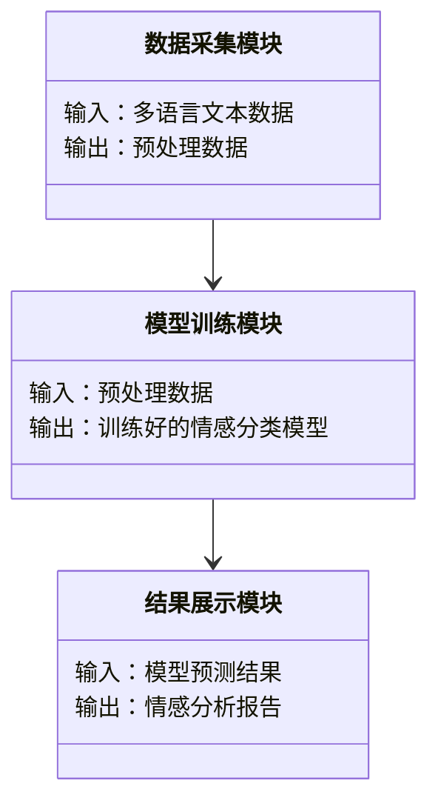
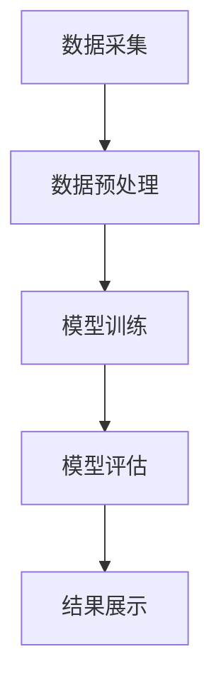
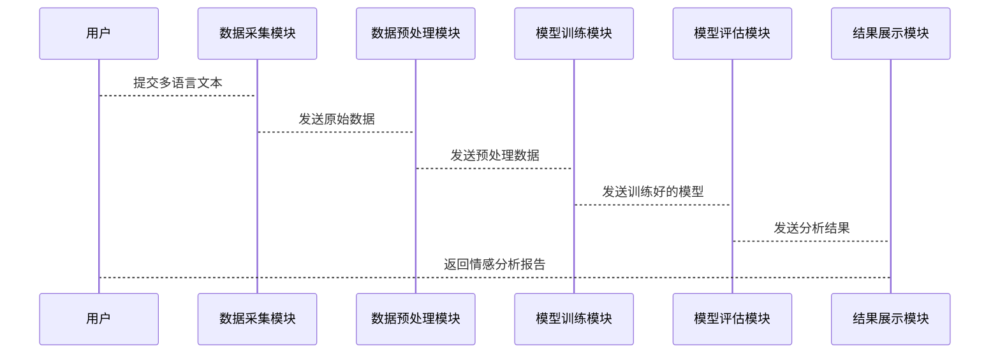

                 


# 如何识别企业的深度学习跨语言情感分析技术优势

> 关键词：深度学习、跨语言、情感分析、自然语言处理、技术优势、企业应用

> 摘要：  
本文将深入探讨如何识别企业在深度学习跨语言情感分析技术中的优势。通过分析技术背景、核心概念、算法原理、系统架构、项目实战和最佳实践，我们旨在为企业提供一套系统化的识别方法，帮助他们更好地利用该技术提升竞争力。

---

## 第一部分：跨语言情感分析技术背景与核心概念

### 第1章：跨语言情感分析技术背景

#### 1.1 问题背景与问题描述
- **问题背景**：情感分析是自然语言处理（NLP）中的核心任务，广泛应用于社交媒体分析、客户反馈分析等领域。然而，随着全球化的发展，企业需要处理多语言数据，单一语言的情感分析已无法满足需求。
- **问题描述**：跨语言情感分析旨在在多种语言上同时进行情感分析，但不同语言的语义结构、文化差异和数据量差异带来了巨大挑战。
- **解决方法**：通过深度学习模型（如预训练语言模型）实现跨语言任务，利用多语言预训练模型的迁移能力，提升跨语言情感分析的准确性和效率。

#### 1.2 问题解决与边界定义
- **核心目标**：在多种语言上准确识别情感极性，同时降低计算成本和数据依赖。
- **技术边界**：专注于情感分析任务，不涉及其他NLP任务（如实体识别或机器翻译）。
- **实现范围**：支持至少两种语言（如中文和英文）的情感分析，数据来源为企业客户评论或社交媒体数据。

#### 1.3 情感分析技术的核心要素
- **数据特征分析**：文本长度、关键词分布、情感倾向词汇。
- **模型构建要素**：预训练模型、跨语言迁移学习、情感分类器。
- **评价指标体系**：准确率、召回率、F1分数、混淆矩阵。

---

### 第2章：跨语言情感分析的核心概念与联系

#### 2.1 跨语言情感分析的原理概述
- **多语言模型的基本原理**：利用预训练语言模型（如BERT）提取跨语言特征，通过微调任务模型实现情感分类。
- **情感分析的核心算法**：基于深度学习的序列标注模型（如LSTM、Transformer）。
- **跨语言数据处理的特殊性**：需要处理语言间的语义差异和数据不平衡问题。

#### 2.2 核心概念对比分析
| 比较维度 | 单语言模型 | 跨语言模型 |
|----------|------------|------------|
| 数据需求 | 数据量大，单一语言 | 数据量小，多语言 |
| 训练效率 | 高 | 较低，依赖迁移学习 |
| 实际应用 | 单一市场 | 全球化企业 |

#### 2.3 实体关系图分析


---

## 第二部分：跨语言情感分析的算法原理

### 第3章：算法原理与流程图

#### 3.1 算法原理概述
- **多任务学习与预训练模型**：通过预训练模型（如BERT）提取跨语言特征，进行多任务学习以提升模型的泛化能力。
- **情感分析任务的分类与回归**：使用序列标注模型进行分类任务（正面、负面、中性）。
- **跨语言数据的特征提取方法**：利用预训练模型的上下文特征进行情感预测。

#### 3.2 算法流程图


#### 3.3 核心算法实现
```python
from transformers import BertTokenizer, BertModel, AdamW
import torch

# 加载预训练模型和分词器
tokenizer = BertTokenizer.from_pretrained('bert-base-multilingual-cased')
model = BertModel.from_pretrained('bert-base-multilingual-cased')

# 定义情感分类器
class SentimentClassifier(torch.nn.Module):
    def __init__(self, bert_model, num_classes=3):
        super().__init__()
        self.bert = bert_model
        self.dropout = torch.nn.Dropout(0.1)
        self.classifier = torch.nn.Linear(768, num_classes)
    
    def forward(self, input_ids, attention_mask):
        outputs = self.bert(input_ids=input_ids, attention_mask=attention_mask)
        pooled_output = outputs.last_hidden_state[:, 0, :]
        pooled_output = self.dropout(pooled_output)
        return self.classifier(pooled_output)

# 初始化模型和优化器
model = SentimentClassifier(model)
optimizer = AdamW(model.parameters(), lr=1e-5)

# 训练循环
for epoch in range(num_epochs):
    for batch in train_loader:
        optimizer.zero_grad()
        input_ids = batch['input_ids'].to(device)
        attention_mask = batch['attention_mask'].to(device)
        labels = batch['labels'].to(device)
        outputs = model(input_ids, attention_mask)
        loss = criterion(outputs, labels)
        loss.backward()
        optimizer.step()
```

#### 3.4 数学模型与公式
- **损失函数**：交叉熵损失函数
  $$ \text{Loss} = -\sum_{i=1}^{n} \sum_{k=1}^{K} y_{ik} \log(p_{ik}) $$
- **优化目标**：最小化损失函数
  $$ \min \text{Loss} $$

---

## 第三部分：跨语言情感分析的系统分析与架构设计

### 第4章：系统分析与架构设计方案

#### 4.1 问题场景介绍
- 企业需要分析多语言客户评论，识别情感倾向，优化客户服务和产品体验。

#### 4.2 系统功能设计


#### 4.3 系统架构设计


#### 4.4 系统接口设计
- 数据接口：API接收多语言文本数据。
- 模型接口：API返回情感分析结果。

#### 4.5 系统交互流程


---

## 第四部分：跨语言情感分析的项目实战

### 第5章：项目实战

#### 5.1 环境安装
```bash
pip install transformers torch
```

#### 5.2 核心代码实现
```python
# 数据加载
from torch.utils.data import Dataset, DataLoader

class CustomDataset(Dataset):
    def __init__(self, texts, labels, tokenizer):
        self.texts = texts
        self.labels = labels
        self.tokenizer = tokenizer
    
    def __len__(self):
        return len(self.texts)
    
    def __getitem__(self, idx):
        text = self.texts[idx]
        label = self.labels[idx]
        encoding = self.tokenizer(
            text,
            padding='max_length',
            max_length=128,
            truncation=True,
            return_tensors='pt'
        )
        return {
            'input_ids': encoding['input_ids'].flatten(),
            'attention_mask': encoding['attention_mask'].flatten(),
            'labels': torch.tensor(label, dtype=torch.long)
        }

# 数据集构建
train_texts = ["I love this product!", "Este producto no es bueno.", "这个产品很差。"]
train_labels = [2, 0, 1]
tokenizer = BertTokenizer.from_pretrained('bert-base-multilingual-cased')
train_dataset = CustomDataset(train_texts, train_labels, tokenizer)
train_loader = DataLoader(train_dataset, batch_size=4, shuffle=True, num_workers=0)
```

---

## 第五部分：跨语言情感分析的最佳实践

### 第6章：最佳实践

#### 6.1 小贴士
- **模型选择**：优先选择多语言预训练模型（如BERT）。
- **数据处理**：注意跨语言数据的平衡性，避免某一语言数据过少。
- **计算资源**：深度学习模型需要较高的计算资源，建议使用GPU加速。

#### 6.2 注意事项
- **模型调优**：根据实际数据分布调整超参数。
- **结果验证**：通过混淆矩阵和示例分析验证模型性能。

#### 6.3 拓展阅读
- 《Transformers: Pre-training of Self-attentional Neural Networks》
- 《BERT: Pre-training of Deep Bidirectional Transformers for Natural Language Processing》

---

## 结语

通过本文的系统分析，我们识别了企业在深度学习跨语言情感分析技术中的优势，并为企业提供了实现该技术的具体方法。希望本文能够为企业在多语言情感分析领域的实践提供有价值的参考。

--- 

如果需要进一步的细化或补充，请随时告知！

